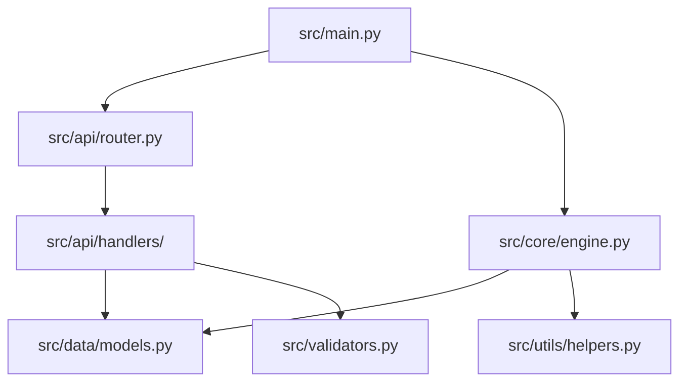

# PROMPT_03: Dependency Mapping & Graph Construction

## Classification
- **Domain:** Discovery & Intake
- **Phase:** 1 — Initial Repository Analysis
- **Prerequisites:** PROMPT_01 (File Inventory), PROMPT_02 (Language Detection)
- **Dependencies:** Language detection results, package manifest files
- **Estimated Effort:** High (requires scanning all source files for imports)

---

## Objective

Construct a complete, multi-level dependency map of the repository, including external packages, internal module dependencies, cross-language dependencies, and transitive dependency chains.

---

## Input Requirements

### Required Context
- Complete file inventory from PROMPT_01
- Language and framework catalog from PROMPT_02
- Package manifest files with versions
- Build configuration files

### Required Files
- All package manifest files (package.json, requirements.txt, Pipfile, Cargo.toml, go.mod, etc.)
- All lock files (package-lock.json, yarn.lock, poetry.lock, Cargo.lock, go.sum, etc.)
- All source files (for import scanning)
- All build configuration files (webpack.config.js, tsconfig.json, pyproject.toml, etc.)

---

## Pre-Analysis Checklist

- [ ] PROMPT_01 and PROMPT_02 completed and context loaded
- [ ] All manifest files identified and located
- [ ] All lock files identified and located
- [ ] Language-specific import patterns known
- [ ] Build configuration files identified

---

## Analysis Tasks

### Task 1: External Package Dependency Mapping

**Purpose:** Create a complete inventory of all external packages and libraries the repository depends on.

**Instructions:**
1. For each language/ecosystem, extract dependencies from manifest files:
   - **JavaScript/TypeScript:** package.json (dependencies, devDependencies, peerDependencies, optionalDependencies)
   - **Python:** requirements.txt, Pipfile, pyproject.toml, setup.py, setup.cfg
   - **Rust:** Cargo.toml (dependencies, dev-dependencies, build-dependencies)
   - **Go:** go.mod (direct and indirect dependencies)
   - **Java:** pom.xml, build.gradle
   - **Ruby:** Gemfile
   - **PHP:** composer.json
2. Cross-reference with lock files for exact resolved versions
3. Classify each dependency:
   - Direct vs. transitive (transitive from lock file analysis)
   - Runtime vs. development vs. build
   - Production vs. optional
4. Identify version constraints and resolved versions
5. Note any dependency with known security issues (if detectable from version)

**Success Criteria:**
- Every external package is listed with ecosystem, version, and version constraint
- Direct vs. transitive distinction is made
- Dependencies are properly classified (runtime, dev, build)
- Version resolution is verified against lock files

**Output Format:**

```markdown
## External Package Dependencies

### Ecosystem Summary
| Ecosystem | Direct Dependencies | Transitive Dependencies | Total Packages |
|-----------|-------------------|------------------------|----------------|
| npm | 45 | 230 | 275 |
| PyPI | 25 | 80 | 105 |
| Total | 70 | 310 | 380 |

### Direct Dependencies (Runtime)
| Package | Ecosystem | Constraint | Resolved Version | Purpose | License |
|---------|-----------|------------|-----------------|---------|---------|
| react | npm | ^18.2.0 | 18.2.0 | UI Framework | MIT |
| express | npm | ^4.18.0 | 4.18.2 | HTTP Server | MIT |
| fastapi | PyPI | >=0.100.0,<0.110.0 | 0.104.0 | API Framework | MIT |
| sqlalchemy | PyPI | >=2.0.0,<3.0.0 | 2.0.23 | ORM | MIT |

### Direct Dependencies (Development)
| Package | Ecosystem | Constraint | Resolved Version | Purpose |
|---------|-----------|------------|-----------------|---------|
| jest | npm | ^29.0.0 | 29.7.0 | Testing |
| pytest | PyPI | >=7.0.0 | 7.4.3 | Testing |
| typescript | npm | ^5.0.0 | 5.3.3 | Type Checking |

### Transitive Dependencies (Summary)
| Package | Required By | Version | Notes |
|---------|-------------|---------|-------|
| ansi-styles | jest, chalk | 6.2.1 | Deep transitive |
| ... | ... | ... | ... |

### Version Conflict Analysis
| Package | Conflicting Versions | Required By | Severity |
|---------|---------------------|-------------|----------|
| None found | - | - | - |

### Security Flags
| Package | Version | CVE | Severity | Fix Available |
|---------|---------|-----|----------|---------------|
| lodash | 4.17.21 | - | - | - |
| (No known vulnerabilities found) |
```

---

### Task 2: Internal Module Dependency Mapping

**Purpose:** Map all internal dependencies between modules, files, and components within the repository.

**Instructions:**
1. For each source file, extract all import/require/include statements:
   - **Python:** import statements, from...import, __import__()
   - **JavaScript/TypeScript:** import, require(), dynamic import()
   - **Rust:** use, mod, extern crate
   - **Go:** import
   - **Java:** import
2. Classify each import as:
   - **Internal:** Imports another file within the repository
   - **External:** Imports a package from package manager
   - **Standard Library:** Imports from language standard library
3. Build internal dependency graph:
   - Which files/modules depend on which other files/modules
   - Direction of dependencies
   - Strength of dependencies (single function vs. full module) (single function vs. full module)
4. Identify dependency patterns:
   - Cyclic dependencies (A imports B imports A)
   - Hub modules (many depend on this, depends on few)
   - Leaf modules (depends on none, many depend on this)
   - Orphan modules (depends on none, none depend on this)

**Success Criteria:**
- Every import statement in every source file is cataloged
- Internal vs. external vs. stdlib classification is complete
- Dependency graph is constructed with direction and strength
- Cyclic dependencies are identified and flagged

**Output Format:**

```markdown
## Internal Module Dependencies

### Import Summary
| Category | Count | Description |
|----------|-------|-------------|
| Internal imports | 1,250 | Cross-file dependencies |
| External imports | 890 | Package dependencies |
| Standard library | 320 | Built-in modules |
| **Total imports** | **2,460** | Across all source files |

### Dependency Graph (Module Level)



### Cyclic Dependencies Found

| Cycle | Files Involved | Severity | Resolution Proposal |
|-------|---------------|----------|-------------------|
| Cycle 1 | src/core/engine.py <-> src/data/models.py | MEDIUM | Extract shared types to new module |
| Cycle 2 | src/api/handlers/auth.py <-> src/middleware/auth.py | LOW | Inline or restructure |

### Hub Modules (High Dependents, Low Dependencies)

| Module | Depended By | Depends On | Type |
|--------|-------------|------------|------|
| src/data/models.py | 25 files | 3 files | Hub |
| src/utils/helpers.py | 18 files | 2 files | Hub |

### Leaf Modules (Many Dependents, Zero Dependencies on Other Modules)

| Module | Depended By | Type |
|--------|-------------|------|
| src/config/settings.py | 30 files | Leaf (Utility) |
| src/constants.py | 22 files | Leaf (Constants) |

### Orphan Modules (No Dependents, No Dependencies on Other Modules)

| Module | Path | Reason |
|--------|------|--------|
| scripts/migration_v1.py | scripts/ | Likely one-time script |
| legacy/deprecated_module.py | legacy/ | Deprecated code |
```

---

### Task 3: Cross-Language & Cross-Boundary Dependencies

**Purpose:** Identify dependencies that cross language boundaries or system boundaries.

**Instructions:**
1. Identify cross-language dependencies:
   - TypeScript/JavaScript files that call Python APIs (or vice versa)
   - Shell scripts that invoke Python/Node.js scripts
   - Makefile targets that build multiple languages
   - Docker multi-stage builds that cross language boundaries
2. Identify external system dependencies:
   - Database connections
   - External API endpoints
   - Message queues
   - File system dependencies (external files, mounted volumes)
   - Network services
3. Identify build-time dependencies:
   - Build tools required
   - Code generation steps
   - Asset preprocessing pipelines

**Success Criteria:**
- All cross-language dependencies are documented
- All external system dependencies are identified
- Build-time dependencies are cataloged

**Output Format:**

```markdown
## Cross-Boundary Dependencies

### Cross-Language Dependencies
| From | To | Interface | Direction | Method |
|------|----|-----------|-----------|--------|
| TypeScript (Frontend) | Python (Backend) | REST API | Unidirectional | HTTP/JSON |
| Python (Backend) | JavaScript (Build) | Script execution | Unidirectional | Subprocess |
| Shell (Scripts) | Python | Script execution | Unidirectional | python script.py |

### External System Dependencies
| System | Type | Connection Method | Configuration Source |
|--------|------|------------------|---------------------|
| PostgreSQL 15 | Database | SQLAlchemy engine | src/config/settings.py |
| Redis 7 | Cache | redis-py | src/config/settings.py |
| AWS S3 | Storage | boto3 | src/config/settings.py |
| SendGrid | Email Service | sendgrid-python | Environment variables |

### Build-Time Dependencies
| Tool | Purpose | Configuration | Required Version |
|------|---------|--------------|-----------------|
| Node.js | Frontend build | package.json | >= 18.0 |
| Python | Backend build | pyproject.toml | >= 3.11 |
| TypeScript Compiler | Type checking | tsconfig.json | >= 5.0 |
| Webpack | Module bundling | webpack.config.js | >= 5.0 |
| Poetry | Python packaging | pyproject.toml | >= 1.5 |
```

---

### Task 4: Dependency Health & Risk Assessment

**Purpose:** Assess the health and risk of all dependencies.

**Instructions:**
1. For each direct dependency, assess:
   - Maintenance status (actively maintained, deprecated, unmaintained)
   - Release frequency
   - Community size (stars, contributors, downloads)
   - License compatibility with project license
2. Identify dependency risks:
   - Abandoned packages
   - Packages with known vulnerabilities
   - Packages with incompatible licenses
   - Packages with excessive transitive dependencies
3. Calculate dependency metrics:
   - Total dependency count
   - Dependency depth
   - Dependency freshness (age of current version)
   - Dependency churn (how often dependencies change)

**Success Criteria:**
- Dependency health is assessed for all direct dependencies
- Risks are identified and documented
- Dependency metrics are calculated

**Output Format:**

```markdown
## Dependency Health & Risk Assessment

### Health Summary
| Category | Count | Percentage |
|----------|-------|------------|
| Healthy | 55 | 79% |
| Needs Attention | 10 | 14% |
| At Risk | 5 | 7% |

### At-Risk Dependencies
| Package | Risk Type | Details | Recommendation |
|---------|-----------|---------|----------------|
| moment | Abandoned | No updates since 2023 | Migrate to date-fns |
| request | Deprecated | Deprecated by maintainer | Migrate to fetch/axios |
| lib-legacy | Unmaintained | No updates in 3 years | Find alternative |

### License Compatibility
| Package | License | Compatible with MIT? |
|---------|---------|---------------------|
| react | MIT | Yes |
| express | MIT | Yes |
| fastapi | MIT | Yes |

### Dependency Metrics
| Metric | Value | Assessment |
|--------|-------|------------|
| Total direct deps | 70 | Moderate |
| Total transitive deps | 310 | High |
| Average dependency depth | 3.2 | Moderate |
| Dependency freshness | 85% up-to-date | Good |
| Duplicate dependencies | 0 | Excellent |
```

---

## Synthesis

**Purpose:** Create a unified dependency map that combines all dependency types.

**Instructions:**
1. Merge external, internal, and cross-boundary dependencies into a unified graph
2. Identify critical dependency paths (single points of failure)
3. Highlight areas with highest dependency complexity
4. Prepare context for PROMPT_04 (Config Analysis) and PROMPT_09 (Dependency Graph)

**Output Format:**

```markdown
## Unified Dependency Map

### Dependency Overview
| Layer | Internal Dependencies | External Dependencies | Cross-Boundary |
|-------|---------------------|---------------------|----------------|
| Frontend | 45 | 35 | 2 (API calls) |
| Backend | 60 | 25 | 5 (DB, Cache, S3, Email) |
| Shared | 10 | 10 | 1 (Build tools) |
| **Total** | **115** | **70** | **8** |

### Critical Dependency Path

```
Frontend (React) -> API Router (Express) -> Auth Middleware -> 
Backend Service (FastAPI) -> Data Access (SQLAlchemy) -> Database (PostgreSQL)
                                    |
                                    v
                              Cache Layer (Redis)
                                    |
                                    v
                              External API (S3, SendGrid)
```

### High-Complexity Areas
| Area | Complexity Score | Reason |
|------|-----------------|--------|
| src/core/engine.py | 0.85 | 15 internal deps, 8 external deps |
| src/api/handlers/auth.py | 0.72 | 10 internal deps, 5 external deps, 1 cross-boundary |

### Context for Next Prompt
- Configuration files that control dependency behavior
- Environment variables for external service connections
- Build configuration that affects dependency resolution
```

---

## Output Requirements

### Required Deliverables
1. External package dependency catalog with version resolution
2. Internal module dependency graph with patterns (cycles, hubs, leaves)
3. Cross-language and cross-boundary dependency documentation
4. Dependency health and risk assessment
5. Unified dependency map with critical paths

### Output Structure
```
DEPENDENCY_MAPPING/
├── external_dependencies.md
├── internal_dependencies.md
├── cross_boundary_dependencies.md
├── dependency_health.md
└── unified_dependency_map.md
```

---

## Quality Checks

- [ ] Every source file's imports are scanned and cataloged
- [ ] External dependencies are classified as direct vs. transitive
- [ ] Internal dependency graph is constructed with direction
- [ ] Cyclic dependencies are identified and flagged
- [ ] Cross-language dependencies are captured
- [ ] External system dependencies are identified
- [ ] Dependency health assessment is complete
- [ ] Critical dependency paths are documented

---

## Continuation Rules

For large repositories (>500 source files):
1. Focus on module-level imports (directory-level), not file-level
2. Analyze at package/module granularity
3. Flag any modules requiring deeper import analysis

---

## Cross-References

- **Previous Prompt:** `PROMPT_02_LANGUAGE_DETECTION.md`
- **Next Prompt:** `PROMPT_04_CONFIG_ANALYSIS.md`
- **Later Prompt:** `PROMPT_09_DEPENDENCY_GRAPH.md` (detailed graph construction)
- **Shared Context Key:** `dependencies.external`, `dependencies.internal`, `dependencies.cross_boundary`
