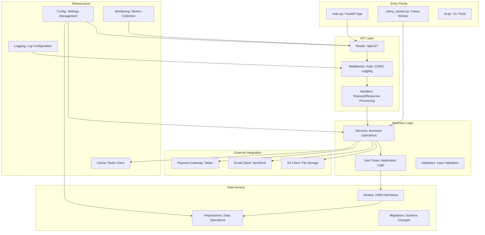
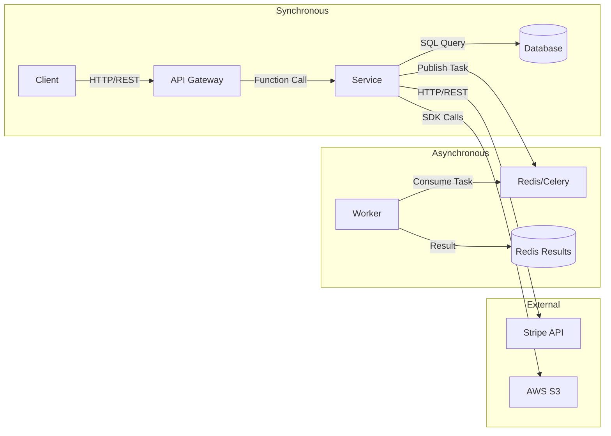
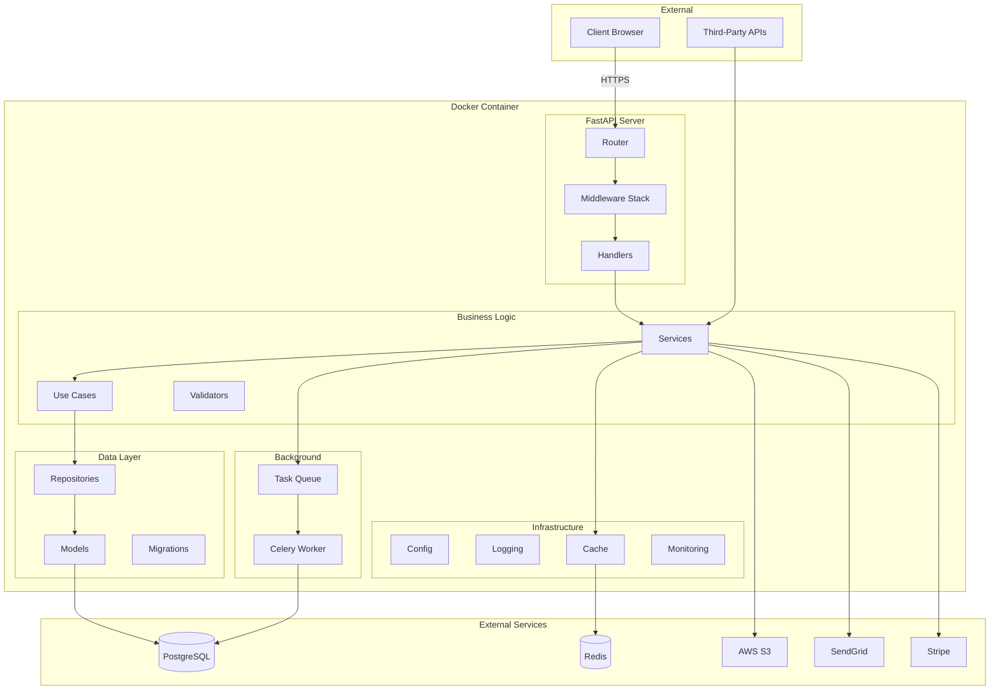

# PROMPT_05: High-Level System Architecture Reconstruction

## Classification
- **Domain:** Architecture Reconstruction
- **Phase:** 2 — Architecture Analysis
- **Prerequisites:** PROMPT_01, PROMPT_02, PROMPT_03, PROMPT_04
- **Dependencies:** File inventory, language detection, dependency map, config analysis
- **Estimated Effort:** High (requires synthesizing all previous analysis)

---

## Objective

Reconstruct the complete high-level system architecture of the repository. Identify all major architectural components, their responsibilities, their interactions, and the overall architectural style/pattern used.

---

## Input Requirements

### Required Context
- Complete file inventory and directory structure from PROMPT_01
- Language and framework catalog from PROMPT_02
- Internal and external dependency map from PROMPT_03
- Configuration architecture from PROMPT_04

### Required Files
- All source files (for architectural pattern detection)
- All entry point files (main.py, index.js, app.ts, etc.)
- All routing/API definition files
- All middleware/interceptor files
- All data model/schema files

---

## Pre-Analysis Checklist

- [ ] All Phase 1 prompts (01-04) completed and context loaded
- [ ] Entry points identified from file inventory
- [ ] Major module boundaries understood from directory structure
- [ ] Dependency patterns identified from dependency map

---

## Analysis Tasks

### Task 1: Architectural Style Identification

**Purpose:** Identify the overall architectural style or pattern used by the system.

**Instructions:**
1. Analyze the system's overall structure to identify architectural style:
   - **Monolithic:** Single deployable unit, shared codebase
   - **Microservices:** Multiple independent services, each with its own codebase
   - **Layered:** Presentation, Business Logic, Data Access layers
   - **Hexagonal/Ports & Adapters:** Core business logic isolated from external concerns
   - **Event-Driven:** Components communicate through events
   - **CQRS:** Separate read and write models
   - **Event Sourcing:** State changes stored as event log
   - **Serverless:** Function-as-a-Service architecture
   - **Micro-frontend:** Frontend composed of independent modules
2. Look for architectural evidence:
   - Directory structure conventions
   - Deployment units (Docker services, serverless functions)
   - Communication patterns (HTTP, message queues, events)
   - Data ownership patterns
   - Team/ownership boundaries (if detectable)
3. Determine if the architecture is:
   - **Intentional:** Clearly designed with a specific pattern
   - **Evolved:** Grew organically, may mix patterns
   - **Transitioning:** In the process of changing architectural style

**Success Criteria:**
- Architectural style is identified with supporting evidence
- Multiple styles are identified if the system is hybrid
- Architectural intent (intentional vs. evolved) is assessed

**Output Format:**

```markdown
## Architectural Style Identification

### Primary Architecture: Layered Monolith with Event-Driven Extensions

**Evidence:**
- Clear separation into `src/api/`, `src/core/`, `src/data/` directories
- Single Docker image for backend (monolithic deployment)
- Celery task queue for async processing (event-driven extension)
- Shared database accessed by all layers

### Secondary Architecture Elements
| Pattern | Evidence | Location |
|---------|----------|----------|
| Event-Driven | Celery tasks, Redis pub/sub | src/workers/, src/events/ |
| Hexagonal | Repository pattern for data access | src/data/repositories/ |
| Pipeline | Data processing pipeline | src/pipeline/ |

### Architecture Assessment
| Dimension | Assessment | Evidence |
|-----------|------------|----------|
| Intentional | Partially | Core structure is intentional, extensions evolved |
| Consistency | Moderate | Some layers mix concerns |
| Maturity | Mature | Well-established patterns, some legacy code |
```

---

### Task 2: Major Component Identification

**Purpose:** Identify and document all major architectural components.

**Instructions:**
1. Identify all major components of the system:
   - **Entry Points:** Where execution begins (main functions, server startup)
   - **API Layer:** HTTP handlers, route definitions, controllers
   - **Business Logic Layer:** Core algorithms, services, use cases
   - **Data Access Layer:** Database access, repositories, ORM models
   - **External Integration Layer:** API clients, third-party service wrappers
   - **Infrastructure Layer:** Logging, monitoring, configuration, caching
   - **Shared/Common Layer:** Utilities, helpers, shared types
2. For each component, document:
   - Name and purpose
   - Location in directory structure
   - Primary responsibilities
   - Key files and entry points
   - Dependencies (internal and external)
   - Interfaces exposed to other components
3. Create a component diagram showing relationships

**Success Criteria:**
- All major components are identified
- Each component has documented responsibilities and boundaries
- Component relationships are mapped

**Output Format:**

```markdown
## Major Components

### Component Map



### Component Details

#### 1. Entry Points
| Component | File | Purpose | Startup Sequence |
|-----------|------|---------|------------------|
| FastAPI App | src/main.py | HTTP server entry point | Load config, init DB, register routes, start server |
| Celery Worker | src/celery_worker.py | Async task processor | Connect to Redis, register tasks, start worker |
| CLI Tools | src/cli.py | Command-line interface | Parse args, execute commands |

#### 2. API Layer
| Component | Location | Responsibility | Key Files |
|-----------|----------|----------------|-----------|
| Router | src/api/router.py | Route registration and versioning | router.py |
| Middleware | src/api/middleware/ | Auth, CORS, logging, rate limiting | auth.py, cors.py, logging.py |
| Handlers | src/api/handlers/ | Request parsing, response formatting | users.py, products.py, orders.py |

#### 3. Business Logic Layer
| Component | Location | Responsibility | Key Files |
|-----------|----------|----------------|-----------|
| Services | src/core/services/ | Business operations | user_service.py, order_service.py |
| Use Cases | src/core/use_cases/ | Application-specific logic | place_order.py, process_payment.py |
| Validators | src/core/validators/ | Input validation rules | user_validator.py, order_validator.py |

[... remaining components ...]
```

---

### Task 3: Layer & Boundary Analysis

**Purpose:** Identify and document all architectural layers and their boundaries.

**Instructions:**
1. Identify all architectural layers:
   - Presentation/API layer
   - Application/Service layer
   - Domain/Business Logic layer
   - Infrastructure/Data Access layer
2. For each layer boundary, document:
   - What crosses the boundary (data, control, events)
   - How the boundary is enforced (interfaces, abstractions, dependency inversion)
   - Whether the boundary is strict or porous
   - Any boundary violations (lower layer depending on higher layer)
3. Analyze dependency direction:
   - Does the system follow Dependency Inversion Principle?
   - Are there circular dependencies between layers?
   - Are there bypass patterns (skipping layers)?

**Success Criteria:**
- All architectural layers are identified
- Layer boundaries are documented with enforcement mechanisms
- Boundary violations are flagged

**Output Format:**

```markdown
## Layer & Boundary Analysis

### Layer Architecture

```
┌─────────────────────────────────────────────────────────────┐
│                    PRESENTATION LAYER                         │
│  API Handlers │ Request/Response │ Serialization             │
│  Depends on: Application Layer                               │
├─────────────────────────────────────────────────────────────┤
│                    APPLICATION LAYER                          │
│  Services │ Use Cases │ Orchestration                        │
│  Depends on: Domain Layer                                    │
├─────────────────────────────────────────────────────────────┤
│                    DOMAIN LAYER                               │
│  Business Logic │ Domain Models │ Validation Rules           │
│  Depends on: Nothing (pure business logic)                   │
├─────────────────────────────────────────────────────────────┤
│                    INFRASTRUCTURE LAYER                       │
│  Data Access │ External APIs │ Caching │ Logging             │
│  Depends on: Domain Layer (via interfaces)                   │
└─────────────────────────────────────────────────────────────┘
```

### Layer Boundaries

| Boundary | Between | Enforcement | Strictness | Violations |
|----------|---------|-------------|------------|------------|
| B1 | Presentation -> Application | Service interfaces | Strict | None |
| B2 | Application -> Domain | Domain model usage | Strict | None |
| B3 | Domain -> Infrastructure | Repository interfaces (DIP) | Strict | None |
| B4 | Infrastructure -> Domain | Interface implementation | Strict | None |

### Boundary Violations Found
| Violation | Description | Location | Severity |
|-----------|-------------|----------|----------|
| V1 | API handler directly accesses database | src/api/handlers/users.py:45 | MEDIUM |
| V2 | Service layer creates HTTP client | src/core/services/report.py:30 | LOW |

### Dependency Direction Analysis
| Principle | Status | Evidence |
|-----------|--------|----------|
| Dependency Inversion | Followed | Repository interfaces in domain, implementations in infrastructure |
| Stable Dependencies | Followed | Domain layer has fewest dependencies |
| Acyclic Dependencies | Violated | 2 circular dependencies found (see PROMPT_03) |
```

---

### Task 4: Communication & Integration Patterns

**Purpose:** Document how components communicate and integrate with each other.

**Instructions:**
1. Identify communication patterns:
   - **Synchronous:** HTTP REST, gRPC, direct function calls
   - **Asynchronous:** Message queues, events, callbacks, futures/promises
   - **Batch:** Scheduled jobs, data pipelines
   - **Streaming:** Real-time data streams, WebSockets
2. For each communication pattern, document:
   - Protocol and format (HTTP/JSON, AMQP, WebSocket)
   - Direction (request-response, publish-subscribe, push-pull)
   - Reliability (at-most-once, at-least-once, exactly-once)
   - Error handling (retries, timeouts, circuit breakers)
3. Identify integration points:
   - Internal service-to-service communication
   - External API integrations
   - Database interactions
   - File system operations

**Success Criteria:**
- All communication patterns are identified
- Each pattern is documented with protocol, direction, and reliability
- Integration points are mapped

**Output Format:**

```markdown
## Communication & Integration Patterns

### Communication Pattern Map



### Communication Patterns

#### Synchronous: HTTP REST
| Aspect | Detail |
|--------|--------|
| Protocol | HTTP/1.1, HTTPS |
| Format | JSON (application/json) |
| Direction | Request-Response |
| Reliability | At-most-once (no retry) |
| Timeout | 30 seconds (configurable) |
| Error Handling | HTTP status codes, error response body |

#### Asynchronous: Celery Tasks
| Aspect | Detail |
|--------|--------|
| Broker | Redis 7 |
| Format | JSON serialized |
| Direction | Publish-Subscribe |
| Reliability | At-least-once (with retry) |
| Retry Policy | 3 retries, exponential backoff |
| Error Handling | Task failure logged, dead letter queue |

#### External Integrations
| Integration | Protocol | Authentication | Rate Limit | Circuit Breaker |
|-------------|----------|----------------|------------|-----------------|
| Stripe | HTTPS/REST | API Key | 100/min | Yes (3 failures -> open) |
| AWS S3 | SDK | IAM Keys | 1000/min | No |
| SendGrid | HTTPS/REST | API Key | 100/min | No |
```

---

### Task 5: Architectural Quality Assessment

**Purpose:** Assess the quality of the architecture against established principles and patterns.

**Instructions:**
1. Assess architectural qualities:
   - **Modularity:** How well are concerns separated?
   - **Cohesion:** How related are elements within a module?
   - **Coupling:** How dependent are modules on each other?
   - **Testability:** How easy is it to test components in isolation?
   - **Extensibility:** How easy is it to add new features?
   - **Maintainability:** How easy is it to understand and modify?
2. Identify architectural debt:
   - Legacy components that should be refactored
   - Missing abstractions
   - Overly complex components
   - God classes/modules
3. Rate each quality dimension

**Success Criteria:**
- All architectural quality dimensions are assessed
- Architectural debt is identified and documented
- Quality ratings are evidence-based

**Output Format:**

```markdown
## Architectural Quality Assessment

### Quality Ratings
| Dimension | Rating (1-10) | Evidence | Improvement Opportunity |
|-----------|---------------|----------|------------------------|
| Modularity | 8 | Clear layer separation, well-defined module boundaries | Some cross-layer violations |
| Cohesion | 7 | Most modules have single responsibility | `src/utils/` is a mixed bag |
| Coupling | 6 | Some tight coupling between services and data access | Introduce repository abstraction |
| Testability | 7 | Unit tests exist, but integration tests dominate | Add more mocking for isolated tests |
| Extensibility | 8 | Plugin architecture for data processors | Document extension points |
| Maintainability | 7 | Good code organization, some legacy code | Refactor legacy module |

### Architectural Debt
| Debt Item | Location | Impact | Effort to Fix | Priority |
|-----------|----------|--------|---------------|----------|
| God Service | src/core/services/user_service.py (800 lines) | Low maintainability | 2 days | HIGH |
| Missing Abstraction | Direct DB access in API handlers | Low testability | 1 day | MEDIUM |
| Legacy Module | src/legacy/ (unused code) | Confusion, dead code | 0.5 day | LOW |
| Circular Dependency | engine.py <-> models.py | Fragile code | 1 day | HIGH |

### Architecture Health Summary
```
Overall Health: GOOD (7.2/10)
Strengths: Clear layering, good modularity, extensible design
Weaknesses: Some coupling issues, legacy code, circular dependencies
Recommendations: Refactor god service, break circular dependency, remove legacy code
```
```

---

## Synthesis

**Purpose:** Create a comprehensive high-level architecture document.

**Instructions:**
1. Combine all task outputs into a unified architecture description
2. Create a visual architecture diagram
3. Document key architectural decisions and their rationale
4. Prepare context for PROMPT_06 (Module Decomposition)

**Output Format:**

```markdown
## High-Level Architecture

### Architecture Overview
- **Style:** Layered Monolith with Event-Driven Extensions
- **Deployment:** Single Docker container (backend), Static files (frontend)
- **Communication:** Synchronous HTTP/REST + Async Celery tasks
- **Data Storage:** PostgreSQL (primary), Redis (cache/queue)

### Architecture Diagram



### Key Architectural Decisions
| Decision | Rationale | Alternatives Considered |
|----------|-----------|------------------------|
| Layered architecture | Familiar, well-understood, good separation of concerns | Microservices (too complex for current scale) |
| Celery for async tasks | Mature, reliable, good Python integration | RabbitMQ, AWS SQS |
| Repository pattern | Testability, abstraction from ORM | Direct ORM usage |
| FastAPI | Performance, async support, automatic docs | Django REST, Flask |

### Context for Next Prompt
- Module boundaries identified for decomposition
- Key components ready for detailed analysis
- Cross-cutting concerns identified
```

---

## Output Requirements

### Required Deliverables
1. Architectural style identification with evidence
2. Major component identification with diagram
3. Layer and boundary analysis
4. Communication and integration pattern documentation
5. Architectural quality assessment
6. High-level architecture document with diagram

### Output Structure
```
ARCHITECTURE_HIGH_LEVEL/
├── architectural_style.md
├── major_components.md
├── layer_boundary_analysis.md
├── communication_patterns.md
├── quality_assessment.md
└── architecture_overview.md
```

---

## Quality Checks

- [ ] Architectural style is identified with concrete evidence from code
- [ ] All major components are identified and documented
- [ ] Layer boundaries are mapped with enforcement mechanisms
- [ ] Communication patterns are documented with protocols
- [ ] Architectural quality is assessed with evidence
- [ ] Architecture diagram accurately represents the system
- [ ] Key architectural decisions are documented
- [ ] Context for PROMPT_06 is prepared

---

## Continuation Rules

For very large systems (>50 major components):
1. Focus on top-level components (first level of decomposition)
2. Document subsystem boundaries
3. Flag subsystems requiring deeper analysis in PROMPT_06

---

## Cross-References

- **Previous Prompt:** `PROMPT_04_CONFIG_ANALYSIS.md`
- **Next Prompt:** `PROMPT_06_MODULE_DECOMPOSITION.md`
- **Related Context:** Component boundaries feed into module decomposition
- **Shared Context Key:** `architecture.style`, `architecture.components`, `architecture.layers`, `architecture.communication`
