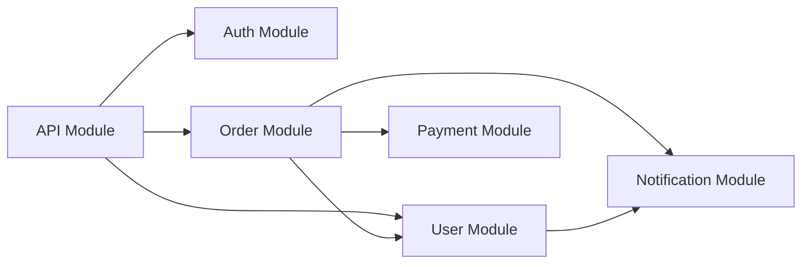

# PROMPT_06: Module Decomposition & Responsibility Mapping

## Classification
- **Domain:** Architecture Reconstruction
- **Phase:** 2 — Architecture Analysis
- **Prerequisites:** PROMPT_05 (High-Level Architecture)
- **Dependencies:** Architecture components, layer boundaries
- **Estimated Effort:** High (requires analyzing each module's internal structure)

---

## Objective

Decompose the high-level architecture into detailed modules, documenting each module's responsibilities, internal structure, interfaces, and relationships with other modules.

---

## Input Requirements

### Required Context
- High-level architecture components from PROMPT_05
- Directory structure from PROMPT_01
- Internal dependency map from PROMPT_03
- Configuration ownership from PROMPT_04

### Required Files
- All source files organized by module

---

## Pre-Analysis Checklist
- [ ] PROMPT_05 completed and architecture components identified
- [ ] Module boundaries understood from directory structure
- [ ] Entry points and public APIs identified

---

## Analysis Tasks

### Task 1: Module Identification & Boundary Definition
**Purpose:** Identify all distinct modules and define their boundaries.

**Instructions:**
1. Group source files into logical modules based on:
   - Directory structure (files in same directory)
   - Functional cohesion (files serving related purposes)
   - Dependency patterns (files that are frequently imported together)
   - Configuration grouping (files that share configuration)
2. For each module, document:
   - Name and path
   - Size (file count, line count, complexity estimate)
   - Primary responsibility (single sentence)
   - Public interface (exported functions, classes, APIs)
   - Internal structure (sub-modules, key files)
   - Module boundary rules (what can and cannot be imported)

**Success Criteria:**
- Every source file belongs to exactly one module
- Module boundaries are logical and consistent
- Module responsibilities are clearly stated

**Output Format:**
```markdown
## Module Identification

| Module | Path | Files | Lines | Responsibility |
|--------|------|-------|-------|----------------|
| API Module | src/api/ | 15 | 3,200 | HTTP request handling |
| Auth Module | src/auth/ | 8 | 1,800 | Authentication & authorization |
| User Module | src/users/ | 10 | 2,500 | User management |
| Order Module | src/orders/ | 12 | 3,100 | Order processing |
| Payment Module | src/payments/ | 6 | 1,500 | Payment processing |
| Notification Module | src/notifications/ | 5 | 1,200 | Notifications |

### Module Details

#### API Module (src/api/)
- **Files:** 15
- **Lines:** 3,200
- **Responsibility:** HTTP request handling, routing, middleware
- **Public Interface:** Router definitions, middleware functions
- **Sub-modules:** handlers/, middleware/, validators/
- **Boundary Rules:** May depend on: Auth, Services, Config. Must NOT depend on: Data Layer directly
```

---

### Task 2: Module Responsibility Deep Dive
**Purpose:** Document the detailed responsibilities of each module.

**Instructions:**
1. For each module, identify:
   - Core responsibilities (primary functions)
   - Supporting responsibilities (helper functions)
   - Lifecycle responsibilities (initialization, cleanup)
   - Error handling responsibilities
2. Map responsibilities to specific files and functions
3. Identify any responsibility overlaps or gaps

**Output Format:**
```markdown
### Auth Module - Responsibility Map
| Responsibility | File | Function/Class | Type |
|---------------|------|----------------|------|
| User authentication | src/auth/auth_service.py | authenticate() | Core |
| Token generation | src/auth/token.py | create_token() | Core |
| Token validation | src/auth/token.py | validate_token() | Core |
| Password hashing | src/auth/password.py | hash_password() | Supporting |
| Session management | src/auth/session.py | create_session() | Supporting |
| Permission checking | src/auth/permissions.py | check_permission() | Core |

### Responsibility Overlaps
| Overlap | Modules Affected | Description | Resolution |
|---------|-----------------|-------------|------------|
| User validation | Auth + User modules | Both validate user input | Auth handles auth, User handles profile |
```

---

### Task 3: Module Interface Documentation
**Purpose:** Document all public interfaces of each module.

**Instructions:**
1. For each module, identify:
   - Public functions and classes (exported)
   - Configuration requirements
   - Events emitted
   - Events consumed
   - Expected error types
2. Document interface contracts:
   - Input types and constraints
   - Output types and guarantees
   - Side effects
   - Performance characteristics
3. Identify implicit interfaces (duck typing, protocol classes)

**Output Format:**
```markdown
### Payment Module - Interface Specification

#### Public Functions
| Function | Input | Output | Side Effects | Errors |
|----------|-------|--------|--------------|--------|
| process_payment() | PaymentRequest | PaymentResult | Charges payment method | PaymentError, InsufficientFundsError |
| refund_payment() | RefundRequest | RefundResult | Issues refund | RefundError |
| get_payment_status() | PaymentID | PaymentStatus | None | NotFoundError |

#### Configuration Requirements
| Setting | Type | Required | Default |
|---------|------|----------|---------|
| STRIPE_API_KEY | string | Yes | - |
| STRIPE_WEBHOOK_SECRET | string | Yes | - |

#### Events
| Event | Direction | Payload | Emitter |
|-------|-----------|---------|---------|
| payment.completed | Outbound | PaymentResult | process_payment() |
| payment.failed | Outbound | PaymentError | process_payment() |
```

---

### Task 4: Cross-Module Interaction Map
**Purpose:** Map all interactions between modules.

**Instructions:**
1. For each module pair, document:
   - Direction of dependency
   - How they interact (direct call, event, shared data)
   - Frequency of interaction
   - Criticality of interaction
2. Identify:
   - Most connected modules (hubs)
   - Isolated modules
   - Critical paths through modules
   - Potential bottlenecks

**Output Format:**
```markdown
## Cross-Module Interaction Map



### Interaction Details
| Source Module | Target Module | Interaction Type | Frequency | Criticality |
|---------------|---------------|------------------|-----------|-------------|
| API | Auth | Function call | Per request | Critical |
| API | User | Function call | Per request | High |
| Order | Payment | Function call | Per order | Critical |
| Order | Notification | Event | Per order | Medium |
```

---

### Task 5: Module Quality Assessment
**Purpose:** Assess the quality of each module's decomposition.

**Instructions:**
1. For each module, assess:
   - Cohesion (how related are elements within)
   - Coupling (how dependent on other modules)
   - Size appropriateness
   - Interface clarity
   - Test coverage
2. Rate each dimension and identify improvement opportunities

**Output Format:**
```markdown
## Module Quality Assessment

| Module | Cohesion | Coupling | Size | Interface | Overall | Issues |
|--------|----------|----------|------|-----------|---------|--------|
| API | 8 | 6 | 7 | 9 | 7.5 | Moderate coupling |
| Auth | 9 | 5 | 8 | 8 | 7.5 | None |
| User | 7 | 7 | 7 | 7 | 7.0 | Large module |
| Payment | 9 | 4 | 9 | 9 | 7.8 | Well-designed |
```

---

## Synthesis
**Purpose:** Create a complete module decomposition reference.

**Output Format:**
```markdown
## Module Decomposition Summary

| Module | Responsibility | Files | Public API | Dependencies | Quality |
|--------|---------------|-------|------------|--------------|---------|
| API | HTTP handling | 15 | 25 functions | Auth, Services | 7.5 |
| Auth | AuthN/AuthZ | 8 | 12 functions | Config | 7.5 |
| User | User management | 10 | 18 functions | Auth, Config | 7.0 |
```

---

## Output Requirements
### Required Deliverables
1. Module inventory with boundaries
2. Module responsibility maps
3. Module interface specifications
4. Cross-module interaction map
5. Module quality assessment

### Output Structure
```
MODULE_DECOMPOSITION/
├── module_inventory.md
├── module_responsibilities.md
├── module_interfaces.md
├── module_interactions.md
└── module_quality.md
```

---

## Quality Checks
- [ ] Every source file belongs to exactly one module
- [ ] Module responsibilities are clearly stated and non-overlapping
- [ ] Module interfaces are documented with input/output specifications
- [ ] Cross-module interactions are mapped
- [ ] Module quality is assessed with evidence

---

## Cross-References
- **Previous Prompt:** PROMPT_05_ARCHITECTURE_HIGH_LEVEL.md
- **Next Prompt:** PROMPT_07_COMPONENT_ANALYSIS.md
- **Shared Context Key:** modules.inventory, modules.responsibilities, modules.interfaces
