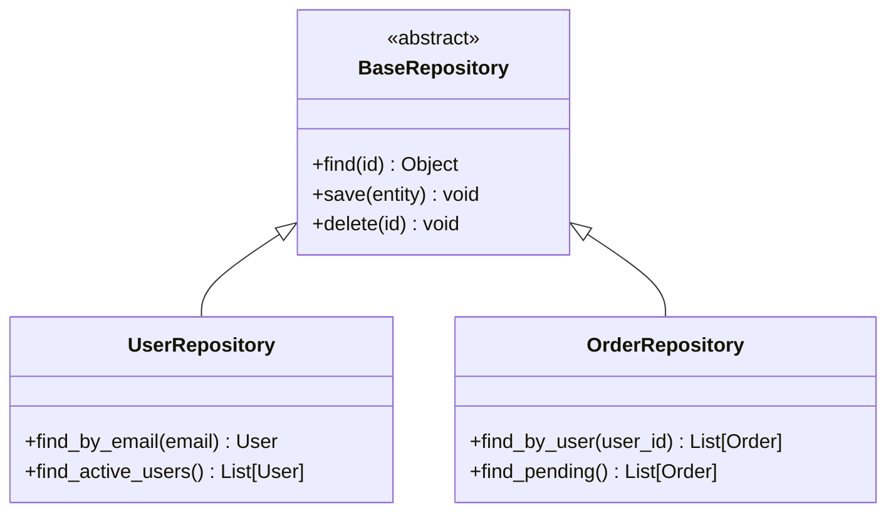

# PROMPT_07: Component-Level Analysis & Interface Identification

## Classification
- **Domain:** Architecture Reconstruction
- **Phase:** 2 — Architecture Analysis
- **Prerequisites:** PROMPT_05, PROMPT_06
- **Dependencies:** Architecture components, module decomposition
- **Estimated Effort:** High (deep analysis of each component)

---

## Objective

Perform a detailed analysis of each component within every module, documenting interfaces, class hierarchies, service boundaries, and internal structure to fully understand how each component fulfills its module responsibilities.

---

## Input Requirements

### Required Context
- Module decomposition from PROMPT_06
- High-level architecture from PROMPT_05
- Internal dependency map from PROMPT_03

### Required Files
- All source files within each module

---

## Pre-Analysis Checklist
- [ ] PROMPT_05 and PROMPT_06 completed and context loaded
- [ ] Module boundaries are defined
- [ ] Module interfaces are documented

---

## Analysis Tasks

### Task 1: Component Identification & Classification
**Purpose:** Identify all components within each module and classify them by type.

**Instructions:**
1. For each module, identify all distinct components:
   - **Controllers/Handlers:** Request/response processing
   - **Services:** Business logic orchestration
   - **Repositories:** Data access abstraction
   - **Models:** Data structures and domain objects
   - **Validators:** Input validation rules
   - **Middleware:** Request/response interceptors
   - **Factories:** Object creation logic
   - **Strategies:** Algorithm selection
2. Classify each component by:
   - Component type
   - Scope (singleton, request-scoped, transient)
   - Lifecycle (stateless, stateful)
   - Thread safety

**Success Criteria:**
- All components are identified within each module
- Components are properly classified by type
- Component scope and lifecycle are documented

**Output Format:**
```markdown
## Component Analysis by Module

### Auth Module Components
| Component | Type | Scope | Lifecycle | Thread Safe | Lines |
|-----------|------|-------|-----------|-------------|-------|
| AuthService | Service | Singleton | Stateless | Yes | 150 |
| TokenManager | Service | Singleton | Stateful | Yes | 200 |
| PasswordHasher | Utility | Transient | Stateless | Yes | 80 |
| AuthMiddleware | Middleware | Request | Stateless | Yes | 60 |
| PermissionChecker | Service | Singleton | Stateless | Yes | 120 |
```

---

### Task 2: Interface & Contract Documentation
**Purpose:** Document the exact interfaces and contracts of each component.

**Instructions:**
1. For each component, document:
   - All public methods with signatures
   - Input parameters with types and constraints
   - Return values with types
   - Exceptions thrown
   - Pre-conditions and post-conditions
   - Side effects
2. Identify:
   - Interface vs. implementation separation
   - Abstract base classes and protocols
   - Dependency injection patterns

**Output Format:**
```markdown
### AuthService Interface

```python
class AuthService:
    def authenticate(self, credentials: Credentials) -> AuthResult:
        """
        Authenticates user with provided credentials.
        
        Args:
            credentials: User credentials (username/email + password)
                - username: str (3-50 chars, alphanumeric)
                - password: str (8-128 chars)
                - remember_me: bool (optional, default=False)
        
        Returns:
            AuthResult with:
                - access_token: str (JWT token)
                - refresh_token: str (JWT token)
                - expires_in: int (seconds)
                - user: User (basic user info)
        
        Raises:
            InvalidCredentialsError: Wrong username or password
            AccountLockedError: Account locked after 5 failed attempts
            RateLimitError: Too many authentication attempts
        
        Side Effects:
            - Logs failed attempts
            - Updates last_login timestamp
            - Creates audit log entry
        """
```

---

### Task 3: Class Hierarchy & Inheritance Mapping
**Purpose:** Document all class hierarchies and inheritance relationships.

**Instructions:**
1. Identify all class hierarchies:
   - Inheritance chains
   - Abstract base classes
   - Mixins and traits
   - Interface implementations
2. Document:
   - Base class -> Derived class relationships
   - Method overrides
   - Abstract methods and their implementations
   - Diamond inheritance (if any)

**Output Format:**


---

### Task 4: Service Boundary & Responsibility Documentation
**Purpose:** Document the exact boundaries and responsibilities of each service.

**Instructions:**
1. For each service, document:
   - Primary responsibility
   - Supported operations
   - Data ownership
   - Dependencies on other services
   - Events emitted
   - Events consumed

**Output Format:**
```markdown
### OrderService Boundary

| Aspect | Detail |
|--------|--------|
| Primary Responsibility | Order lifecycle management |
| Owns Data | Orders, OrderItems, OrderStatus |
| Operations | create, update, cancel, refund, track |
| Depends On | UserService (validation), PaymentService (charging), InventoryService (stock check), NotificationService (alerts) |
| Emits Events | order.created, order.cancelled, order.shipped, order.delivered |
| Consumes Events | payment.completed, payment.failed, inventory.updated |
```

---

## Synthesis
**Purpose:** Create a comprehensive component catalog.

**Output Format:**
```markdown
## Component Catalog Summary

| Module | Components | Public Methods | Interfaces | Abstract Classes |
|--------|------------|----------------|------------|------------------|
| Auth | 5 | 25 | 2 | 1 |
| User | 8 | 40 | 3 | 2 |
| Order | 10 | 50 | 4 | 2 |
| Payment | 4 | 20 | 2 | 1 |
```

---

## Output Requirements
### Required Deliverables
1. Component inventory with classification
2. Interface and contract documentation
3. Class hierarchy and inheritance maps
4. Service boundary documentation

---

## Cross-References
- **Previous Prompt:** PROMPT_06_MODULE_DECOMPOSITION.md
- **Next Prompt:** PROMPT_08_DATA_FLOW_MAPPING.md
- **Shared Context Key:** components.inventory, components.interfaces, components.hierarchy
