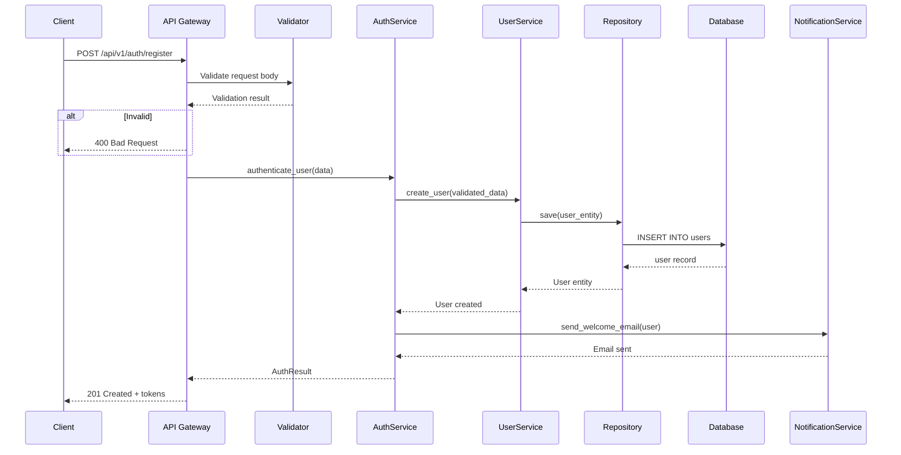

# PROMPT_08: Data Flow Mapping & Transformation Analysis

## Classification
- **Domain:** Architecture Reconstruction
- **Phase:** 2 — Architecture Analysis
- **Prerequisites:** PROMPT_05, PROMPT_06, PROMPT_07
- **Dependencies:** Architecture components, module decomposition, component interfaces
- **Estimated Effort:** High (requires tracing data through entire system)

---

## Objective

Map every significant data flow through the system, from entry points to persistence and external integrations. Document all data transformations, validation points, and state changes that occur along each flow.

---

## Input Requirements

### Required Context
- Architecture components and layers from PROMPT_05
- Module decomposition from PROMPT_06
- Component interfaces from PROMPT_07
- Configuration and environment from PROMPT_04

### Required Files
- All source files involved in data processing
- All data model/schema definitions
- All serialization/deserialization code
- All validation code

---

## Pre-Analysis Checklist
- [ ] PROMPT_05, PROMPT_06, PROMPT_07 completed and context loaded
- [ ] All entry points identified
- [ ] All data models identified
- [ ] All external integration points identified

---

## Analysis Tasks

### Task 1: Primary Data Flow Identification
**Purpose:** Identify and document all primary data flows through the system.

**Instructions:**
1. For each entry point (API endpoint, event handler, CLI command), trace the complete data flow:
   - Input reception and parsing
   - Validation and sanitization
   - Business logic processing
   - Data access and persistence
   - Response generation and formatting
   - External system interactions
2. Document each flow with:
   - Trigger (what initiates the flow)
   - Steps (ordered list of processing steps)
   - Data transformations at each step
   - Validation points
   - Error handling at each step
   - Output/destination

**Success Criteria:**
- Every significant data flow is identified and documented
- Each flow has complete step-by-step trace
- Data transformations are documented at each step

**Output Format:**

```markdown
## Primary Data Flows

### Flow 1: User Registration



### Flow Steps
| Step | Component | Action | Data Transformation | Validation |
|------|-----------|--------|-------------------|------------|
| 1 | API Gateway | Parse HTTP request | JSON -> RegistrationRequest | Content-Type, size |
| 2 | Validator | Validate input | RegistrationRequest -> ValidatedRequest | Email format, password strength |
| 3 | AuthService | Hash password | Plain text -> bcrypt hash | - |
| 4 | UserService | Create user | ValidatedRequest -> UserEntity | Username uniqueness |
| 5 | Repository | Persist | UserEntity -> SQL INSERT | DB constraints |
| 6 | AuthService | Generate tokens | UserEntity -> JWT tokens | - |
| 7 | NotificationService | Send email | UserEntity -> EmailMessage | - |
```

---

### Task 2: Data Transformation Mapping
**Purpose:** Document every data transformation that occurs in the system.

**Instructions:**
1. Identify all data transformation points:
   - Serialization/Deserialization (JSON, XML, Protocol Buffers)
   - Type conversion (string to int, date parsing)
   - Encoding/Decoding (Base64, URL encoding)
   - Encryption/Decryption
   - Hashing
   - Data aggregation/transformation
   - Format conversion (CSV to JSON, etc.)
2. For each transformation, document:
   - Input format and schema
   - Output format and schema
   - Transformation logic
   - Error cases
   - Performance characteristics

**Success Criteria:**
- Every data transformation is identified
- Input/output schemas are documented
- Transformation logic is explained

**Output Format:**

```markdown
## Data Transformation Map

### Transformation: Request Validation
| Aspect | Detail |
|--------|--------|
| Location | src/api/validators/user_validator.py:25-60 |
| Input | RegistrationRequest (raw JSON) |
| Output | ValidatedRegistration (typed object) |
| Logic | Field presence, email regex, password strength, username format |
| Errors | ValidationError with field-level messages |

### Transformation: Password Hashing
| Aspect | Detail |
|--------|--------|
| Location | src/auth/password.py:15-30 |
| Input | Plain text password (str) |
| Output | bcrypt hash (str, 60 chars) |
| Algorithm | bcrypt with 12 rounds |
| Errors | ValueError for empty password |

### Transformation: Entity to Response
| Aspect | Detail |
|--------|--------|
| Location | src/api/serializers/user_serializer.py |
| Input | UserEntity (ORM model) |
| Output | UserResponse (JSON-serializable dict) |
| Logic | Select fields, format dates, exclude sensitive data |
| Errors | None (always succeeds) |
```

---

### Task 3: State Change Documentation
**Purpose:** Document all state changes that occur during data flows.

**Instructions:**
1. For each data flow, identify state changes:
   - Database state changes (INSERT, UPDATE, DELETE)
   - Cache state changes (SET, DELETE, INVALIDATE)
   - In-memory state changes (object mutations)
   - External system state changes (API calls that modify remote state)
2. Document:
   - Before state
   - After state
   - Trigger condition
   - Rollback possibility

**Output Format:**

```markdown
## State Change Map

### Flow: Place Order
| Step | Component | State Change | Before | After | Rollback |
|------|-----------|--------------|--------|-------|----------|
| 1 | OrderService | Create order record | No order | Order(status=pending) | DELETE order |
| 2 | InventoryService | Reserve inventory | Stock available | Stock reserved | Release stock |
| 3 | PaymentService | Charge payment | No charge | Charge(pending) | Void charge |
| 4 | OrderService | Update order status | Order(pending) | Order(confirmed) | Revert to pending |
| 5 | NotificationService | Send confirmation | No notification | Notification(sent) | Cannot rollback |
```

---

### Task 4: Data Flow Quality Assessment
**Purpose:** Assess the quality and reliability of data flows.

**Instructions:**
1. For each data flow, assess:
   - Error handling coverage
   - Data validation completeness
   - Transactional integrity
   - Idempotency
   - Data consistency guarantees
2. Identify:
   - Missing validation
   - Incomplete error handling
   - Data inconsistency risks
   - Non-idempotent operations

**Output Format:**

```markdown
## Data Flow Quality Assessment

| Flow | Error Handling | Validation | Transactional | Idempotent | Consistency | Overall |
|------|---------------|------------|---------------|------------|-------------|---------|
| User Registration | 8/10 | 9/10 | Yes | Yes | Strong | 8.5 |
| Place Order | 7/10 | 8/10 | Partial | No | Eventual | 6.5 |
| Process Payment | 9/10 | 9/10 | Yes | Yes | Strong | 9.0 |

### Issues Found
| Flow | Issue | Severity | Recommendation |
|------|-------|----------|----------------|
| Place Order | Not idempotent | HIGH | Add idempotency key |
| Place Order | No distributed transaction | MEDIUM | Add saga pattern |
| User Registration | Weak password validation | LOW | Add common password check |
```

---

## Synthesis
**Purpose:** Create a comprehensive data flow reference.

**Output Format:**

```markdown
## Data Flow Summary

| Flow | Trigger | Steps | Transformations | State Changes | Quality |
|------|---------|-------|-----------------|---------------|---------|
| User Registration | POST /register | 7 | 4 | 3 | 8.5 |
| User Login | POST /login | 5 | 3 | 2 | 9.0 |
| Place Order | POST /orders | 8 | 5 | 4 | 6.5 |
| Process Payment | Internal | 4 | 3 | 2 | 9.0 |
```

---

## Output Requirements
### Required Deliverables
1. Primary data flow documentation with sequence diagrams
2. Data transformation map with input/output schemas
3. State change documentation
4. Data flow quality assessment

---

## Cross-References
- **Previous Prompt:** PROMPT_07_COMPONENT_ANALYSIS.md
- **Next Prompt:** PROMPT_09_DEPENDENCY_GRAPH.md
- **Shared Context Key:** data_flows.primary, data_flows.transformations, data_flows.state_changes
