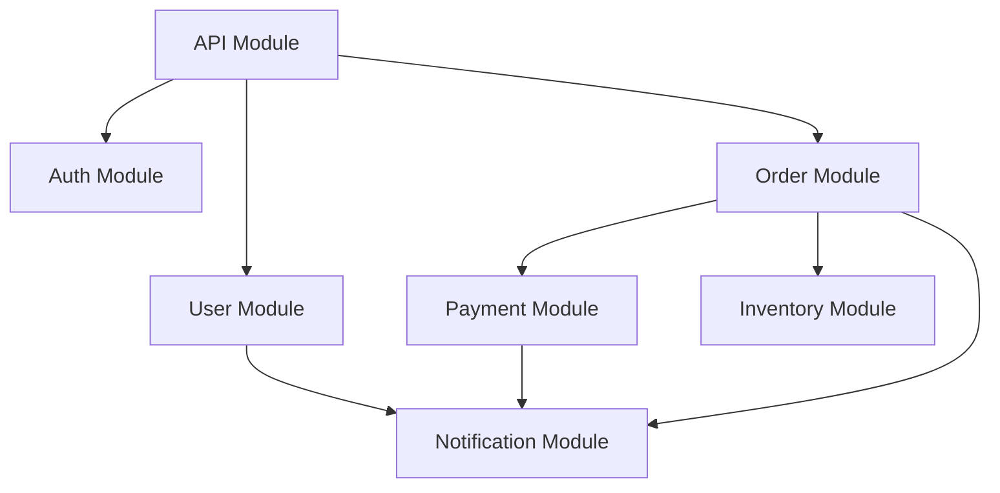

# PROMPT_09: Dependency Graph Construction & Analysis

## Classification
- **Domain:** Architecture Reconstruction
- **Phase:** 2 — Architecture Analysis
- **Prerequisites:** PROMPT_05, PROMPT_06, PROMPT_07
- **Dependencies:** Component analysis, module decomposition, architecture components
- **Estimated Effort:** Medium (synthesize dependency information)

---

## Objective

Construct a complete, multi-level dependency graph that captures all dependency relationships in the system, analyze dependency patterns, and identify dependency-related architecture concerns.

---

## Input Requirements

### Required Context
- Internal dependency map from PROMPT_03
- External dependency catalog from PROMPT_03
- Module responsibilities from PROMPT_06
- Component interfaces from PROMPT_07
- Configuration dependencies from PROMPT_04

---

## Pre-Analysis Checklist
- [ ] PROMPT_05, PROMPT_06, PROMPT_07 completed and context loaded
- [ ] Internal dependency data from PROMPT_03 is available
- [ ] Module boundaries are defined

---

## Analysis Tasks

### Task 1: Complete Dependency Graph Construction
**Purpose:** Build a comprehensive dependency graph spanning all dependency types.

**Instructions:**
1. Construct dependency graph at four levels:
   - **Module Level:** Dependencies between modules
   - **Component Level:** Dependencies between components
   - **File Level:** Dependencies between files
   - **Package Level:** Dependencies between external packages
2. For each dependency edge, document:
   - Source and target
   - Direction
   - Type (compile-time, runtime, optional)
   - Strength (strong vs. weak coupling)
   - Stability (stable vs. volatile)

**Output Format:**
```markdown
## Module-Level Dependency Graph



### Dependency Edge Details
| Source | Target | Type | Strength | Stability | File Evidence |
|--------|--------|------|----------|-----------|---------------|
| API | Auth | Compile | Strong | Stable | src/api/middleware/auth.py imports AuthService |
| Order | Payment | Runtime | Strong | Stable | src/orders/services/order_service.py calls PaymentService |
```

---

### Task 2: Dependency Metrics Calculation
**Purpose:** Calculate key dependency metrics for the system.

**Instructions:**
1. Calculate for each module:
   - **Afferent Coupling (Ca):** Number of modules that depend on this module
   - **Efferent Coupling (Ce):** Number of modules this module depends on
   - **Instability (I):** Ce / (Ca + Ce) — 0 is maximally stable, 1 is maximally unstable
   - **Abstractness (A):** Ratio of abstract elements to total elements
   - **Distance from Main Sequence (D):** |A + I - 1| — 0 is ideal

**Output Format:**
```markdown
## Dependency Metrics

| Module | Ca (Incoming) | Ce (Outgoing) | I (Instability) | A (Abstractness) | D (Distance) |
|--------|---------------|---------------|-----------------|-------------------|--------------|
| API | 0 | 5 | 1.00 | 0.10 | 0.10 |
| Auth | 3 | 1 | 0.25 | 0.30 | 0.05 |
| User | 4 | 2 | 0.33 | 0.20 | 0.13 |
| Order | 1 | 5 | 0.83 | 0.15 | 0.02 |
| Payment | 2 | 2 | 0.50 | 0.40 | 0.10 |
| Notification | 3 | 1 | 0.25 | 0.20 | 0.45 |

### Stability Analysis
- **Stable Modules (I < 0.3):** Auth, Notification
- **Unstable Modules (I > 0.7):** API, Order
- **Ideal Modules (D < 0.1):** Auth, Order
- **Needs Attention (D > 0.3):** Notification (too abstract for its stability)
```

---

### Task 3: Dependency Pattern Analysis
**Purpose:** Identify and analyze dependency patterns.

**Instructions:**
1. Identify dependency patterns:
   - **Hub Pattern:** Module with very high Ca (many dependents)
   - **Chain Pattern:** A -> B -> C (sequential dependency)
   - **Cycle Pattern:** A -> B -> C -> A (circular dependency)
   - **Star Pattern:** Central module with many spokes
   - **Tree Pattern:** Hierarchical dependency structure
2. Assess each pattern's impact:
   - Maintainability
   - Testability
   - Change propagation risk

**Output Format:**
```markdown
## Dependency Pattern Analysis

| Pattern | Location | Impact | Risk Level |
|---------|----------|--------|------------|
| Hub | src/data/models.py (25 dependents) | High change impact | HIGH |
| Chain | API -> Service -> Repository -> Database | Brittle if any link breaks | MEDIUM |
| Cycle | engine.py <-> models.py | Fragile, hard to test | HIGH |
| Star | src/config/settings.py (30 dependents) | Configuration changes risky | MEDIUM |
```

---

### Task 4: Dependency Quality Assessment
**Purpose:** Assess the quality of dependency management.

**Instructions:**
1. Assess:
   - Dependency direction compliance with architecture
   - Layer violation detection
   - Unnecessary dependencies
   - Missing abstractions
   - Dependency injection usage

**Output Format:**
```markdown
## Dependency Quality Assessment

| Aspect | Score | Issues |
|--------|-------|--------|
| Layer Compliance | 7/10 | 2 layer violations |
| Dependency Injection | 8/10 | Some direct instantiation |
| Abstraction Quality | 6/10 | Missing interfaces for 3 services |
| Cycle Management | 5/10 | 2 cycles found |
| Overall | 6.5/10 | Improvement needed |
```

---

## Synthesis
**Purpose:** Create a unified dependency analysis.

**Output Format:**
```markdown
## Dependency Graph Summary

| Metric | Value | Assessment |
|--------|-------|------------|
| Total modules | 8 | Manageable |
| Total dependency edges | 25 | Moderate complexity |
| Cyclic dependencies | 2 | Needs refactoring |
| Layer violations | 2 | Minor |
| Hub modules | 2 | Monitor for stability |
```

---

## Output Requirements
### Required Deliverables
1. Multi-level dependency graph
2. Dependency metrics and analysis
3. Dependency pattern identification
4. Dependency quality assessment

---

## Cross-References
- **Previous Prompt:** PROMPT_08_DATA_FLOW_MAPPING.md
- **Next Prompt:** PROMPT_10_CLASS_FUNCTION_ANALYSIS.md
- **Shared Context Key:** dependency_graph.complete, dependency_graph.metrics
