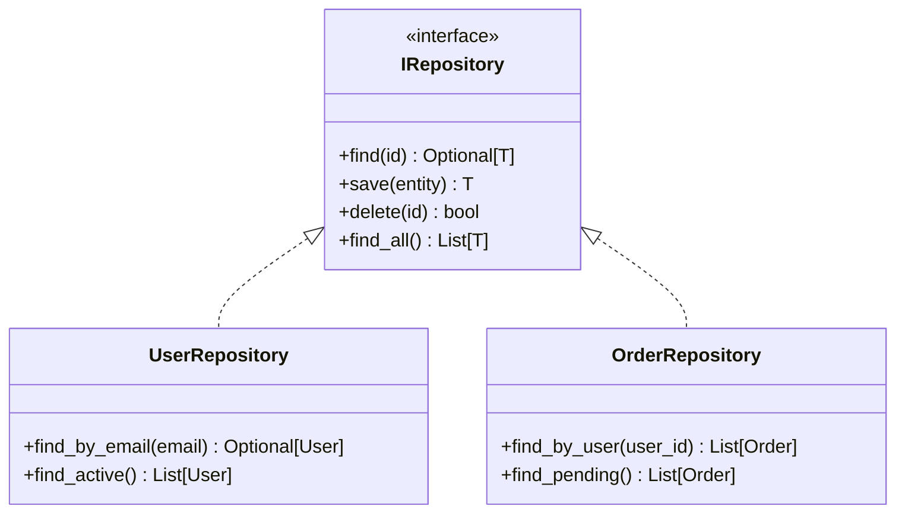

# PROMPT_12: Design Pattern Detection & Documentation

## Classification
- **Domain:** Deep Code Intelligence
- **Phase:** 3 — Detailed Code Analysis
- **Prerequisites:** PROMPT_10, PROMPT_11
- **Dependencies:** Class/function catalog, algorithm documentation
- **Estimated Effort:** Medium

---

## Objective

Identify every design pattern implemented in the repository, document how each pattern is applied, assess correctness of implementation, and identify opportunities for pattern introduction or improvement.

---

## Input Requirements

### Required Context
- Class analysis from PROMPT_10
- Component analysis from PROMPT_07
- Architecture analysis from PROMPT_05

---

## Pre-Analysis Checklist
- [ ] PROMPT_10 and PROMPT_11 completed
- [ ] All class hierarchies identified
- [ ] All interface/protocol implementations identified

---

## Analysis Tasks

### Task 1: Design Pattern Identification

**Purpose:** Identify all design patterns used in the codebase.

**Instructions:**
1. Scan the codebase for known design patterns:
   - **Creational:** Singleton, Factory, Factory Method, Abstract Factory, Builder, Prototype
   - **Structural:** Adapter, Bridge, Composite, Decorator, Facade, Flyweight, Proxy
   - **Behavioral:** Chain of Responsibility, Command, Interpreter, Iterator, Mediator, Memento, Observer, State, Strategy, Template Method, Visitor
   - **Architectural:** MVC, MVP, MVVM, Repository, Unit of Work, Service Layer, Dependency Injection
2. For each pattern candidate:
   - Read the implementation to confirm pattern usage
   - Identify variations from canonical pattern
   - Document the pattern's specific application

**Output Format:**

```
markdown
## Design Pattern Inventory

| Pattern | Category | Location | Implementation | Correctness |
|---------|----------|----------|---------------|-------------|
| Repository | Architectural | src/data/repositories/ | Interface + concrete implementations | CORRECT |
| Singleton | Creational | src/config/settings.py | Module-level instance | CORRECT |
| Factory | Creational | src/users/factories/ | Abstract factory for user creation | CORRECT |
| Strategy | Behavioral | src/payments/strategies/ | Interface with multiple implementations | CORRECT |
| Observer | Behavioral | src/events/ | Event bus with subscribers | PARTIAL (sync only) |
| Dependency Injection | Architectural | src/di/container.py | Manual DI container | CORRECT |
```

---

### Task 2: Pattern Implementation Documentation

**Purpose:** Document the specific implementation of each design pattern.

**Instructions:**
1. For each pattern, document:
   - Participants (classes/interfaces involved)
   - Structure diagram
   - How the pattern is used in context
   - Any variations from standard pattern
   - Rationale for pattern choice

**Output Format:**

```
markdown
## Pattern: Repository Pattern

### Classification
- **Type:** Architectural / Data Access
- **Location:** src/data/repositories/
- **Standard Pattern:** Yes (no variations)

### Participants
| Role | Implementation | Interface |
|------|---------------|-----------|
| Repository Interface | IRepository (Protocol) | src/data/repositories/interfaces.py |
| Concrete Repository | UserRepository, OrderRepository | src/data/repositories/impl/ |
| Entity | User, Order | src/data/models/ |

### Structure


### Usage Context
Used by all Service classes to abstract data access. Enables unit testing through mock repositories and allows changing data source without affecting business logic.

### Rationale
- Testability: Services can be tested with mock repositories
- Flexibility: Can switch from SQLAlchemy to raw SQL or external API
- Separation: Business logic doesn't depend on ORM specifics
```

---

### Task 3: Anti-Pattern Detection

**Purpose:** Identify common anti-patterns in the codebase.

**Instructions:**
1. Scan for anti-patterns:
   - **God Class:** Single class doing too much
   - **Shotgun Surgery:** Single change requires many file modifications
   - **Feature Envy:** Class using too many methods of another class
   - **Lazy Class:** Class that doesn't do enough
   - **Speculative Generality:** Unused abstractions
   - **Message Chain:** Long chain of method calls
   - **Middle Man:** Class that delegates everything
2. Document each anti-pattern with location and impact

**Output Format:**

```
markdown
## Anti-Pattern Inventory

| Anti-Pattern | Location | Impact | Severity | Recommendation |
|--------------|----------|--------|----------|----------------|
| God Class | UserService (800 lines) | Low maintainability | HIGH | Split into multiple services |
| Feature Envy | OrderService uses 20 PaymentService methods | Tight coupling | MEDIUM | Move logic to PaymentService |
| Lazy Class | MigrationHelper (1 method, 5 lines) | Unnecessary abstraction | LOW | Inline or remove |
```

---

## Synthesis
**Purpose:** Create a comprehensive design pattern reference.

**Output Format:**

```
markdown
## Design Pattern Summary

| Pattern | Type | Usage | Correctness | Coverage |
|---------|------|-------|-------------|----------|
| Repository | Architectural | Data access | Correct | Full |
| Singleton | Creational | Config | Correct | Single use |
| Strategy | Behavioral | Payments | Correct | Partial |
| Observer | Behavioral | Events | Partial | Single use |
| Anti-patterns | 3 found | - | - | - |
```

---

## Output Requirements
### Required Deliverables
1. Design pattern inventory with classification
2. Pattern implementation documentation with diagrams
3. Anti-pattern inventory with recommendations

---

## Cross-References
- **Previous Prompt:** PROMPT_11_ALGORITHM_EXTRACTION.md
- **Next Prompt:** PROMPT_13_ERROR_HANDLING_ANALYSIS.md
- **Shared Context Key:** patterns.detected, patterns.anti_patterns
