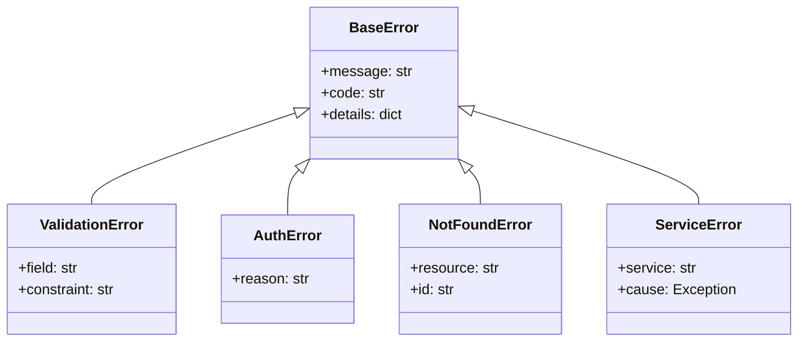

# PROMPT_13: Error Handling & Retry Strategy Analysis

## Classification
- **Domain:** Deep Code Intelligence
- **Phase:** 3 — Detailed Code Analysis
- **Prerequisites:** PROMPT_10, PROMPT_11
- **Dependencies:** Class/function catalog, algorithm documentation
- **Estimated Effort:** High

---

## Objective

Perform a comprehensive analysis of every error handling pattern, exception hierarchy, retry strategy, fallback mechanism, and error recovery path in the repository. Identify gaps in error coverage and assess robustness.

---

## Input Requirements

### Required Context
- Class and function analysis from PROMPT_10
- Algorithm documentation from PROMPT_11
- Data flow mappings from PROMPT_08
- Configuration analysis from PROMPT_04

---

## Pre-Analysis Checklist
- [ ] PROMPT_10, PROMPT_11 completed
- [ ] All exception/error classes identified
- [ ] All try-catch blocks identified

---

## Analysis Tasks

### Task 1: Error Class Hierarchy Analysis

**Purpose:** Document the complete error/exception hierarchy.

**Instructions:**
1. Identify all custom exception/error classes
2. Document the class hierarchy
3. Map each error type to its usage context

**Output Format:**

```
markdown
## Error Class Hierarchy



### Error Types by Module
| Module | Custom Errors | Inherits From | Count |
|--------|---------------|---------------|-------|
| Auth | InvalidCredentialsError, TokenExpiredError, AccountLockedError | AuthError | 5 |
| Validation | ValidationError, DuplicateError, FormatError | ValidationError | 7 |
| Data | NotFoundError, ConstraintError, ConnectionError | ServiceError | 4 |
| Payment | PaymentFailedError, InsufficientFundsError, RefundError | ServiceError | 4 |
```

---

### Task 2: Error Handling Pattern Documentation

**Purpose:** Document all error handling patterns used in the codebase.

**Instructions:**
1. Identify error handling patterns:
   - Try-catch-finally blocks
   - Error return values (Result types, Option types)
   - Error callback/handler registration
   - Global error handlers (middleware, exception handlers)
   - Logging-based error tracking
2. For each pattern, document:
   - Locations where it's used
   - Completeness of coverage
   - What happens after error handling (recovery, propagation, termination)

**Output Format:**

```
markdown
## Error Handling Patterns

### Pattern 1: Try-Catch with Logging
| Aspect | Detail |
|--------|--------|
| **Usage** | 85 locations across all services |
| **Structure** | try: operation, catch SpecificError: log, raise ServiceError |
| **Coverage** | 90% of external operations covered |
| **Recovery** | None (re-raises as ServiceError) |

### Pattern 2: Result Type Pattern
| Aspect | Detail |
|--------|--------|
| **Usage** | 15 locations in data layer |
| **Structure** | Return Result[OK, Error] instead of raising |
| **Coverage** | 60% of repository methods |
| **Recovery** | Caller decides how to handle |

### Global Error Handler
| Aspect | Detail |
|--------|--------|
| **Location** | src/middleware/error_handler.py |
| **Scope** | All HTTP requests |
| **Behavior** | Catches unhandled exceptions, returns 500, logs full trace |
```

---

### Task 3: Retry Strategy Analysis

**Purpose:** Document all retry strategies used in the codebase.

**Instructions:**
1. Identify retry mechanisms:
   - Explicit retry loops
   - Decorator-based retry (@retry)
   - Library-based retry (tenacity, retry)
   - Retry in external libraries (HTTP clients, DB drivers)
2. For each retry strategy, document:
   - Retry count
   - Backoff strategy (linear, exponential, constant)
   - Which errors trigger retry
   - Which errors don't trigger retry
   - Circuit breaker integration

**Output Format:**

```
markdown
## Retry Strategy Analysis

### Retry Usage Summary
| Location | Strategy | Max Retries | Backoff | Trigger Errors | Non-Trigger Errors |
|----------|----------|-------------|---------|----------------|-------------------|
| src/data/database.py | Exponential | 3 | 2x (1s, 2s, 4s) | ConnectionError, TimeoutError | IntegrityError, DataError |
| src/services/payment.py | Linear | 3 | 1s | NetworkError, TimeoutError | PaymentFailedError |
| src/clients/s3.py | Fixed | 5 | 2s | All 5xx errors | 4xx errors |

### Retry Decorator Analysis
```python
@retry(
    stop=stop_after_attempt(3),
    wait=wait_exponential(multiplier=1, min=1, max=10),
    retry=retry_if_exception_type((ConnectionError, TimeoutError))
)
```

### Circuit Breaker Configuration
| Location | Threshold | Half-Open Timeout | State |
|----------|-----------|-------------------|-------|
| PaymentService | 5 failures in 60s | 30s | CLOSED |
| S3Client | 10 failures in 60s | 60s | CLOSED |
```

---

### Task 4: Error Coverage Gap Analysis

**Purpose:** Identify gaps in error handling coverage.

**Instructions:**
1. For each module, check error handling completeness:
   - Are all external calls wrapped in error handling?
   - Are all expected error types handled?
   - Is there a default/fallback handler?
   - Are errors propagated appropriately?
2. Identify:
   - Missing error handlers
   - Catch-all blocks that swallow errors
   - Unhandled exception types
   - Inconsistent error responses

**Output Format:**

```
markdown
## Error Coverage Gaps

| Gap | Location | Type | Severity | Impact |
|-----|----------|------|----------|--------|
| No error handling for S3 upload | src/services/file_service.py:45 | Missing handler | HIGH | Silent failure |
| Bare except clause | src/legacy/migration.py:120 | Swallows all errors | HIGH | Hides bugs |
| Inconsistent error response format | src/api/handlers/ | Design inconsistency | MEDIUM | Client confusion |
| Unhandled timeout in external API | src/clients/stripe.py | Missing handler | MEDIUM | Hanging requests |

### Error Coverage by Module
| Module | Coverage % | Missing Count | Risk Level |
|--------|------------|---------------|------------|
| Auth | 95% | 2 | LOW |
| User | 90% | 3 | LOW |
| Order | 85% | 5 | MEDIUM |
| Payment | 80% | 4 | MEDIUM |
| Data | 70% | 8 | HIGH |
```

---

## Synthesis
**Purpose:** Create a comprehensive error handling reference.

**Output Format:**

```
markdown
## Error Handling Summary

| Aspect | Assessment | Priority Actions |
|--------|------------|-----------------|
| Error Hierarchy | Well-designed, extensible | None |
| Error Coverage | 85% overall | Fix gaps in Data module |
| Retry Strategy | Good coverage | Add circuit breaker to S3 |
| Error Response | Inconsistent | Standardize format |
| Logging | Comprehensive | Add structured logging |

**Risk Assessment:** MEDIUM — Critical paths have good coverage, but data layer needs attention.
```

---

## Output Requirements
### Required Deliverables
1. Error class hierarchy documentation
2. Error handling pattern catalog
3. Retry strategy analysis
4. Error coverage gap analysis

---

## Cross-References
- **Previous Prompt:** PROMPT_12_DESIGN_PATTERN_DETECTION.md
- **Next Prompt:** PROMPT_14_STATE_MANAGEMENT.md
- **Shared Context Key:** errors.hierarchy, errors.patterns, errors.retry, errors.gaps
