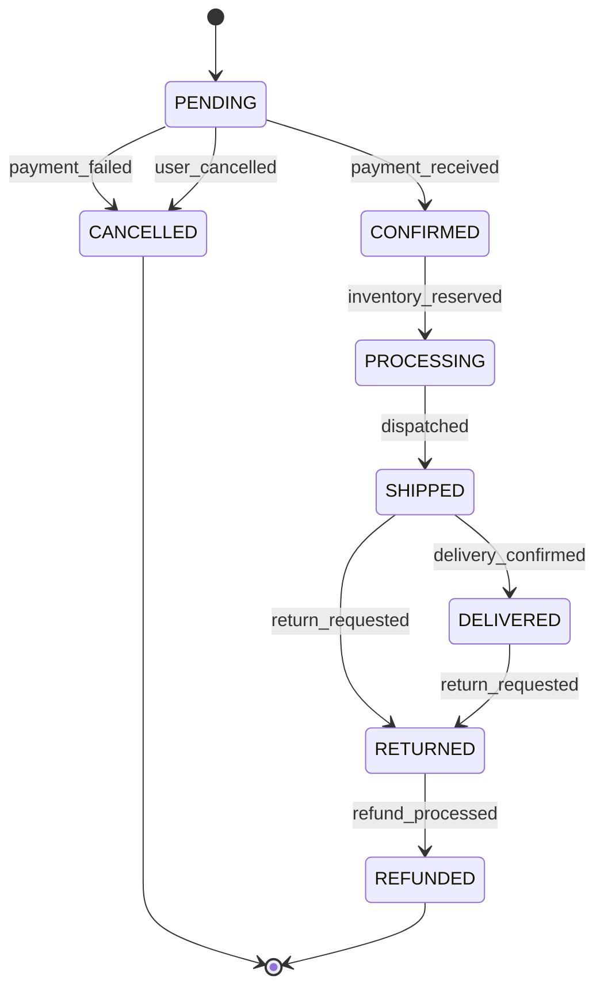

# PROMPT_14: State Management & State Machine Analysis

## Classification
- **Domain:** Deep Code Intelligence
- **Phase:** 3 — Detailed Code Analysis
- **Prerequisites:** PROMPT_10, PROMPT_13
- **Dependencies:** Class/function catalog, error handling analysis
- **Estimated Effort:** High

---

## Objective

Identify and document every state management pattern, state machine, state transition, and state persistence mechanism in the repository. Understand how the system manages state across requests, sessions, and system boundaries.

---

## Input Requirements

### Required Context
- Class analysis from PROMPT_10
- Data flow mappings from PROMPT_08
- Error handling analysis from PROMPT_13
- Configuration analysis from PROMPT_04

---

## Pre-Analysis Checklist
- [ ] PROMPT_10, PROMPT_13 completed
- [ ] All stateful components identified
- [ ] All database models identified

---

## Analysis Tasks

### Task 1: State Machine Identification

**Purpose:** Identify all state machines and stateful entities in the system.

**Instructions:**
1. Identify stateful entities:
   - **Domain entities with status fields:** Order (pending, confirmed, shipped, delivered, cancelled)
   - **Session state:** User sessions, authentication tokens
   - **Workflow state:** Pipeline stages, processing steps
   - **UI state:** Form state, navigation state, modal state
2. For each state machine, document:
   - All possible states
   - All possible transitions
   - Transition triggers (events, method calls, timeouts)
   - Guard conditions (preconditions for transitions)
   - Side effects of transitions

**Output Format:**

```markdown
## State Machine: Order Lifecycle

### States


### State Definitions
| State | Description | Allowed Transitions | Guard Conditions |
|-------|-------------|-------------------|------------------|
| PENDING | Order created, awaiting payment | CONFIRMED, CANCELLED | Payment must be valid |
| CONFIRMED | Payment received | PROCESSING, CANCELLED | Inventory must be available |
| PROCESSING | Being prepared | SHIPPED | All items in stock |
| SHIPPED | In transit | DELIVERED, RETURNED | Tracking number required |
| DELIVERED | Received by customer | RETURNED | Within return window (30 days) |
| CANCELLED | Order cancelled | None | Refund must be processed if paid |
| RETURNED | Customer returned | REFUNDED | Items must be received |
| REFUNDED | Refund processed | None | - |

### Transition Details
| Transition | Trigger | Source | Target | Side Effects |
|------------|---------|--------|--------|--------------|
| payment_received | PaymentService callback | PENDING | CONFIRMED | Send confirmation email, reserve inventory |
| user_cancelled | User cancels in UI | PENDING | CANCELLED | Release any held inventory |
| dispatched | Warehouse scan | PROCESSING | SHIPPED | Send tracking email, update delivery ETA |
```

---

### Task 2: State Persistence Analysis

**Purpose:** Document how state is persisted across system boundaries.

**Instructions:**
1. Identify state persistence mechanisms:
   - **Database:** Entity state in relational tables
   - **Cache:** Session state in Redis
   - **File system:** Temporary state files
   - **External:** State stored in external services
2. For each mechanism, document:
   - What state is stored
   - Storage format
   - Retention policy
   - Consistency guarantees
   - Recovery mechanism

**Output Format:**

```markdown
## State Persistence

### Persistence Mechanisms
| Mechanism | State Type | Location | Format | Retention | Consistency |
|-----------|------------|----------|--------|-----------|-------------|
| PostgreSQL | Entity state | orders.status | VARCHAR(20) | Permanent | Strong (ACID) |
| Redis | Session state | sessions:* | JSON | 24 hours | Eventual |
| Redis | Cache state | cache:* | Pickle | TTL-based | Eventual |
| JWT Token | Auth state | Client-side | JWT | Token expiry | None (stateless) |

### State Recovery
| Failure Scenario | Recovery Mechanism | Data Loss |
|-----------------|-------------------|-----------|
| Server crash | Database persistence, session reload from Redis | In-memory state lost |
| Redis failure | Fallback to database, degraded mode | Cache data lost |
| Network partition | Retry with idempotency keys | None (with idempotency) |
```

---

### Task 3: State Consistency Analysis

**Purpose:** Assess state consistency guarantees and identify inconsistency risks.

**Instructions:**
1. Identify consistency patterns:
   - **Strong consistency:** ACID transactions
   - **Eventual consistency:** Cache updates, async processing
   - **Read-after-write consistency:** Session management
2. Identify inconsistency risks:
   - Race conditions
   - Stale cache data
   - Partial updates
   - Concurrent modification

**Output Format:**

```markdown
## State Consistency Analysis

### Consistency Patterns
| Pattern | Location | Guarantee | Risk Level |
|---------|----------|-----------|------------|
| ACID Transaction | Order creation | Strong | LOW |
| Cache-aside | User profile cache | Eventual | MEDIUM |
| Optimistic locking | Inventory updates | Strong (with retry) | LOW |
| Eventual consistency | Notification delivery | Eventual | LOW |

### Inconsistency Risks
| Risk | Location | Impact | Mitigation |
|------|----------|--------|------------|
| Stale inventory count | Redis cache | Overselling | Short TTL, DB fallback |
| Concurrent order updates | OrderService | Lost updates | Optimistic locking |
| Session inconsistency | Multiple servers | User logged out | Sticky sessions + Redis |
```

---

## Synthesis
**Purpose:** Create a comprehensive state management reference.

**Output Format:**

```markdown
## State Management Summary

| State Machine | States | Transitions | Persistence | Consistency |
|---------------|--------|-------------|-------------|-------------|
| Order | 8 | 10 | PostgreSQL | Strong |
| User Session | 2 | 3 | Redis | Eventual |
| Payment | 5 | 6 | PostgreSQL | Strong |
| Inventory | 3 | 4 | PostgreSQL + Redis | Eventual |
```

---

## Output Requirements
### Required Deliverables
1. State machine documentation with diagrams
2. State persistence analysis
3. State consistency analysis

---

## Cross-References
- **Previous Prompt:** PROMPT_13_ERROR_HANDLING_ANALYSIS.md
- **Next Prompt:** PROMPT_15_EXECUTION_PIPELINE.md
- **Shared Context Key:** state.machines, state.persistence, state.consistency
