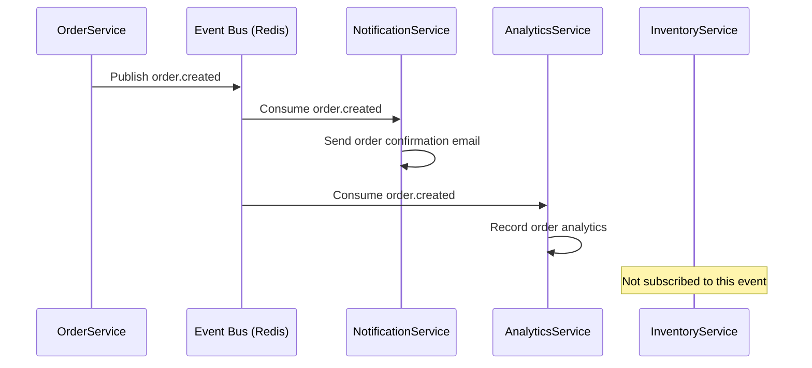

# PROMPT_16: Event-Driven Workflow Analysis

## Classification
- **Domain:** Workflow & Execution Analysis
- **Phase:** 4 — Workflow Analysis
- **Prerequisites:** PROMPT_15 (Execution Pipeline)
- **Dependencies:** Pipeline analysis, state management
- **Estimated Effort:** High

---

## Objective

Identify and document every event-driven workflow, event bus implementation, event handler, event propagation path, and event sourcing mechanism in the system.

---

## Input Requirements

### Required Context
- Execution pipelines from PROMPT_15
- State management from PROMPT_14
- Component analysis from PROMPT_07

---

## Pre-Analysis Checklist
- [ ] PROMPT_15 completed and context loaded
- [ ] Event-related code identified
- [ ] Message queue/broker configuration identified

---

## Analysis Tasks

### Task 1: Event Bus & Event System Analysis

**Purpose:** Document the event system architecture.

**Instructions:**
1. Identify event system components:
   - Event bus/message broker
   - Event definitions/types
   - Publishers and subscribers
   - Event serialization/deserialization
   - Event routing
2. Document event flow patterns:
   - Point-to-point (one publisher, one subscriber)
   - Pub/Sub (one publisher, multiple subscribers)
   - Event streaming (ordered event log)
   - Event sourcing (event log as source of truth)

**Output Format:**

```markdown
## Event System Architecture

### Event Bus: Redis Pub/Sub + Celery
| Component | Technology | Purpose |
|-----------|------------|---------|
| Sync events | Redis Pub/Sub | Real-time in-process events |
| Async events | Celery + Redis | Background task events |
| Event definitions | Python dataclasses | Event type definitions |

### Event Types
| Event | Type | Publisher | Subscribers | Delivery |
|-------|------|-----------|-------------|----------|
| order.created | Async | OrderService | NotificationService, AnalyticsService | At-least-once |
| order.cancelled | Async | OrderService | InventoryService, PaymentService | At-least-once |
| payment.completed | Sync | PaymentService | OrderService | Exactly-once |
| user.registered | Async | AuthService | NotificationService, AnalyticsService | At-least-once |
```

---

### Task 2: Event Flow Map

**Purpose:** Map the complete flow of each event through the system.

**Instructions:**
1. For each event type, trace:
   - Where it's emitted
   - Where it's consumed
   - What actions are taken on consumption
   - What follow-up events are emitted
   - Error handling on consumption failure

**Output Format:**

```markdown
## Event Flow: order.created



### Event Handler Details
| Handler | Service | Action | Async | Error Handling |
|---------|---------|--------|-------|----------------|
| handle_order_created | NotificationService | Send confirmation email | Yes | Retry 3x, then dead letter |
| handle_order_created | AnalyticsService | Record analytics event | Yes | Ignore failure (best effort) |
```

---

### Task 3: Event Reliability & Consistency Analysis

**Purpose:** Assess event delivery guarantees and consistency.

**Instructions:**
1. For each event flow, assess:
   - Delivery guarantee (at-most-once, at-least-once, exactly-once)
   - Ordering guarantee (total order, partial order, no order)
   - Duplicate detection
   - Dead letter handling
   - Retry policy

**Output Format:**

```markdown
## Event Reliability Analysis

| Event | Delivery | Ordering | Duplicate Detection | Retry | Dead Letter |
|-------|----------|----------|-------------------|-------|-------------|
| order.created | At-least-once | No ordering | Idempotency key | 3x exponential | Yes (Redis list) |
| payment.completed | Exactly-once | Global order | Transaction ID | None (critical) | None (manual) |
| user.registered | At-least-once | No ordering | Email dedup | 3x fixed | Yes |
```

---

## Synthesis
**Purpose:** Create a comprehensive event workflow reference.

**Output Format:**

```markdown
## Event Workflow Summary

| Event | Publisher | Subscribers | Delivery | Reliability |
|-------|-----------|-------------|----------|-------------|
| order.created | OrderService | 2 | Async | At-least-once |
| order.cancelled | OrderService | 2 | Async | At-least-once |
| payment.completed | PaymentService | 1 | Sync | Exactly-once |
| user.registered | AuthService | 2 | Async | At-least-once |
```

---

## Output Requirements
### Required Deliverables
1. Event system architecture documentation
2. Event flow maps with sequence diagrams
3. Event reliability and consistency analysis

---

## Cross-References
- **Previous Prompt:** PROMPT_15_EXECUTION_PIPELINE.md
- **Next Prompt:** PROMPT_17_AI_WORKFLOW_ANALYSIS.md
- **Shared Context Key:** events.system, events.flows, events.reliability
