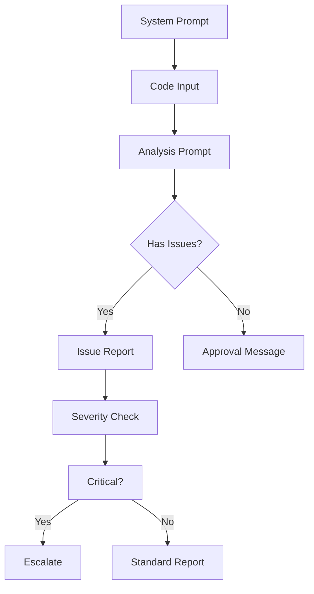

# PROMPT_17: AI Workflow & LLM Integration Analysis

## Classification
- **Domain:** Workflow & Execution Analysis
- **Phase:** 4 — Workflow Analysis
- **Prerequisites:** All Phase 3 prompts, PROMPT_15
- **Dependencies:** Pipeline analysis, event workflows, component analysis
- **Estimated Effort:** High

---

## Objective

Identify and document all AI/LLM workflows, prompt chains, reasoning pipelines, agent architectures, planning systems, memory structures, and tool-calling frameworks integrated into the repository.

---

## Input Requirements

### Required Context
- Component analysis from PROMPT_07
- Execution pipelines from PROMPT_15
- Event workflows from PROMPT_16
- Algorithm documentation from PROMPT_11
- Configuration from PROMPT_04

### Required Files
- All files related to AI/LLM integration
- All prompt template files
- All agent configuration files
- All tool definition files
- All memory/context management files

---

## Pre-Analysis Checklist

- [ ] PROMPT_15 and PROMPT_16 completed
- [ ] AI/LLM related files identified from file scanning
- [ ] Prompt template directories identified
- [ ] Agent configuration files located

---

## Analysis Tasks

### Task 1: AI/LLM Integration Architecture

**Purpose:** Document the complete AI/LLM integration architecture.

**Instructions:**
1. Identify AI/LLM components:
   - LLM providers integrated (OpenAI, Anthropic, local models, etc.)
   - Model configuration (model names, parameters, endpoints)
   - Prompt management system
   - Response parsing and validation
   - Cost tracking and rate limiting
2. Document integration patterns:
   - Direct API calls
   - SDK/library usage
   - Streaming vs. batch
   - Synchronous vs. asynchronous
   - Fallback model configuration

**Output Format:**

```markdown
## AI/LLM Integration Architecture

### LLM Providers
| Provider | Models Used | Endpoint | Authentication | Fallback |
|----------|-------------|----------|----------------|----------|
| OpenAI | gpt-4, gpt-3.5-turbo | api.openai.com | API Key | Anthropic |
| Anthropic | claude-3-opus, claude-3-sonnet | api.anthropic.com | API Key | OpenAI |
| Local | mistral-7b (via Ollama) | localhost:11434 | None | None |

### Integration Pattern
| Aspect | Detail |
|--------|--------|
| Pattern | Adapter pattern with provider abstraction |
| SDK | openai==1.12.0, anthropic==0.18.0 |
| Streaming | Server-Sent Events (SSE) for real-time |
| Rate Limiting | Token-based (configurable per tier) |
| Cost Tracking | Per-request cost logging to database |
```

---

### Task 2: Prompt Chain & Pipeline Analysis

**Purpose:** Document all prompt chains and pipelines.

**Instructions:**
1. Identify prompt structures:
   - System prompts (role, context, constraints)
   - User prompts (input, instructions)
   - Few-shot examples
   - Response format instructions
2. Map prompt chains:
   - Single prompt -> response
   - Multi-step chains (prompt A -> response -> prompt B)
   - Conditional chains (branching based on response)
   - Iterative chains (refinement loops)
3. Document prompt engineering patterns:
   - Prompt templates with variables
   - Dynamic prompt construction
   - Context injection strategies
   - Output parsing and validation

**Output Format:**

```markdown
## Prompt Chain: Code Review Assistant

### Chain Structure


### Prompt Templates
| Prompt | Type | Variables | Max Tokens | Temperature |
|--------|------|-----------|------------|-------------|
| System prompt | System | {role}, {context} | 500 | 0 |
| Code analysis | User | {code}, {language}, {rules} | 2000 | 0.2 |
| Issue severity | User | {issue}, {context} | 500 | 0.1 |
| Escalation | User | {issue}, {impact} | 1000 | 0 |

### Dynamic Prompt Construction
```python
def build_analysis_prompt(code: str, language: str, rules: List[str]) -> str:
    return f"""
    Analyze the following {language} code for issues.
    
    Rules to check:
    {chr(10).join(f'- {rule}' for rule in rules)}
    
    Code:
    
```{language}
    {code}
    
```
    
    Provide analysis in the following JSON format:
    {{
        "has_issues": bool,
        "issues": [
            {{
                "line": int,
                "severity": "critical" | "major" | "minor",
                "description": str,
                "suggestion": str
            }}
        ]
    }}
    """
```
---

### Task 3: Agent Architecture Analysis

**Purpose:** Document any AI agent architectures in the repository.

**Instructions:**
1. Identify agent patterns:
   - Single-purpose agents (one task)
   - Multi-agent systems (coordinating multiple agents)
   - Agentic workflows (autonomous decision-making)
   - Tool-using agents (agents with tool access)
2. Document agent architecture:
   - Agent roles and responsibilities
   - Agent communication patterns
   - Decision-making processes
   - Memory and context management
   - Tool definitions and access control

**Output Format:**

```markdown
## Agent Architecture

### Agent: CodeReviewAgent
| Aspect | Detail |
|--------|--------|
| **Role** | Automated code review assistant |
| **LLM** | GPT-4 (primary), Claude-3 (fallback) |
| **Tools** | 5 (code_analyzer, git_inspector, style_checker, security_scanner, doc_generator) |
| **Memory** | Conversation history (last 20 exchanges) |
| **Max Iterations** | 3 refinement cycles |

### Tool Definitions
| Tool | Description | Parameters | Trigger Condition |
|------|-------------|------------|-------------------|
| code_analyzer | Analyze code quality | code: str, language: str | Always |
| git_inspector | Check git history | file_path: str | When blame needed |
| style_checker | Check style guide | code: str, style: str | After code_analyzer |
| security_scanner | Scan for vulnerabilities | code: str | When severity > medium |
| doc_generator | Generate documentation | analysis: dict | Final step |

### Agent Workflow
```
1. Receive code review request
2. Run code_analyzer tool
3. If issues found, run style_checker
4. If security concern, run security_scanner
5. Aggregate all findings
6. Generate final review report
7. Optionally run doc_generator for new code
```
---

### Task 4: Memory & Context Management

**Purpose:** Document how the system manages AI memory and context.

**Instructions:**
1. Identify memory systems:
   - **Short-term memory:** Conversation history within a session
   - **Long-term memory:** Persistent storage across sessions (vector DB, key-value store)
   - **Episodic memory:** Specific interaction logs
   - **Semantic memory:** Knowledge base, documentation
2. Document context management:
   - Context window optimization
   - Context truncation strategies
   - Relevant context retrieval
   - Token budget management

**Output Format:**

```markdown
## Memory & Context Management

### Memory Architecture
| Memory Type | Storage | Retention | Retrieval Method |
|-------------|---------|-----------|------------------|
| Short-term | In-memory dict | Session lifetime | Direct access |
| Long-term | PostgreSQL | Indefinite | SQL queries |
| Semantic | Pinecone vector DB | Indefinite | Cosine similarity |
| Episodic | Redis | 30 days | Key lookup |

### Context Management Strategy
| Strategy | Implementation | Token Savings |
|----------|---------------|---------------|
| Sliding window | Keep last 5 exchanges | 60% |
| Summarization | Summarize old context | 80% |
| Relevance filter | Only include relevant history | 40% |
| Token budget | Hard limit per role | Configurable |
```

---

### Task 5: Prompt Quality & Safety Analysis

**Purpose:** Assess prompt quality, safety, and effectiveness.

**Instructions:**
1. Analyze prompt quality:
   - Clarity and specificity
   - Edge case handling
   - Output format compliance
   - Injection prevention
2. Check safety measures:
   - Prompt injection prevention
   - Output validation and sanitization
   - Content filtering
   - Rate limiting per user

**Output Format:**

```markdown
## Prompt Quality & Safety Analysis

### Quality Assessment
| Prompt | Clarity | Specificity | Edge Cases | Overall |
|--------|---------|-------------|------------|---------|
| Code analysis | 9/10 | 8/10 | 7/10 | 8.0 |
| Issue severity | 7/10 | 6/10 | 5/10 | 6.0 |
| Escalation | 8/10 | 8/10 | 6/10 | 7.3 |

### Safety Measures
| Measure | Implemented | Effectiveness |
|---------|-------------|---------------|
| Input sanitization | Yes | High |
| Output validation | Yes (JSON schema) | High |
| Prompt injection prevention | Partial (basic escaping) | Medium |
| Content filtering | Yes (blocklist) | Medium |
| Rate limiting | Yes (token-based) | High |
```

---

## Synthesis
**Purpose:** Create a comprehensive AI workflow reference.

**Output Format:**

```markdown
## AI Workflow Summary

| Component | Type | Count | Primary Model | Complexity |
|-----------|------|-------|---------------|------------|
| LLM Providers | External | 3 | GPT-4 | Medium |
| Prompt Chains | Workflow | 5 | - | High |
| Agents | Autonomous | 2 | GPT-4 | High |
| Memory Systems | Storage | 4 | - | Medium |
| Tools | Integration | 8 | - | Medium |
```

---

## Output Requirements
### Required Deliverables
1. AI/LLM integration architecture documentation
2. Prompt chain and pipeline analysis
3. Agent architecture documentation
4. Memory and context management documentation
5. Prompt quality and safety assessment

---

## Cross-References
- **Previous Prompt:** PROMPT_16_EVENT_WORKFLOW.md
- **Next Prompt:** PROMPT_18_TOOL_INTEGRATION.md
- **Shared Context Key:** ai.architecture, ai.prompts, ai.agents, ai.memory
