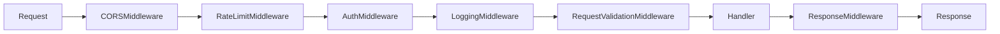

# PROMPT_18: Tool Integration & Middleware Analysis

## Classification
- **Domain:** Workflow & Execution Analysis
- **Phase:** 4 — Workflow Analysis
- **Prerequisites:** PROMPT_15, PROMPT_17
- **Dependencies:** Pipeline analysis, AI workflow analysis
- **Estimated Effort:** Medium

---

## Objective

Identify and document every tool integration point, middleware component, plugin system, service boundary, and external tool interaction in the repository.

---

## Input Requirements

### Required Context
- Execution pipelines from PROMPT_15
- AI workflows from PROMPT_17 (if applicable)
- Component analysis from PROMPT_07
- Dependency map from PROMPT_09

---

## Pre-Analysis Checklist
- [ ] PROMPT_15, PROMPT_17 completed
- [ ] All middleware identified
- [ ] All plugin/extension points identified

---

## Analysis Tasks

### Task 1: Middleware Stack Analysis

**Purpose:** Document the complete middleware stack.

**Instructions:**
1. Identify all middleware components:
   - Order of execution
   - Purpose and responsibility
   - Configuration options
   - Conditional execution rules
2. Document middleware interactions:
   - Request modification
   - Response modification
   - Short-circuit conditions

**Output Format:**

```markdown
## Middleware Stack

### Execution Order


### Middleware Details
| Middleware | Order | Purpose | Short-circuit | Config |
|------------|-------|---------|---------------|--------|
| CORSMiddleware | 1 | Handle CORS headers | No | ALLOWED_ORIGINS |
| RateLimitMiddleware | 2 | Rate limiting | Yes (429) | RATE_LIMIT_CONFIG |
| AuthMiddleware | 3 | Authentication | Yes (401) | AUTH_CONFIG |
| LoggingMiddleware | 4 | Request logging | No | LOG_CONFIG |
| RequestValidationMiddleware | 5 | Input validation | Yes (400) | None |
```

---

### Task 2: External Tool Integration Map

**Purpose:** Document all external tool integrations.

**Instructions:**
1. Identify all external tool integrations:
   - CLI tools invoked
   - External APIs consumed
   - SDK/library integrations
   - Database/queue connections
   - File system operations
2. For each integration, document:
   - Protocol and interface
   - Authentication method
   - Error handling
   - Fallback behavior
   - Version requirements

**Output Format:**

```markdown
## External Tool Integration Map

| Tool | Type | Interface | Auth | Fallback | Error Handling |
|------|------|-----------|------|----------|----------------|
| Stripe | Payment API | REST/HTTPS | API Key | Manual processing | Retry 3x |
| AWS S3 | Storage | SDK | IAM Keys | Local storage | Retry 5x |
| SendGrid | Email | REST/HTTPS | API Key | Log to file | Log and continue |
| Redis | Cache | TCP | Password | None | Degraded mode |
| PostgreSQL | Database | TCP | Password | Read replica | Connection pool |
```

---

### Task 3: Plugin & Extension System Analysis

**Purpose:** Document any plugin or extension systems.

**Instructions:**
1. Identify plugin/extension points:
   - Plugin interfaces and contracts
   - Plugin discovery and loading
   - Plugin lifecycle management
   - Plugin configuration
2. Document existing plugins:
   - Plugin purpose
   - Implementation
   - Dependencies
   - Activation conditions

**Output Format:**

```markdown
## Plugin System Analysis

| Plugin | Type | Purpose | Dependencies | Activation |
|--------|------|---------|--------------|------------|
| SlackNotifier | Notification | Send Slack alerts | slack-sdk | Config flag |
| PagerDutyIntegration | Alerting | Incident management | pdpyras | Config flag |
| CustomAuthProvider | Auth | Custom authentication | None | Config flag |
```

---

## Synthesis
**Purpose:** Create a comprehensive tool integration reference.

**Output Format:**

```markdown
## Tool Integration Summary

| Integration | Type | Count | Criticality | Reliability |
|-------------|------|-------|-------------|-------------|
| Middleware | Pipeline | 6 | Critical | High |
| External APIs | Service | 8 | High | Medium |
| Plugins | Extension | 3 | Low | Medium |
| SDKs | Library | 5 | High | High |
```

---

## Output Requirements
### Required Deliverables
1. Middleware stack documentation with execution order
2. External tool integration map
3. Plugin/extension system documentation

---

## Cross-References
- **Previous Prompt:** PROMPT_17_AI_WORKFLOW_ANALYSIS.md
- **Next Prompt:** PROMPT_19_CACHING_PERFORMANCE.md
- **Shared Context Key:** tools.middleware, tools.integrations, tools.plugins
