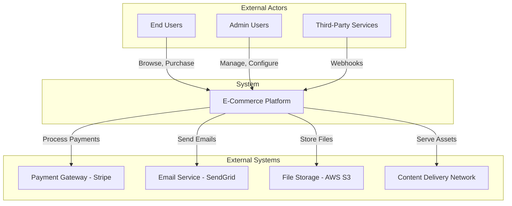
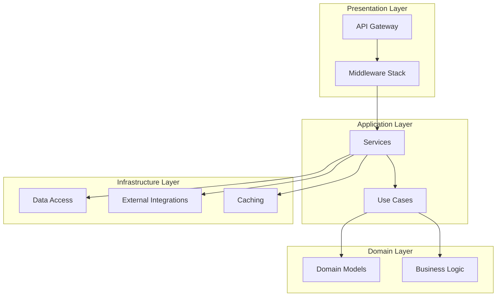

# PROMPT_20: Architecture Documentation Generation

## Classification
- **Domain:** Documentation Generation
- **Phase:** 5 — Documentation Production
- **Prerequisites:** ALL Phase 1-4 prompts (01-19)
- **Dependencies:** Complete analysis context from all previous phases
- **Estimated Effort:** Very High (synthesizing all analysis into documentation)

---

## Objective

Generate comprehensive architecture documentation that captures every aspect of the system's architecture, design decisions, component relationships, and structural patterns discovered during the analysis phases.

---

## Input Requirements

### Required Context
- Architecture style and components from PROMPT_05
- Module decomposition from PROMPT_06
- Component analysis from PROMPT_07
- Data flow mappings from PROMPT_08
- Dependency graph from PROMPT_09
- Design patterns from PROMPT_12
- State management from PROMPT_14
- Execution pipelines from PROMPT_15
- Event workflows from PROMPT_16
- AI workflows from PROMPT_17
- Tool integrations from PROMPT_18
- Caching/performance from PROMPT_19

---

## Pre-Analysis Checklist

- [ ] ALL analysis prompts (01-19) completed and context loaded
- [ ] Quality gate passed (per QUALITY_STANDARDS.md)
- [ ] All gaps documented and resolved or flagged

---

## Analysis Tasks

### Task 1: System Overview & Context
**Purpose:** Generate the high-level system overview.

**Instructions:**
1. Synthesize all architectural findings into a cohesive overview
2. Create system context diagram showing external actors and systems
3. Document system purpose, scope, and key capabilities
4. Identify system boundaries and external dependencies

**Output Format:**

```markdown
---
document_type: documentation
framework_version: 1.0.0
generated_by: PROMPT_20
status: draft
---

# System Architecture Documentation

## 1. System Overview

### 1.1 Purpose & Scope
[Comprehensive description of what the system does]

### 1.2 System Context Diagram



### 1.3 Key Capabilities
| Capability | Description | Primary Module |
|------------|-------------|----------------|
| User Management | Registration, authentication, profile management | Auth Module |
| Product Catalog | Product listing, search, categorization | Catalog Module |
| Order Processing | Order creation, payment, fulfillment | Order Module |
| Payment Processing | Payment collection, refunds, reconciliation | Payment Module |
```

---

### Task 2: Architecture Deep Dive
**Purpose:** Generate detailed architecture documentation for each layer.

**Instructions:**
1. Document each architectural layer with diagrams
2. Describe layer responsibilities and boundaries
3. Document layer interactions and data flow
4. Include design decisions and rationale

**Output Format:**

```markdown
## 2. Architecture Deep Dive

### 2.1 Layered Architecture



### 2.2 Layer Responsibilities
| Layer | Responsibility | Key Components | Technology |
|-------|----------------|----------------|------------|
| Presentation | HTTP handling, validation, serialization | FastAPI, Middleware | Python/FastAPI |
| Application | Use case orchestration, business workflows | Services, Use Cases | Python |
| Domain | Core business logic, domain rules | Domain Models, Validators | Python |
| Infrastructure | Data access, external APIs, caching | Repositories, Clients | Python/SQLAlchemy |
```

---

### Task 3: Component & Module Reference
**Purpose:** Generate complete component and module reference.

**Instructions:**
1. Document every module with its components
2. Include module dependency diagrams
3. Document module interfaces and contracts
4. Cross-reference with implementation files

**Output Format:**

```markdown
## 3. Module Reference

### 3.1 Module Map

| Module | Path | Responsibility | Dependencies | Files |
|--------|------|----------------|--------------|-------|
| Auth | src/auth/ | Authentication & authorization | Config, Database | 8 |
| Users | src/users/ | User management | Auth, Config | 10 |
| Orders | src/orders/ | Order lifecycle | Users, Payments, Inventory | 12 |

### 3.2 Detailed Module: Auth Module
[Full module documentation with components, interfaces, and dependencies]
```

---

### Task 4: Architecture Decision Records
**Purpose:** Document all key architectural decisions.

**Instructions:**
1. For each significant architectural decision, create an ADR entry:
   - Decision title and ID
   - Context and problem statement
   - Options considered
   - Decision outcome
   - Rationale
   - Consequences
   - Compliance verification

**Output Format:**

```markdown
## 4. Architecture Decision Records

### ADR-001: Use FastAPI as Web Framework
| Aspect | Detail |
|--------|--------|
| **Context** | Need for high-performance async API framework |
| **Options** | FastAPI, Django REST, Flask, Starlette |
| **Decision** | FastAPI |
| **Rationale** | Async support, automatic OpenAPI docs, Pydantic validation, performance |
| **Consequences** | Python 3.7+ required, async ecosystem dependency |
| **Compliance** | Confirmed by framework usage in src/main.py |
```

---

## Output Requirements
### Required Deliverables
1. System overview with context diagram
2. Architecture deep dive with layer documentation
3. Complete module and component reference
4. Architecture decision records

### Output Structure
```
DOCUMENTATION_ARCHITECTURE/
├── 01_system_overview.md
├── 02_architecture_deep_dive.md
├── 03_module_reference.md
├── 04_adr.md
└── architecture_complete.md
```

---

## Quality Checks
- [ ] All modules documented with responsibilities
- [ ] All architectural decisions captured as ADRs
- [ ] Diagrams accurately represent the system
- [ ] Cross-references to implementation files are valid
- [ ] Architecture is described at appropriate level of detail

---

## Cross-References
- **Previous Prompt:** PROMPT_19_CACHING_PERFORMANCE.md
- **Next Prompt:** PROMPT_21_DOCUMENTATION_TECHNICAL.md
- **Shared Context Key:** documentation.architecture
