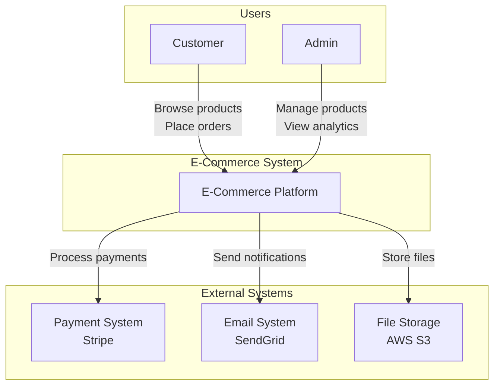
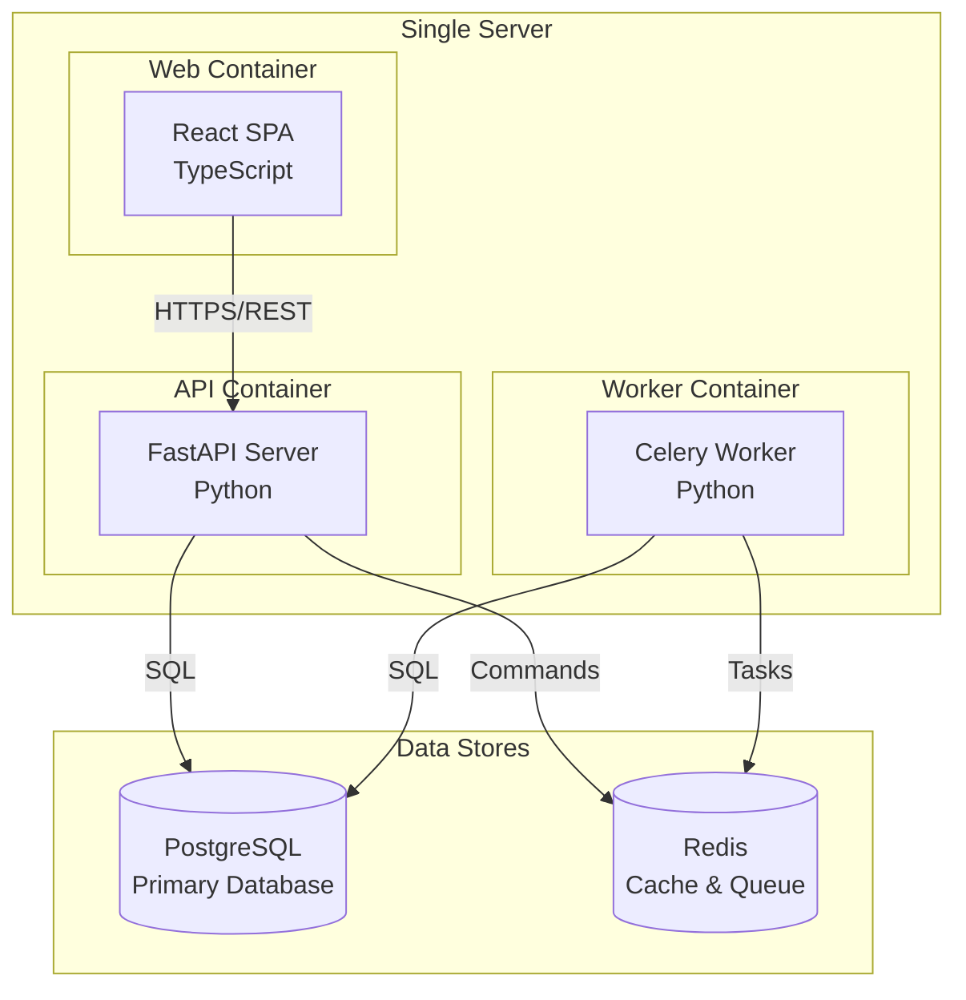
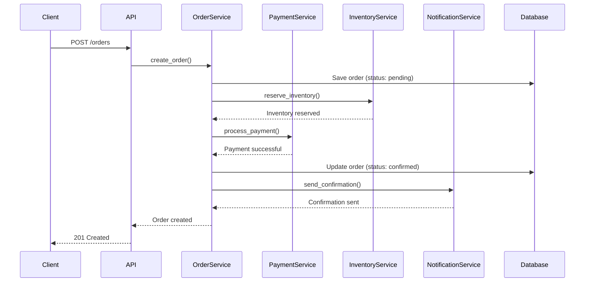
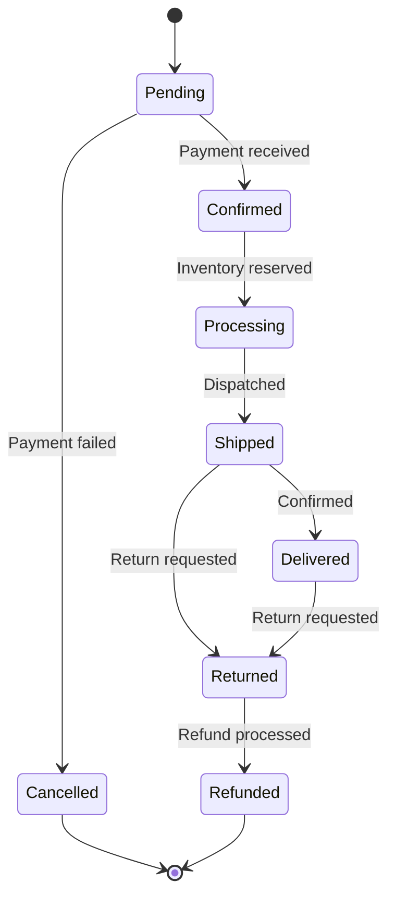
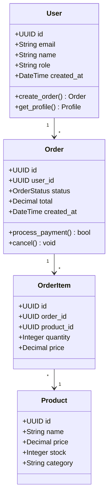
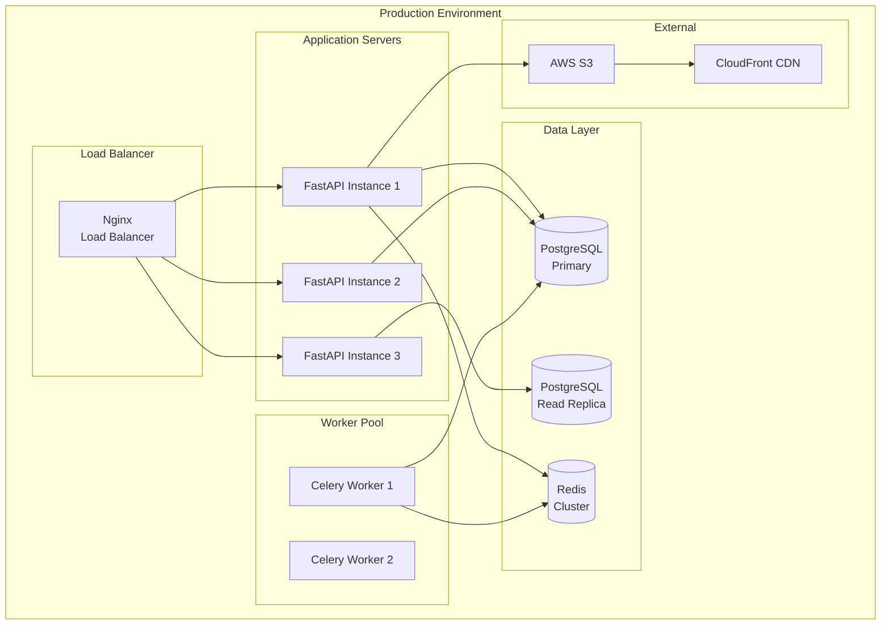

# PROMPT_23: Diagram & Visual Documentation Generation

## Classification
- **Domain:** Documentation Generation
- **Phase:** 5 — Documentation Production
- **Prerequisites:** All Phase 1-4 prompts (01-19)
- **Dependencies:** Complete analysis context
- **Estimated Effort:** High

---

## Objective

Generate all visual documentation artifacts including architecture diagrams, sequence diagrams, flowcharts, UML diagrams, state machine diagrams, and dependency graphs using Mermaid.js and other diagramming standards.

---

## Input Requirements

### Required Context
- All architectural findings from Phase 2-4
- Data flow mappings from PROMPT_08
- State machines from PROMPT_14
- Execution pipelines from PROMPT_15
- Event workflows from PROMPT_16
- Dependency graph from PROMPT_09

---

## Analysis Tasks

### Task 1: Architecture Diagrams
**Purpose:** Generate all architecture-level diagrams.

**Instructions:**
1. Create the following diagrams:
   - System context diagram (C4 Level 1)
   - Container diagram (C4 Level 2)
   - Component diagram (C4 Level 3)
   - Deployment diagram
   - Network architecture diagram

**Output Format:**

```markdown
## Architecture Diagrams

### System Context Diagram (C4 Level 1)


### Container Diagram (C4 Level 2)

---

### Task 2: Behavioral Diagrams
**Purpose:** Generate all behavioral and process diagrams.

**Instructions:**
1. Create the following diagrams:
   - Sequence diagrams for key flows
   - State machine diagrams
   - Activity diagrams for complex processes
   - Event flow diagrams

**Output Format:**

```markdown
## Behavioral Diagrams

### Sequence Diagram: Order Placement


### State Machine Diagram: Order Lifecycle

---

### Task 3: Structural Diagrams
**Purpose:** Generate all structural diagrams.

**Instructions:**
1. Create the following diagrams:
   - Class diagrams for key domain models
   - Component diagrams for module structure
   - Package/dependency diagrams
   - Database ER diagrams

**Output Format:**

```markdown
## Structural Diagrams

### Class Diagram: Domain Models

---

### Task 4: Infrastructure & Deployment Diagrams
**Purpose:** Generate infrastructure and deployment diagrams.

**Instructions:**
1. Create the following diagrams:
   - Deployment architecture diagram
   - Network topology diagram
   - CI/CD pipeline diagram
   - Data flow diagram

**Output Format:**

```markdown
## Infrastructure Diagrams

### Deployment Architecture

---

## Output Requirements
### Required Deliverables
1. Architecture diagrams (C4 model levels 1-3)
2. Behavioral diagrams (sequence, state, activity)
3. Structural diagrams (class, component, package)
4. Infrastructure and deployment diagrams

### Output Structure
```
DOCUMENTATION_DIAGRAMS/
├── architecture_diagrams.md
├── behavioral_diagrams.md
├── structural_diagrams.md
└── infrastructure_diagrams.md
```

---

## Quality Checks
- [ ] All diagrams use Mermaid.js syntax
- [ ] Diagrams are focused (max 15 nodes per diagram)
- [ ] All diagrams have descriptive captions
- [ ] Complex systems use multiple focused diagrams
- [ ] Diagrams render correctly in standard Markdown viewers
- [ ] All abbreviations are defined in captions

---

## Cross-References
- **Previous Prompt:** PROMPT_22_DOCUMENTATION_DEVELOPER.md
- **Next Prompt:** PROMPT_24_DOCUMENTATION_QUALITY.md
- **Shared Context Key:** documentation.diagrams
