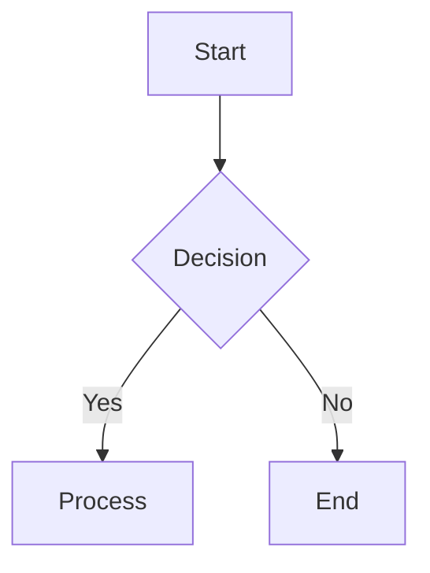
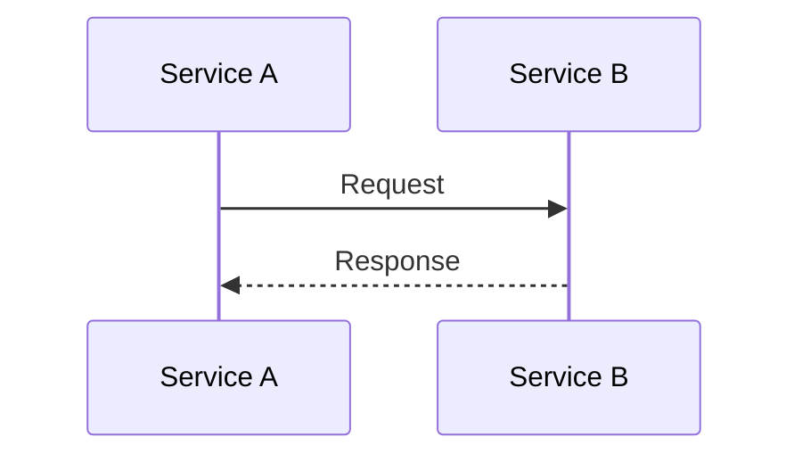
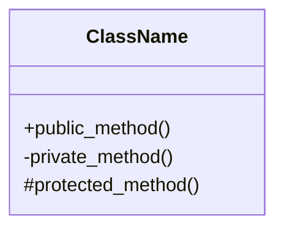
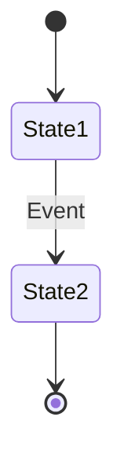
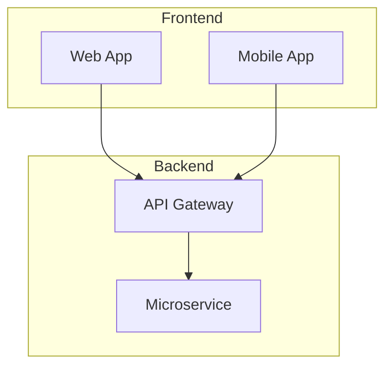

# Output Rules

## Enterprise Reverse Engineering Prompt Framework

---

## 1. Output Classification

### 1.1 Output Types

| Type | Description | Format |
|------|-------------|--------|
| **Analysis Output** | Intermediate analysis results | Markdown with structured sections |
| **Documentation Output** | Final documentation deliverables | Markdown, Mermaid diagrams |
| **Context Output** | Shared context between prompts | YAML frontmatter |
| **Status Output** | Progress and gap reports | Markdown with checklists |
| **Quality Output** | Quality check results | Markdown with verification tables |

---

## 2. Document Structure Rules

### 2.1 Heading Hierarchy

```markdown
# Title (H1) — Document title, one per document
## Section (H2) — Major sections
### Subsection (H3) — Sub-sections
#### Sub-subsection (H4) — Detailed breakdowns
##### Detail (H5) — Specific details (use sparingly)
```

**Rules:**
- Never skip heading levels (H1 → H3 is invalid)
- Maximum one H1 per document
- H5 should be used for no more than 2 levels of nesting
- Each H2 must have at least one paragraph or list before next H2

### 2.2 Metadata Header

Every output document must start with:

```markdown
---
document_type: [analysis | documentation | context | status | quality]
framework_version: 1.0.0
generated_by: PROMPT_XX
repository: [repository name]
analysis_date: [YYYY-MM-DD]
status: [draft | review | final]
confidence_level: [high | medium | low]
total_files_analyzed: [number]
total_lines_analyzed: [number]
---
```

### 2.3 Page Structure Template

```markdown
---
[Metadata Header]
---

# [Document Title]

## Document Information
- **Purpose:** [Brief description]
- **Scope:** [What this document covers]
- **Prerequisites:** [Required reading]
- **Related Documents:** [Links to related docs]

---

## Table of Contents
1. [Section 1](#section-1)
2. [Section 2](#section-2)
3. ...

---

## Section 1
[Content]

---

## Section 2
[Content]

---

## Appendices
- Appendix A: [Title]
- Appendix B: [Title]

---

## Change Log
| Version | Date | Author | Changes |
|---------|------|--------|---------|
| 1.0 | YYYY-MM-DD | AI Agent | Initial version |

---

## Source References
- [File 1](path/to/file1): lines XX-YY
- [File 2](path/to/file2): lines XX-YY
```

---

## 3. Formatting Rules

### 3.1 Code Formatting

```markdown
Inline code: `variable_name`, `function()`, `ClassName`

Code blocks with language:
```python
def example_function(param1: str) -> bool:
    """Documentation string."""
    return True
```

Code blocks for config/data:
```json
{
  "key": "value",
  "nested": {
    "property": true
  }
}
```

Code blocks for terminal output:
```
$ npm install
Installing packages...
Done
```
```

### 3.2 Table Formatting

```markdown
| Left-Aligned | Center-Aligned | Right-Aligned |
|:-------------|:--------------:|--------------:|
| Value 1      |    Value 2     |        Value 3 |
| Long value   |    Center      |            42 |

Rules:
- Always use alignment markers (:---, :---:, ---:)
- Always include header separator row
- Keep tables under 6 columns when possible
- Use monospace fonts for code-related content
```

### 3.3 List Formatting

```markdown
Unordered lists:
- Item 1
- Item 2
  - Nested item 2a
  - Nested item 2b
- Item 3

Ordered lists:
1. First step
2. Second step
   1. Sub-step 2a
   2. Sub-step 2b
3. Third step

Definition lists:
Term 1
: Definition of term 1

Term 2
: Definition of term 2
```

### 3.4 Blockquote Formatting

```markdown
> **Note:** Important information that requires attention.
>
> This is a multi-paragraph note with additional context.

> **Warning:** Critical information about potential issues.
>
> This warning requires action before proceeding.

> **Caution:** Information about potential pitfalls.
```

### 3.5 Alert Boxes

```markdown
> [!NOTE]
> Useful information that users should know.

> [!TIP]
> Helpful advice for doing things better.

> [!IMPORTANT]
> Key information users need to know.

> [!WARNING]
> Urgent info that needs immediate attention.

> [!CAUTION]
> Advises about risks or negative outcomes.
```

---

## 4. Diagram Formatting Rules

### 4.1 Mermaid Diagram Standards

```markdown
Flowchart:


Sequence Diagram:


Class Diagram:


State Diagram:


Architecture Diagram:

```

### 4.2 Diagram Rules

1. Every diagram must have a caption
2. Every diagram must have alt text
3. Diagrams must be kept focused (max 15 nodes for flowcharts)
4. Complex systems require multiple focused diagrams, not one complex diagram
5. Use consistent styling within a diagram
6. Define all abbreviations in the diagram caption
7. Diagrams must render correctly in standard Markdown viewers

---

## 5. Source Reference Formatting

### 5.1 Inline References

```markdown
The authentication module (`src/auth/auth_service.py:15-45`) handles ...
```

### 5.2 Block References

```markdown
**Source:** `src/auth/auth_service.py:15-45`

```python
def authenticate_user(credentials: Credentials) -> User:
    # Implementation
    pass
```

**Evidence:** The function accepts a Credentials object and returns a User object, confirming it handles authentication.
```

### 5.3 Cross-References

```markdown
**Cross-Reference:** See [Module Analysis](PROMPT_06_MODULE_DECOMPOSITION.md#auth-module) for detailed decomposition of the Auth module.
```

---

## 6. Gap Documentation Formatting

```markdown
## [GAP-001] Missing Error Handler
- **Location:** `src/processor/data_pipeline.py:120-150`
- **Description:** The data transformation function does not handle empty input
- **Impact:** Pipeline may crash on empty datasets
- **Severity:** MAJOR
- **Status:** UNRESOLVED
- **Resolution:** Add input validation or default value handling
```

---

## 7. Confidence Level Markers

Every claim about the repository must be marked with a confidence level:

```markdown
[CONFIRMED] — Directly observed in source code
  Example: "[CONFIRMED] The function returns a User object (src/auth.py:42)"

[INFERRED] — Logically derived from confirmed evidence
  Example: "[INFERRED] The system uses JWT tokens based on the jsonwebtoken dependency"

[UNKNOWN] — Cannot be determined from available code
  Example: "[UNKNOWN] The deployment strategy cannot be determined from source code alone"
```

---

## 8. Output Size Management

### 8.1 Document Size Limits

| Document Type | Maximum Size | Action if Exceeded |
|---------------|-------------|-------------------|
| Analysis output | 10,000 words | Split into sub-documents |
| Documentation | 20,000 words | Split into chapters |
| Context data | 5,000 lines | Compress or split |
| Quality report | 5,000 words | Use summary with detail appendices |

### 8.2 Continuation Markers

When a document exceeds size limits, use this continuation format:

```markdown
[CONTINUATION_POINT: Section_Name]
Current section complete: [X/Y tasks]
Next section to process: [Next Section]
Requesting continuation to complete [Next Section]
```

---

## 9. File Naming Conventions

### 9.1 Output File Naming

```markdown
Analysis files: ANALYSIS_[MODULE_NAME]_[VERSION].md
Documentation files: DOCS_[DOC_TYPE]_[VERSION].md
Context files: CONTEXT_[PHASE]_[VERSION].yaml
Quality files: QUALITY_[CHECK_TYPE]_[VERSION].md
```

### 9.2 Directory Structure for Output

```markdown
output/
├── analysis/
│   ├── analysis_architecture_v1.md
│   ├── analysis_modules_v1.md
│   └── ...
├── documentation/
│   ├── docs_architecture_v1.md
│   ├── docs_developer_handbook_v1.md
│   └── ...
├── context/
│   └── context_phase2_v1.yaml
└── quality/
    └── quality_final_review_v1.md
```

---

## 10. Prohibited Output Practices

1. **No placeholder content** — Every section must contain actual analysis, not "TODO" or "To be filled"
2. **No empty sections** — If a section has no content, remove it or mark as [NOT APPLICABLE]
3. **No orphan references** — Every cross-reference must point to an existing section or document
4. **No undated content** — All metadata must include dates
5. **No unlabeled diagrams** — Every diagram needs a caption
6. **No raw binary data** — Only text-based outputs allowed
7. **No duplicate content** — Information should appear once and be cross-referenced
8. **No broken links** — All internal links must be verified
9. **No unformatted code** — All code must be in proper code blocks with language tags
10. **No markdown errors** — All markdown must render correctly

---

## 11. Final Output Checklist

Before finalizing any output:

- [ ] Metadata header is present and complete
- [ ] Heading hierarchy is correct (no skipped levels)
- [ ] All code blocks have language specifications
- [ ] All tables have alignment markers and headers
- [ ] All diagrams have captions and alt text
- [ ] All source references are accurate
- [ ] All cross-references point to valid targets
- [ ] All confidence levels are assigned
- [ ] All gaps are documented in standard format
- [ ] No prohibited content practices violated
- [ ] Markdown renders correctly
- [ ] File naming follows conventions
- [ ] Output size is within limits
