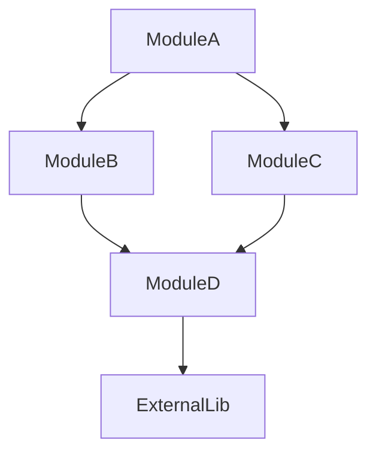

# Phase 3: Dependency & Relationship Analysis

> **Document:** PROMPT_03.md  
> **Phase:** 3 of 10  
> **Purpose:** Map all dependencies—internal and external—and analyze relationships between components  
> **Prerequisite:** Phase 2 complete; module map and structural understanding established

---

## 📋 PHASE INFORMATION

| Property | Value |
|----------|-------|
| **Phase** | 3 — Dependency & Relationship Analysis |
| **Entry Criteria** | Phase 2 complete; module map available; structural understanding established |
| **Exit Criteria** | Complete dependency graph; all imports/exports mapped; relationship matrix built |
| **Estimated Effort** | High |

---

## 🎯 OBJECTIVES

1. **Map** all internal dependencies (imports, requires, includes).
2. **Catalog** all external dependencies (packages, libraries, services).
3. **Construct** a dependency graph for the entire repository.
4. **Analyze** relationship patterns between modules.
5. **Identify** dependency direction and coupling.
6. **Detect** circular dependencies and dependency issues.

---

## 🔬 METHODOLOGY

### Step 1: External Dependency Catalog

For each external dependency, document:

```markdown
### [package-name] v[version]
- **Type:** Library / Framework / Tool / Service
- **Source:** npm / PyPI / Maven / Crates.io / Go Modules / RubyGems / Direct Download
- **Purpose:** [What this dependency provides]
- **Used By:** [Modules/files that use this dependency]
- **Usage Pattern:** [How the dependency is used—import, require, plugin, CLI]
- **Criticality:** Core / Important / Peripheral / Dev-only
- **License:** [License type, if identifiable]
- **Alternatives:** [Known alternatives, for context]
```

**Sources to check:**

| Language | Dependency File | Format |
|----------|----------------|--------|
| Node.js | package.json | dependencies, devDependencies, peerDependencies |
| Python | requirements.txt, pyproject.toml | Package names with versions |
| Java | pom.xml, build.gradle | Maven/Gradle coordinates |
| Rust | Cargo.toml | [dependencies] section |
| Go | go.mod | require statements |
| Ruby | Gemfile | gem statements |
| C/C++ | CMakeLists.txt, conanfile.txt | find_package, conan requirements |

### Step 2: Internal Dependency Mapping

For each module, map all internal dependencies:

```
- Module: [module-name]
- Depends On: [list of internal modules/components]
- Used By: [list of modules/components that depend on this]
- Dependency Type: (Import / Require / Include / Plugin / Event / Message / Shared State)
- Coupling Level: (Tight / Loose / None)
```

**For each file, trace:**
- All import/require/include statements
- All references to other files' symbols
- All plugin registrations
- All event subscriptions
- All message queue interactions
- All shared state access

### Step 3: Dependency Graph Construction

Build a dependency graph:



**Create separate graphs for:**
1. **Module-level graph:** Dependencies between modules
2. **Package-level graph:** Dependencies between packages/libraries
3. **External dependency graph:** All external dependencies

**For each graph, note:**
- Direction of dependencies
- Strength of coupling
- Cyclic dependencies (critical issue)
- Highly connected nodes (potential God modules)
- Isolated nodes (potential dead code)
- Dependency bottlenecks

### Step 4: Coupling Analysis

Analyze coupling between modules:

| Coupling Type | Description | Impact |
|---------------|-------------|--------|
| Content Coupling | One module modifies internal data of another | Very high - bad |
| Common Coupling | Modules share global data | High - problematic |
| Control Coupling | One module controls the flow of another | Medium - manageable |
| Stamp Coupling | Modules pass composite data structures | Medium - manageable |
| Data Coupling | Modules pass simple data | Low - good |
| Message Coupling | Modules communicate via messages | Very low - excellent |
| No Coupling | Modules are independent | Ideal |

**For each module relationship, document:**
- Coupling type
- Coupling strength
- Whether coupling is appropriate for the relationship
- Recommendations for reducing coupling (if too high)

### Step 5: Dependency Health Analysis

Analyze dependency health:

```
- Circular Dependencies: [list any circular dependencies]
- Dependency Conflicts: [version conflicts between dependencies]
- Duplicate Dependencies: [same dependency used in different versions]
- Deprecated Dependencies: [dependencies that are deprecated]
- Unused Dependencies: [dependencies not referenced in code]
- Overly Broad Dependencies: [dependencies used for a single function]
- Outdated Dependencies: [major versions behind]
- Security Issues: [known vulnerabilities, if identifiable]
```

### Step 6: Relationship Matrix

Build a relationship matrix:

| Module | A | B | C | D | External |
|--------|---|---|---|---|----------|
| A | - | Import | Message | - | yes |
| B | - | - | Import | Import | yes |
| C | - | - | - | Import | - |
| D | - | - | - | - | yes |

### Step 7: Knowledge Base Update

```json
{
  "external_dependencies": { /* from Step 1 */ },
  "internal_dependencies": { /* from Step 2 */ },
  "dependency_graph": { /* from Step 3 */ },
  "coupling_analysis": { /* from Step 4 */ },
  "dependency_health": { /* from Step 5 */ },
  "relationship_matrix": { /* from Step 6 */ },
  "phase_3_notes": {
    "critical_dependencies": [],
    "circular_dependencies": [],
    "dependency_risks": [],
    "open_questions": []
  }
}
```

---

## 🛠️ TOOLS

| Tool | Purpose | Usage |
|------|---------|-------|
| `search_files` | Find import/require patterns | Regex for import statements |
| `read_file` | Examine dependency files | package.json, go.mod, etc. |
| `execute_command` | Run dependency analyzers | `npm list`, `pip freeze`, `go list` |
| `list_files` | Verify dependency file locations | Module structures |

---

## 📚 KNOWLEDGE BASE UPDATE

Add to the working knowledge base:

1. **ExternalDependencies:** Complete catalog with versions and usage
2. **InternalDependencies:** Module-to-module dependency map
3. **DependencyGraph:** Visual and structured dependency representation
4. **CouplingAnalysis:** Coupling types and strengths
5. **DependencyHealth:** Issues, conflicts, and risks

---

## 📦 DELIVERABLES

Phase 3 produces:

1. `03_DEPENDENCY_ANALYSIS/INTERNAL_DEPENDENCIES.md` — Internal dependency map
2. `03_DEPENDENCY_ANALYSIS/EXTERNAL_DEPENDENCIES.md` — External dependency catalog
3. `03_DEPENDENCY_ANALYSIS/DEPENDENCY_GRAPH.md` — Visual dependency graphs
4. `03_DEPENDENCY_ANALYSIS/IMPORT_ANALYSIS.md` — Import/export analysis

---

## ✅ QUALITY CHECK

- [ ] All external dependencies cataloged?
- [ ] All internal dependencies mapped?
- [ ] Dependency graphs accurate and complete?
- [ ] Circular dependencies identified?
- [ ] Coupling analysis complete?
- [ ] Dependency health assessed?
- [ ] No dependency gaps?

---

## 🚪 PHASE COMPLETION GATE

Before proceeding to Phase 4:

1. Confirm the dependency catalog is complete.
2. Confirm the dependency graph is accurate.
3. Confirm coupling analysis is thorough.
4. Flag any critical dependency issues (circular deps, outdated packages).
5. **If critical dependency issues exist, document them before proceeding.**

---

**PROCEED TO PHASE 4 → `PROMPT_04.md`**

---

> **💡 Module Available:** Use `modules/MODULE_DEPENDENCY_GRAPH.md` for complex or large-scale dependency graph analysis.

