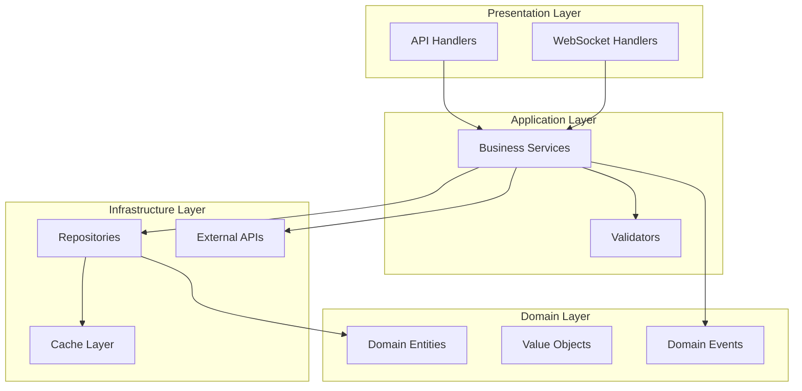

# Phase 5: Architecture Reconstruction

> **Document:** PROMPT_05.md  
> **Phase:** 5 of 10  
> **Purpose:** Reconstruct the complete architecture of the system from the analyzed code  
> **Prerequisite:** Phase 4 complete; deep code understanding established

---

## 📋 PHASE INFORMATION

| Property | Value |
|----------|-------|
| **Phase** | 5 — Architecture Reconstruction |
| **Entry Criteria** | Phase 4 complete; all code analyzed; deep understanding established |
| **Exit Criteria** | Complete architecture documentation; architecture diagrams; layer analysis |
| **Estimated Effort** | High |

---

## 🎯 OBJECTIVES

1. **Reconstruct** the system architecture from analyzed code.
2. **Document** the architectural style and patterns.
3. **Map** layers, components, and their interactions.
4. **Diagram** the complete system architecture.
5. **Document** architectural decisions and trade-offs.
6. **Create** a comprehensive architecture knowledge base.

---

## 🔬 METHODOLOGY

### Step 1: Architectural Style Identification

Identify the architectural style(s):

| Style | Indicators |
|-------|------------|
| **Layered Architecture** | Controllers → Services → Repositories |
| **Microservices** | Multiple services, API gateways, inter-service communication |
| **Event-Driven** | Event buses, message queues, event handlers, pub/sub |
| **Microkernel / Plugin** | Core system, plugin interfaces, dynamic loading |
| **Hexagonal (Ports & Adapters)** | Port interfaces, adapter implementations |
| **Clean Architecture** | Dependency inversion, use cases, entity boundaries |
| **CQRS** | Command/Query separation, separate read/write models |
| **Event Sourcing** | Event store, event replay, current state from events |
| **Serverless** | Function handlers, cloud services, stateless design |
| **MVC** | Models, Views, Controllers |
| **MVVM** | Models, Views, ViewModels |
| **Pipe-and-Filter** | Processing pipelines, filter chains |
| **Blackboard** | Shared knowledge base, independent specialists |

**Document the identified architecture:**

```markdown
### Primary Architecture: [Style]
- **Confidence:** [Level]
- **Evidence:**
  - [Evidence point 1]
  - [Evidence point 2]
- **Variations:** [How the implementation differs from textbook style]
- **Quality of Implementation:** [Well-executed / Partial / Problematic]

### Secondary Architecture: [Style, if applicable]
- **Description:** [How secondary style complements the primary]
```

### Step 2: Layer Analysis

For each architectural layer, document:

```markdown
### Layer: [Layer Name]
- **Purpose:** [What this layer provides]
- **Boundary:** [What defines this layer]
- **Responsibility:** [What this layer is responsible for]
- **Components:** [Components in this layer]
- **Interfaces:** [How this layer exposes functionality]
- **Dependencies:** [What this layer depends on]
- **Rules:** [Rules enforced within this layer]
- **Violations:** [Any layer violations detected]

#### Layer Interaction
- **Incoming:** [How other layers interact with this layer]
- **Outgoing:** [How this layer interacts with other layers]
- **Protocol:** [Synchronous / Asynchronous / Event-based]
```

### Step 3: Component Architecture

For each significant component, document:

```markdown
### Component: [Component Name]
- **Module:** [Parent module]
- **Purpose:** [What this component does]
- **Files:** [Key files in this component]
- **Public API:** [How this component is used]
- **Internal Structure:** [How this component is organized]
- **State:** [What state this component manages]
- **Lifecycle:** [How this component is created, used, destroyed]
- **Dependencies:** [What this component depends on]
- **Used By:** [Who uses this component]

#### Component Interfaces
- **Interface:** [Interface name and definition]
- **Implementations:** [Different implementations if any]
- **Consumers:** [Who consumes each interface]
```

### Step 4: Data Architecture

Document the data architecture:

```markdown
### Data Architecture

#### Data Flow
- **Primary Data Flow:** [End-to-end data flow description]
- **Data Sources:** [Where data enters the system]
- **Data Sinks:** [Where data leaves the system]
- **Data Transformations:** [Key transformations]

#### Data Storage
- **Primary Storage:** [Database type and schema]
- **Caches:** [Caching layer and strategy]
- **File Storage:** [File system / object storage usage]
- **In-Memory State:** [What is kept in memory]

#### Data Models
- **Core Entities:** [List of core data entities]
- **Relationships:** [How entities relate]
- **Validation Rules:** [Data validation rules]
- **Serialization:** [How data is serialized/deserialized]
```

### Step 5: Communication Architecture

Document how components communicate:

```markdown
### Communication Architecture

#### Communication Patterns
| Pattern | Where Used | Protocol |
|---------|------------|----------|
| Request-Response | API handlers | HTTP/gRPC |
| Publish-Subscribe | Event system | Message Queue |
| Command Pattern | Service layer | In-process |
| Observer | State changes | Event emitter |

#### API Architecture (if applicable)
- **API Style:** REST / GraphQL / gRPC / SOAP / WebSocket
- **Endpoints:** [List of major endpoints]
- **Authentication:** [Auth mechanism]
- **Rate Limiting:** [Rate limiting strategy]
- **Versioning:** [API versioning strategy]
```

### Step 6: Architecture Diagram Generation

Generate comprehensive architecture diagrams:



### Step 7: Architectural Decision Documentation

For each significant architectural decision:

```markdown
### ADR: [Decision Title]
- **Context:** [Why this decision was needed]
- **Decision:** [What was decided]
- **Alternatives:** [What alternatives were considered]
- **Rationale:** [Why this decision was made]
- **Consequences:** [What this decision means for the system]
- **Status:** [Accepted / Deprecated / Superseded]
- **Evidence in Code:** [Where this decision is visible]
```

### Step 8: Knowledge Base Update

```json
{
  "architectural_style": { /* identified style(s) */ },
  "layers": { /* layer analysis */ },
  "components": { /* component architecture */ },
  "data_architecture": { /* data flow and storage */ },
  "communication_architecture": { /* how components communicate */ },
  "architecture_diagrams": { /* generated diagrams */ },
  "architectural_decisions": { /* documented decisions */ },
  "phase_5_notes": {
    "architectural_issues": [],
    "design_debt": [],
    "reconstruction_confidence": "high/medium/low",
    "open_questions": []
  }
}
```

---

## 🛠️ TOOLS

| Tool | Purpose | Usage |
|------|---------|-------|
| `read_file` | Review architecture indicators | module boundaries, interfaces |
| `search_files` | Find architectural patterns | Interface definitions, layer violations |
| `execute_command` | Generate diagrams | Mermaid rendering |

---

## 📚 KNOWLEDGE BASE UPDATE

Add to the working knowledge base:

1. **ArchitecturalStyle:** Identified style(s) with evidence
2. **LayerArchitecture:** All layers defined with responsibilities
3. **ComponentArchitecture:** All components documented
4. **DataArchitecture:** Data flow, storage, models
5. **CommunicationArchitecture:** Communication patterns
6. **ArchitectureDiagrams:** Complete diagram set
7. **ArchitectureDecisions:** Key decisions documented

---

## 📦 DELIVERABLES

Phase 5 produces:

1. `05_ARCHITECTURE/SYSTEM_ARCHITECTURE.md` — Overall system architecture
2. `05_ARCHITECTURE/COMPONENT_ARCHITECTURE.md` — Component details
3. `05_ARCHITECTURE/MODULE_ARCHITECTURE.md` — Module architecture
4. `05_ARCHITECTURE/LAYER_DIAGRAM.md` — Layer architecture
5. `05_ARCHITECTURE/DATA_ARCHITECTURE.md` — Data architecture
6. `05_ARCHITECTURE/ARCHITECTURE_DECISIONS.md` — ADRs

Plus diagrams in the `DIAGRAMS/` directory:
- `DIAGRAMS/SYSTEM_ARCHITECTURE.md`

---

## ✅ QUALITY CHECK

- [ ] Architectural style correctly identified?
- [ ] All layers documented?
- [ ] All components documented?
- [ ] Data architecture complete?
- [ ] Communication patterns identified?
- [ ] Architecture diagrams accurate?
- [ ] Architectural decisions documented?
- [ ] Confidence levels recorded?

---

## 🚪 PHASE COMPLETION GATE

Before proceeding to Phase 6:

1. Confirm the architecture is fully reconstructed.
2. Confirm all layers and components are documented.
3. Confirm architecture diagrams are accurate.
4. Confirm architectural decisions are captured.
5. **If the architecture has significant complexity or ambiguity, document the uncertainty.**

---

**PROCEED TO PHASE 6 → `PROMPT_06.md`**

---

> **💡 Module Available:** Use `modules/MODULE_ARCHITECTURE.md` for deeper architectural analysis, especially for complex or distributed systems.

