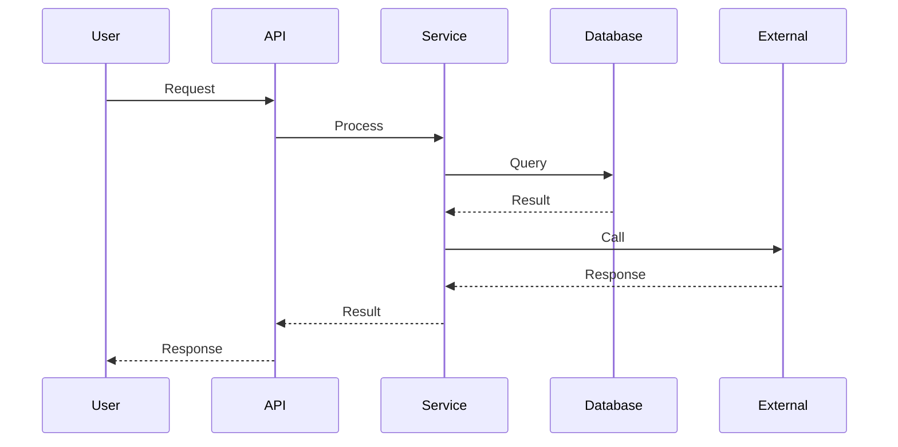
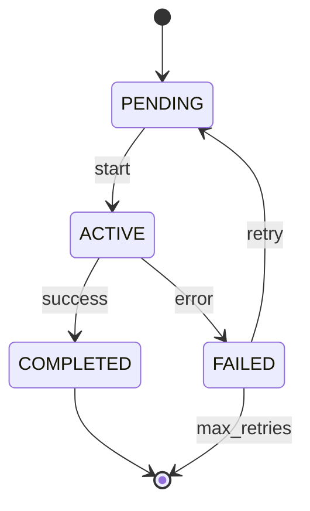
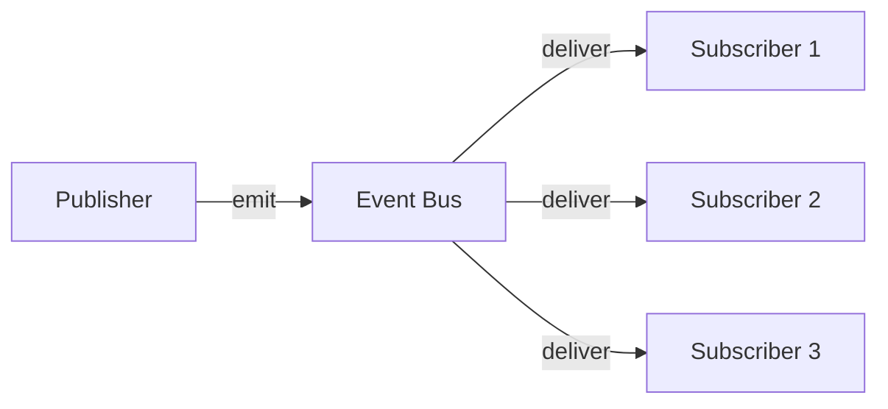

# Phase 6: Workflow & Execution Path Analysis

> **Document:** PROMPT_06.md  
> **Phase:** 6 of 10  
> **Purpose:** Analyze all workflows, execution paths, state transitions, and event flows  
> **Prerequisite:** Phase 5 complete; architecture reconstructed

---

## 📋 PHASE INFORMATION

| Property | Value |
|----------|-------|
| **Phase** | 6 — Workflow & Execution Path Analysis |
| **Entry Criteria** | Phase 5 complete; architecture understood; components identified |
| **Exit Criteria** | All workflows traced; execution paths documented; state machines mapped |
| **Estimated Effort** | Very High |

---

## 🎯 OBJECTIVES

1. **Identify** all workflows and execution paths.
2. **Trace** end-to-end workflows from trigger to completion.
3. **Map** all state transitions and state machines.
4. **Document** event flows and event-driven processes.
5. **Analyze** error paths and recovery workflows.
6. **Diagram** every significant workflow.

---

## 🔬 METHODOLOGY

### Step 1: Workflow Identification

Identify all workflows in the system:

| Workflow Category | Examples |
|-------------------|----------|
| **User Journeys** | Registration, login, checkout, profile update |
| **Data Processing** | Import, export, transformation, validation |
| **Background Jobs** | Scheduled tasks, batch processing, cleanup |
| **Event Handlers** | Webhook processing, event consumption |
| **API Flows** | Request lifecycle, authentication flow |
| **Error Recovery** | Retry logic, fallback, circuit breaker |
| **State Changes** | Order status, document lifecycle, deployment pipeline |
| **AI/ML Pipelines** | Training, inference, data preprocessing |

**For each identified workflow:**

```markdown
### Workflow: [Workflow Name]
- **Trigger:** [What starts this workflow]
- **Category:** [User / Data / Background / Event / API / Recovery / State / AI]
- **Criticality:** [Core / Important / Peripheral]
- **Frequency:** [Continuous / On-demand / Scheduled / Event-driven]
- **Files Involved:** [Files participating in this workflow]
```

### Step 2: End-to-End Workflow Tracing

For each workflow, trace the complete path:

```markdown
### Telemetry: [Workflow Name]

#### Flow Diagram


#### Step-by-Step Trace
| Step | Component | Action | Details | File:Line |
|------|-----------|--------|---------|-----------|
| 1 | User | Initiate request | POST /api/resource | - |
| 2 | API Gateway | Authenticate | Validate JWT token | gateway.js:42 |
| 3 | Router | Route request | Match /api/resource | router.js:15 |
| 4 | Controller | Handle request | Parse body, validate | controller.js:28 |
| 5 | Service | Business logic | Process request data | service.js:56 |
| 6 | Repository | Data access | Query/modify database | repository.js:89 |
| 7 | Service | Return result | Transform & return | service.js:120 |
| 8 | Controller | Format response | Set status, headers | controller.js:75 |
| 9 | API Gateway | Send response | Return to client | gateway.js:88 |

#### Decision Points
| Step | Decision | Condition | Path A | Path B |
|------|----------|-----------|--------|--------|
| 4 | Validation | Is input valid? | Proceed to step 5 | Return 400 error |
| 5 | Authorization | Is user authorized? | Proceed to step 6 | Return 403 error |
| 6 | Data exists | Does record exist? | Return data | Return 404 error |
```

### Step 3: State Machine Analysis

For each stateful component, document the state machine:

```markdown
### State Machine: [Entity/Component Name]
- **Entity:** [What entity this state machine governs]
- **File:** [File containing the state machine]

#### States
| State | Description | Entry Action | Exit Action |
|-------|-------------|--------------|-------------|
| PENDING | Initial state | Log creation | - |
| ACTIVE | Processing | Send notification | - |
| COMPLETED | Success | Cleanup | Archive data |
| FAILED | Error | Log error | Retry setup |

#### Transitions


| Transition | From | To | Trigger | Guard | Action |
|------------|------|----|---------|-------|--------|
| start | PENDING | ACTIVE | Request received | Validated | - |
| success | ACTIVE | COMPLETED | Process success | - | Send notification |
| error | ACTIVE | FAILED | Exception | - | Log error |
| retry | FAILED | PENDING | Retry policy | max_retries < 3 | Increment retry count |
```

### Step 4: Event Flow Analysis

For event-driven systems, document event flows:

```markdown
### Event: [Event Name]
- **Publisher:** [Component that emits the event]
- **Subscribers:** [Components that consume the event]
- **Payload:** [Data carried by the event]
- **Delivery Guarantee:** [At-most-once / At-least-once / Exactly-once]
- **Ordering:** [Ordered / Unordered]

#### Event Flow


#### Event Handler Details
| Handler | File:Line | Async/Sync | Error Handling |
|---------|-----------|------------|----------------|
| Handler 1 | handler1.js:12 | Async | Retry 3x |
| Handler 2 | handler2.js:45 | Sync | Log and skip |
```

### Step 5: Error Recovery Workflows

Document error recovery paths:

```markdown
### Error Recovery: [Workflow Name]

#### Failure Scenarios
| Scenario | Error Type | Detection | Recovery | File:Line |
|----------|------------|-----------|----------|-----------|
| DB timeout | Transient | Exception | Retry (3x, backoff) | db.js:42 |
| Validation err | Permanent | Validation | Return 400 | validator.js:15 |
| External API down | Transient | Timeout | Circuit breaker | api.js:88 |

#### Retry Configuration
- **Max Retries:** 3
- **Backoff Strategy:** Exponential (1s, 2s, 4s)
- **Jitter:** ±500ms
- **Timeout per attempt:** 5s
- **Circuit Breaker:** Open after 5 failures, reset after 30s
```

### Step 6: Knowledge Base Update

```json
{
  "workflows": { /* all identified workflows */ },
  "execution_paths": { /* traced execution paths */ },
  "state_machines": { /* state machine definitions */ },
  "event_flows": { /* event flow documentation */ },
  "error_recovery": { /* error recovery workflows */ },
  "phase_6_notes": {
    "complex_workflows": [],
    "concurrency_issues": [],
    "state_management_issues": [],
    "open_questions": []
  }
}
```

---

## 🛠️ TOOLS

| Tool | Purpose | Usage |
|------|---------|-------|
| `search_files` | Find workflow patterns | State transitions, event emissions |
| `read_file` | Trace workflow logic | Read handler/service files |
| `execute_command` | Run tests | Observe workflow execution |

---

## 📚 KNOWLEDGE BASE UPDATE

Add to the working knowledge base:

1. **WorkflowCatalog:** All identified workflows with triggers
2. **ExecutionTraces:** Detailed step-by-step traces
3. **StateMachines:** All state machine definitions
4. **EventFlows:** Complete event flow documentation
5. **ErrorRecovery:** Recovery workflow documentation

---

## 📦 DELIVERABLES

Phase 6 produces:

1. `06_WORKFLOWS/WORKFLOW_INDEX.md` — Index of all workflows
2. `06_WORKFLOWS/[workflow-name]_WORKFLOW.md` — Per-workflow documentation
3. `06_WORKFLOWS/EXECUTION_PATHS.md` — Execution path analysis
4. `06_WORKFLOWS/STATE_TRANSITIONS.md` — State machine documentation
5. `06_WORKFLOWS/EVENT_FLOW.md` — Event flow documentation
6. `06_WORKFLOWS/ERROR_HANDLING_WORKFLOWS.md` — Error recovery documentation

Plus diagrams in `DIAGRAMS/`:
- `DIAGRAMS/SEQUENCE_DIAGRAMS.md`
- `DIAGRAMS/STATE_DIAGRAMS.md`
- `DIAGRAMS/WORKFLOW_DIAGRAMS.md`

---

## ✅ QUALITY CHECK

- [ ] All workflows identified?
- [ ] Workflow traces complete (step-by-step)?
- [ ] Decision points documented?
- [ ] State machines complete with all states and transitions?
- [ ] Event flows documented?
- [ ] Error recovery workflows documented?
- [ ] Diagrams accurate and complete?

---

## 🚪 PHASE COMPLETION GATE

Before proceeding to Phase 7:

1. Confirm all workflows are traced end-to-end.
2. Confirm state machines are complete.
3. Confirm event flows are mapped.
4. Confirm error recovery is documented.
5. **If any workflow remains untraced, flag it and resolve before proceeding.**

---

**PROCEED TO PHASE 7 → `PROMPT_07.md`**

---

> **💡 Modules Available:**
> - `modules/MODULE_WORKFLOW_ANALYSIS.md` — For complex workflow analysis
> - `modules/MODULE_DATA_FLOW.md` — For data flow-specific analysis

