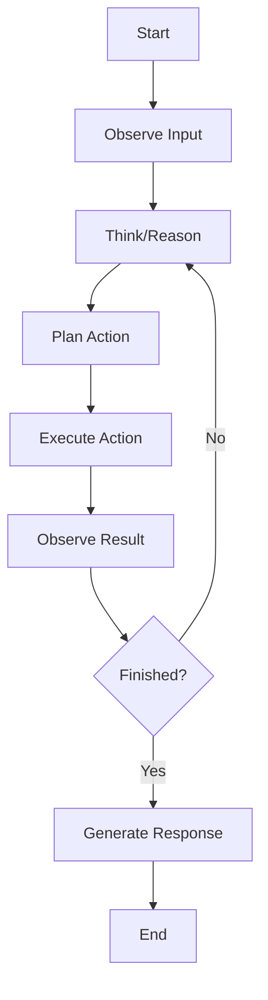
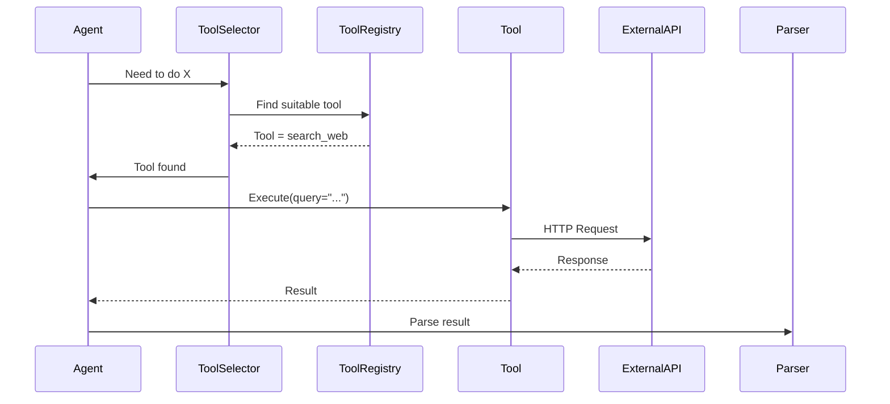

# Phase 8: AI Workflow & Agent Analysis

> **Document:** PROMPT_08.md  
> **Phase:** 8 of 10  
> **Purpose:** Analyze AI-specific workflows, agent architectures, prompt pipelines, and reasoning systems  
> **Prerequisite:** Phase 7 complete; design patterns and decisions understood  
> **Note:** Skip this phase if the repository does not contain AI/agent systems

---

## 📋 PHASE INFORMATION

| Property | Value |
|----------|-------|
| **Phase** | 8 — AI Workflow & Agent Analysis |
| **Entry Criteria** | Phase 7 complete; pattern understanding established |
| **Exit Criteria** | All AI workflows documented; agent architectures mapped; prompt pipelines traced |
| **Estimated Effort** | High (if AI repo) / Minimal (if not AI) |

---

## 🎯 OBJECTIVES

1. **Identify** if the repository contains AI/agent systems.
2. **Analyze** prompt architecture and engineering.
3. **Map** agent workflows and orchestration.
4. **Document** reasoning pipelines and planning mechanisms.
5. **Trace** tool integration and function calling.
6. **Understand** AI system boundaries and interfaces.

---

## 🖥️ AI REPOSITORY DETECTION

Before proceeding, determine if this is an AI repository:

### Indicators of AI Systems
- Files containing prompt strings or templates
- LLM API calls (OpenAI, Anthropic, Google AI, etc.)
- Agent loop implementations
- Chain-of-thought or reasoning logic
- Embedding/vector database usage
- RAG (Retrieval Augmented Generation) patterns
- AI framework imports (LangChain, LlamaIndex, AutoGPT, etc.)
- Tool/function calling implementations
- Memory management for AI agents
- Planning/scheduling algorithms for AI

**If none of these are present, skip this phase.**

---

## 🔬 METHODOLOGY

### Step 1: Prompt Architecture Analysis

If prompt engineering is present, analyze the prompt system:

```markdown
### Prompt Architecture

#### Prompt Inventory
| Prompt ID | Purpose | Location | Type |
|-----------|---------|----------|------|
| PROMPT_001 | System prompt | prompts/system.md | System |
| PROMPT_002 | User query | prompts/query.md | User |
| PROMPT_003 | Tool calling | prompts/tools.md | System+Function |

#### Prompt Structure Analysis
##### Prompt: [Prompt ID or Name]
- **File:** [File path]
- **Type:** System / User / Assistant / Function / Few-shot / Template
- **Purpose:** [What this prompt accomplishes]

**Content Structure:**
- **Role Definition:** [How the AI's role is defined]
- **Instructions:** [Key instructions given]
- **Constraints:** [Behavioral constraints]
- **Output Format:** [Expected output format]
- **Few-Shot Examples:** [Number and type of examples]

**Prompt Engineering Techniques Used:**
- [ ] Chain-of-Thought prompting
- [ ] Few-shot learning
- [ ] Role prompting
- [ ] Step-by-step instructions
- [ ] Output formatting
- [ ] Constraint specification
- [ ] Negative prompts (what NOT to do)
- [ ] Persona assignment
- [ ] Context window management
- [ ] Dynamic prompt construction
- [ ] Prompt chaining

**Quality Assessment:**
- **Clarity:** [High / Medium / Low]
- **Specificity:** [High / Medium / Low]
- **Robustness:** [High / Medium / Low]
- **Injection risks:** [Identified / Not identified]
- **Potential improvements:** [Suggestions]
```

### Step 2: Agent Architecture Analysis

If agent systems are present:

```markdown
### Agent Architecture

#### Agent Overview
- **Agent Name:** [Name of the agent system]
- **Type:** Single Agent / Multi-Agent / Supervisor-Worker / Swarm
- **Framework:** [LangChain / AutoGPT / CrewAI / Custom / etc.]

#### Agent Components
| Component | Purpose | Implementation | File:Line |
|-----------|---------|----------------|-----------|
| Agent Core | Main loop | while loop | agent.py:42 |
| Memory | State storage | Dict/DB | memory.py:15 |
| Tools | External access | Function list | tools.py:88 |
| Planner | Action planning | Chain-of-thought | planner.py:56 |
| Parser | Output parsing | Regex/JSON | parser.py:23 |

#### Agent Loop


#### Agent State Management
- **Persistent State:** [What is stored between sessions]
- **Ephemeral State:** [What is kept during a session]
- **Context Window:** [How context is managed]
- **Memory Types:** [Working / Short-term / Long-term / Episodic]
```

### Step 3: Reasoning Pipeline Analysis

If reasoning pipelines exist:

```markdown
### Reasoning Pipeline

#### Pipeline Steps
| Step | Process | Input | Output | File:Line |
|------|---------|-------|--------|-----------|
| 1 | Input Processing | Raw input | Processed input | pipeline.py:12 |
| 2 | Context Retrieval | Query | Relevant context | retriever.py:34 |
| 3 | Reasoning | Context + Query | Chain-of-thought | reasoner.py:56 |
| 4 | Tool Selection | Reasoning | Tool + args | selector.py:78 |
| 5 | Tool Execution | Tool + args | Result | executor.py:90 |
| 6 | Response Generation | All context | Final response | generator.py:12 |

#### Reasoning Strategies
- **Chain-of-Thought:** [How CoT is implemented]
- **ReAct Pattern:** [How ReAct is implemented (if applicable)]
- **Reflection:** [Self-reflection mechanism]
- **Self-Consistency:** [Multiple reasoning paths]
- **Tree-of-Thought:** [Branching reasoning]
```

### Step 4: Planning Pipeline Analysis

If planning systems exist:

```markdown
### Planning Pipeline

#### Planning Mechanism
- **Planner Type:** [Hierarchical / Sequential / Dynamic / Meta]
- **Planning Depth:** [Single-step / Multi-step / Recursive]
- **Replanning:** [When/how plans are revised]

#### Plan Structure
```json
{
  "goal": "Complete task X",
  "steps": [
    {"step": 1, "action": "research", "target": "topic Y", "status": "pending"},
    {"step": 2, "action": "analyze", "target": "findings", "status": "pending"},
    {"step": 3, "action": "generate", "target": "report", "status": "pending"}
  ],
  "current_step": 0,
  "max_steps": 10
}
```

#### Planning Execution
- **Step Execution:** [How each step is executed]
- **Progress Tracking:** [How progress is tracked]
- **Failure Handling:** [What happens when a step fails]
- **Completion Criteria:** [When the plan is considered complete]
```

### Step 5: Tool Integration Analysis

If the AI system uses tools/functions:

```markdown
### Tool Integration

#### Tool Inventory
| Tool Name | Purpose | Parameters | Returns | File:Line |
|-----------|---------|------------|---------|-----------|
| search_web | Web search | query, limit | results | tools.js:42 |
| read_file | File reading | path | content | tools.js:88 |
| execute_code | Code execution | code, language | output | tools.js:134 |

#### Tool Execution Flow


#### Tool Calling Pattern
- **Registration:** [How tools are registered]
- **Discovery:** [How the agent discovers available tools]
- **Selection:** [How the agent selects which tool to use]
- **Execution:** [How tools are executed]
- **Error Handling:** [How tool errors are handled]
- **Rate Limiting:** [Rate limiting for external tools]
```

### Step 6: RAG (Retrieval Augmented Generation) Analysis

If RAG is used:

```markdown
### RAG System

#### Retrieval Pipeline
- **Embedding Model:** [Model used for embeddings]
- **Vector Store:** [Vector database used]
- **Chunking Strategy:** [How documents are chunked]
- **Retrieval Strategy:** [Similarity / Hybrid / Re-ranking]
- **Top-K:** [Number of chunks retrieved]

#### Generation Pipeline
- **Context Assembly:** [How retrieved context is assembled]
- **Context Window:** [How much context fits]
- **Prompt Template:** [How context is injected into prompts]
- **Response Generation:** [How final response is generated]

#### Retrieval Quality
- **Precision:** [Assessment of retrieval precision]
- **Recall:** [Assessment of retrieval recall]
- **Relevance:** [Assessment of relevance]
```

### Step 7: Knowledge Base Update

```json
{
  "is_ai_repository": true/false,
  "prompt_architecture": { /* prompt analysis results */ },
  "agent_architecture": { /* agent analysis results */ },
  "reasoning_pipelines": { /* reasoning analysis */ },
  "planning_pipelines": { /* planning analysis */ },
  "tool_integration": { /* tool analysis */ },
  "rag_system": { /* RAG analysis, if present */ },
  "phase_8_notes": {
    "ai_system_complexity": "high/medium/low",
    "prompt_quality": "high/medium/low",
    "agent_effectiveness": "high/medium/low",
    "open_questions": []
  }
}
```

---

## 🛠️ TOOLS

| Tool | Purpose | Usage |
|------|---------|-------|
| `search_files` | Find prompt patterns, AI calls | Search for API keys, prompt templates |
| `read_file` | Read AI workflow files | Read agent loops, prompt files |
| `execute_command` | Run AI tests | Test agent interactions |

---

## 📚 KNOWLEDGE BASE UPDATE

Add to the working knowledge base:

1. **IsAIRepository:** Boolean indicating if AI systems are present
2. **PromptArchitecture:** Complete prompt analysis
3. **AgentArchitecture:** Agent system architecture
4. **ReasoningPipelines:** Reasoning mechanisms
5. **PlanningPipelines:** Planning mechanisms
6. **ToolIntegration:** Tool inventory and calling patterns
7. **RAGSystem:** RAG pipeline analysis (if present)

---

## 📦 DELIVERABLES

Phase 8 produces (only if AI repository):

1. `08_AI_WORKFLOWS/PROMPT_ARCHITECTURE.md` — Prompt engineering analysis
2. `08_AI_WORKFLOWS/AGENT_WORKFLOWS.md` — Agent architecture analysis
3. `08_AI_WORKFLOWS/REASONING_PIPELINES.md` — Reasoning pipeline analysis
4. `08_AI_WORKFLOWS/PLANNING_PIPELINES.md` — Planning pipeline analysis
5. `08_AI_WORKFLOWS/TOOL_INTEGRATION.md` — Tool integration analysis
6. `08_AI_WORKFLOWS/AI_SYSTEM_BOUNDARIES.md` — AI system boundaries

If not an AI repository, deliver a brief statement: "This repository does not contain AI/agent systems."

---

## ✅ QUALITY CHECK

- [ ] Correctly determined if this is an AI repository?
- [ ] All prompts analyzed?
- [ ] Agent architecture documented?
- [ ] Reasoning pipelines traced?
- [ ] Planning pipelines documented?
- [ ] Tool integrations mapped?
- [ ] AI boundaries identified?

---

## 🚪 PHASE COMPLETION GATE

Before proceeding to Phase 9:

1. Confirm AI system presence correctly determined.
2. If AI repo: all AI workflows and systems documented.
3. If not AI repo: confirmed and documented.
4. **Proceed to Phase 9 regardless of whether this phase was fully executed or skipped.**

---

**PROCEED TO PHASE 9 → `PROMPT_09.md`**

---

> **💡 Module Available:** Use `modules/MODULE_AI_WORKFLOW.md` for deeper analysis of complex AI systems.

