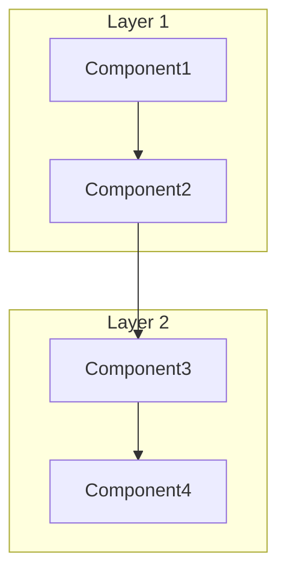
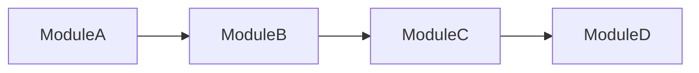
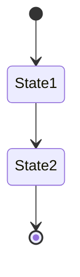

# Phase 9: Documentation Synthesis

> **Document:** PROMPT_09.md  
> **Phase:** 9 of 10  
> **Purpose:** Synthesize all analysis findings into comprehensive, professional documentation  
> **Prerequisite:** All analysis phases complete (Phases 1-8)

---

## 📋 PHASE INFORMATION

| Property | Value |
|----------|-------|
| **Phase** | 9 — Documentation Synthesis |
| **Entry Criteria** | Phases 1-8 complete; working knowledge base fully populated |
| **Exit Criteria** | All documentation files generated; all templates applied; cross-references verified |
| **Estimated Effort** | Very High |

---

## 🎯 OBJECTIVES

1. **Synthesize** all analysis findings into cohesive documentation.
2. **Generate** all required documentation files.
3. **Apply** templates for consistent formatting.
4. **Create** all required diagrams.
5. **Establish** comprehensive cross-references.
6. **Build** the developer handbook and rebuild guide.
7. **Ensure** all output meets quality standards.

---

## 🔬 METHODOLOGY

### Step 1: Documentation Planning

Plan which documents to generate:

#### Required Documents (Always)
| Document | Template | Content Source |
|----------|----------|----------------|
| INDEX.md | — | Master index for documentation |
| REPOSITORY_OVERVIEW.md | — | Phase 1 findings |
| FILE_INVENTORY.md | — | Phase 1 findings |
| LANGUAGE_AND_TECH_STACK.md | — | Phase 1 findings |
| BUILD_AND_CONFIGURATION.md | — | Phase 1 findings |
| MODULE_MAP.md | — | Phase 2 findings |
| FOLDER_RESPONSIBILITIES.md | — | Phase 2 findings |
| SYSTEM_ARCHITECTURE.md | TEMPLATE_ARCHITECTURE_DOC | Phase 5 findings |
| COMPONENT_ARCHITECTURE.md | TEMPLATE_ARCHITECTURE_DOC | Phase 5 findings |
| REBUILD_GUIDE.md | TEMPLATE_REBUILD_GUIDE | All phases |

#### Context-Dependent Documents
| Document | Condition | Template |
|----------|-----------|----------|
| API_REFERENCE.md | If API exists | TEMPLATE_API_DOC |
| SEQUENCE_DIAGRAMS.md | If workflows exist | TEMPLATE_SEQUENCE_DIAGRAM |
| WORKFLOW_*.md | Per workflow | TEMPLATE_WORKFLOW_DOC |
| AI_WORKFLOWS/*.md | If AI repository | — |
| ENVIRONMENT_VARIABLES.md | If env vars exist | — |

### Step 2: Document Generation

For each document, follow this process:

#### 2.1 Gather Content
- Extract relevant findings from the working knowledge base.
- Cross-reference with related findings from other phases.
- Collect specific file paths, line numbers, and code examples.

#### 2.2 Apply Template
- Use the appropriate template from the `templates/` directory.
- Fill in all template placeholders with actual content.
- Follow the template structure but adapt to the specific content.

#### 2.3 Write Documentation
Follow OUTPUT_RULES.md for writing style:
- Use active voice.
- Be precise and specific.
- Include file paths and line numbers.
- Use code blocks for code examples.
- Include Mermaid diagrams where applicable.
- Write for the target audience (developers, architects, new team members).

#### 2.4 Add Cross-References
- Reference related documents within the documentation set.
- Reference related components and modules.
- Reference external dependencies where relevant.
- Ensure bidirectional cross-references.

#### 2.5 Add Confidence Metadata
- For each major finding, include confidence level.
- Mark unverified findings explicitly.

### Step 3: Diagram Generation

For each required diagram:

```markdown
### Diagram: [Diagram Title]
- **Type:** [Architecture / Sequence / State / Dependency / Workflow / Class]
- **File:** DIAGRAMS/[diagram-name].md

[Generate Mermaid diagram based on analysis findings]
```

**Generate these diagrams (at minimum):**

```markdown
## System Architecture Diagram


## [Key Workflow] Sequence Diagram
```mermaid
sequenceDiagram
    Actor->>System: Action
    System->>Component: Process
    Component-->>System: Result
    System-->>Actor: Response
```

## Component Dependency Diagram


## State Diagram (if applicable)

```

### Step 4: Cross-Reference Network

Build a comprehensive cross-reference network:

```markdown
## Cross-Reference Network

### Module Cross-References
| Module | Documented In | Depends On | Used By |
|--------|---------------|------------|---------|
| Module A | MODULE_MAP.md | Module B, Module C | Module D |
| Module B | MODULE_MAP.md | External Lib | Module A |

### Component Cross-References
| Component | Module | Documented In | Consumes | Produces |
|-----------|--------|---------------|----------|----------|
| API Handler | Module A | COMPONENT_ARCHITECTURE.md | HTTP Requests | Events |
| Service | Module A | COMPONENT_ARCHITECTURE.md | Commands | Results |

### Document Cross-References
| Document | References | Referenced By |
|----------|------------|---------------|
| SYSTEM_ARCHITECTURE.md | MODULE_MAP.md, COMPONENT_ARCHITECTURE.md | INDEX.md, REBUILD_GUIDE.md |
```

### Step 5: Developer Handbook Generation

Create a developer-centric handbook:

```markdown
# Developer Handbook

## Getting Started
- Prerequisites
- Setup instructions
- Running locally

## Code Organization
- Module structure
- Naming conventions
- File organization

## Development Workflow
- Feature development process
- Testing strategy
- Code review guidelines

## Key Patterns
- Patterns to understand
- Patterns to follow
- Patterns to avoid

## Common Tasks
- How to add a new [feature/module]
- How to modify [existing functionality]
- How to debug [common issues]

## Architecture Overview
- System architecture (high-level)
- Key components
- Data flow

## Troubleshooting
- Common issues and solutions
- Debugging techniques
- Logging and monitoring
```

### Step 6: Rebuild Guide Generation

Create a guide for rebuilding the system:

```markdown
# Rebuild Guide

## System Overview
- What the system does
- Key capabilities

## Architecture Summary
- Architectural style
- Layer architecture
- Component diagram

## Technology Stack
- Languages and versions
- Frameworks and versions
- External services

## Build Process
- Build commands
- Build dependencies
- Build output

## Database Schema (if applicable)
- Entities and relationships
- Migrations
- Seed data

## API Specifications (if applicable)
- Endpoints
- Request/response formats
- Authentication

## Environment Setup
- Required environment variables
- Configuration files
- Third-party accounts

## Deployment
- Deployment architecture
- Deployment steps
- Health checks

## Testing Strategy
- Test categories
- Test commands
- Test coverage expectations

## Monitoring & Observability
- Logging
- Metrics
- Alerts
```

### Step 7: Engineering Notes

Document engineering insights:

```markdown
# Engineering Notes

## Design Decisions Summary
| Decision | Rationale | Trade-offs |
|----------|-----------|------------|
| Decision 1 | Reason 1 | Trade-off A |
| Decision 2 | Reason 2 | Trade-off B |

## Technical Debt
| Debt | Severity | Recommended Action | Effort |
|------|----------|--------------------|--------|
| Issue 1 | High | Refactor | 3 days |
| Issue 2 | Medium | Clean up | 1 day |

## Architecture Improvements
| Improvement | Rationale | Priority |
|-------------|-----------|----------|
| Improvement 1 | Benefit X | High |
| Improvement 2 | Benefit Y | Medium |

## Security Considerations
- Authentication mechanisms
- Authorization model
- Data protection
- Vulnerability concerns

## Performance Considerations
- Performance characteristics
- Bottlenecks identified
- Optimization opportunities

## Known Issues
- Bugs
- Limitations
- Workarounds
```

### Step 8: Knowledge Base Finalization

```json
{
  "documentation_artifacts": {
    "generated_files": [ /* list of all generated files */ ],
    "diagrams": [ /* list of all generated diagrams */ ],
    "cross_references": { /* complete cross-reference network */ },
    "developer_handbook": { /* handbook content */ },
    "rebuild_guide": { /* rebuild guide content */ },
    "engineering_notes": { /* engineering notes */ }
  },
  "phase_9_notes": {
    "coverage_gaps": [],
    "quality_concerns": [],
    "pending_items": []
  }
}
```

---

## 🛠️ TOOLS

| Tool | Purpose | Usage |
|------|---------|-------|
| `create_file` | Write documentation files | All documentation output |
| `read_file` | Review templates | Read templates before using |
| `search_files` | Verify cross-references | Ensure references are correct |

---

## 📚 KNOWLEDGE BASE UPDATE

Add to the working knowledge base:

1. **DocumentationArtifacts:** Complete list of generated files
2. **CrossReferences:** Full cross-reference network
3. **DeveloperHandbook:** Developer-centric documentation
4. **RebuildGuide:** System rebuild instructions
5. **EngineeringNotes:** Technical insights and recommendations

---

## 📦 DELIVERABLES

Phase 9 produces ALL documentation files in the output directory structure defined in OUTPUT_RULES.md.

Use the templates from `templates/` directory for consistent formatting.

---

## ✅ QUALITY CHECK

- [ ] All required documents generated?
- [ ] All templates applied correctly?
- [ ] Diagrams accurate and complete?
- [ ] Cross-references established and verified?
- [ ] Developer handbook complete?
- [ ] Rebuild guide complete?
- [ ] Engineering notes documented?
- [ ] Writing style follows OUTPUT_RULES.md?
- [ ] No placeholder or stub content?

---

## 🚪 PHASE COMPLETION GATE

Before proceeding to Phase 10:

1. Confirm all required documents are generated.
2. Confirm all diagrams are generated and accurate.
3. Confirm cross-references are complete and bidirectional.
4. Confirm developer handbook and rebuild guide are complete.
5. **Review the entire documentation set for consistency and completeness.**

---

**PROCEED TO PHASE 10 → `PROMPT_10.md`**

---

> **💡 Module Available:** Use `modules/MODULE_DOCUMENTATION_GENERATION.md` for advanced documentation generation strategies.

