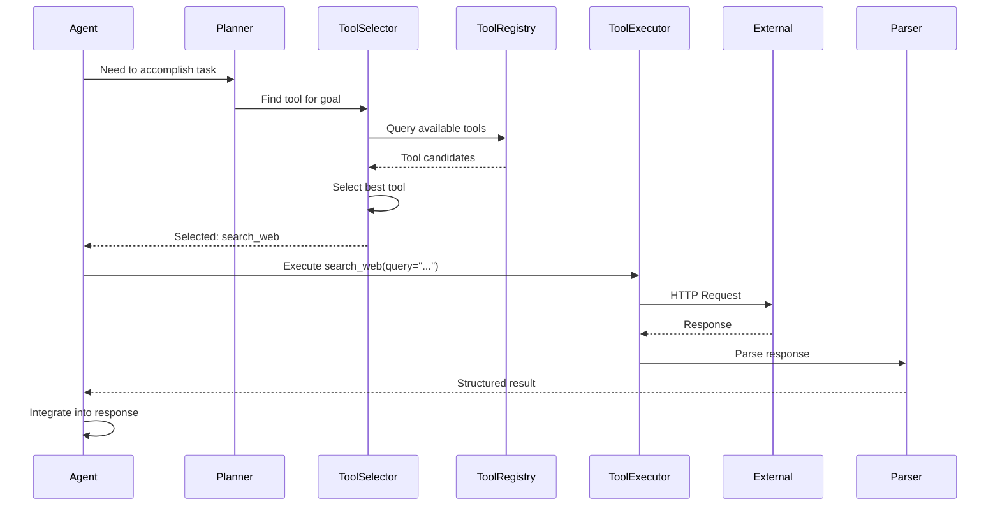
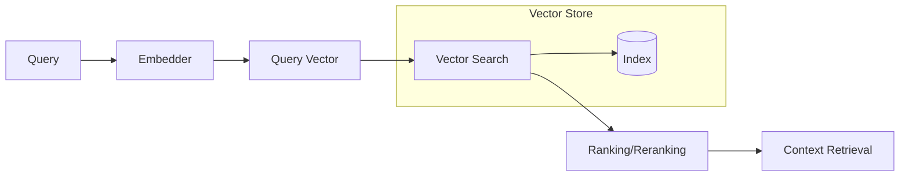

# Module: AI Workflow Deep Analysis

> **Document:** modules/MODULE_AI_WORKFLOW.md  
> **Version:** 1.0.0  
> **Purpose:** Deep-dive module for analyzing complex AI/agent systems  
> **When to Use:** Repository contains sophisticated AI agent systems, prompt engineering frameworks, or AI orchestration pipelines

---

## 🎯 PURPOSE

This module provides advanced analysis techniques for understanding complex AI systems, agent architectures, prompt frameworks, and AI orchestration workflows.

---

## 🔬 METHODOLOGY

### 1. Agent Architecture Deep Dive

```markdown
## Agent Architecture Analysis

### Agent Taxonomy
| Agent Type | Role | Capabilities | Autonomy Level |
|------------|------|--------------|----------------|
| Supervisor | Orchestration | Task decomposition, delegation | Full |
| Worker | Execution | Tool use, research | Partial |
| Reflector | Quality | Self-review, improvement | Semi |
| Critic | Validation | Error detection, verification | Partial |

### Agent Communication Protocol
- **Message Format:** [JSON / Structured / Natural language]
- **Channel:** [Direct call / Message queue / Shared memory]
- **Synchronization:** [Sync / Async / Hybrid]
- **Conflict Resolution:** [How agents resolve disagreements]

### Agent Memory Architecture
| Memory Type | Storage | Duration | Capacity | Retrieval |
|-------------|---------|----------|----------|-----------|
| Working | In-memory | Session | Limited | Direct |
| Short-term | Vector DB | Hours | 1000 items | Semantic |
| Long-term | Database | Permanent | Unlimited | Structured query |
| Episodic | Log file | Indefinite | Unlimited | Sequential |

### Agent State Persistence
- **What is persisted:** [Agent state, conversation history, task progress]
- **Serialization format:** [JSON / Pickle / Custom]
- **Storage backend:** [File system / Database / Cloud storage]
- **Recovery mechanism:** [How agent recovers from crash]
```

### 2. Prompt Engineering Deep Analysis

```markdown
## Prompt Engineering Analysis

### Prompt Taxonomy
| Prompt Category | Purpose | Examples |
|-----------------|---------|----------|
| System Prompts | Define AI behavior | Role, constraints, capabilities |
| Task Prompts | Describe specific task | Instructions, input format |
| Context Prompts | Provide background | History, relevant information |
| Output Format Prompts | Define output structure | JSON schema, markdown template |
| Few-Shot Prompts | Provide examples | Input-output pairs |
| Chain Prompts | Step-by-step reasoning | Chain-of-thought examples |

### Prompt Template Analysis
```markdown
### Template: [Template Name]
- **File:** [path/to/template.md]
- **Variables:** {variable1}, {variable2}
- **Max Length:** [tokens]

**Template Content:**
```
[Template content with {{placeholders}}]
```

**Variable Sources:**
| Variable | Source | Preprocessing | Fallback |
|----------|--------|---------------|----------|
| {context} | Vector DB retrieval | Truncation | Empty string |
| {query} | User input | Sanitization | - |
```

### Prompt Injection Analysis
- **Injection Vectors:** [User input fields, external data sources]
- **Current Protections:** [Input sanitization, output filtering]
- **Vulnerability Assessment:** [Level of risk]
- **Recommendations:** [How to improve security]

### Prompt Versioning & Management
- **Versioning Strategy:** [Git-based / Database / None]
- **A/B Testing:** [How prompts are tested]
- **Prompt Registry:** [Centralized / Decentralized]
- **Change Management:** [How prompt changes are tracked]
```

### 3. Reasoning Pipeline Deep Analysis

```markdown
## Reasoning Pipeline Analysis

### Reasoning Strategy Decomposition

#### Chain-of-Thought (CoT)
- **Implementation:** [How CoT is implemented]
- **Trigger Conditions:** [When CoT is used vs. direct response]
- **Step Format:** [Markdown list / numbered / structured]
- **Max Steps:** [Limit on reasoning steps]

#### ReAct Pattern
- **Implementation:** [Thought → Action → Observation loop]
- **Termination Condition:** [When the loop ends]
- **Max Iterations:** [Maximum loop cycles]
- **Error Recovery:** [What happens when a step fails]

#### Tree-of-Thought (ToT)
- **Branching Factor:** [Number of branches per step]
- **Depth Limit:** [Maximum depth of the tree]
- **Evaluation Function:** [How branches are evaluated]
- **Search Strategy:** [BFS / DFS / Beam search]
- **Selection Mechanism:** [How the best path is chosen]

#### Reflection & Self-Correction
- **Reflection Trigger:** [When reflection occurs]
- **Reflection Depth:** [What aspects are reflected on]
- **Correction Implementation:** [How corrections are applied]
- **Learning From Mistakes:** [How past errors influence future behavior]

### Reasoning Quality Metrics
| Metric | Current Value | Target | Assessment |
|--------|---------------|--------|------------|
| Correctness | % | > 90% | ✅/❌ |
| Consistency | % | > 95% | ✅/❌ |
| Coherence | Score | > 8/10 | ✅/❌ |
| Factuality | % | > 95% | ✅/❌ |
```

### 4. Tool Integration Deep Analysis

```markdown
## Tool Integration Analysis

### Tool Registry Architecture
- **Registration Mechanism:** [How tools are added/registered]
- **Discovery Protocol:** [How the agent discovers tools]
- **Capability Declaration:** [How tool capabilities are defined]
- **Versioning:** [How tool versions are managed]

### Tool Execution Pipeline


### Tool Contract Analysis
| Tool | Input Schema | Output Schema | Error Schema | Idempotent? |
|------|-------------|---------------|-------------|-------------|
| search_web | {query: string, limit: int} | {results: array} | {error: string} | Yes |
| execute_code | {code: string, language: string} | {output: string} | {error: string} | No |

### Tool Security Analysis
- **Input Validation:** [How tool inputs are validated]
- **Sandboxing:** [How tool execution is isolated]
- **Permission Model:** [What tools can access what resources]
- **Rate Limiting:** [How tool usage is limited]
- **Audit Logging:** [How tool usage is tracked]
```

### 5. RAG System Deep Analysis

```markdown
## RAG System Deep Analysis

### Document Processing Pipeline
- **Ingestion:** [How documents are ingested]
- **Chunking Strategy:** [Fixed size / Semantic / Recursive]
- **Chunk Size:** [token count]
- **Chunk Overlap:** [token count]
- **Embedding Model:** [Model name, dimensions]
- **Indexing Strategy:** [Flat / HNSW / IVF]

### Retrieval Pipeline


### Retrieval Quality Metrics
| Metric | Value | Target | Assessment |
|--------|-------|--------|------------|
| Precision@K | % | > 80% | ✅/❌ |
| Recall@K | % | > 85% | ✅/❌ |
| MRR | score | > 0.8 | ✅/❌ |
| NDCG | score | > 0.8 | ✅/❌ |

### Context Window Management
- **Window Size:** [token limit]
- **Truncation Strategy:** [Head / Tail / Dynamic]
- **Context Prioritization:** [How important content is prioritized]
- **Overflow Handling:** [What happens when context exceeds limit]
```

### 6. AI System Boundaries

```markdown
## AI System Boundaries

### Internal vs External Boundaries
| Boundary | Description | Enforcement | Failure Mode |
|----------|-------------|-------------|--------------|
| AI → External API | Network calls | Rate limiting | API unavailable |
| AI → User | Response delivery | Output filtering | Harmful content |
| AI → Internal Tools | Tool invocation | Permission check | Tool error |

### Guardrails & Safety
- **Content Filtering:** [How harmful content is filtered]
- **Topic Restrictions:** [What topics are restricted]
- **Behavioral Constraints:** [What behaviors are constrained]
- **Override Mechanisms:** [How guardrails can be overridden]

### Observability & Monitoring
- **LLM Call Logging:** [How calls are logged]
- **Performance Monitoring:** [Latency, token usage, cost]
- **Quality Monitoring:** [Response quality, user satisfaction]
- **Alerting:** [What triggers alerts]
- **Debugging Interface:** [How AI behavior is debugged]
```

---

## 📦 OUTPUT

Use this module during Phase 8 to enhance:
- `08_AI_WORKFLOWS/PROMPT_ARCHITECTURE.md` — With deeper prompt analysis
- `08_AI_WORKFLOWS/AGENT_WORKFLOWS.md` — With deeper agent analysis
- `08_AI_WORKFLOWS/REASONING_PIPELINES.md` — With reasoning analysis
- `08_AI_WORKFLOWS/TOOL_INTEGRATION.md` — With tool analysis
- `08_AI_WORKFLOWS/AI_SYSTEM_BOUNDARIES.md` — With boundary analysis

---

## ✅ QUALITY CRITERIA

- [ ] Agent architecture fully mapped
- [ ] Prompt engineering deeply analyzed
- [ ] Reasoning pipelines decomposed
- [ ] Tool integration thoroughly analyzed
- [ ] RAG system analyzed (if applicable)
- [ ] AI system boundaries documented
- [ ] Security and safety assessed

