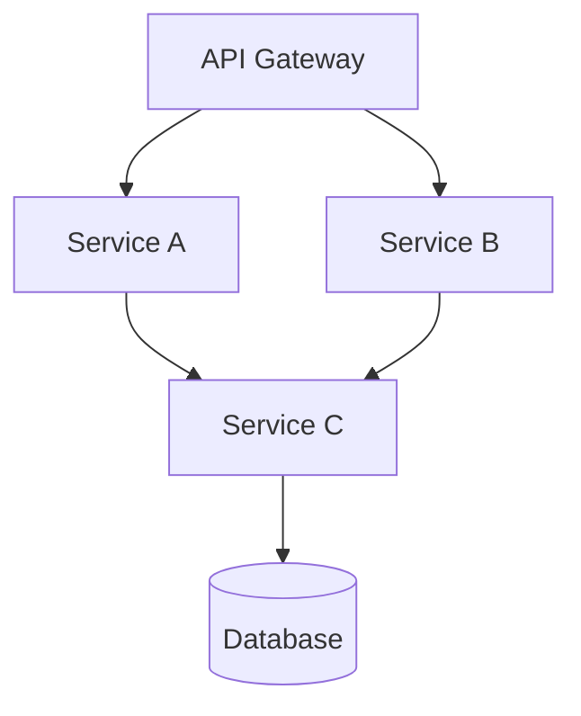
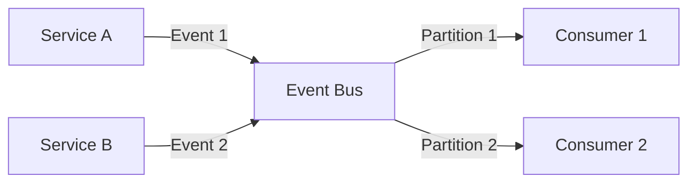

# Module: Architecture Deep Analysis

> **Document:** modules/MODULE_ARCHITECTURE.md  
> **Version:** 1.0.0  
> **Purpose:** Deep-dive module for analyzing complex or unconventional architectures  
> **When to Use:** Repository has complex architecture, multiple architectural styles, or unclear structure

---

## 🎯 PURPOSE

This module provides advanced architectural analysis tools for understanding complex, distributed, or unconventional software architectures. Use this when the standard Phase 5 analysis is insufficient.

---

## 🔬 METHODOLOGY

### 1. Multi-Style Architecture Detection

Detect when a system uses multiple architectural styles:

```markdown
## Multi-Style Analysis

### Style Detection Matrix
| Component | Primary Style | Secondary Style | Interface Between Styles |
|-----------|---------------|-----------------|--------------------------|
| Component A | Layered | Event-Driven | Event Bus |
| Component B | Microservice | - | API Gateway |
| Component C | Plugin | Hexagonal | Port Interface |

### Cross-Style Communication
How components using different architectural styles communicate:
- **Between Layered and Event-Driven:** Event Bus interface
- **Between Microservice and Plugin:** API contract
- **Conflict Points:** Where different styles create tension
```

### 2. Distributed Systems Analysis

For distributed systems (microservices, serverless, etc.):

```markdown
## Distributed System Analysis

### Service Topology


### Service Boundaries
- **Service A:** [Responsibility, data ownership]
- **Service B:** [Responsibility, data ownership]
- **Service C:** [Responsibility, data ownership]

### Inter-Service Communication
| Communication | Protocol | Sync/Async | Data Format | Reliability |
|---------------|----------|------------|-------------|-------------|
| A → C | gRPC | Sync | Protobuf | Retry 3x |
| B → C | Kafka | Async | Avro | At-least-once |

### Service Discovery
- **Mechanism:** [DNS / Consul / Kubernetes / Custom]
- **Health Checks:** [How services are checked]
- **Load Balancing:** [Strategy]

### Data Consistency
- **Consistency Model:** [Eventual / Strong / Causal]
- **Distributed Transactions:** [Saga / 2PC / TCC / None]
- **Conflict Resolution:** [Strategy]
```

### 3. Event-Driven Architecture Deep Dive

For event-driven systems:

```markdown
## Event-Driven Architecture Analysis

### Event Schema
| Event Name | Producer | Consumers | Schema | Schema Registry |
|------------|----------|-----------|--------|-----------------|
| UserCreated | Auth Service | Email, Analytics | JSON Schema | Yes |

### Event Flow Graph


### Event Ordering
- **Partition Key:** [How events are partitioned]
- **Ordering Guarantee:** [Per-partition / Global / None]
- **Exactly-Once Semantics:** [Enabled / Not enabled]

### Dead Letter Queue
- **DLQ Exists:** [Yes / No]
- **DLQ Processing:** [Manual / Automatic retry]
- **Poison Message Handling:** [Strategy]
```

### 4. Hexagonal / Clean Architecture Analysis

For Hexagonal or Clean Architecture:

```markdown
## Hexagonal Architecture Analysis

### Port Inventory
| Port | Type | Purpose | Files |
|------|------|---------|-------|
| UserRepository | Outbound | Data access | repos/user_repo.go |
| EmailService | Outbound | Email sending | ports/email.go |
| PaymentGateway | Inbound | Payment processing | ports/payment.go |

### Adapter Inventory
| Adapter | Target | Port Implemented | Files |
|---------|--------|-----------------|-------|
| PostgresUserRepo | PostgreSQL | UserRepository | adapters/postgres/user.go |
| SMTPEmailService | SMTP Server | EmailService | adapters/smtp/email.go |
| StripePayment | Stripe API | PaymentGateway | adapters/stripe/payment.go |

### Dependency Rule Compliance
- **Core Domain has zero external dependencies:** ✅/❌
- **All dependencies point inward:** ✅/❌
- **Adapter replacements are isolated:** ✅/❌
- **Testability of Core:** High/Medium/Low
```

### 5. Architecture Debt Analysis

```markdown
## Architecture Debt Analysis

### Architecture Violations
| Violation | Location | Severity | Description |
|-----------|----------|----------|-------------|
| Layer Break | service/direct_db.rs | High | Service directly accesses DB without repository |
| Circular Dependency | mod_a → mod_b → mod_a | Critical | Modules form dependency cycle |

### Architecture Erosion
- **Drift from Intended Architecture:** [How much the current architecture differs from the intended one]
- **Conway's Law Observations:** [How org structure affects architecture]
- **Architecture Completeness:** [How complete the architecture implementation is]

### Technical Debt Related to Architecture
| Debt Item | Type | Impact | Fix Priority |
|-----------|------|--------|--------------|
| Monolith with microservice abstractions | Architecture | Slows development | High |
| Missing service boundaries | Architecture | Coupling risks | Medium |
```

### 6. Architecture Metrics

```markdown
## Architecture Metrics

### Coupling Metrics
- **Afferent Coupling (Ca):** [Number of modules outside this module that depend on it]
- **Efferent Coupling (Ce):** [Number of modules this module depends on]
- **Instability:** Ce / (Ca + Ce) = [value]
- **Abstractness:** [Ratio of abstract to concrete elements]

### Cohesion Metrics
- **LCOM (Lack of Cohesion of Methods):** [value]
- **Cohesion Score:** [value]

### Complexity Metrics
- **Component Dependency Count:** [average, max]
- **Cyclic Dependency Count:** [number of cycles]
- **Hub Component Count:** [components with >5 dependencies]
```

---

## 📦 OUTPUT

Use this module during Phase 5 to enhance:
- `05_ARCHITECTURE/SYSTEM_ARCHITECTURE.md` — With deeper architectural analysis
- `05_ARCHITECTURE/ARCHITECTURE_DECISIONS.md` — With architectural debt

---

## ✅ QUALITY CRITERIA

- [ ] Architectural style(s) correctly identified
- [ ] Distributed system topology mapped (if applicable)
- [ ] Event-driven architecture fully analyzed (if applicable)
- [ ] Hexagonal/Clean architecture compliance checked (if applicable)
- [ ] Architecture debt documented
- [ ] Architecture metrics calculated

