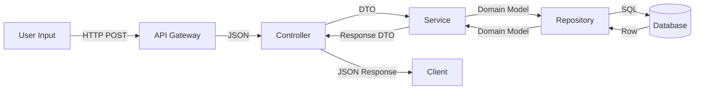
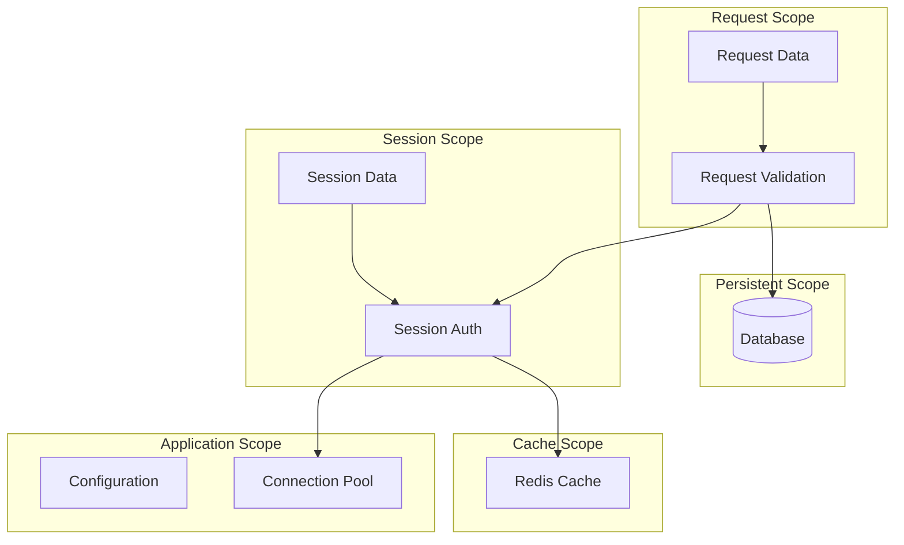
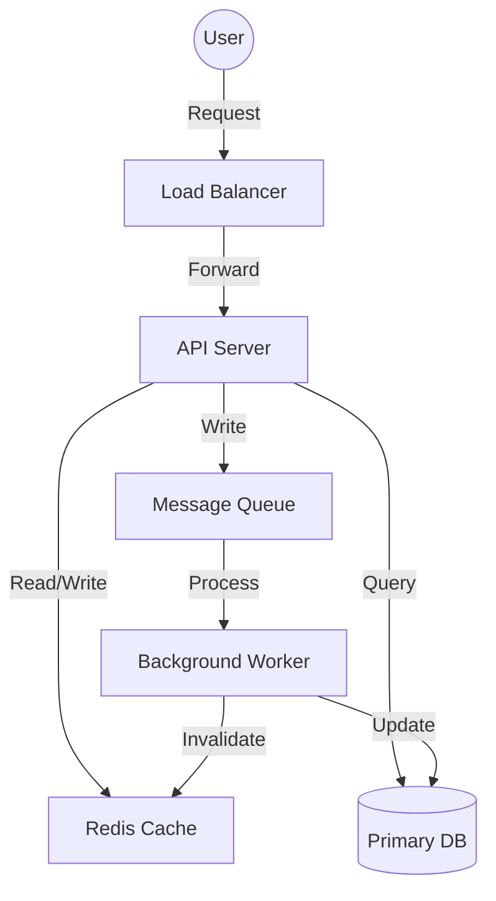
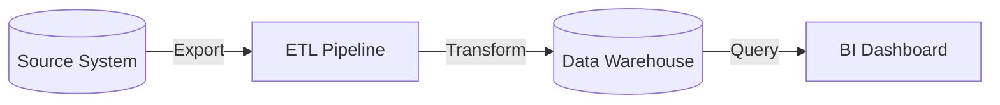

# Module: Data Flow Deep Analysis

> **Document:** modules/MODULE_DATA_FLOW.md  
> **Version:** 1.0.0  
> **Purpose:** Deep-dive module for data flow and state management analysis  
> **When to Use:** Repository has complex data pipelines, state management systems, or requires data flow documentation

---

## 🎯 PURPOSE

This module provides advanced data flow analysis techniques for understanding how data moves through the system, how state is managed, and how data transformations occur.

---

## 🔬 METHODOLOGY

### 1. End-to-End Data Flow Tracing

```markdown
## End-to-End Data Flow

### Flow: [Flow Name]
- **Origin:** [Where data enters the system]
- **Destination:** [Where data is consumed or stored]
- **Trigger:** [What initiates the flow]

#### Data Flow Diagram


#### Data Transformations
| Step | Input Format | Transformation | Output Format | File:Line |
|------|-------------|----------------|---------------|-----------|
| API → Controller | HTTP Request | Parse JSON | Request DTO | controller.js:42 |
| Controller → Service | Request DTO | Validate → Domain Model | Domain Model | service.js:56 |
| Service → Repository | Domain Model | Map → DB Entity | DB Entity | repository.js:89 |
| DB → Repository | SQL Result | Map → Domain Model | Domain Model | repository.js:120 |
```

### 2. Data Transformation Pipeline

```markdown
## Data Transformation Pipeline

### Pipeline: [Pipeline Name]

#### Processing Stages
| Stage | Input | Process | Output | File |
|-------|-------|---------|--------|------|
| Extract | Raw data | Read from source | Structured data | extractor.py |
| Validate | Structured data | Schema validation | Validated data | validator.py |
| Transform | Validated data | Business logic | Transformed data | transformer.py |
| Load | Transformed data | Write to target | Stored data | loader.py |

#### Stage Details
##### Stage: [Stage Name]
- **Purpose:** [What this stage does]
- **Implementation:** [How it works]
- **Failure Mode:** [What happens on failure]
- **Retry Strategy:** [How retries are handled]

#### Pipeline Orchestration
- **Orchestrator:** [What manages the pipeline]
- **Parallelism:** [Which stages run in parallel]
- **Error Propagation:** [How errors propagate through the pipeline]
- **Pipeline State:** [How pipeline progress is tracked]
```

### 3. State Management Analysis

```markdown
## State Management Analysis

### State Architecture

#### State Types
| State Type | Location | Scope | Persistence | Lifetime |
|------------|----------|-------|-------------|----------|
| Application | In-memory | Global | None | Application lifetime |
| Session | In-memory/Redis | Per user | Yes | Session lifetime |
| Request | In-memory | Per request | None | Request lifetime |
| Cache | Redis/Memcached | Global | Configurable | TTL-based |
| Persistent | Database | Global | Yes | Permanent |

#### State Flow Diagram


#### State Consistency Model
- **Consistency Level:** [Strong / Eventual / Causal]
- **Conflict Resolution:** [Last-write-wins / CRDT / Custom]
- **Stale Read Handling:** [How stale reads are detected/handled]
- **Write-Ahead Logging:** [Used / Not used]
```

### 4. Cache Architecture Analysis

```markdown
## Cache Architecture

### Cache Inventory
| Cache Name | Type | Storage | TTL | Invalidation Strategy | Size |
|------------|------|---------|-----|----------------------|------|
| User Cache | Read-through | Redis | 300s | Write-invalidate | 10MB |
| Session Cache | Write-through | Redis | 3600s | TTL | 50MB |
| Data Cache | Lazy-loading | In-memory | 60s | Time-based | 5MB |

### Cache Access Patterns
| Pattern | Description | Location |
|---------|-------------|----------|
| Cache-Aside | Read from cache, miss → read DB → cache | user_service.js |
| Write-Through | Write to cache + DB simultaneously | session_service.js |
| Write-Behind | Write to cache, async write to DB | analytics.js |
| Refresh-Ahead | Refresh cache before TTL expiry | preloader.js |

### Cache Hit/Miss Analysis
- **Overall Hit Rate:** [%]
- **Miss Penalty:** [Time penalty for cache misses]
- **Hot Keys:** [Most frequently accessed keys]
- **Cold Start:** [How cache is populated on startup]
```

### 5. Data Validation & Integrity

```markdown
## Data Validation & Integrity

### Validation Rules
| Field | Rule | Enforced At | Error Handling |
|-------|------|-------------|----------------|
| email | Valid email format | API layer + Service layer | Return 400 |
| age | 0-150 | Service layer | Return validation error |
| ssn | Format XXX-XX-XXXX | Service layer | Mask in logs |

### Integrity Constraints
| Constraint | Database | Application | Enforcement |
|------------|----------|-------------|-------------|
| Unique email | UNIQUE index | Check before insert | DB + App |
| Foreign key | FK constraint | Reference check | DB + App |
| Non-null | NOT NULL | Validation | DB + App |

### Data Sanitization
| Sanitization | Location | Purpose |
|--------------|----------|---------|
| Input escaping | API Gateway | Prevent injection |
| Output encoding | Response builder | Prevent XSS |
| PII masking | Logger | Privacy compliance |
```

### 6. Data Flow Diagrams

```markdown
## Data Flow Diagrams

### System Data Flow


### Batch Data Flow


### Data Flow Documentation
- **Critical Data Paths:** [Data paths that are business-critical]
- **Data Bottlenecks:** [Where data flow slows down]
- **Single Points of Failure:** [Components whose failure would stop data flow]
- **Data Loss Risks:** [Where data could be lost]
```

---

## 📦 OUTPUT

Use this module during Phase 6 to enhance:
- `06_WORKFLOWS/EXECUTION_PATHS.md` — With data flow details
- `06_WORKFLOWS/STATE_TRANSITIONS.md` — With state management details

Also use during Phase 5 to enhance:
- `05_ARCHITECTURE/DATA_ARCHITECTURE.md` — With data flow diagrams

---

## ✅ QUALITY CRITERIA

- [ ] End-to-end data flows traced
- [ ] Data transformation documented
- [ ] State management analyzed
- [ ] Cache architecture documented
- [ ] Data validation rules documented
- [ ] Data flow diagrams generated
- [ ] Data bottlenecks identified

