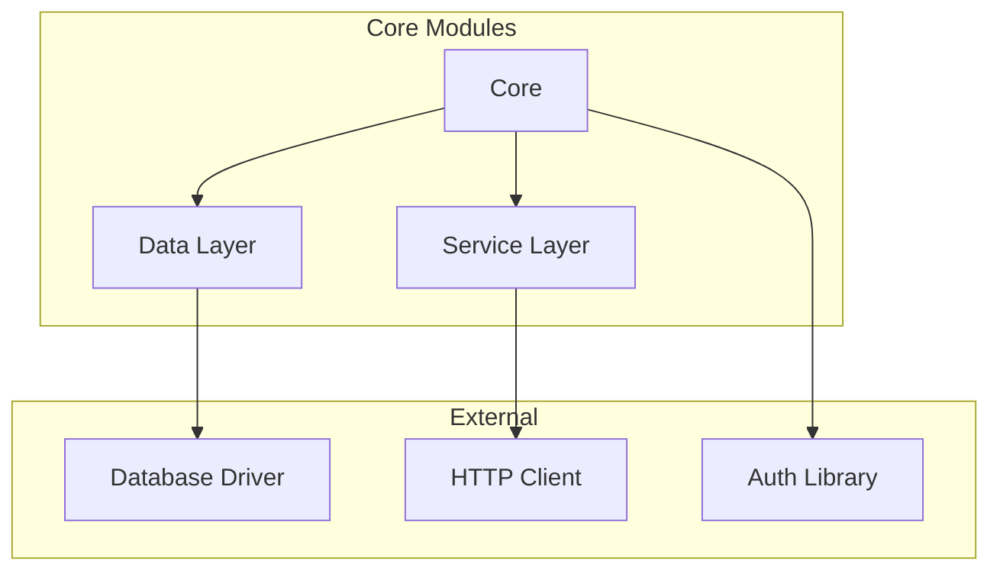
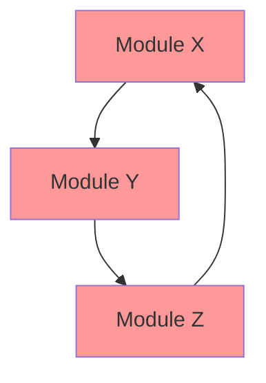

# Module: Dependency Graph Construction & Analysis

> **Document:** modules/MODULE_DEPENDENCY_GRAPH.md  
> **Version:** 1.0.0  
> **Purpose:** Advanced dependency graph construction and analysis  
> **When to Use:** Repository has complex dependency structures requiring visualization and analysis

---

## 🎯 PURPOSE

This module provides advanced dependency graph construction, visualization, and analysis techniques. Use when the repository has complex, nested, or multi-language dependency structures.

---

## 🔬 METHODOLOGY

### 1. Automated Dependency Extraction

For each language, extract dependencies using these methods:

#### JavaScript/TypeScript
```bash
# Extract dependency tree
npm ls --all --json > deps.json

# Check for unused dependencies
npx depcheck

# Circular dependency detection
npx madge --circular --extensions ts,js src/
```

#### Python
```bash
# Extract dependency tree
pip freeze > requirements-full.txt

# Dependency analysis
pipdeptree --json > deps.json

# Circular dependency detection
pip check
```

#### Java/Kotlin
```bash
# Maven dependency tree
mvn dependency:tree -DoutputFile=deps.txt

# Gradle dependency analysis
gradle dependencies --scan
```

#### Rust
```bash
# Cargo dependency tree
cargo tree --all-features
cargo audit
```

#### Go
```bash
# Go module graph
go mod graph > deps.txt

# Vulnerability check
govulncheck ./...
```

### 2. Custom Regex-Based Extraction

When automated tools are unavailable:

```markdown
## Import/Require Pattern Extraction

### JavaScript/TypeScript
- **Regex:** `import .+ from ['"](.+)['"]` or `require\(['"](.+)['"]\)`
- **Internal Detection:** Relative paths (./, ../) or project-specific scope (@project/)

### Python
- **Regex:** `from (.+) import` or `import (.+)`
- **Internal Detection:** Project package name or relative imports

### Java
- **Regex:** `import (.+);`
- **Internal Detection:** Package pattern matching project structure

### Go
- **Regex:** `"([^"]+)"` in import block
- **Internal Detection:** Module path comparison

### Rust
- **Regex:** `use (.+);` or `extern crate (.+);`
- **Internal Detection:** Crate path comparison
```

### 3. Dependency Graph Visualization

Generate Mermaid.js dependency diagrams:

#### Module-Level Dependency Graph


#### Circular Dependency Detection Diagram


### 4. Dependency Metrics

```markdown
## Dependency Metrics

### Module-Level Metrics
| Module | Fan-In | Fan-Out | Depth | Instability | Abstractness |
|--------|--------|---------|-------|-------------|--------------|
| Core | 5 | 2 | 1 | 0.29 | 0.50 |
| Services | 3 | 4 | 2 | 0.57 | 0.33 |

### Repository-Level Metrics
- **Total Dependencies (internal):** [count]
- **Total Dependencies (external):** [count]
- **Average Module Dependencies:** [value]
- **Maximum Module Dependencies:** [value]
- **Circular Dependency Count:** [value]
- **Dependency Depth (max):** [level]
```

### 5. Dependency Health Scoring

```markdown
## Dependency Health

### External Dependency Health
| Dependency | Current Version | Latest Version | Age | Deprecated? | Vulnerable? |
|------------|-----------------|----------------|-----|-------------|-------------|
| lib-a | 1.2.3 | 2.0.0 | 18 months | No | CVE-2024-1234 |

### Internal Dependency Health
| Component | Dependencies | Unused Dependencies? | Duplicate Dependencies? |
|-----------|--------------|---------------------|------------------------|
| Module X | 10 | 1 (unused-import) | 0 |

### Health Score
- **External Dependency Health Score:** [score]/100
- **Internal Dependency Health Score:** [score]/100
- **Overall Dependency Health Score:** [score]/100
```

### 6. Dependency Change Impact Analysis

```markdown
## Change Impact Analysis

### High-Impact Modules
Modules with high fan-out or criticality:
| Module | Impact When Changed | Files Affected | Risk |
|--------|--------------------|----------------|------|
| Core Library | All dependent modules | 42 files | HIGH |
| Config Module | Modules reading config | 15 files | MEDIUM |

### Dependency Traversal
When [Module X] changes:
1. [Module A] would need recompilation/retesting (direct dependency)
2. [Module B] would need recompilation/retesting (transitive dependency)
3. [Module C] would need recompilation/retesting (transitive dependency)
```

---

## 📦 OUTPUT

Use this module during Phase 3 to enhance:
- `03_DEPENDENCY_ANALYSIS/DEPENDENCY_GRAPH.md` — With additional graphs and metrics
- `03_DEPENDENCY_ANALYSIS/INTERNAL_DEPENDENCIES.md` — With deeper analysis

---

## ✅ QUALITY CRITERIA

- [ ] Dependencies extracted for all languages
- [ ] Module-level dependency graph generated
- [ ] Package-level dependency graph generated
- [ ] External dependency health assessed
- [ ] Internal dependency health assessed
- [ ] Change impact analysis completed
- [ ] Circular dependencies identified and documented

