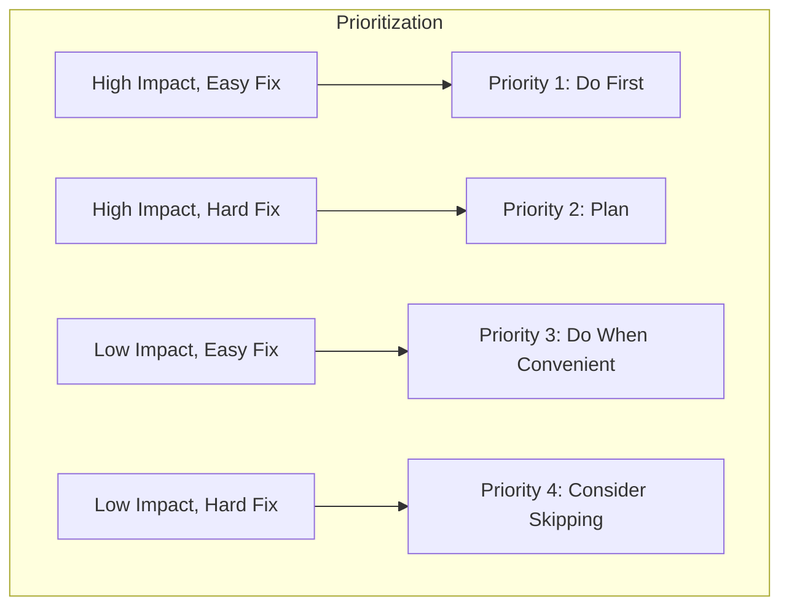

# Module: Advanced Quality Validation

> **Document:** modules/MODULE_QUALITY_VALIDATION.md  
> **Version:** 1.0.0  
> **Purpose:** Advanced quality validation procedures for the documentation output  
> **When to Use:** During Phase 10 when standard validation is insufficient, or when quality score requires improvement

---

## 🎯 PURPOSE

This module provides advanced validation techniques for ensuring documentation quality, including statistical sampling, automated checks, and comprehensive quality assessment.

---

## 🔬 METHODOLOGY

### 1. Statistical Sampling Verification

```markdown
## Statistical Sampling

### Sampling Strategy
For large documentation sets, use stratified random sampling:

| Stratum | Population | Sample Size | Confidence Level |
|---------|------------|-------------|-----------------|
| Architecture docs | 10 | 5 | 95% |
| Component docs | 25 | 8 | 95% |
| Workflow docs | 15 | 6 | 95% |
| API docs | 20 | 7 | 95% |
| Reference docs | 30 | 10 | 95% |

### Verification Protocol
For each sampled document:
1. Read the document completely.
2. Verify 5 random technical claims against source code.
3. Check cross-references for accuracy.
4. Assess clarity and completeness.
5. Score against quality standards.

### Sampling Error Calculation
- **Total Documents:** [N]
- **Sample Size:** [n]
- **Error Rate in Sample:** [e]%
- **Estimated Error Rate:** [e ± margin]% at 95% confidence
```

### 2. Automated Consistency Checks

```markdown
## Automated Consistency Checks

### Terminology Check
Create a term extraction and comparison:

```bash
# Extract all unique terms from documentation
grep -roh '\b[A-Z][a-z]*[A-Z][a-z]*\b' docs/ | sort -u > docs_terms.txt

# Extract all unique terms from source code
grep -roh '\b[A-Z][a-z]*[A-Z][a-z]*\b' src/ | sort -u > code_terms.txt

# Compare terminology
diff docs_terms.txt code_terms.txt > term_differences.txt
```

### Cross-Reference Integrity Check
```bash
# Extract all cross-reference patterns
grep -roh '\[.*\]\(.*\.md\)' docs/ > refs.txt

# Verify each reference target exists
while read ref; do
    target=$(echo $ref | sed 's/.*(\(.*\))/\1/')
    if [ ! -f "$target" ]; then
        echo "BROKEN REF: $ref in $(grep -rl $ref docs/)"
    fi
done < refs.txt
```
```

### 3. Depth Quality Assessment

```markdown
## Depth Quality Assessment

### Depth Scoring Criteria

| Element | Shallow (0) | Adequate (1) | Deep (2) |
|---------|-------------|--------------|----------|
| File Documentation | Name + 1-line purpose | Purpose, dependencies, key elements | Purpose, deps, elements, logic, errors |
| Function Documentation | Name only | Name + parameters | Name + params + logic + errors + callers |
| Algorithm Documentation | Name + 1-line description | Name + step overview | Name + steps + complexity + edge cases |
| Workflow Documentation | List of steps | Steps + decision points | Steps + decisions + errors + alternatives |
| Architecture Documentation | 1-paragraph overview | Layer + component list | Layers + components + interactions + rationale |

### Depth Score Calculation
- **Total Elements Scored:** [count]
- **Deep (2 points):** [count] = [points]
- **Adequate (1 point):** [count] = [points]
- **Shallow (0 points):** [count] = [points]
- **Maximum Possible:** [count] × 2 = [max]
- **Depth Score:** [points]/[max] = [score]%
```

### 4. Usefulness Assessment

```markdown
## Usefulness Assessment

### Target Audience Evaluation

#### Developer Usefulness
- Can a developer find the file they need to modify? [Yes/No/Partial]
- Can a developer understand the function they need to change? [Yes/No/Partial]
- Can a developer identify all callers of a function? [Yes/No/Partial]

#### Architect Usefulness
- Can an architect understand the system structure? [Yes/No/Partial]
- Can an architect identify design decisions? [Yes/No/Partial]
- Can an architect evaluate architecture trade-offs? [Yes/No/Partial]

#### New Team Member Usefulness
- Can a new member set up the project? [Yes/No/Partial]
- Can a new member understand the development workflow? [Yes/No/Partial]
- Can a new member find where to make their first change? [Yes/No/Partial]

### Actionability Score
| Task | Can Be Done from Documentation? | Confidence |
|------|--------------------------------|------------|
| Add a new API endpoint | ✅ Yes / ⚠️ Partial / ❌ No | High |
| Modify existing business logic | ✅ Yes / ⚠️ Partial / ❌ No | High |
| Debug a common error | ✅ Yes / ⚠️ Partial / ❌ No | Medium |
| Deploy the system | ✅ Yes / ⚠️ Partial / ❌ No | High |
```

### 5. Diagram Quality Scoring

```markdown
## Diagram Quality Scoring

### Diagram Evaluation Criteria
| Criterion | Weight | Score (0-10) | Weighted Score |
|-----------|--------|--------------|----------------|
| Accuracy | 40% | /10 | /4.0 |
| Clarity | 25% | /10 | /2.5 |
| Completeness | 20% | /10 | /2.0 |
| Consistency | 15% | /10 | /1.5 |
| **Total** | **100%** | | **/10** |

### Per-Diagram Scoring
| Diagram | Accuracy | Clarity | Completeness | Consistency | Total |
|---------|----------|---------|--------------|-------------|-------|
| System Architecture | /10 | /10 | /10 | /10 | /10 |
| Component Diagram | /10 | /10 | /10 | /10 | /10 |
| Workflow Diagram | /10 | /10 | /10 | /10 | /10 |
```

### 6. Gap Analysis Deep Dive

```markdown
## Gap Analysis Deep Dive

### Gap Categorization
| Category | Description | Severity | Remediation |
|----------|-------------|----------|-------------|
| Coverage Gap | Missing file/module documentation | High | Add documentation |
| Depth Gap | Documented but insufficient detail | Medium | Expand documentation |
| Accuracy Gap | Incorrect documentation | Critical | Correct immediately |
| Consistency Gap | Terminology or format mismatch | Low | Normalize |
| Reference Gap | Missing cross-references | Low | Add references |

### Gap Prioritization Matrix


### Gap Closure Tracking
| Gap | Category | Severity | Assigned To | Status | Target Date |
|-----|----------|----------|-------------|--------|-------------|
| Missing user service doc | Coverage | High | AI Agent | Open | Before sign-off |
| Inaccurate API example | Accuracy | Critical | AI Agent | In progress | Immediate |
```

### 7. Final Quality Score Deep Calculation

```markdown
## Final Quality Score Calculation

### Dimension Scoring

#### Completeness Score (25% weight)
- **File Coverage:** documented_files / total_files × 100 = [score]%
- **Concept Coverage:** documented_concepts / total_concepts × 100 = [score]%
- **Completeness Score:** (file_coverage + concept_coverage) / 2 = [score]%

#### Accuracy Score (25% weight)
- **Technical Accuracy:** verified_findings / total_sampled_findings × 100 = [score]%
- **Logical Accuracy:** documented_logical_flows / verified_logical_flows × 100 = [score]%
- **Accuracy Score:** (technical + logical) / 2 = [score]%

#### Clarity Score (15% weight)
- **Readability:** assessment_score (0-100) = [score]%
- **Structure:** assessment_score (0-100) = [score]%
- **Clarity Score:** (readability + structure) / 2 = [score]%

#### Consistency Score (10% weight)
- **Terminology Consistency:** consistent_terms / total_terms × 100 = [score]%
- **Format Consistency:** consistent_docs / total_docs × 100 = [score]%
- **Consistency Score:** (terminology + format) / 2 = [score]%

#### Depth Score (15% weight)
- **Depth Score:** from depth assessment = [score]%

#### Usefulness Score (10% weight)
- **Developer Usefulness:** from assessment = [score]%
- **Architect Usefulness:** from assessment = [score]%
- **New Member Usefulness:** from assessment = [score]%
- **Usefulness Score:** average of three = [score]%

### Final Calculation
```
Total = (Completeness × 0.25) + (Accuracy × 0.25) + (Clarity × 0.15) 
       + (Consistency × 0.10) + (Depth × 0.15) + (Usefulness × 0.10)
```

### Confidence Interval
- **Score:** [calculated]%
- **Confidence Interval:** [score]% ± [margin]% at 95% confidence
- **Lower Bound:** [calculated]%
- **Upper Bound:** [calculated]%
```

---

## 📦 OUTPUT

Use this module during Phase 10 to enhance:
- `10_VALIDATION/QUALITY_REPORT.md` — With deeper quality analysis
- `10_VALIDATION/VALIDATION_CHECKLIST.md` — With advanced validation items
- `10_VALIDATION/GAP_ANALYSIS.md` — With gap prioritization

---

## ✅ QUALITY CRITERIA

- [ ] Statistical sampling completed
- [ ] Automated consistency checks run
- [ ] Depth quality assessed
- [ ] Usefulness evaluated
- [ ] Diagram quality scored
- [ ] Gap analysis with prioritization
- [ ] Final quality score calculated with confidence interval
- [ ] All remediation items addressed

