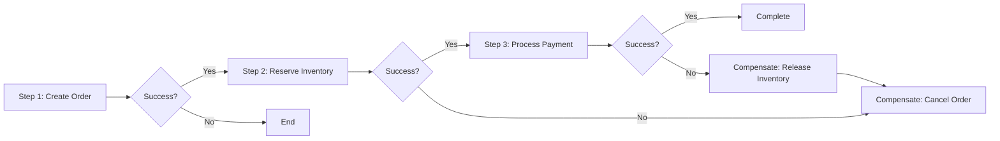

# Module: Workflow Deep Analysis

> **Document:** modules/MODULE_WORKFLOW_ANALYSIS.md  
> **Version:** 1.0.0  
> **Purpose:** Deep-dive module for complex workflow analysis  
> **When to Use:** Repository has complex, multi-step, or distributed workflows

---

## 🎯 PURPOSE

This module provides advanced workflow analysis techniques for understanding complex, multi-step, stateful, or distributed workflows.

---

## 🔬 METHODOLOGY

### 1. Workflow Pattern Identification

Identify workflow patterns used:

```markdown
## Workflow Patterns

### Pattern Inventory
| Pattern | Description | Location | Example |
|---------|-------------|----------|---------|
| **Pipeline** | Sequential processing stages | pipeline.ts | Data transformation pipeline |
| **Fan-Out/Fan-In** | Parallel processing, then aggregation | parallel.js | Batch processing |
| **Saga** | Distributed transaction with compensation | saga.go | Order fulfillment |
| **State Machine** | Explicit states and transitions | state.go | Document workflow |
| **Observer** | Reactive event-driven steps | observer.js | Notification system |
| **Retry with Backoff** | Automatic retry on failure | retry.ts | External API calls |
| **Circuit Breaker** | Fail-fast when dependency is down | circuit.js | External service calls |
| **Scheduler** | Time-based or cron-triggered | scheduler.go | Report generation |
```

### 2. Workflow Complexity Analysis

```markdown
## Workflow Complexity

### Complexity Metrics
| Workflow | Steps | Branches | Parallel Paths | Error Paths | Complexity Score |
|----------|-------|----------|----------------|-------------|-----------------|
| User Registration | 8 | 4 | 2 | 3 | HIGH |
| Order Processing | 12 | 6 | 3 | 5 | VERY HIGH |

### Complexity Assessment
- **Workflow [Name]:** This workflow has high complexity due to multiple decision points, parallel execution paths, and error recovery mechanisms.
- **Risk Areas:** The [step name] decision point handles [N] branches, which is complex and error-prone.
```

### 3. Transaction and Compensation Analysis

For workflows with distributed transactions:

```markdown
## Transaction Analysis

### Saga Flow: [Saga Name]


### Compensation Map
| Step | Action | Compensation | Compensation Action |
|------|--------|--------------|-------------------|
| 1 | Create Order | Cancel Order | order_service.cancel() |
| 2 | Reserve Inventory | Release Inventory | inventory_service.release() |
| 3 | Process Payment | Refund Payment | payment_service.refund() |
```

### 4. Concurrency and Race Conditions

```markdown
## Concurrency Analysis

### Concurrency Mechanisms
| Mechanism | Location | Purpose |
|-----------|----------|---------|
| Mutex | db.py:42 | Protect database writes |
| Semaphore | worker.py:88 | Limit concurrent workers |
| Atomic Operations | counter.js:15 | Thread-safe counting |
| Transaction Isolation | db.py:100 | Database consistency |

### Race Condition Analysis
- **Potential Race:** [Description of potential race condition]
- **Location:** [File:Line]
- **Current Protection:** [How it's protected]
- **Risk Level:** [Low / Medium / High]

### Deadlock Detection
- **Potential Deadlock:** [Description]
- **Resources Involved:** [Resource A, Resource B]
- **Lock Ordering:** [Current order, Recommended order]
- **Risk Level:** [Low / Medium / High]
```

### 5. Workflow Performance Analysis

```markdown
## Workflow Performance

### Performance Characteristics
| Workflow | Average Latency | P99 Latency | Throughput | Bottleneck |
|----------|----------------|-------------|------------|------------|
| Registration | 150ms | 500ms | 100/s | Email Service |
| Order Process | 2s | 5s | 50/s | Payment Gateway |

### Bottleneck Details
- **Bottleneck 1:** [Component] — [Reason, impact]
- **Bottleneck 2:** [Component] — [Reason, impact]

### Optimization Opportunities
| Opportunity | Expected Impact | Effort |
|-------------|-----------------|--------|
| Cache [X] results | 30% latency reduction | Low |
| Parallelize [Y] and [Z] | 40% throughput increase | Medium |
```

### 6. Workflow Resilience Analysis

```markdown
## Workflow Resilience

### Failure Mode Analysis
| Failure Mode | Symptoms | Detection | Recovery | MTTR |
|--------------|----------|-----------|----------|------|
| DB Connection Lost | Query failures | Connection pool timeout | Automatic reconnect | 2s |
| External API Down | Timeouts | Circuit breaker | Fallback to cache | 30s |

### Resilience Patterns
| Pattern | Location | Purpose |
|---------|----------|---------|
| Circuit Breaker | api_client.js | Protect downstream from failures |
| Bulkhead | worker_pool.go | Isolate failure domains |
| Timeout | http_client.ts | Prevent indefinite waits |
| Retry with Backoff | retry_handler.py | Recover from transient failures |
| Fallback | cache_fallback.js | Graceful degradation |

### Chaos Engineering Recommendations
- [Recommendation 1]: Inject failures into [component] to test resilience
- [Recommendation 2]: Test [workflow] under high load
```

---

## 📦 OUTPUT

Use this module during Phase 6 to enhance:
- `06_WORKFLOWS/[workflow-name]_WORKFLOW.md` — With deeper analysis
- `06_WORKFLOWS/ERROR_HANDLING_WORKFLOWS.md` — With resilience analysis

---

## ✅ QUALITY CRITERIA

- [ ] Workflow patterns identified
- [ ] Complexity analysis complete
- [ ] Transaction/compensation analysis done (if applicable)
- [ ] Concurrency analysis thorough
- [ ] Performance analysis complete
- [ ] Resilience analysis complete

