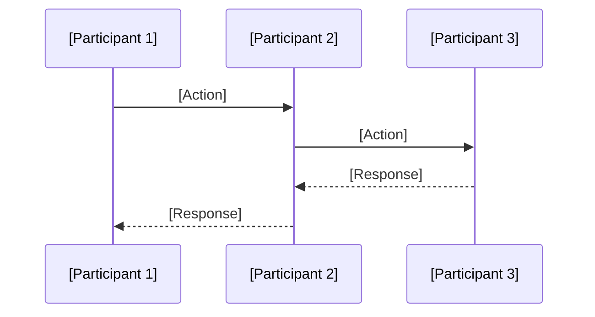
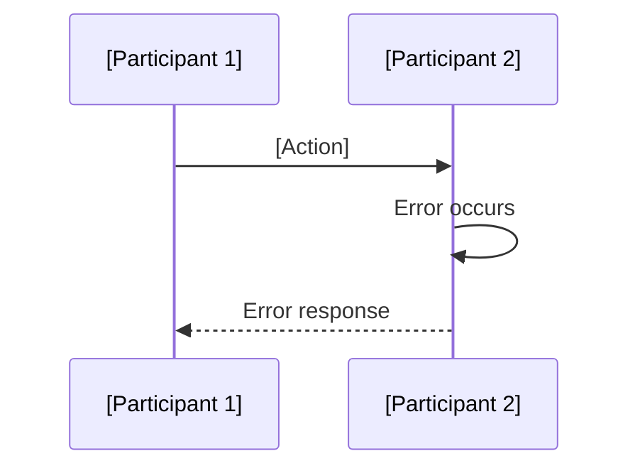

# Template: Sequence Diagram

> **Document:** templates/TEMPLATE_SEQUENCE_DIAGRAM.md  
> **Version:** 1.0.0  
> **Purpose:** Template for documenting interaction sequences  
> **When to Use:** During Phase 9 to document component interaction sequences

---

## 📋 STRUCTURE

```markdown
# Sequence Diagram: [Diagram Title]

> **Document:** [relative-path.md]
> **Phase:** Sequence Diagram
> **Last Updated:** [YYYY-MM-DD]
> **Purpose:** Illustrate the interaction sequence for [workflow/scenario]

---

## Overview

[Brief description of the interaction being diagrammed]

## Participants

| Participant | Type | Description |
|-------------|------|-------------|
| [Participant 1] | [System/External/User] | [Description] |
| [Participant 2] | [System/External/User] | [Description] |

## Normal Flow



### Step Details

| Step | Actor | Action | Details | File:Line |
|------|-------|--------|---------|-----------|
| 1 | [Actor] | [Action] | [Details] | [file:line] |
| 2 | [Actor] | [Action] | [Details] | [file:line] |
| 3 | [Actor] | [Action] | [Details] | [file:line] |

## Error Flow



### Error Handling

| Error | Triggered At | Handling | Recovery |
|-------|-------------|----------|----------|
| [Error] | Step [N] | [Handling] | [Recovery] |

## Alternative Flows

### Flow: [Alternative Flow Name]

```mermaid
sequenceDiagram
    [Alternative sequence]
```

## Confidence Assessment

- **Diagram Confidence:** [High/Medium/Low]
- **Accuracy Notes:** [Notes on accuracy]

## Cross-References

- [Related Document 1](path/to/doc.md)
- [Related Workflow](path/to/workflow.md)
```

---

## 📝 USAGE GUIDELINES

1. **Scope:** Use for documenting specific interaction sequences between components.
2. **Focus:** Each diagram should focus on one interaction scenario.
3. **Participants:** Include all relevant participants (users, systems, external services).
4. **Clarity:** Use clear, descriptive action labels.
5. **Error Flows:** Always include error/alternative flows.

---

## ✅ QUALITY CHECKLIST

- [ ] Clear title and overview
- [ ] All participants listed with descriptions
- [ ] Normal flow diagram accurate
- [ ] Step details with file:line references
- [ ] Error flow diagram included
- [ ] Alternative flows documented (if applicable)
- [ ] Confidence assessment included

