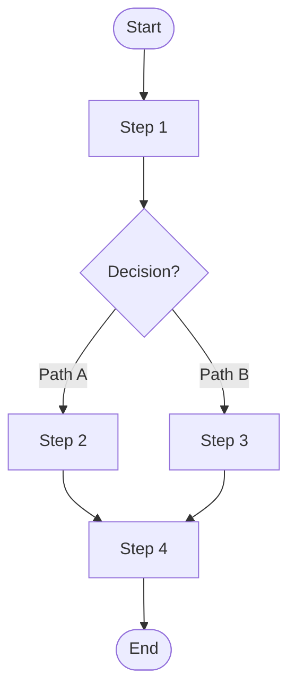

# Template: Workflow Documentation

> **Document:** templates/TEMPLATE_WORKFLOW_DOC.md  
> **Version:** 1.0.0  
> **Purpose:** Template for documenting workflows and execution paths  
> **When to Use:** During Phase 9 for workflow documentation

---

## 📋 STRUCTURE

```markdown
# Workflow: [Workflow Name]

> **Document:** [relative-path.md]
> **Phase:** Workflow Documentation
> **Last Updated:** [YYYY-MM-DD]
> **Purpose:** Document the [workflow name] workflow

---

## Overview

- **Trigger:** [What initiates this workflow]
- **Category:** [User / Data / Background / Event / API / Recovery]
- **Criticality:** [Core / Important / Peripheral]
- **Frequency:** [Continuous / On-demand / Scheduled / Event-driven]

## Flow Diagram



## Step-by-Step Trace

| Step | Component | Action | Details | File:Line |
|------|-----------|--------|---------|-----------|
| 1 | [Component] | [Action] | [Details] | [file:line] |
| 2 | [Component] | [Action] | [Details] | [file:line] |
| 3 | [Decision] | [Decision] | [Condition] | [file:line] |
| 4 | [Component] | [Action] | [Details] | [file:line] |

## Decision Points

| Step | Decision | Condition | Path A | Path B |
|------|----------|-----------|--------|--------|
| [N] | [Decision] | [Condition] | [Path A description] | [Path B description] |

## Error Handling

| Step | Error | Handling | Recovery |
|------|-------|----------|----------|
| [N] | [Error description] | [Handling mechanism] | [Recovery steps] |

## Sequence Diagram

```mermaid
sequenceDiagram
    participant Actor
    participant Component1
    participant Component2
    
    Actor->>Component1: Action
    Component1->>Component2: Action
    Component2-->>Component1: Response
    Component1-->>Actor: Response
```

## Data Transformations

| Step | Input | Transformation | Output |
|------|-------|----------------|--------|
| [N] | [Input format] | [Transformation] | [Output format] |

## Performance Characteristics

- **Average Latency:** [time]
- **P99 Latency:** [time]
- **Throughput:** [ops/sec]
- **Bottleneck:** [Component]

## Confidence Assessment

- **Workflow Confidence:** [High/Medium/Low]
- **Uncertainties:** [List]

## Cross-References

- [Related Architecture](path/to/architecture.md)
- [Related Components](path/to/components.md)
- [Related Sequence Diagram](path/to/sequence.md)
```

---

## 📝 USAGE GUIDELINES

1. **Scope:** Use for each significant workflow in the system.
2. **Clarity:** The flow diagram should be easily understandable at a glance.
3. **Traceability:** Every step should be traceable to a file:line in the codebase.
4. **Completeness:** Include happy path, error paths, and alternative paths.
5. **Performance:** Include performance characteristics when measurable.

---

## ✅ QUALITY CHECKLIST

- [ ] Workflow trigger documented
- [ ] Flow diagram included and accurate
- [ ] Step-by-step trace with file:line references
- [ ] Decision points documented
- [ ] Error handling documented
- [ ] Sequence diagram included
- [ ] Data transformations documented
- [ ] Performance characteristics noted (if measurable)

