# DIAGRAM TEMPLATES

> Reusable Mermaid diagram templates for use in reverse engineering documentation. Adapt these templates for specific repositories.

---

## 1. SYSTEM CONTEXT DIAGRAM

Shows the system in its environment — external actors and systems it interacts with.

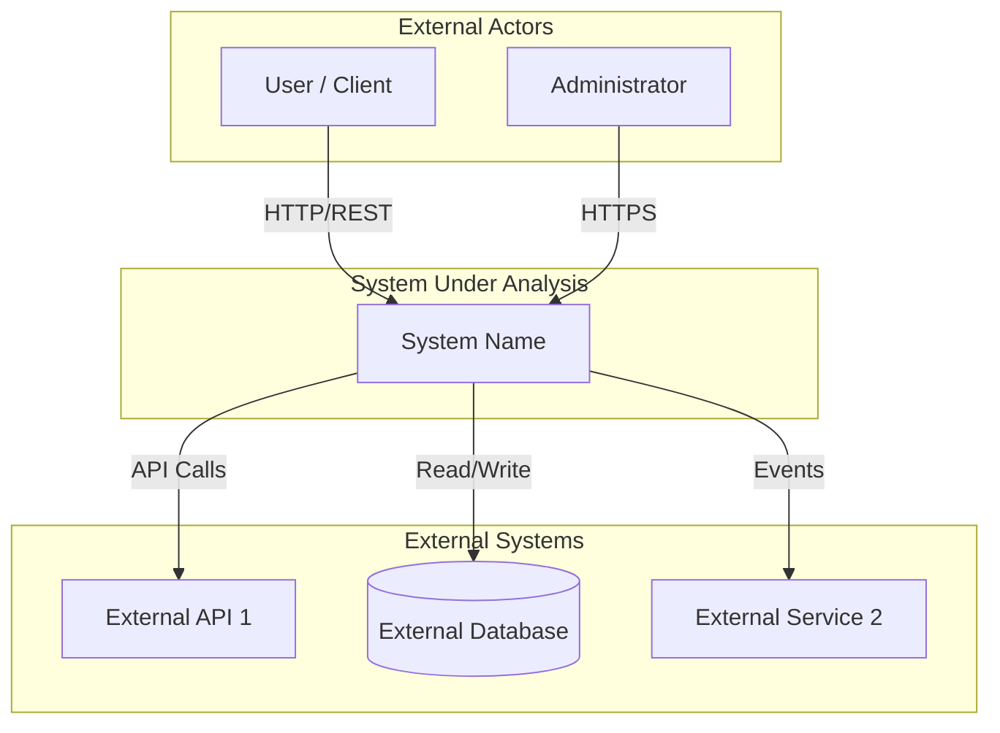

---

## 2. COMPONENT ARCHITECTURE DIAGRAM

Shows the major components of the system and their relationships.

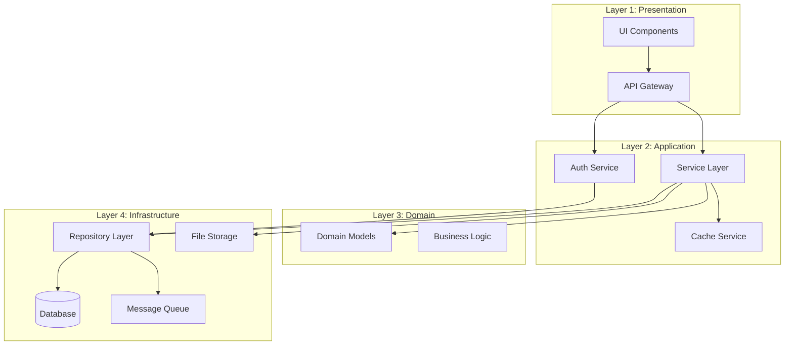

---

## 3. MODULE DEPENDENCY GRAPH

Shows dependencies between modules or packages.

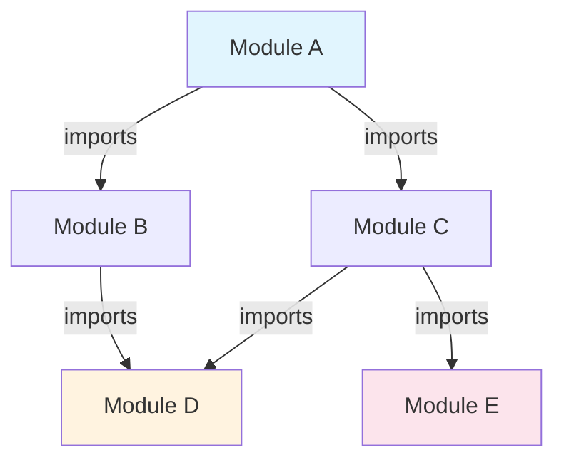

---

## 4. LAYER ARCHITECTURE DIAGRAM

Shows the layering of the system with boundaries.

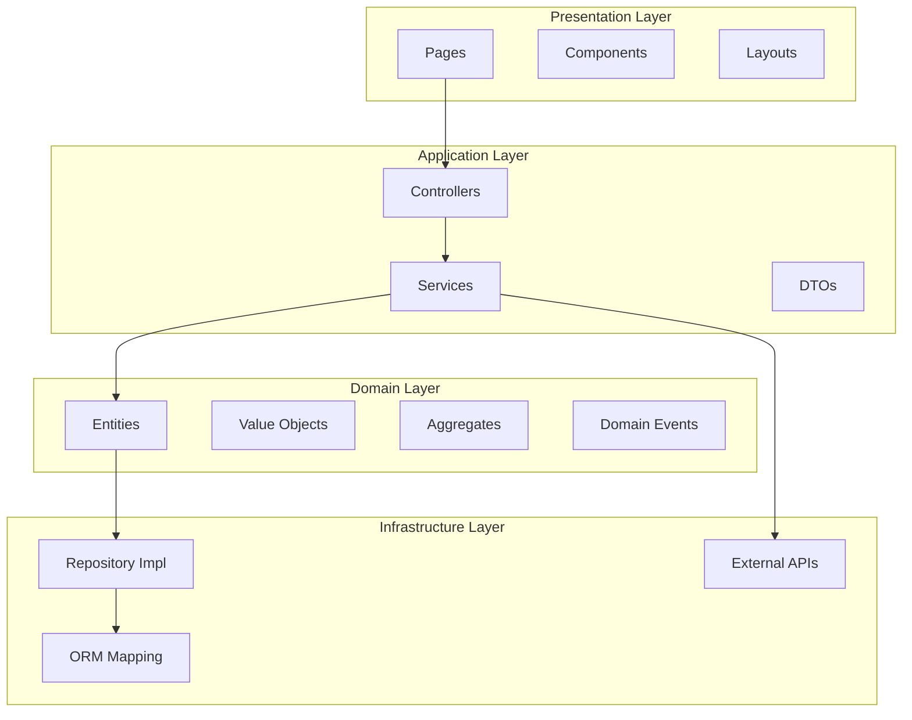

---

## 5. DATA FLOW DIAGRAM

Shows how data moves through the system.

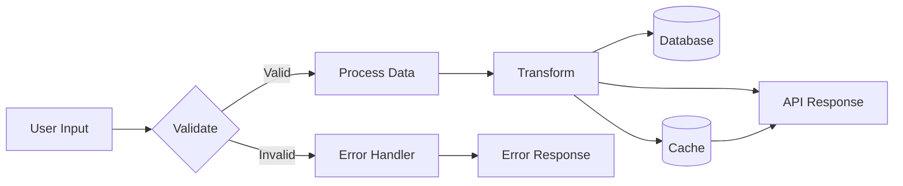

---

## 6. SEQUENCE DIAGRAM — REQUEST FLOW

Shows the flow of a request through the system.

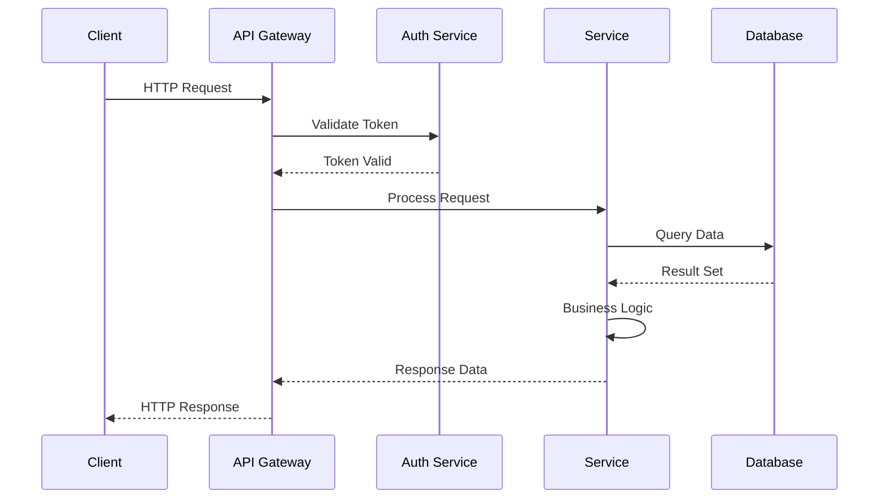

---

## 7. STATE MACHINE DIAGRAM

Models a system's states and transitions.

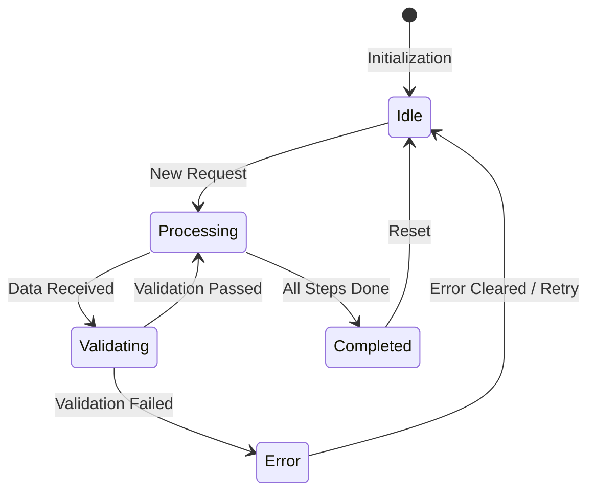

---

## 8. EXECUTION PATH FLOWCHART

Shows an algorithm or decision process.

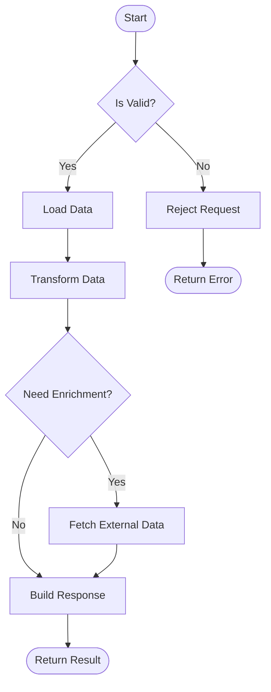

---

## 9. CLASS DIAGRAM — COMPONENT STRUCTURE

Shows the structure of a component and its relationships.

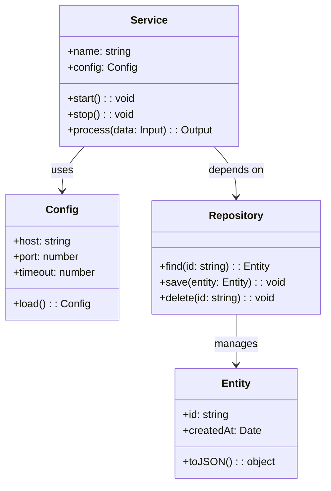

---

## 10. EVENT FLOW DIAGRAM

Shows event-driven communication between components.

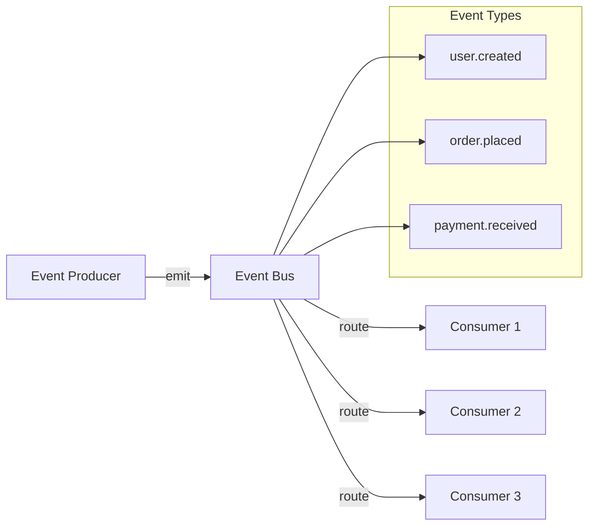

---

## 11. AGENT WORKFLOW DIAGRAM

For AI-agent-based systems — shows how agents interact.

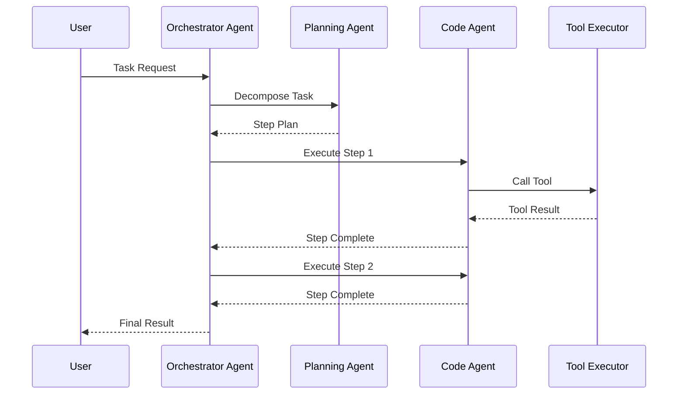

---

## 12. DEPLOYMENT TOPOLOGY DIAGRAM

Shows how the system is deployed across infrastructure.

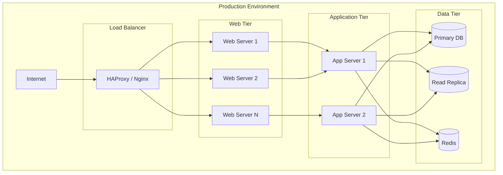

---

## 13. MEMORY/RAG WORKFLOW DIAGRAM

For systems with AI memory and retrieval capabilities.

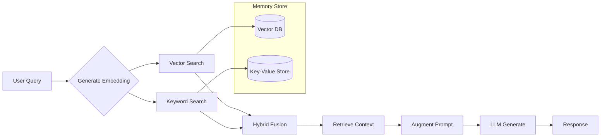

---

## DIAGRAM STYLE GUIDE

### Colors
- **System components:** `#e1f5fe` (light blue) or `#bbdefb`
- **External systems:** `#fff3e0` (light orange) or `#ffe0b2`
- **Data stores:** `#f3e5f5` (light purple) or `#e1bee7`
- **User/actors:** `#e8f5e9` (light green) or `#c8e6c9`
- **Error/edge cases:** `#fce4ec` (light red) or `#ffcdd2`

### Node Shapes
- `[Rectangle]` — Standard component, service, module
- `(Rounded)` — External actor, user, external system
- `{Diamond}` — Decision point, conditional branch
- `[(Cylinder)]` — Database, data store
- `[[Stadium]]` — API, interface boundary
- `[/Parallelogram/]` — Input/output, data transformation

### Line Styles
- Solid arrow (`-->`) — Direct call or dependency
- Dotted arrow (`-.->`) — Indirect, dynamic, or async
- Thick arrow (`==>` ) — Data flow, event emission
- Dashed line (`-.-`) — Optional, configuration, or metadata dependency
