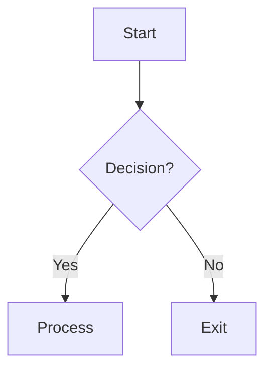

# OUTPUT RULES

> Rules governing the format, structure, and delivery of all documentation produced by this framework.

---

## SECTION 1: DOCUMENT STRUCTURE

### 1.1 Universal Header

Every output document MUST begin with:

```markdown
# [Document Title]

> **Source Prompt:** PROMPT_NN_Name.md  
> **Phase:** [Phase Number] — [Phase Name]  
> **Repository:** [Repository Name]  
> **Commit:** [Full Commit Hash]  
> **Generated:** YYYY-MM-DD HH:MM:SS UTC  
> **Status:** [Draft | Review | Complete]  
> **Confidence:** [High | Medium | Low — see body for specifics]  
> **Next Expected Document:** [Phase/Path/Name]
```

### 1.2 Universal Footer

Every output document MUST end with:

```markdown
---

## Verification

How to verify this document's claims:
- [Verification step 1]
- [Verification step 2]

## Next Phase

Proceed to **[Phase N+1: Prompt Name](link)** after this document passes quality gate Q[N].

## Document Status

[ ] Draft — initial analysis, pending review  
[ ] Reviewed — peer-checked against source code  
[X] Complete — passed quality gate Q[N]
```

### 1.3 Section Numbering

- Top-level sections: `## Section Name`
- Subsections: `### Subsection Name`
- Sub-subsections: `#### Sub-subsection Name`
- Maximum paragraph depth: `#####` (reserved for inline examples)
- All sections must be numbered only if the document type requires cross-referencing (e.g., Architecture Handbook). Use consistent numbering: `### 3.2.1 Module Name`.

### 1.4 Content Sections (Minimum)

Every Phase documentation output MUST contain at minimum:

1. **Overview** — What this document covers
2. **Methodology** — How the analysis was performed
3. **Findings** — The actual analysis results
4. **Edge Cases** — Boundary conditions, error states, exceptional paths
5. **Omissions** — What was not covered and why
6. **Verification** — How to verify the findings

---

## SECTION 2: CODE REFERENCING

### 2.1 Inline Code References

```
File: `src/services/auth.service.ts` (lines 45–89)
```

### 2.2 Block Code References

For multi-line code sections:

```typescript
// src/services/auth.service.ts (lines 45–89) — Authentication flow
export class AuthService {
  private tokenStore: TokenStore;

  async authenticate(credentials: Credentials): Promise<Session> {
    // ...
  }
}
```

### 2.3 Cross-File References

```
Flow: `input-validation.ts` → `auth.service.ts` → `token-store.ts` → `database.ts`
```

### 2.4 Reference Priority

When multiple files reference the same concept:
- Primary file: The file where the concept is defined
- Reference files: Files where the concept is used/called
- Documentation files: Separate from implementation files

---

## SECTION 3: DIAGRAM RULES

### 3.1 Diagram Placement

- Every diagram must appear AFTER the paragraph that introduces it
- Every diagram must have a caption: `**Figure 1:** Description of what this diagram shows`
- Complex diagrams (>50 nodes) should be split into sub-diagrams

### 3.2 Mermaid Standards



Standards:
- Use descriptive node labels, not single letters (e.g., `AuthService` not just `A`)
- Use consistent node shapes: `[ ]` for processes, `{ }` for decisions, `( )` for start/end
- Use edge labels for conditions: `|condition|`
- Group related nodes with `subgraph` blocks
- Maximum 30 nodes per single diagram to maintain readability

### 3.3 Diagram Types by Documentation

| Document Type | Primary Diagram Type | Secondary Diagram Type |
|--------------|---------------------|----------------------|
| System Architecture | Component diagram (`graph`) | Context diagram (`graph`) |
| Module Dependencies | Dependency graph (`graph`) | Layer diagram (`graph`) |
| Data Flow | Data flow diagram (`flowchart`) | Sequence diagram (`sequenceDiagram`) |
| Execution Paths | Flowchart (`flowchart`) | Decision tree (`graph`) |
| State Management | State diagram (`stateDiagram-v2`) | Transition table |
| API Contracts | Sequence diagram (`sequenceDiagram`) | Class diagram (`classDiagram`) |
| Agent Workflows | Sequence diagram (`sequenceDiagram`) | Flowchart (`flowchart`) |
| Event Systems | Event flow (`graph`) | Sequence diagram (`sequenceDiagram`) |

---

## SECTION 4: TABLE STANDARDS

### 4.1 Table Structure

```markdown
| Column 1 | Column 2 | Column 3 | Column 4 |
|----------|----------|----------|----------|
| Content  | Content  | Content  | Content  |
```

- Always include header separator row
- Left-align text columns, right-align numeric columns
- Use `---` for general columns, `:---` for left-align, `---:` for right-align, `:---:` for center-align
- Keep tables to ≤ 6 columns for readability
- Break wide tables into multiple focused tables

### 4.2 Required Table Types

When applicable, the following table formats must be used:

**File Inventory Table:**
| File Path | Size | Language | Role | Dependencies | Key Exports |
|-----------|------|----------|------|-------------|-------------|

**Function Inventory Table:**
| Function | File | Line | Signature | Side Effects | Called By |
|----------|------|------|-----------|-------------|-----------|

**Dependency Table:**
| Dependency | Version | Type | Used By | Purpose | License |
|------------|---------|------|---------|---------|---------|

**Configuration Table:**
| Key | Location | Type | Default | Possible Values | Effect |
|-----|----------|------|---------|----------------|--------|

**API Endpoint Table:**
| Method | Path | Handler | Auth Required | Input Schema | Output Schema |
|--------|------|---------|--------------|-------------|--------------|

---

## SECTION 5: FILE NAMING CONVENTIONS FOR OUTPUTS

| Output Type | Naming Pattern | Example |
|-------------|---------------|---------|
| Phase documentation | `NN_repository_phase_name.md` | `01_acmeservice_discovery.md` |
| Architecture handbook | `ARCHITECTURE_HANDBOOK.md` | `ARCHITECTURE_HANDBOOK.md` |
| Developer handbook | `DEVELOPER_HANDBOOK.md` | `DEVELOPER_HANDBOOK.md` |
| Rebuild guide | `REBUILD_GUIDE.md` | `REBUILD_GUIDE.md` |
| Diagram files | `diagrams/NN_diagram_name.md` | `diagrams/01_system_architecture.md` |
| Analysis notes | `_analysis/NN_topic.md` | `_analysis/03_ambiguities.md` |
| Validation reports | `VALIDATION_REPORT.md` | `VALIDATION_REPORT.md` |

---

## SECTION 6: STYLE RULES

**6.1** Use sentence case for headings, not Title Case (exception: proper nouns, brand names).

**6.2** Use backticks for all code references, file paths, variable names, and commands.

**6.3** Use bold for emphasis of key concepts, italic for technical terms on first use.

**6.4** Use blockquotes (`>`) for:
   - Important caveats
   - Ambiguity notes
   - `[SPECULATIVE]` findings
   - Cross-references to other phases

**6.5** Use horizontal rules (`---`) sparingly — only to separate major sections.

**6.6** Use task lists (`- [ ]`) only for:
   - Verification steps
   - Quality gate checklists
   - Status tracking within documents

**6.7** Do not use emoji in documentation unless quoting the source code.

**6.8** Do not use HTML in markdown unless unavoidable (e.g., complex tables, specific formatting for PDF output).

---

## SECTION 7: DOCUMENTATION DELIVERY

**7.1** All documentation for a repository is delivered in a `docs/reverse-engineering/` directory relative to the repository root.

**7.2** If the repository does not have a `docs/` directory, create one.

**7.3** Analysis working notes go into `docs/reverse-engineering/_analysis/` — a hidden directory excluded from documentation rendering.

**7.4** All diagrams go into `docs/reverse-engineering/diagrams/`.

**7.5** Final delivery format is plain Markdown (`.md`). No PDF, HTML, or other formats unless explicitly requested.

**7.6** A `docs/reverse-engineering/SUMMARY.md` file is generated as the entry point to all reverse engineering documentation.
