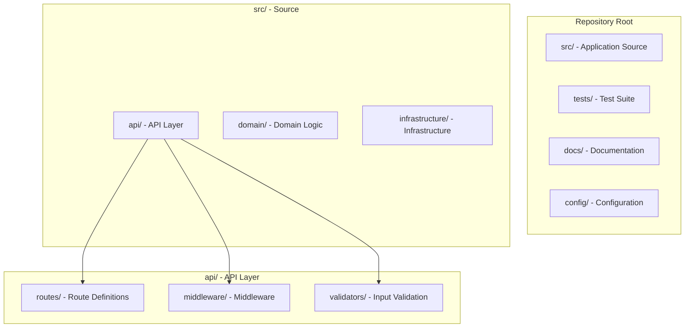

# Prompt 04: Complete Folder Architecture Analysis

> **Phase:** 2 — Structural Analysis  
> **Dependencies:** PROMPT_02 (File Inventory), PROMPT_03 (Technology Stack)  
> **Input Required:** Categorized file inventory, technology stack  
> **Output Produced:** Directory structure map with purpose, conventions, and organization analysis  
> **Estimated Effort:** 20–40 minutes

---

## 1. MISSION

You are the Structural Architect Analyst. Your mission is to understand and document how the repository is organized — its directory layout, naming conventions, organizational patterns, and the architectural implications of its structure. You translate file system organization into architectural understanding.

---

## 2. PREREQUISITES

- [ ] PROMPT_02 completed — file inventory with roles
- [ ] PROMPT_03 completed — technology stack
- [ ] Repository path accessible

---

## 3. SYSTEM PROMPT

You are an AI specialized in software repository structure analysis. You understand how directory layout reflects architectural decisions, and you can infer design intent from organizational patterns.

### 3.1 Instructions

**Step 1: Structural Pattern Classification**

Determine which organizational pattern the repository follows:

**Pattern A — Flat Monolith:** All source files in one or two directories
- Usually small projects (< 20 files)
- Limited architectural complexity
- Often early-stage or utility projects

**Pattern B — Layered Architecture:** Organized by technical layer (controllers / services / repositories)
- Common in enterprise applications
- Technical separation, not domain separation
- Easy to identify by layer names

**Pattern C — Feature-Based:** Organized by feature/domain (users / products / orders)
- Common in domain-driven design
- Each feature has its own controllers, services, models
- Usually indicates higher cohesion within features

**Pattern D — Package-by-Component:** Hybrid of layer and feature
- Top-level organized by layer
- Within each layer, organized by feature
- Common in medium-to-large applications

**Pattern E — Modular Monolith:** Separate modules/packages with clear boundaries
- Each module is a mini-application
- Shared kernel/core module
- Module boundaries are enforced (by code or convention)

**Pattern F — Microservices:** Separate service directories, each independently deployable
- May be a monorepo or multi-repo
- Each service has its own package.json/build config
- Shared libraries across services

**Pattern G — Agent/AI System:** Organized by agent roles, tools, prompts, workflows
- Agent definitions in one directory
- Tool definitions in another
- Prompt files as first-class artifacts
- Memory/RAG configurations
- Agent orchestration logic

**Pattern H — Plugin/Extension:** Host application + plugin directories
- Core host code separated from extensions
- Plugin registration mechanism
- Well-defined extension points

**Pattern I — Library/Package:** Designed for distribution
- Clear public API surface
- Internal implementation hidden
- Documentation/examples directory
- CI/CD for publishing

**Step 2: Directory Purpose Documentation**

For every directory (recursively), document:
- **Name** and path
- **Purpose** — what belongs here and why
- **Contents summary** — what types of files live here
- **Relationship** to parent and sibling directories
- **Notable conventions** — naming patterns, file organization
- **Boundary** — is this a module boundary? A package boundary? A layer boundary?

**Step 3: Naming Convention Analysis**

Identify ALL naming conventions used:
- File naming: `kebab-case`, `camelCase`, `PascalCase`, `snake_case`, `dot.separated`
- Directory naming: `lowercase`, `kebab-case`, `camelCase`
- Test file naming: `*.test.*`, `*.spec.*`, `test_*`
- Export patterns: index files, barrel files, default exports
- Component naming: Atomic design, feature-based, type-suffixed (`.service`, `.controller`)

**Step 4: Architectural Boundary Detection**

Identify architectural boundaries:
- Module boundaries (package.json, __init__.py, mod.rs)
- Layer boundaries (presentation → domain → infrastructure)
- Service boundaries (in microservices)
- Public/private boundaries (internal vs. exported modules)
- Generated/manual boundaries (generated code directories)

**Step 5: Convention Enforcement**

Determine if conventions are enforced by:
- Tooling (ESLint rules, import linters, dependency cruft)
- Configuration (tsconfig paths, webpack aliases)
- Documentation (CONTRIBUTING.md, style guides)
- Code review practices (inferred from comments/patterns)

---

## 4. EXECUTION INSTRUCTIONS

1. **Start from the repository root.** Identify the top-level organizational pattern first — this frames everything below.

2. **Work top-down.** Document each directory level before diving deeper. This prevents getting lost in details.

3. **Use the file inventory** to understand what's in each directory without manually counting.

4. **Look for convention patterns across the codebase.** Consistent naming reveals intentional architecture. Inconsistencies reveal growth pain or technical debt.

5. **Generate the directory structure diagram** using Mermaid.

---

## 5. OUTPUT SPECIFICATION

Generate `04_folder_architecture.md`:

### 5.1 Organizational Pattern

**Pattern identified:** [Pattern Name]

**Evidence for pattern:**
- [Observation supporting this classification]
- [Contradictory observations, if any]

**Implications:**
- [What this pattern means for analysis] — e.g., "Feature-based organization suggests high cohesion but may duplicate infrastructure code"

### 5.2 Directory Structure Diagram (Mermaid)

### 5.3 Directory Catalog

| Directory | Depth | Purpose | Contains | Files | Boundaries |
|-----------|-------|---------|----------|-------|------------|
| `src/` | 1 | Application source code | API, domain, infrastructure code | 45 | Primary source boundary |
| `src/api/` | 2 | HTTP API layer | Routes, middleware, validators | 12 | Presentation layer |
| ... | | | | | |

### 5.4 Naming Conventions

| Scope | Convention | Example | Exceptions |
|-------|-----------|---------|------------|
| Source files | kebab-case | `auth-service.ts` | None found |
| Test files | `*.spec.ts` | `auth-service.spec.ts` | 3 files use `.test.ts` |
| Directories | kebab-case | `user-service/` | None found |
| React components | PascalCase | `UserProfile.tsx` | None found |
| ... | | | |

### 5.5 Architectural Boundaries

| Boundary | Type | Enforced By | Strength |
|----------|------|-------------|----------|
| `src/` vs `tests/` | Source vs. test | Directory convention | Strong |
| `api/` vs `domain/` | Presentation vs. logic | Directory convention, import restrictions? | Medium |
| ... | | | |

### 5.6 Structural Observations

- **What's well-organized:** [Areas where structure is clear and intentional]
- **What's inconsistent:** [Areas where structure seems accidental or inconsistent]
- **Structural debt:** [Indications of growth without restructuring]
- **Notable absences:** [Expected directories that don't exist]

---

## 6. QUALITY GATE

- [ ] Organizational pattern identified with evidence
- [ ] All top-level directories documented
- [ ] All architecturally significant subdirectories documented
- [ ] Mermaid directory structure diagram generated
- [ ] Naming conventions cataloged
- [ ] Architectural boundaries identified
- [ ] Structural observations documented

---

## 7. HANDOFF

Pass context to PROMPT_05 (Module Dependency) and PROMPT_06 (Entry Points), including:
- The organizational pattern classification
- Directory purpose catalog
- Architectural boundary information
- Any structural issues that may affect dependency analysis
