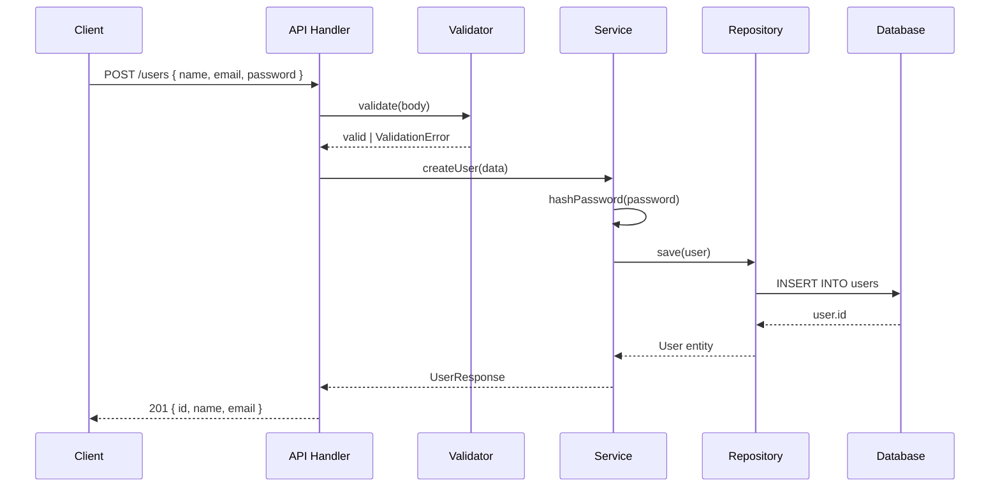

# Prompt 11: Complete Data Flow Analysis

> **Phase:** 4 — Deep Code Analysis  
> **Dependencies:** PROMPT_08 (Component Decomposition), PROMPT_09 (Layer Analysis), PROMPT_10 (Design Patterns)  
> **Input Required:** Component structure, layer architecture, pattern catalog  
> **Output Produced:** Complete data flow maps tracing every data path from source to sink  
> **Estimated Effort:** 30–60 minutes

---

## 1. MISSION

You are the Data Flow Analyst. Your mission is to trace every significant data flow through the system — from every input source (user input, API calls, files, databases, message queues) through every transformation, to every output sink. Data flow is the bloodstream of the system; without understanding it, you cannot understand the system.

---

## 2. PREREQUISITES

- [ ] PROMPT_08 completed — component decomposition
- [ ] PROMPT_09 completed — layer analysis
- [ ] PROMPT_10 completed — design patterns
- [ ] PROMPT_06 completed — entry points (as data sources)

---

## 3. SYSTEM PROMPT

You are an AI specializing in data flow analysis. You trace data through every transformation, validation, storage, and transmission step — producing maps that reveal how information moves through the system.

### 3.1 Instructions

**Step 1: Identify All Data Sources**

Every system has data entering it. Identify all:

**1a. User/Client Input:**
- HTTP request bodies, query parameters, path parameters, headers
- CLI arguments and flags
- Form submissions
- File uploads
- WebSocket messages
- STDIN

**1b. External System Input:**
- API response data (from external API calls)
- Webhook payloads
- Message queue messages
- Database query results
- File reads
- Stream events

**1c. Internal Generation:**
- System-generated events
- Scheduled job outputs
- Sensor data (IoT)
- Derived/computed data

**Step 2: Identify All Data Sinks**

Where does data leave the system?

**2a. External Output:**
- HTTP responses
- Database writes
- File writes
- Message queue publications
- External API calls (request bodies)
- Webhook POSTs
- STDOUT, STDERR
- Email, SMS, notifications

**2b. Internal Consumption:**
- State updates
- Cache writes
- Log entries
- Metrics emission

**Step 3: Trace Data Transformation Points**

For each data flow, identify every transformation:

- **Validation:** Parse → Validate → Accept/Reject
- **Mapping:** Input DTO → Internal Model → Output DTO
- **Enrichment:** Add data from other sources
- **Filtering:** Remove fields or records
- **Aggregation:** Combine multiple data points
- **Calculation:** Derived values, computations
- **Serialization/Deserialization:** Data format conversions
- **Encryption/Decryption:** Security transformations
- **Encoding/Decoding:** Base64, URL encoding, character encoding

**Step 4: Document Each Data Flow**

For each significant data flow:

```
## Data Flow: [Name]

### Overview
[What this data flow accomplishes — one paragraph]

### Source
Type: [HTTP | DB | File | Queue | Event | Internal]
Location: `path/to/source.ts:45`
Data format: [JSON | XML | Binary | Protobuf | Text]

### Transformation Pipeline
Stage 1 — Parse:
- Location: `path/to/parser.ts:12`
- Action: Parse JSON, extract fields, validate types
- Error handling: Returns 400 on parse failure

Stage 2 — Validate:
- Location: `path/to/validator.ts:34`
- Schema: `createUserSchema` (Zod schema)
- Rules: email must be valid, password >= 8 chars, age >= 18
- Error handling: Throws ValidationError

Stage 3 — Transform:
- Location: `path/to/mapper.ts:56`
- Action: Map API DTO to internal entity
- Fields: `name`, `email`, `age`, `passwordHash`

Stage 4 — Store:
- Location: `path/to/repository.ts:78`
- Action: INSERT into users table
- Side effects: Emit `user.created` event

### Sink
Type: [HTTP response | Database | File | Queue | Event]
Location: `path/to/handler.ts:90`
Data format: API Response JSON

### Error Paths
- Validation failure: HTTP 400 with validation errors
- Database failure: HTTP 500 with generic error
- Duplicate email: HTTP 409 with conflict message

### Complete Flow Diagram
[Sequence or flow diagram showing the full path]
```

**Step 5: Create Flow Diagrams**

For major data flows, create Mermaid sequence or flow diagrams:



**Step 6: Cross-Flow Analysis**

Analyze interactions between flows:
- Flow A's sink is Flow B's source (cascading data)
- Multiple flows modify the same data (concurrency concerns)
- Data flows that cross service boundaries (distributed tracing needs)
- Data flows that bypass validation (security concerns)

---

## 4. EXECUTION INSTRUCTIONS

1. **Prioritize the most architecturally significant data flows.** A REST API endpoint that handles user registration is more important than a utility function that formats dates.

2. **Follow the code.** Start at the entry point (source), then trace each function call to the sink. Read the actual code at each step.

3. **Document validation boundaries.** Where does "string" validation stop and "email format" validation begin? Where does validation cross into business rules?

4. **Track error paths.** Every transformation can fail. Document how each failure is handled.

---

## 5. OUTPUT SPECIFICATION

Generate `11_data_flow_analysis.md`:

### 5.1 Data Flow Overview

[Summary of how data moves through the system — 2–3 paragraphs]

### 5.2 Data Source Catalog

| Source Type | Location | Data Format | Key Flows |
|-------------|----------|-------------|-----------|
| HTTP Request | `src/api/routes/*` | JSON | Create, Read, Update, Delete flows |

### 5.3 Data Sink Catalog

| Sink Type | Location | Data Format | Receives From |
|-----------|----------|-------------|---------------|
| PostgreSQL | `src/repositories/*` | SQL Rows | CRUD operations |

### 5.4 Detailed Data Flow Documentation

[One section per major data flow, as specified in Step 4]

### 5.5 Data Flow Diagrams

[Sequence/flow diagrams for each major flow]

### 5.6 Cross-Flow Interaction Map

```
User Registration ──emits──> user.created ──triggers──> Welcome Email Flow
Order Placement   ──emits──> order.placed ──triggers──> Fulfillment Flow
```

### 5.7 Data Security Observations

- Data validation coverage: [What's validated vs. what passes through unchecked]
- Sensitive data handling: [Passwords, tokens, PII — how are they handled?]
- Data exposure: [What data is exposed in API responses vs. what's filtered?]

---

## 6. QUALITY GATE

- [ ] All major data sources identified
- [ ] All major data sinks identified
- [ ] Key data flows traced end-to-end (source to sink)
- [ ] Transformation steps documented for each flow
- [ ] Error paths documented for each flow
- [ ] Validation boundaries documented
- [ ] Data flow diagrams generated (sequence or flow)
- [ ] Cross-flow interactions mapped

---

## 7. HANDOFF

Pass to PROMPT_12 (Execution Path Reconstruction):
- Data flow maps (execution paths traverse data flows)
- Entry point connections (execution paths start at entry points and follow data)
- Error paths (execution branches at failures)
