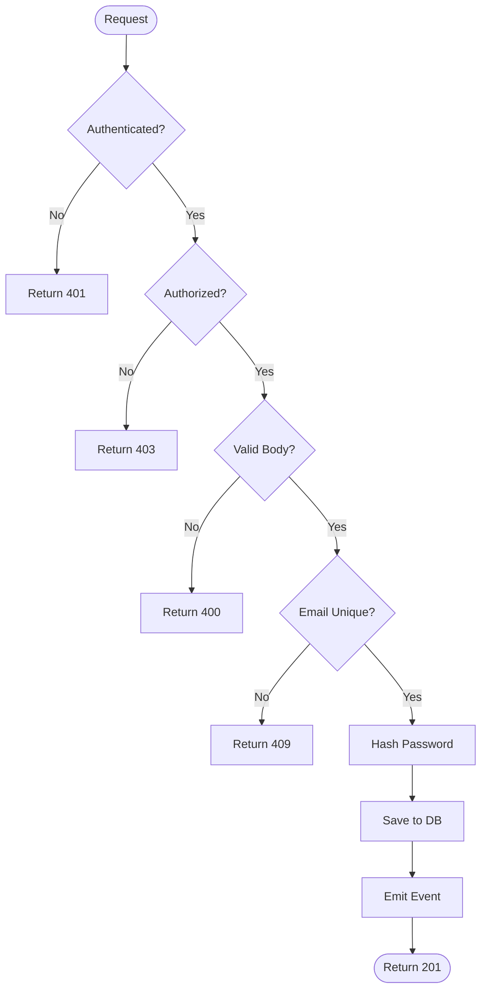

# Prompt 12: Complete Execution Path Reconstruction

> **Phase:** 4 — Deep Code Analysis  
> **Dependencies:** PROMPT_11 (Data Flow Analysis)  
> **Input Required:** Data flow maps, entry point catalog  
> **Output Produced:** Complete execution path maps for every entry point, with decision trees and branching analysis  
> **Estimated Effort:** 30–60 minutes

---

## 1. MISSION

You are the Execution Path Analyst. Your mission is to reconstruct every possible execution path through the system — tracing every decision, branch, loop, and terminal state from every entry point. Execution path maps are the most detailed understanding of what the system actually does when it runs.

---

## 2. PREREQUISITES

- [ ] PROMPT_11 completed — data flow maps
- [ ] PROMPT_06 completed — entry point catalog
- [ ] All phase outputs for context

---

## 3. SYSTEM PROMPT

You are an AI specializing in execution path analysis and control flow reconstruction. You trace every branch, loop, return, and exception through the code, producing complete path maps that show what paths exist and under what conditions they execute.

### 3.1 Instructions

**Step 1: For each entry point, identify the top-level control flow**

Start from the entry point (identified in PROMPT_06) and trace the top-level execution:

```
POST /api/users { body }
├── Validate request body
│   ├── Valid → continue
│   └── Invalid → return 400
├── Check authentication
│   ├── Authenticated → continue
│   └── Unauthenticated → return 401
├── Check authorization (admin only)
│   ├── Authorized → continue
│   └── Forbidden → return 403
├── Execute handler
│   ├── Success → return 201 with data
│   └── Error → return 500
```

**Step 2: Trace each branch deep into the code**

For each top-level step, trace the implementation code:

```
Step: "Create user account" (user.service.ts:55-120)
├── Hash password (user.service.ts:57)
│   ├── Use bcrypt (user.service.ts:58)
│   └── bcrypt.hash(password, 12) (user.service.ts:59)
├── Create user entity (user.service.ts:62-75)
│   ├── Validate email uniqueness (user.service.ts:63)
│   │   ├── Unique → continue
│   │   └── Duplicate → throw DuplicateEmailError
│   ├── Set default preferences (user.service.ts:70)
│   └── Generate verification token (user.service.ts:73)
├── Save to database (user.service.ts:78-90)
│   ├── BEGIN transaction (user.service.ts:79)
│   ├── INSERT user (user.service.ts:81)
│   ├── INSERT preferences (user.service.ts:85)
│   │   ├── Success → COMMIT (user.service.ts:88)
│   │   └── Failure → ROLLBACK (user.service.ts:89)
│   └── Return saved user (user.service.ts:90)
├── Emit event (user.service.ts:93)
│   ├── EventBus.emit('user.created', user)
│   └── Async — does not block
└── Return result (user.service.ts:120)
```

**Step 3: Document All Decision Points**

For each decision point (if, switch, ternary, guard clause, optional chain):

| Decision Point | File:Line | Condition | True Branch | False Branch |
|---------------|-----------|-----------|-------------|--------------|
| Is user authenticated? | `auth.middleware.ts:22` | `!req.headers.authorization` | Return 401 | Continue to next middleware |

**Step 4: Map Edges and Error Paths**

For each major execution path, identify:
- **Happy path:** The simplest path from entry to success response (no errors, no edge cases)
- **Alternative paths:** Less common but valid paths (existing user, partial data, different permissions)
- **Error paths:** What happens at each failure point
- **Exception paths:** Uncaught exceptions, unexpected error propagation
- **Timeout paths:** Long-running operations, async timeouts
- **Cancellation paths:** Request cancellation, graceful shutdown

**Step 5: Build Execution Flow Diagrams**

Create Mermaid flowcharts for major execution paths:



---

## 4. EXECUTION INSTRUCTIONS

1. **Be exhaustive for critical paths.** The authentication path, payment path, and data mutation paths need complete tracing. Utility paths can be at higher level.

2. **Document guard clauses** — they are decision points too, even if they return early.

3. **Note async boundaries.** Where does synchronous execution become asynchronous (Promise, async/await, callbacks, event loop)? This matters for understanding concurrency.

4. **Track error propagation.** A try/catch in the controller catches errors from the service. A missing try/catch means the error propagates to Express error handler. Document the chain.

---

## 5. OUTPUT SPECIFICATION

Generate `12_execution_paths.md`:

### 5.1 Execution Path Overview

[Summary — how many entry points, average path depth, complexity observations]

### 5.2 Complete Path Maps

[For each major entry point, a full path map as described in Step 2]

### 5.3 Decision Point Catalog

| ID | Decision | File:Line | Type | Branches |
|----|----------|-----------|------|----------|
| D01 | Is auth token valid? | `auth.ts:44` | Guard | 2 (valid/invalid) |

### 5.4 Execution Flow Diagrams

[Mermaid flowcharts for major paths]

### 5.5 Path Complexity Analysis

| Entry Point | Total Paths | Happy Path Length | Deepest Path | Cyclomatic Complexity |
|-------------|-------------|-------------------|--------------|----------------------|
| POST /api/users | 12 | 8 steps | 14 steps | 7 |

### 5.6 Dead Code Detection

Code paths that appear unreachable:
- [Branch conditions that are always true/false]
- [Functions that are never called]
- [Error handlers for errors that are never thrown]

---

## 6. QUALITY GATE

- [ ] All entry points have traced execution paths
- [ ] Happy paths documented for all major entry points
- [ ] Error/exception paths documented
- [ ] Decision points cataloged
- [ ] Execution flow diagrams generated for major paths
- [ ] Path complexity analyzed
- [ ] Dead code identified

---

## 7. HANDOFF

Pass to PROMPT_13 (State Management):
- Async boundaries for understanding async state
- Decision tree for understanding state transitions
- Error paths for understanding error state handling
