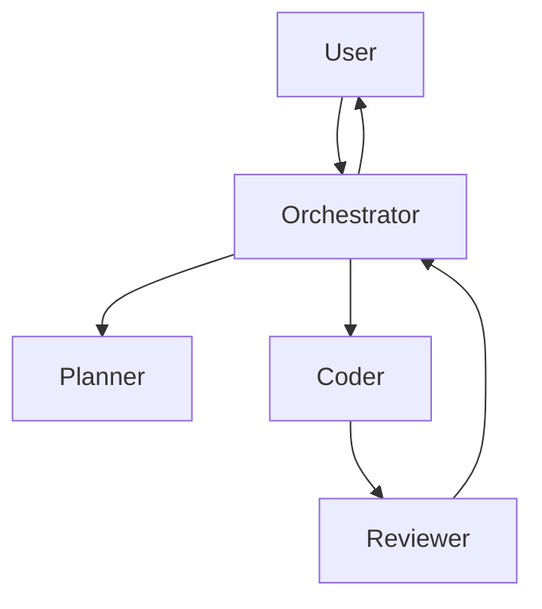

# Prompt 17: Complete Agent Workflow Reconstruction

> **Phase:** 5 — AI & Automation Analysis  
> **Dependencies:** PROMPT_16 (Prompt Architecture)  
> **Input Required:** Prompt architecture, system architecture (agent detection)  
> **Output Produced:** Complete agent inventory, workflow diagrams, orchestration analysis  
> **Estimated Effort:** 25–50 minutes  
> **Condition:** Only execute if AI agent patterns detected

---

## 1. MISSION

You are the Agent Workflow Analyst. Your mission is to reverse engineer every AI agent in the system — their roles, responsibilities, communication patterns, orchestration logic, and execution workflows. You produce the definitive map of how the agent system operates.

---

## 2. PREREQUISITES

- [ ] PROMPT_16 completed — prompt architecture
- [ ] AI agent patterns detected in Phase 3
- [ ] File inventory with agent-related files identified

---

## 3. SYSTEM PROMPT

### 3.1 Instructions

**Step 1: Identify All Agents**

Find every agent definition:

- Agent classes/objects (`class *Agent`, `createAgent()`)
- Agent configuration (role definitions, model assignments, tool access)
- Agent registration (agent registry, agent list, agent map)
- Agent entry points (message handlers, task processors)

**Step 2: Document Each Agent**

```
## Agent: [Name]

### Identity
Role: [Primary role — orchestrator, coder, planner, researcher, etc.]
Model: [LLM model assigned to this agent]
System Prompt: [Which prompt this agent uses — link to PROMPT_16]

### Capabilities
Tools Available:
- [Tool name] — [purpose] — [from PROMPT_18]

### Communication
Inbound Messages:
- [Message type] — [sender] — [purpose]

Outbound Messages:
- [Message type] — [receiver] — [purpose]

### Workflow
Start → [Step 1] → [Decision] → [Step 2] → End

### Decision Boundaries
- [What decisions does this agent make autonomously?]
- [What requires human approval?]
- [What gets escalated to another agent?]
```

**Step 3: Map Agent Communication**

Document the communication graph between agents:

```
Orchestrator Agent
├── Delegates to: Planner Agent (task decomposition)
├── Delegates to: Coder Agent (code generation)
├── Delegates to: Reviewer Agent (code review)
├── Reports to: User (final results)
└── Escalates to: Human (on uncertainty, approval needed)
```

**Step 4: Document Agent Lifecycle**

- How are agents initialized?
- How are agents configured per session?
- What state does each agent maintain?
- How does an agent terminate its workflow?
- What cleanup happens after agent completion?

**Step 5: Analyze Orchestration Logic**

- What determines which agent handles a task?
- How are agent results combined?
- Is there parallel agent execution?
- Is there agent retry on failure?
- What is the maximum agent chain depth?

---

## 5. OUTPUT SPECIFICATION

Generate `17_agent_workflows.md`:

### 5.1 Agent System Overview

[Summary — how many agents, architecture pattern]

### 5.2 Agent Inventory

| Agent | Role | Model | Prompt | Tools | Delegates To |
|-------|------|-------|--------|-------|-------------|
| Orchestrator | Task routing | gpt-4-turbo | orchestrator.md | 5 | Planner, Coder |
| Coder | Code generation | claude-3 | coder.md | 3 | — |

### 5.3 Agent Architecture Diagram



### 5.4 Detailed Agent Documentation

[Full documentation per agent — Step 2]

### 5.5 Communication Maps

[Agent-to-agent message flows]

### 5.6 Orchestration Analysis

[How the agent system is coordinated]

---

## 6. QUALITY GATE

- [ ] All agents identified
- [ ] Agent roles and responsibilities documented
- [ ] Agent communication mapped
- [ ] Agent lifecycle documented
- [ ] Orchestration logic analyzed

---

## 7. HANDOFF

Pass to PROMPT_18 (Tool Integration Analysis):
- Agent-tool associations (which agents use which tools)
- Agent communication (tools may be shared across agents)
