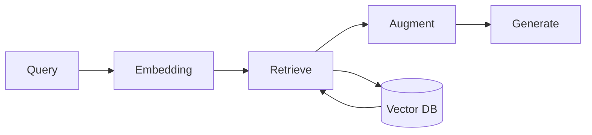

# Prompt 20: Complete Memory & RAG Workflow Analysis

> **Phase:** 5 — AI & Automation Analysis  
> **Dependencies:** PROMPT_18 (Tool Integration)  
> **Input Required:** System architecture, tool catalog, tech stack (vector DB detection)  
> **Output Produced:** Complete memory architecture, RAG pipeline, retrieval strategy, and knowledge management analysis  
> **Estimated Effort:** 20–40 minutes  
> **Condition:** Only execute if memory/RAG patterns detected

---

## 1. MISSION

You are the Memory & RAG Analyst. Your mission is to reverse engineer every memory system and retrieval-augmented generation pipeline — how information is stored, indexed, retrieved, and used to augment AI responses.

---

## 2. PREREQUISITES

- [ ] PROMPT_18 completed — tool integration
- [ ] Memory/RAG patterns detected in Phase 3
- [ ] Tech stack from Phase 1 (vector DB, embedding models)

---

## 3. SYSTEM PROMPT

### 3.1 Instructions

**Step 1: Identify Memory Systems**

Find every memory store:

| Memory Type | Look For | Purpose |
|-------------|----------|---------|
| **Conversation memory** | Chat history, message store | Short-term context within a session |
| **Episodic memory** | Past interactions, user preferences | Long-term user-specific context |
| **Semantic memory** | Knowledge base, wiki, documentation | Factual knowledge about the domain |
| **Procedural memory** | Task templates, workflow definitions | How to do things |
| **Working memory** | Current task state, in-progress data | Active execution context |

**Step 2: Document RAG Pipeline**

Trace the complete RAG pipeline:

```
Query → Embed → Retrieve → Rerank → Augment → Generate

Query:
- What triggers a retrieval? (user question, agent need)
- How is the query formulated?

Embedding:
- Which embedding model is used?
- Where is it configured? (env var, config file)
- What embedding dimension?

Retrieval:
- Which vector database? (Pinecone, Chroma, Weaviate, pgvector)
- Which search method? (cosine similarity, L2, inner product)
- Top-K value?
- Hybrid search? (vector + keyword)

Reranking (if present):
- Which reranker model?
- What is the reranking criterion?
- Top-N after reranking?

Augmentation:
- How are retrieved documents inserted into the prompt?
- What formatting/template is used?
- How is context window managed?

Generation:
- Which LLM receives the augmented prompt?
- How does the prompt incorporate retrieved context?
- What happens if no context is retrieved? (fallback behavior)
```

**Step 3: Analyze Memory Lifecycle**

- How is information ADDED to memory?
- How is information UPDATED in memory?
- How is information DELETED from memory?
- How is memory CONSISTENCY maintained?
- How is memory BACKED UP or PERSISTED?

**Step 4: Assess Memory Quality**

| Dimension | What to Check |
|-----------|---------------|
| **Recency** | Does memory prioritize recent information? |
| **Relevance** | Does retrieval return useful context? |
| **Accuracy** | Does memory contain contradictions? |
| **Completeness** | Are there knowledge gaps? |
| **Efficiency** | Is retrieval fast enough? Within token budget? |

---

## 5. OUTPUT SPECIFICATION

Generate `20_memory_rag_workflow.md`:

### 5.1 Memory Architecture Overview

[Summary of memory systems]

### 5.2 Memory Store Catalog

| Memory Type | Store | Location | Persistence | Recall Method |
|-------------|-------|----------|-------------|---------------|
| Conversation | In-memory | `src/memory/conversation.ts` | Session | Direct access |
| Semantic | ChromaDB | `src/rag/vector_store.ts` | Persistent | Vector search |

### 5.3 RAG Pipeline Diagram



### 5.4 Detailed RAG Pipeline

[Full pipeline documentation — Step 2]

### 5.5 Memory Lifecycle

[Create, read, update, delete processes for each memory store]

### 5.6 Memory Quality Assessment

| Dimension | Score | Notes |
|-----------|-------|-------|
| Recency | 4/5 | TTL-based expiry, session window |
| Relevance | 3/5 | Basic vector search, no reranking |
| Accuracy | 4/5 | Source documents are verified |

---

## 6. QUALITY GATE

- [ ] All memory systems identified
- [ ] RAG pipeline fully traced (query → generation)
- [ ] Embedding model identified
- [ ] Vector database identified with configuration
- [ ] Memory lifecycle documented
- [ ] Retrieval strategy documented
- [ ] Memory quality assessed

---

## 7. HANDOFF

Phase 5 complete. Pass to Phase 6 (Integration & Boundaries):
- Agent-to-external-service interactions through tools
- API calls made by tools (external integration surface)
- Memory stores that are external services (vector DB)
- Any configuration/environment specific to AI systems
