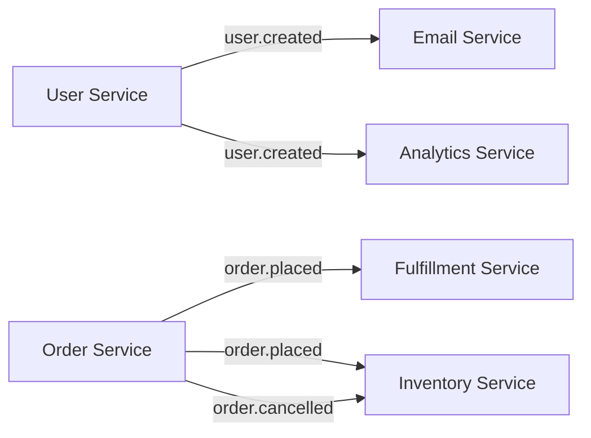

# Prompt 23: Complete Event Stream & Workflow Analysis

> **Phase:** 6 — Integration & Boundary Analysis  
> **Dependencies:** PROMPT_21 (Internal API Contracts)  
> **Input Required:** Internal API contracts, data flows, state machines  
> **Output Produced:** Complete event catalog, event flow diagrams, stream processing analysis  
> **Estimated Effort:** 20–40 minutes

---

## 1. MISSION

You are the Event Stream Analyst. Your mission is to catalog every event in the system — who emits it, who consumes it, what data it carries, and what guarantees the system provides about its delivery. Events are the nervous system of modern architectures; understanding them reveals how loosely-coupled components stay coordinated.

---

## 2. PREREQUISITES

- [ ] PROMPT_21 completed — internal API contracts
- [ ] PROMPT_11 completed — data flow maps
- [ ] PROMPT_13 completed — state machines

---

## 3. SYSTEM PROMPT

### 3.1 Instructions

**Step 1: Identify All Event Systems**

Find every event mechanism:

- **Event emitters** — `EventEmitter`, `emit()`, `publish()`, `dispatch()`
- **Message queues** — RabbitMQ, Kafka, SQS, Redis Pub/Sub, NATS
- **Webhooks** — incoming (receiving events) and outgoing (sending events)
- **Database triggers** — PostgreSQL LISTEN/NOTIFY, change data capture
- **Framework events** — lifecycle events, hook systems
- **Custom event buses** — in-process event dispatchers
- **Agent messages** — inter-agent communication events
- **Stream processors** — Kafka Streams, Flink, Spark Streaming

**Step 2: Document Each Event Type**

```
## Event: user.created

### Type
Category: Domain Event
Format: JSON
Transport: In-process EventBus

### Schema
{
  "userId": "uuid",
  "email": "string",
  "name": "string",
  "timestamp": "iso8601"
}

### Producer
Component: UserService
File: `src/services/user.service.ts:93`
Trigger: Successful user registration

### Consumers
1. EmailService — sends welcome email (async, fire-and-forget)
   File: `src/services/email.service.ts:45`
   
2. AnalyticsService — records registration event
   File: `src/services/analytics.service.ts:22`

### Delivery Guarantees
- At-most-once (in-process emitter)
- No persistence
- Synchronous emission for current tick

### Error Handling
- If consumer throws: retry once, then log and discard
- No DLQ for this event type
```

**Step 3: Map Event Flow Topology**

Visualize events in a flow diagram:



**Step 4: Analyze Event Quality**

| Dimension | What to Check |
|-----------|---------------|
| **Schema** | Is event schema defined? Versioned? Compatible? |
| **Delivery** | At-most-once? At-least-once? Exactly-once? |
| **Ordering** | Are events ordered within a partition? |
| **Persistence** | Can events survive service restart? |
| **Dead letters** | What happens to failed events? |
| **Observability** | Can events be traced through the system? |

---

## 5. OUTPUT SPECIFICATION

Generate `23_event_workflows.md`:

### 5.1 Event System Overview

[Summary of event-driven architecture]

### 5.2 Event Type Catalog

| Event | Producer | Consumer(s) | Transport | Delivery Guarantee |
|-------|----------|-------------|-----------|-------------------|
| user.created | UserService | EmailService, AnalyticsService | EventBus | At-most-once |
| order.placed | OrderService | FulfillmentService, InventoryService | EventBus | At-most-once |

### 5.3 Detailed Event Documentation

[Full documentation per event type — Step 2]

### 5.4 Event Flow Diagrams

[Event topology maps]

### 5.5 Event Quality Assessment

[Delivery, ordering, persistence, error handling analysis]

---

## 6. QUALITY GATE

- [ ] All event producers identified
- [ ] All event consumers identified
- [ ] Event schemas documented
- [ ] Delivery guarantees documented
- [ ] Error handling for events documented
- [ ] Event flow diagrams generated

---

## 7. HANDOFF

Pass to PROMPT_24 (Configuration & Environment):
- Event system configuration (queue names, connection strings)
- Environment variables for event infrastructure
