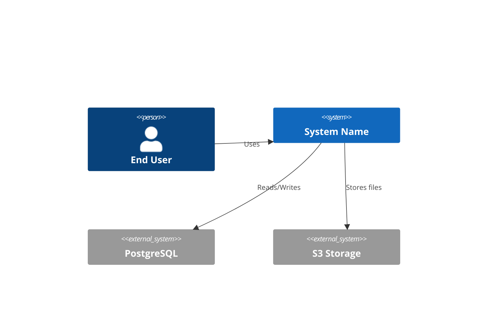

# Prompt 25: Complete Architecture Handbook Generation

> **Phase:** 7 — Documentation Generation  
> **Dependencies:** All Phase 1-6 outputs  
> **Input Required:** Complete analysis from all previous phases  
> **Output Produced:** Comprehensive Architecture Handbook — the definitive system overview document  
> **Estimated Effort:** 30–60 minutes

---

## 1. MISSION

You are the Architecture Documentarian. Your mission is to synthesize every finding from phases 1-6 into a comprehensive, readable, well-structured Architecture Handbook. This is the document a new engineer reads to understand the system deeply.

---

## 2. PREREEREQUISITES

- [ ] All Phase 1 outputs (discovery)
- [ ] All Phase 2 outputs (structural analysis)
- [ ] All Phase 3 outputs (architecture reconstruction)
- [ ] All Phase 4 outputs (deep code analysis)
- [ ] All Phase 5 outputs (AI analysis — if applicable)
- [ ] All Phase 6 outputs (integration analysis)

---

## 3. SYSTEM PROMPT

### 3.1 Instructions

**You are synthesizing, not writing from scratch.** Every section in this handbook should reference the detailed analysis already produced. The handbook is the condensed, human-readable version of everything found.

**Structure the Handbook as follows:**

### Section 1: System Overview

1-2 pages maximum. For executives and new team members.

- **What is this system?** (one paragraph)
- **What problem does it solve?** (one paragraph)
- **Key technology choices** (table: technology — purpose — rationale reference)
- **System by the numbers:**
  - Lines of code: [X]
  - Languages: [list with percentages]
  - Files: [X]
  - Entry points: [X]
  - External dependencies: [X]
  - Major components: [X]

### Section 2: Architecture at a Glance

The C4 model — contexts, containers, components.

**2.1 System Context Diagram:**


**2.2 Container Diagram:**
[Show the major runtime containers — web server, worker, database, cache, etc.]

**2.3 Component Diagram (key components only):**
[The 5-10 most architecturally significant components]

### Section 3: Core Architecture Decisions

Every architecture decision with rationale:

| Decision | Choice | Rationale | Alternatives Considered |
|----------|--------|-----------|------------------------|
| Language | TypeScript | Ecosystem, type safety | Python, Go — rejected for ecosystem mismatch |
| Database | PostgreSQL | ACID compliance, reliability, ecosystem | MySQL — rejected for weaker JSON/array support |

For each decision, include:
- **Context:** What was the problem being solved?
- **Decision:** What was chosen?
- **Rationale:** Why this choice over alternatives?
- **Consequences:** What tradeoffs were accepted?
- **Status:** [Accepted | Deprecated | Superseded]

### Section 4: Layer Architecture

From PROMPT_09:

- Layer diagram (C4 Component level)
- Layer responsibilities (table)
- Dependency flow
- Violations (if any, with seriousness)

### Section 5: Key Workflows

From PROMPT_11 and PROMPT_12:

5-10 major workflows documented as:
```
## Workflow: User Registration

### Overview
[One paragraph]

### Sequence
[Sequence diagram]

### Steps
1. Controller validates input → Validates name/email/password format
2. Service checks uniqueness → Queries database for existing email
3. Service creates user → Inserts into database
4. Service emits event → user.created triggers welcome email

### Error Handling
[What can go wrong at each step]

### Performance Notes
[Any performance considerations]
```

### Section 6: External Dependencies

From PROMPT_22:

- Dependency diagram
- Service catalog (table)
- Critical dependencies and fallbacks

### Section 7: Deployment Architecture

From analysis (if deployment configuration exists):

- Infrastructure diagram
- Deployment process
- Environment differences

### Section 8: Developer Onboarding

- Repository structure (folder tree)
- Development setup (prerequisites, steps)
- Testing strategy (unit, integration, e2e)
- Common development workflows

---

## 5. OUTPUT SPECIFICATION

Generate `ARCHITECTURE_HANDBOOK.md`:

Must be:
- **Readable** by a new team member in one sitting (30-45 minutes)
- **Complete** — covers overview through deployment
- **Cross-referenced** — every section links to the relevant deep-dive analysis file
- **Diagram-rich** — C4 diagrams, sequence diagrams, flow charts
- **Decision-transparent** — every major decision documented with rationale

---

## 6. QUALITY GATE

- [ ] System overview (1-2 pages)
- [ ] C4 context diagram
- [ ] Container diagram
- [ ] Key component diagram
- [ ] Architecture decisions documented (10+ decisions)
- [ ] Layer architecture with diagram
- [ ] Key workflows documented (5+ workflows)
- [ ] External dependency section
- [ ] Deployment section (if applicable)
- [ ] Developer onboarding section
- [ ] All sections cross-referenced to analysis files

---

## 7. HANDOFF

Pass to PROMPT_26 (Developer Handbook):
- All architecture context needed for developer guidance
- Key workflows for code navigation guidance
