# DIAGRAM GUIDE

## FRAMEWORK: Enterprise Reverse Engineering Prompt Framework
## PURPOSE: Standard for all diagram generation in reverse engineering outputs

---

## 1. DIAGRAM REQUIREMENTS

Generate a diagram for any subsystem/flow when:

- A component has >5 children or subcomponents
- A flow has >5 sequential steps
- A state machine has >3 states
- The architecture has >3 layers
- A call graph involves >5 distinct functions
- Any process benefits from visual representation

## 2. DIAGRAM FORMAT

**All diagrams MUST use Mermaid syntax as the primary format.**

Mermaid is supported by GitHub, GitLab, Notion, Obsidian, and most Markdown renderers.

**UML diagrams** must also use Mermaid where the UML diagram type maps to a Mermaid type (classDiagram, sequenceDiagram, stateDiagram-v2, etc.). For UML types not supported by Mermaid (use case diagrams, activity diagrams, deployment diagrams, package diagrams), use PlantUML syntax or structured text descriptions with clear node/edge lists.

## 3. DIAGRAM TYPES

### 3.1 Architecture Diagrams

Used for: system architecture, component relationships, layer visualization

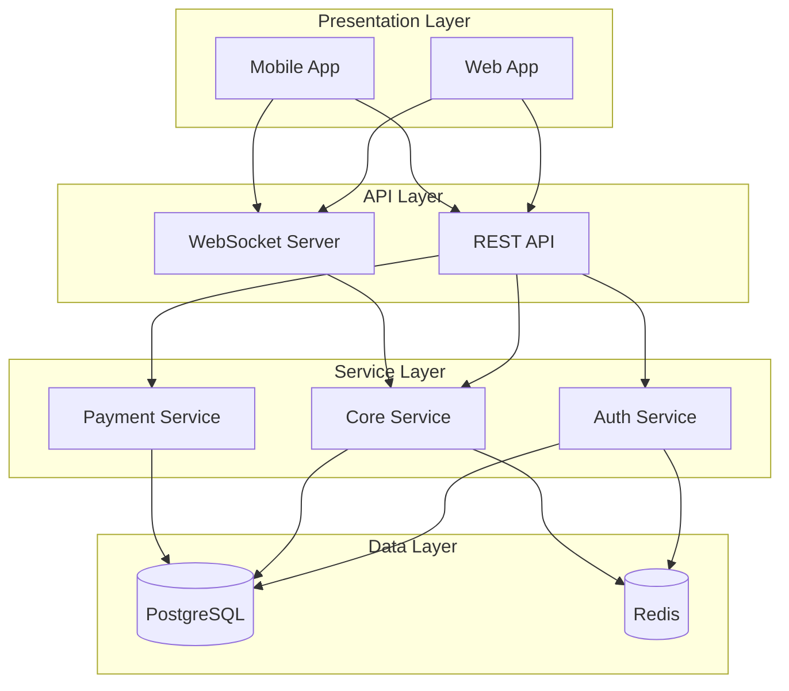

### 3.2 Data Flow Diagrams

Used for: end-to-end data flows, request/response cycles, ETL pipelines

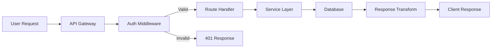

### 3.3 Sequence Diagrams

Used for: interaction flows, API call sequences, multi-service workflows

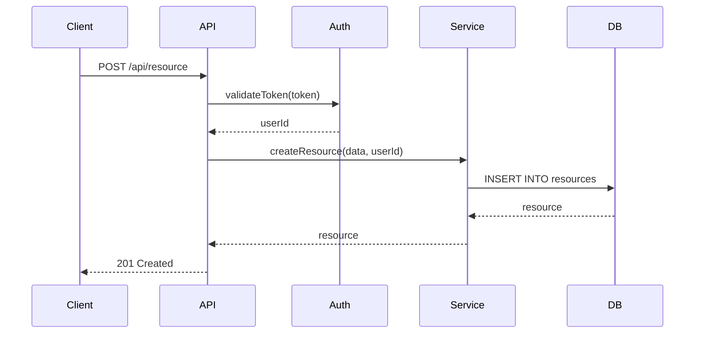

### 3.4 State Machine Diagrams

Used for: state machines, workflow states, lifecycle management

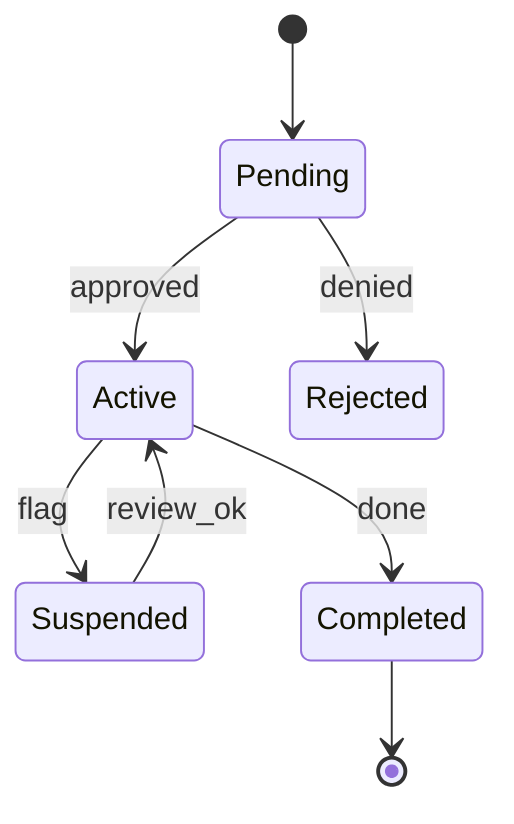

### 3.5 Component/Module Diagrams

Used for: module dependency visualization, package structure

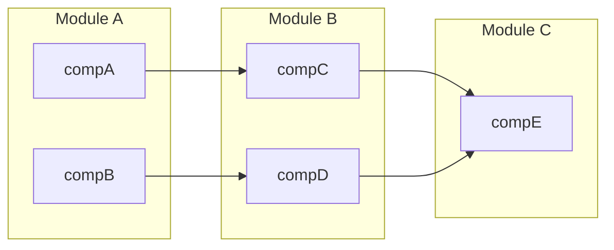

### 3.6 Call Graph Diagrams

Used for: function call chains, execution paths, entry point analysis

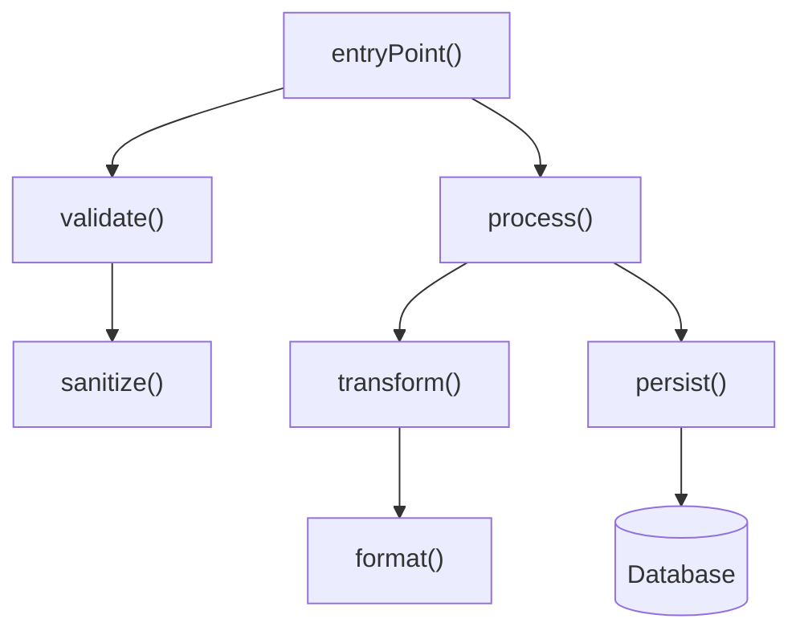

### 3.7 Class Hierarchy Diagrams

Used for: inheritance trees, interface implementations, class relationships

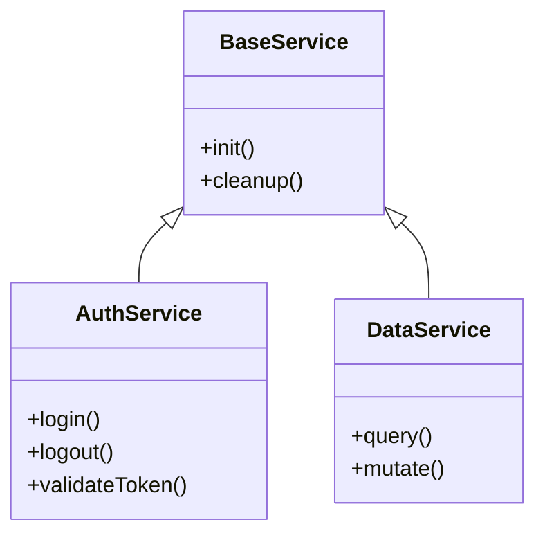

### 3.8 Deployment Diagrams (Mermaid Graph — UML-like)

Used for: deployment topology, physical nodes, runtime environments, infrastructure layout

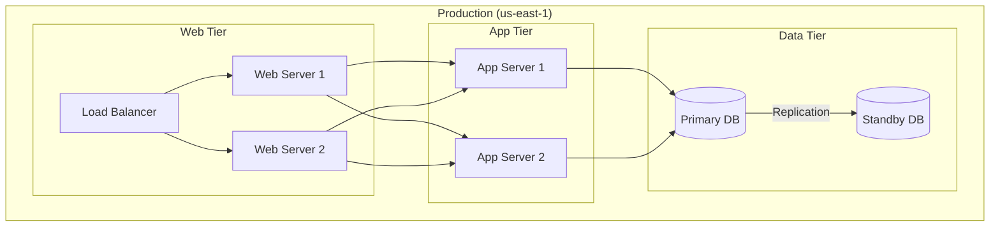

### 3.9 UML Diagrams

UML diagrams provide standardized representations of system structure and behavior. Use Mermaid equivalents where available, or structured text for UML types not supported by Mermaid.

#### 3.9.1 UML Class Diagram (Mermaid classDiagram)
Covered in Section 3.7. Used for: class hierarchies, interfaces, relationships, multiplicities.

#### 3.9.2 UML Sequence Diagram (Mermaid sequenceDiagram)
Covered in Section 3.3. Used for: interaction flows, message passing, lifelines.

#### 3.9.3 UML State Machine Diagram (Mermaid stateDiagram-v2)
Covered in Section 3.4. Used for: states, transitions, events, guards.

#### 3.9.4 UML Use Case Diagram (Mermaid not natively supported)

Used for: actor-system interactions, system boundaries, high-level functional requirements.

**Use structured text representation:**
```
USE CASE: Payment Processing
  Actor: Customer
  Actor: Admin
  System: Payment System
  Use Cases:
    UC1: Place Order
      - Customer → Place Order
      - Place Order → Validate Payment
      - Place Order → Confirm Order
    UC2: Refund Order
      - Admin → Refund Order
      - Refund Order → Process Refund
      - Refund Order → Notify Customer
  Relationships:
    UC1 includes Validate Payment
    UC2 extends UC1 (alternative flow)
```

#### 3.9.5 UML Activity Diagram (Mermaid not natively supported)

Used for: business process flows, concurrent activities, decision nodes, swimlanes.

**Use flowchart with swimlane annotations:**
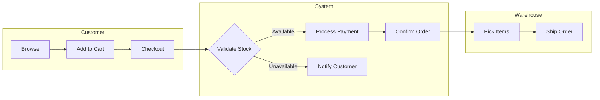

Label swimlane boundaries in the diagram caption.

#### 3.9.6 UML Package Diagram (Mermaid graph with subgraphs)

Used for: namespace organization, module groupings, dependency between packages.

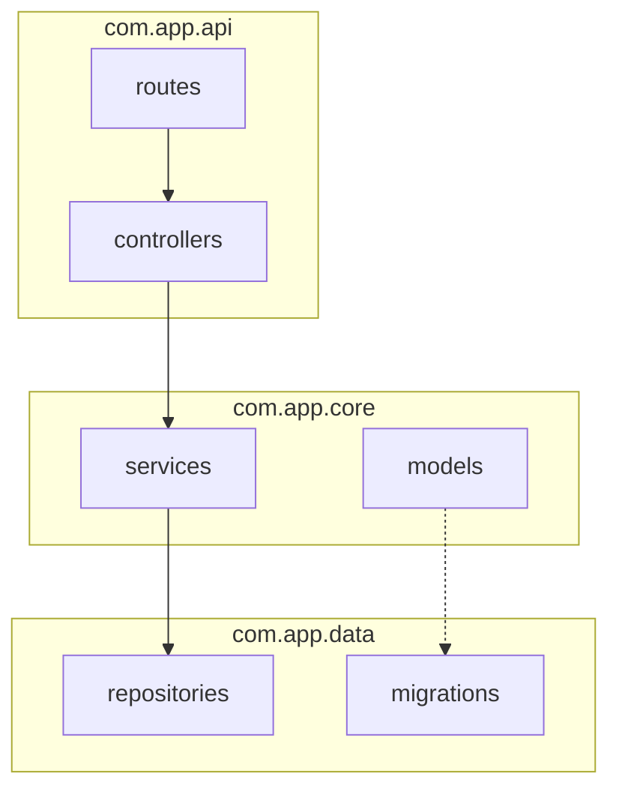

#### 3.9.7 UML Object/Composite Structure Diagram

Used for: object snapshots at runtime, part-whole hierarchies, relationship instances.

**Use Mermaid graph with instance-level naming:**
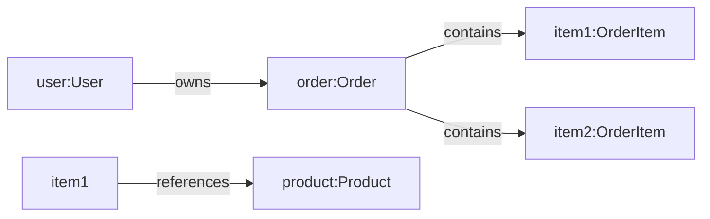

### 3.10 Timeline Diagrams

Used for: deployment pipelines, build processes, scheduled jobs

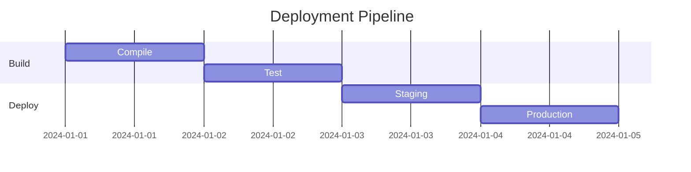

## 4. DIAGRAM RULES

### 4.1 Naming

- All diagrams must have an ID (for cross-referencing)
- Pattern: `diag-[type]-[number]`
- Example: `diag-arch-01`, `diag-flow-05`, `diag-state-03`

### 4.2 Storage

Inline diagrams: embedded in the relevant documentation file
Standalone diagrams: stored in `re-docs/diagrams/[type]/[name].md`

### 4.3 Annotation

Every diagram must have:
- A descriptive caption
- A diagram ID
- The originating phase number
- File:line references for key nodes

### 4.4 Styling

Mermaid style customization (when needed):
```mermaid
%%{init: {'theme': 'neutral', 'themeVariables': { 'primaryColor': '#f0f0f0'}}}%%
```

### 4.5 Validation

All diagrams must:
- Be valid Mermaid syntax (test with `npx @mermaid-js/mermaid-cli`)
- Render without errors in GitHub-flavored Markdown
- Have all nodes referenced in corresponding documentation
- Use consistent direction (TB for hierarchies, LR for flows)

## 5. DIAGRAM INVENTORY

The complete reverse engineering output should include a minimum of:

| Diagram Type | Mermaid Support | Minimum | When |
|-------------|----------------|---------|------|
| Architecture | graph | 2 | Always |
| Data Flow | flowchart | 5 | If system has >3 flows |
| Sequence | sequenceDiagram | 5 | If system has >3 interaction patterns |
| State Machine | stateDiagram-v2 | 1 | If system has >3 states |
| Component | graph | 2 | If system has >3 modules |
| Call Graph | flowchart | 3 | If system has >3 entry points |
| Class Hierarchy | classDiagram | 1 | If system uses OOP |
| Deployment | graph | 1 | If system has >3 deployment nodes |
| Use Case | Text/PlantUML | 1 | If system has >5 use cases |
| Activity | flowchart | 1 | If system has >10-step process |
| Package | graph/subgraph | 1 | If system has >5 packages |
| Timeline | gantt | 1 | If CI/CD pipelines or scheduled jobs |

## 6. EMERGENCY DIAGRAMS

If Mermaid rendering is unavailable or the diagram is too complex:

### Option A: ASCII Art (for simple structures)
```
+----------------+     +----------------+
|   Web App      |---->|   API Server   |
+----------------+     +----------------+
                               |
                        +----------------+
                        |   Database     |
                        +----------------+
```

### Option B: Text Description (for very complex diagrams)
```
ARCHITECTURE (text):
Layer 1 (Presentation): Web App, Mobile App
  ↓ HTTP/WebSocket
Layer 2 (API): REST API Gateway
  ↓ gRPC
Layer 3 (Services): Auth, Core, Payment
  ↓ SQL/Redis Protocol
Layer 4 (Data): PostgreSQL, Redis
```

---

*All diagrams must be accurate, readable, and clearly cross-referenced from the documentation text.*
