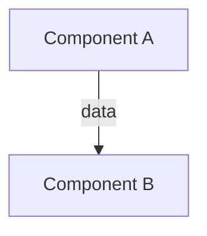

# OUTPUT RULES — Enterprise Reverse Engineering Framework

## RULE CLASSIFICATION: Immutable Formatting Rules
## APPLIES TO: All generated documentation and analysis files

---

## RULE O1: FILE FORMAT

All output files must be:
- Format: Markdown (.md)
- Encoding: UTF-8
- Line endings: LF (Unix)
- Line width: Maximum 120 characters per line
- Indentation: 2 spaces per level (not tabs)

## RULE O2: FRONT MATTER

Every output file must begin with a YAML front matter block:

```yaml
---
phase: 1
phase_name: Structure Analysis
file_id: 01-folder-tree
classification: Analysis Output
target_repository: <repo-name>
generated_date: <YYYY-MM-DD>
accuracy_tier: A / B / C / D
coverage_percentage: <0-100>
dependencies: [list of files this output depends on]
---
```

## RULE O3: HEADING HIERARCHY

```
# Title (H1) — One per file, matches the file purpose
## Section (H2) — Major sections
### Subsection (H3) — Sub-sections
#### Detail (H4) — Specific details
##### Example (H5) — Rare, only for examples
```

## RULE O4: CODE BLOCKS

All code blocks must specify the language:

```typescript
// Correct
const x = 1;
```

```python
# Correct
x = 1
```

```
Incorrect — no language specified
```

## RULE O5: FILE REFERENCES

All file references must use this format:

```
`src/auth/jwt.ts:25-89`
```

With the pattern: `relative/path/to/file.ts:startLine-endLine`

## RULE O6: DIAGRAMS

All diagrams must:
- Use Mermaid.js syntax
- Be enclosed in ```mermaid code blocks
- Include a caption below the diagram
- Be referenced from the text



*Diagram 1: Component relationship between A and B*

## RULE O7: TABLES

All tables must be well-formatted:

```markdown
| Column 1 | Column 2 | Column 3 |
|----------|----------|----------|
| Value 1  | Value 2  | Value 3  |
```

- Tables must have header rows
- Columns must be aligned with dashes
- Empty cells should use `—` (em dash)

## RULE O8: LISTS

Use dashes (`-`) for unordered lists. Use numbers (`1.`) for ordered lists.

For nested lists, indent 2 spaces per level:

```markdown
- Level 1
  - Level 2
    - Level 3
```

## RULE O9: ACCURACY LABELING

Every significant claim must include its accuracy tier inline:

```
The system uses PostgreSQL for persistent storage [Tier: A, src/db/config.ts:10-15].
JWT tokens likely have a 24-hour expiration [Tier: B, inferred from src/auth/config.ts:12].
```

## RULE O10: CROSS-REFERENCES

Cross-references must use explicit file and section references:

```markdown
See [Phase 1 Structure Analysis: Folder Tree](../01-structure/01-folder-tree.md#src-directory)
```

Not:
```markdown
See the folder tree section (as discussed earlier)
```

## RULE O11: GAP FLAGGING

All gaps must use this format:

```markdown
> **GAP-001**: The purpose of `src/utils/obscure.ts` could not be determined.
> **Impact**: Low — this file is not imported by any other module.
> **Evidence**: Grep found zero imports. File contains a single function `transform()` with no callers.
> **Suggested Action**: Contact the original author to determine if this is dead code.
```

## RULE O12: FORWARD REFERENCES

When referencing something not yet analyzed:

```markdown
[FORWARD-REF: Phase 7, Architecture — the routing system mentioned here
is analyzed in detail during architecture reconstruction]
```

## RULE O13: NO PLACEHOLDER TEXT

Do not use placeholder text like "TODO", "TBD", "FIXME", "coming soon", or similar.

If information is unknown, use the gap flagging format (Rule O11).

## RULE O14: EVIDENCE SECTIONS

Every major output section must end with an evidence table:

```markdown
### Evidence

| Finding | Source | Tier |
|---------|--------|------|
| Finding description | `file.ts:line` | A |
```

## RULE O15: SUMMARY SECTIONS

Every file longer than 300 lines must begin with a summary section:

```markdown
## Summary

This file contains the authentication module. It provides JWT-based
authentication with refresh token rotation. Key components:
- AuthService (line 25): Main authentication logic
- TokenManager (line 120): JWT creation and validation
- RefreshTokenStore (line 200): Refresh token persistence
```

## RULE O16: DIAGRAM FILES

Diagram files must follow this structure:

```markdown
# Architecture Diagrams

## Diagram 1: System Architecture
[Diagram]

## Diagram 2: Component Interactions
[Diagram]
...
```

## RULE O17: OUTPUT VALIDATION

Before finalizing any output file, verify:

- [ ] Front matter is present and complete
- [ ] All H1 headings have a matching file purpose
- [ ] All code blocks have language specified
- [ ] All file:line references use correct format
- [ ] All accuracy tiers are labeled
- [ ] All gaps are flagged with GAP-IDs
- [ ] All tables are properly formatted
- [ ] No placeholder text exists
- [ ] No vague language
- [ ] Diagram syntax is valid Mermaid

---

*Output rules are enforced at every phase. Files that violate output rules will be rejected.*
