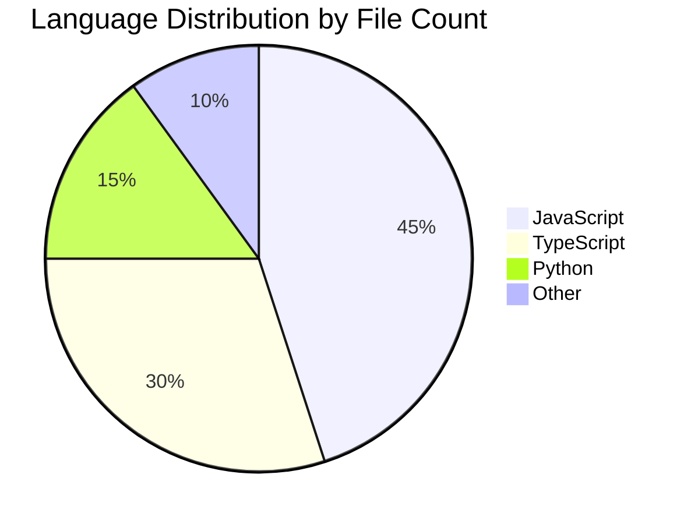

# PROMPT_01 — Phase 00: Project Scouting

## PHASE CLASS: Initial Survey
## DEPENDENCIES: None (starting phase)
## OUTPUT DIRECTORY: `re-docs/00-scouting/`

---

## OBJECTIVE

Perform an initial high-level survey of the target repository. Determine the repository's purpose, scale, language composition, and overall structure. This phase builds the foundation for all subsequent analysis.

## PREREQUISITES

- [ ] MASTER_PROMPT.md has been read
- [ ] MISSION.md has been internalized
- [ ] OPERATING_RULES.md have been internalized
- [ ] QUALITY_STANDARDS.md have been internalized
- [ ] OUTPUT_RULES.md have been internalized
- [ ] The target repository has been cloned or accessed
- [ ] `re-docs/` directory has been created at repo root

## INPUTS

- The target repository filesystem

## ANALYSIS STEPS

### Step 1: Repository Identification

Run the following commands and capture results:

```bash
# Repository metadata
git log --oneline -5
git remote -v
git branch -a

# Repository size
git count-objects -vH
# OR
find . -type f | wc -l
```

Document:
- Repository name
- Repository URL / origin
- Current branch
- Last 5 commits (messages and authors)
- Total file count
- Total directory count
- Total lines of code (use cloc if available, or approximate)
- Primary language (detected from file extensions)
- Repository age (from first commit)

### Step 2: Language Detection

Identify every programming language present in the repository:

```bash
# List all unique file extensions and their counts
Get-ChildItem -Recurse -File | Group-Object Extension | Sort-Object Count -Descending | Select-Object Count, Name
```

For each language, document:
- Language name
- File extension
- File count
- Estimated lines of code
- Primary role in the project

### Step 3: Top-Level Structure

Read the top-level directory listing:

```
/
├── src/           → What is this?
├── docs/          → What is this?
├── tests/         → What is this?
├── package.json   → What is this?
├── README.md      → What is this?
└── ...
```

For each top-level entry, document:
- Name
- Type (file / directory)
- One-sentence purpose (based on name and initial inspection)
- Child count (for directories)

### Step 4: README Analysis

Read the README file(s) completely.

Document:
- Project name and description
- Claimed features
- Installation instructions
- Usage instructions
- Configuration instructions
- Architecture claims (if any)
- Tech stack claims (if any)
- Links to further documentation
- Any claims that can be verified later

### Step 5: Entry Point Detection

Identify all entry points to the application:

```bash
# Common entry point patterns
# Node: index.js, app.js, server.js, main.js, bin/
# Python: main.py, app.py, manage.py, __main__.py
# Go: main.go, cmd/
# Rust: main.rs, src/main.rs
# Java: public static void main, Application.java
# Ruby: bin/, app.rb
# C: main.c, main.cpp
# Multi-language: Dockerfile, docker-compose.yml, Makefile
```

Document every entry point found with its file path.

### Step 6: Configuration File Detection

Find all configuration files:

```bash
# Generic config patterns
Get-ChildItem -Recurse -File | Where-Object { $_.Name -match '\.(json|ya?ml|toml|ini|cfg|conf|env|config\.(js|ts|py|rb))$' } -ErrorAction SilentlyContinue
```

Document each configuration file with:
- File path
- File type
- Apparent purpose
- Whether it appears to be a template or actual config

### Step 7: Documentation Inventory

Find all documentation files:

```bash
Get-ChildItem -Recurse -File | Where-Object { $_.Name -match '\.(md|txt|rst|adoc|html|pdf)$' -or $_.Name -match '^(README|CHANGELOG|CONTRIBUTING|LICENSE|CODE_OF_CONDUCT|SECURITY)' } -ErrorAction SilentlyContinue
```

Document each documentation file with path and purpose.

### Step 8: High-Level Risk Assessment

Identify potential analysis challenges:
- Minified/obfuscated files
- Generated code
- Binary files
- Very large files (>1000 lines)
- Deeply nested directories
- Circular dependencies (if detectable)
- Monorepo structure
- Git submodules

## OUTPUT SPECIFICATION

Generate the following files in `re-docs/00-scouting/`:

### File 1: `01-repo-profile.md`

```yaml
---
phase: 00
phase_name: Project Scouting
file_id: 01-repo-profile
---
```

Contains:
- Repository metadata (name, URL, branch, commits)
- Size metrics (files, directories, LOC)
- File extension distribution (table)
- Language distribution (table)

### File 2: `02-top-level-structure.md`

Contains:
- Full top-level directory listing
- Description of each top-level entry
- Initial observations about organization

### File 3: `03-readme-analysis.md`

Contains:
- Complete README content analysis
- Claims extracted from README (for later verification)
- Gaps between README claims and apparent reality

### File 4: `04-entry-points.md`

Contains:
- All entry points with file paths
- Entry point type classification
- Brief description of each entry point's purpose

### File 5: `05-config-files.md`

Contains:
- All configuration files with paths
- File type classification
- Apparent purpose summary

### File 6: `06-documentation-inventory.md`

Contains:
- All documentation files with paths
- Content summary per file
- Documentation coverage assessment

### File 7: `07-scouting-summary.md`

Contains:
- High-level summary of findings
- Initial architecture hypothesis
- Potential analysis challenges
- Recommended analysis strategy

## REQUIRED DIAGRAMS

### Diagram 1: Repository Composition



(Use actual detected percentages)

## VALIDATION CHECKS

- [ ] Repository profile is complete (name, URL, size, languages)
- [ ] Top-level structure is documented
- [ ] README has been read and analyzed
- [ ] All entry points have been identified
- [ ] All configuration files have been cataloged
- [ ] Documentation inventory is complete
- [ ] No gaps in basic understanding of what this project does

## COMPLETION CHECKLIST

- [ ] All 7 output files generated
- [ ] Scouting summary written
- [ ] Initial architecture hypothesis formulated
- [ ] Analysis challenges identified
- [ ] All outputs saved to `re-docs/00-scouting/`
- [ ] Phase validation checks passed

---

*Proceed to PROMPT_02_STRUCTURE.md only after all checklist items are complete.*
