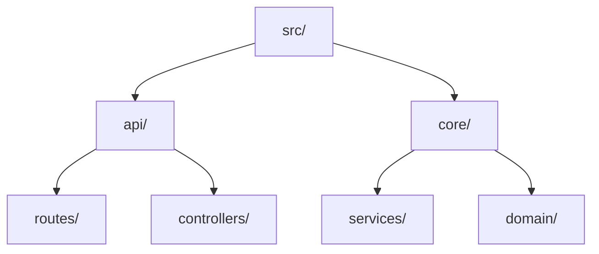
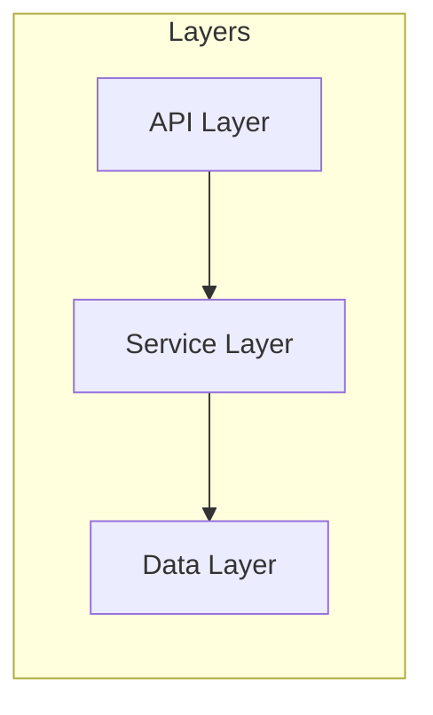

# PROMPT_02 — Phase 01: Structure Analysis

## PHASE CLASS: Structural Survey
## DEPENDENCIES: PROMPT_01 (Project Scouting) — complete
## OUTPUT DIRECTORY: `re-docs/01-structure/`

---

## OBJECTIVE

Build a complete, detailed map of the repository's folder and file structure. Document naming conventions, organizational patterns, and the responsibility of every directory and subdirectory.

## PREREQUISITES

- [ ] PROMPT_01 completed
- [ ] `re-docs/00-scouting/` outputs exist
- [ ] Top-level structure understood

## INPUTS

- Repository filesystem
- `re-docs/00-scouting/02-top-level-structure.md` (top-level map)
- `re-docs/00-scouting/04-entry-points.md` (entry points)

## ANALYSIS STEPS

### Step 1: Full Folder Tree Generation

Generate a complete folder tree structure:

```markdown
src/
├── api/
│   ├── routes/
│   ├── controllers/
│   ├── middleware/
│   └── validators/
├── core/
│   ├── domain/
│   ├── services/
│   └── ports/
├── infrastructure/
│   ├── database/
│   ├── cache/
│   └── messaging/
└── config/
```

For repositories over 5000 files, generate the tree with depth limiting (show only directories + key files per directory). Include file counts per directory.

For each directory node, document:
- Directory path
- Number of files
- Number of subdirectories
- Types of files present (extensions)
- One-sentence responsibility

### Step 2: Naming Convention Analysis

Analyze naming conventions used across the repository:

- **Files**: Are they kebab-case? snake_case? camelCase? PascalCase?
- **Directories**: Same questions
- **Classes**: Convention used
- **Functions**: Convention used
- **Variables**: Convention used
- **Database tables**: Convention used
- **API endpoints**: Convention used

For each, document:
- Convention observed
- Primary location where this convention appears
- Consistency level (consistent, mostly consistent, inconsistent)
- Examples

### Step 3: Organizational Pattern Identification

Identify the organizational pattern(s) used:

- **Layer-based**: `controllers/`, `services/`, `repositories/`
- **Feature-based**: `auth/`, `payments/`, `users/`
- **Hybrid**: Combination of layer and feature
- **Domain-driven**: `domain/`, `application/`, `infrastructure/`
- **Component-based**: Each component has its own sub-tree
- **Flat**: Minimal nesting
- **Other**: Custom organization

### Step 4: File Role Classification

For each directory with significant content, classify the role of its files:

| Directory | Primary File Role | Secondary Roles |
|-----------|------------------|-----------------|
| src/api/routes/ | Route definitions | Validation, middleware binding |
| src/core/services/ | Business logic | Orchestration |
| src/infrastructure/database/ | Data access | ORM config |

### Step 5: Directory Depth Analysis

Document the directory nesting depth:

- Maximum depth
- Average depth
- Deepest path(s)
- Is depth reasonable or excessive?

### Step 6: Monorepo Detection (if applicable)

If the repository is a monorepo (multiple projects in one repo):
- Identify each project within the monorepo
- Document the monorepo tool used (Nx, Turborepo, Lerna, pnpm workspaces, etc.)
- Document project boundaries
- Document shared code

## OUTPUT SPECIFICATION

### File 1: `01-folder-tree.md`

Full folder tree with annotations. Use nested markdown lists or code blocks with comments.

### File 2: `02-directory-responsibilities.md`

Table of every directory with its responsibility:

| Directory | Responsibility | File Count | Key Files |
|-----------|---------------|------------|-----------|
| src/api/routes/ | Define HTTP routes and bind controllers | 12 | auth.ts, users.ts |

### File 3: `03-naming-conventions.md`

Documentation of all naming conventions found.

### File 4: `04-organization-pattern.md`

Analysis of the organizational pattern with:
- Pattern name
- Strengths for this project
- Weaknesses for this project
- Consistency assessment

### File 5: `05-structure-summary.md`

High-level summary:
- Total depth analysis
- Organizational maturity assessment
- Structural patterns worth noting
- Recommendations for structural improvements (if any)

## REQUIRED DIAGRAMS

### Diagram 1: Directory Tree



(Full tree, not partial)

### Diagram 2: Organizational Pattern



## VALIDATION CHECKS

- [ ] Every directory in the repository has a documented responsibility
- [ ] Naming conventions are documented with examples
- [ ] Organizational pattern is identified and described
- [ ] Folder tree is complete and accurate
- [ ] No structural element is undocumented

## COMPLETION CHECKLIST

- [ ] All 5 output files generated
- [ ] Folder tree covers all directories
- [ ] Directory responsibilities are complete
- [ ] Naming conventions documented
- [ ] Organizational pattern identified
- [ ] Structure summary written
- [ ] All outputs saved to `re-docs/01-structure/`
- [ ] Phase validation checks passed

---

*Proceed to PROMPT_03_BUILD_CONFIG.md only after all checklist items are complete.*
