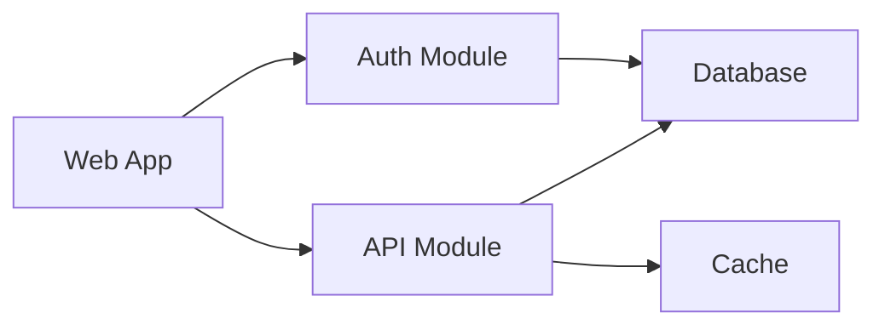
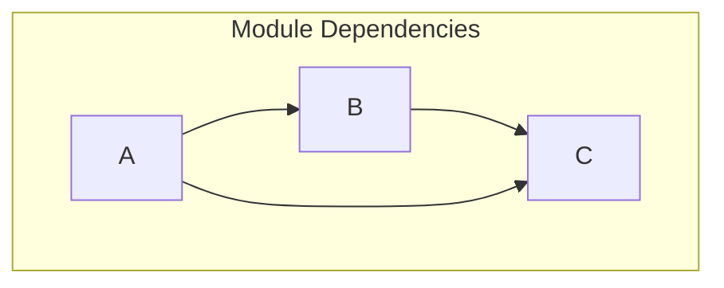

# PROMPT_04 — Phase 03: Dependency Graph Analysis

## PHASE CLASS: Infrastructure Survey
## DEPENDENCIES: PROMPT_03 (Build & Config) — complete
## OUTPUT DIRECTORY: `re-docs/03-dependencies/`

---

## OBJECTIVE

Build a complete, accurate dependency graph for the entire repository. Document every direct dependency, indirect dependency, and their roles within the system.

## PREREQUISITES

- [ ] PROMPT_03 completed
- [ ] Build system is understood
- [ ] Package files (package.json, requirements.txt, etc.) identified

## INPUTS

- All dependency manifest files (package.json, requirements.txt, Cargo.toml, go.mod, etc.)
- All lock files (package-lock.json, yarn.lock, Cargo.lock, go.sum, etc.)
- Build configuration (for understanding dependency roles)

## ANALYSIS STEPS

### Step 1: Direct Dependency Extraction

For each dependency manifest, extract all direct dependencies:

For each dependency, document:
- **Name**
- **Version specified** (in manifest)
- **Type**: production / development / build / optional
- **Category**: framework, library, tool, plugin, etc.
- **Source**: npm, PyPI, crates.io, GitHub, etc.
- **License** (check license field or README)
- **Purpose**: What does this dependency do for the project?
- **Usage locations**: Where is this dependency imported/required?
- **Version resolution**: What version is actually installed (from lock file)?

### Step 2: Dependency Role Classification

Classify each dependency by role:

| Role | Description | Example |
|------|-------------|---------|
| Framework | Core framework the app is built on | React, Express, Django |
| UI Library | UI component library | Material UI, shadcn/ui |
| State Management | State management solution | Redux, Zustand, Pinia |
| Database Driver | Database connection | pg, mongoose, prisma |
| ORM | Object-relational mapping | Prisma, TypeORM, SQLAlchemy |
| Validation | Input/output validation | Zod, Joi, Pydantic |
| Authentication | Auth library | NextAuth, Passport, JWT |
| HTTP Client | HTTP request library | axios, fetch, urllib |
| Testing | Testing framework | Jest, Vitest, pytest |
| Linting | Linting tool | ESLint, Ruff |
| Formatting | Formatting tool | Prettier, Black |
| Build Tool | Build/bundling tool | Webpack, Vite, esbuild |
| Utility | General utility | lodash, date-fns, dayjs |
| Logging | Logging library | winston, pino, loguru |
| Monitoring | Monitoring/observability | Sentry, OpenTelemetry |
| Caching | Caching solution | redis, node-cache |
| Messaging | Message queue | Bull, Celery, RabbitMQ |
| Type Safety | Type system | TypeScript, mypy, pyright |

### Step 3: Internal Dependency Mapping

Map dependencies between internal modules:

```
src/auth/  →  src/core/    (auth depends on core)
src/api/   →  src/auth/    (api depends on auth)
src/api/   →  src/core/    (api depends on core)
```

Identify:
- Which modules depend on which
- Direction of dependencies
- Circular dependencies (CRITICAL — flag immediately)
- Dependency depth per module

### Step 4: Dependency Tree Construction

For critical dependencies, construct the dependency tree:

```
react@18.2.0
├── loose-envify@1.4.0
│   └── js-tokens@4.0.0
└── scheduler@0.23.0
```

Document only for important dependencies (frameworks, core libraries).

### Step 5: Version Analysis

For each dependency:
- Check if the version is pinned or ranges
- Check for outdated dependencies
- Check for security vulnerabilities (if tooling available)
- Check for deprecated dependencies
- Note breaking changes between current and latest

### Step 6: License Analysis

Scan all dependencies for license information:
- Identify licenses in use
- Flag copyleft licenses (GPL, AGPL)
- Flag conflicting licenses
- Compile a license inventory

### Step 7: Dead Dependency Detection

Identify potential dead dependencies:
- Dependencies declared in manifest but not imported anywhere
- Development dependencies that are unused
- Dependencies that appear to be no longer needed

Use grep to verify import/require/use statements:

```bash
# Example: check if a dependency is actually used
rg -l "dependency-name" --type-add 'src:*.{ts,tsx,js,jsx}' -t src
```

## OUTPUT SPECIFICATION

### File 1: `01-dependency-inventory.md`

Complete inventory of all dependencies:

| Dependency | Version | Type | Role | License | Used In |
|------------|---------|------|------|---------|---------|
| express | ^4.18.0 | prod | Framework | MIT | src/server.ts |

### File 2: `02-dependency-by-role.md`

Dependencies organized by role category.

### File 3: `03-internal-dependency-graph.md`

Internal module dependency graph (which modules depend on which).

### File 4: `04-dependency-trees.md`

Dependency trees for critical dependencies.

### File 5: `05-version-analysis.md`

Version analysis with upgrade recommendations and security flags.

### File 6: `06-license-inventory.md`

Complete license inventory.

### File 7: `07-dependency-summary.md`

Summary:
- Total dependency count (direct)
- Total dependency count (transitive)
- Dependency health assessment
- Security recommendations
- Upgrade recommendations
- Dead dependency candidates

## REQUIRED DIAGRAMS

### Diagram 1: Dependency Graph by Module



### Diagram 2: Internal Dependency Direction



## VALIDATION CHECKS

- [ ] Every dependency in every manifest file is documented
- [ ] Each dependency has a purpose/role assigned
- [ ] Internal dependencies between modules are mapped
- [ ] No obvious circular dependencies are missed
- [ ] License information is captured for all dependencies
- [ ] Version pinning strategy is documented
- [ ] Dead dependency candidates are identified

## COMPLETION CHECKLIST

- [ ] All 7 output files generated
- [ ] Dependency inventory is complete
- [ ] Internal dependency graph is mapped
- [ ] Version analysis performed
- [ ] License inventory compiled
- [ ] Dependency health assessed
- [ ] All outputs saved to `re-docs/03-dependencies/`
- [ ] Phase validation checks passed

---

*Proceed to PROMPT_05_TECH_STACK.md only after all checklist items are complete.*
