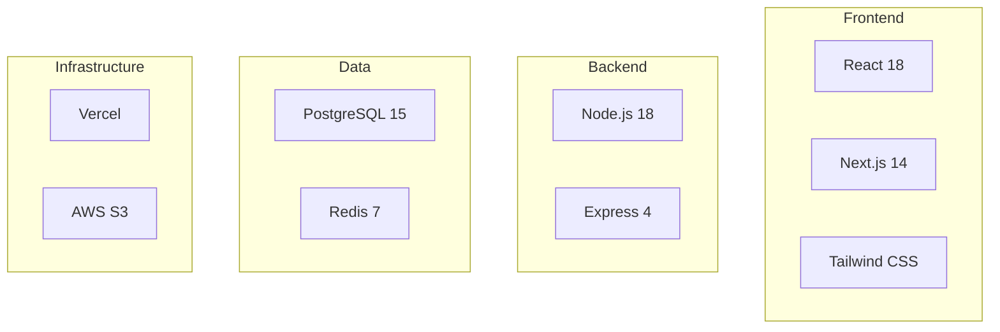

# PROMPT_05 — Phase 04: Technology Stack Identification

## PHASE CLASS: Technology Survey
## DEPENDENCIES: PROMPT_04 (Dependencies) — complete
## OUTPUT DIRECTORY: `re-docs/04-tech-stack/`

---

## OBJECTIVE

Identify and document every technology in the stack: programming languages, frameworks, libraries, runtimes, databases, message brokers, caching systems, cloud services, external APIs, and tooling. For each technology, document its role, version, configuration, and usage patterns.

## PREREQUISITES

- [ ] PROMPT_04 completed
- [ ] Dependencies are documented
- [ ] Build system is understood

## INPUTS

- `re-docs/03-dependencies/01-dependency-inventory.md`
- `re-docs/02-build-config/01-build-system.md`
- Source code (for usage pattern analysis)

## ANALYSIS STEPS

### Step 1: Primary Technology Identification

Identify all primary technologies:

| Category | Technologies to Identify |
|----------|------------------------|
| **Languages** | All programming languages, markup languages, query languages |
| **Runtimes** | Node.js version, Python version, JVM version, .NET runtime |
| **Frontend Frameworks** | React, Vue, Angular, Svelte, Next.js, Nuxt |
| **Backend Frameworks** | Express, FastAPI, Django, Spring Boot, Rails |
| **Database Systems** | PostgreSQL, MySQL, MongoDB, Redis, SQLite |
| **ORM/ODM** | Prisma, TypeORM, Mongoose, SQLAlchemy |
| **Caching** | Redis, Memcached, in-memory caching |
| **Message Queues** | RabbitMQ, Kafka, Bull, Celery |
| **Cloud Services** | AWS, GCP, Azure, Vercel, Netlify |
| **External APIs** | Stripe, Twilio, SendGrid, OpenAI |
| **Monitoring** | Sentry, Datadog, Prometheus, Grafana |
| **Authentication** | Auth0, Clerk, NextAuth, Firebase Auth |

For each technology, document:
- Name (official name)
- Version (as used in the project)
- Category
- Configuration file (where configured)
- Key configuration settings
- When/how it's instantiated
- How it's used (key code patterns)

### Step 2: Technology Version Matrix

Create a version matrix:

| Technology | Version | Latest Available | Status |
|-----------|---------|-----------------|--------|
| Node.js | 18.x | 22.x | Outdated |
| React | 18.2.0 | 19.0 | Current |
| Express | 4.18.0 | 4.21.0 | Current |

Status: Current, Outdated, Deprecated, EOL

### Step 3: Framework Configuration Analysis

For each major framework:
- Read its configuration file(s)
- Document every configuration option
- Note deviations from defaults
- Explain why non-default choices were made

### Step 4: Runtime Version Detection

Detect runtime versions:
- From .nvmrc, .node-version, .python-version
- From Dockerfile FROM statements
- From CI/CD configuration
- From package.json engines field

### Step 5: Platform and Hosting Detection

Detect platform services:
- Cloud provider (AWS, GCP, Azure)
- Hosting platform (Vercel, Netlify, Railway, Heroku)
- Database hosting (Supabase, PlanetScale, Neon)
- File storage (S3, Cloudflare R2, Firebase Storage)
- CDN (Cloudflare, Fastly, Akamai)

Document:
- Service name
- Configuration location
- Environment variables required
- Pricing tier (if detectable)

### Step 6: External Service Integration

Identify all external service integrations:
- Payment processors
- Email services
- SMS services
- AI/ML APIs
- Analytics services
- Monitoring services
- Third-party APIs

For each, document:
- API used
- Authentication method
- Configuration location
- Key endpoints used (if REST)
- Key functions used (if SDK)

## OUTPUT SPECIFICATION

### File 1: `01-tech-stack-matrix.md`

Complete technology stack matrix with all technologies and versions.

### File 2: `02-language-usage.md`

Deep dive into each language's usage patterns, conventions, and idioms.

### File 3: `03-framework-analysis.md`

Analysis of each major framework with configuration documentation.

### File 4: `04-runtime-and-platform.md`

Runtime versions, platform services, hosting configuration.

### File 5: `05-external-integrations.md`

All external service integrations with API details.

### File 6: `06-tech-stack-summary.md`

Summary including:
- Overall tech stack description
- Stack maturity assessment
- Technology risks (outdated, deprecated, EOL)
- Recommended upgrades
- Technology diversity score

## REQUIRED DIAGRAMS

### Diagram 1: Technology Stack Layers

## VALIDATION CHECKS

- [ ] Every language used is documented
- [ ] Every framework is documented with version
- [ ] Runtime versions are confirmed
- [ ] Database systems are identified
- [ ] All external services are cataloged
- [ ] No technology is undocumented

## COMPLETION CHECKLIST

- [ ] All 6 output files generated
- [ ] Tech stack matrix is complete
- [ ] Framework configuration analyzed
- [ ] External integrations documented
- [ ] Platform/hosting identified
- [ ] Technology risks identified
- [ ] All outputs saved to `re-docs/04-tech-stack/`
- [ ] Phase validation checks passed

---

*Proceed to PROMPT_06_MODULES.md only after all checklist items are complete.*
