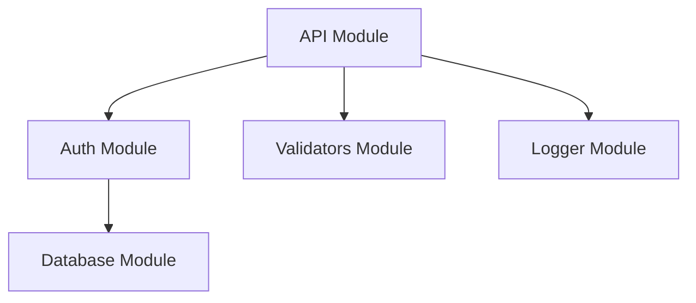

# PROMPT_06 — Phase 05: Module Boundary & Interface Analysis

## PHASE CLASS: Structural Deep Dive
## DEPENDENCIES: PROMPT_05 (Tech Stack) — complete
## OUTPUT DIRECTORY: `re-docs/05-modules/`

---

## OBJECTIVE

Identify every module in the system, document its boundary, public interface, internal structure, and relationships with other modules. This phase transforms "directories" into meaningful "modules" with defined responsibilities.

## PREREQUISITES

- [ ] PROMPT_05 completed
- [ ] Tech stack is understood
- [ ] Repository structure is known
- [ ] Internal dependencies are mapped

## INPUTS

- `re-docs/01-structure/01-folder-tree.md`
- `re-docs/01-structure/02-directory-responsibilities.md`
- `re-docs/03-dependencies/03-internal-dependency-graph.md`
- Full source code access

## ANALYSIS STEPS

### Step 1: Module Identification

Identify every distinct module in the system. A module is defined as:

**A cohesive unit of functionality with a clear responsibility, contained within a directory boundary, exposing a public API.**

For each module, document:
- **Module name**
- **Directory path**
- **Responsibility** (one-paragraph description)
- **Module type**: library, service, application, utility, configuration, etc.

Module identification heuristics:
- A directory that has an index file (index.ts, __init__.py, mod.rs, etc.)
- A directory that exports multiple related files
- A directory that is imported by other directories
- A directory that has internal cohesion (files relate to each other)
- A package.json, Cargo.toml, or other module manifest

### Step 2: Public Interface Extraction

For each module, extract its public interface:

- **Exports**: Every class, function, constant, type that is exported from the module
- **Entry points**: The main entry file(s) of the module
- **Public API surface**: What the module exposes to other modules

Document:
```markdown
## Module: Auth

### Public Interface

| Export | Type | Description |
|--------|------|-------------|
| login() | Function | Authenticate user credentials |
| logout() | Function | Invalidate user session |
| refreshToken() | Function | Refresh JWT token |
| AuthService | Class | Main authentication service |
| UserRole | Enum | User role enumeration |
```

### Step 3: Internal Structure

For each module, document its internal structure:

- **Files within the module**
- **Role of each file**
- **Internal dependencies** (files within the module that depend on each other)
- **Module-internal patterns** (how the module organizes its code)

```markdown
### Internal Structure

src/auth/
├── index.ts          → Public API exports
├── service.ts        → AuthService implementation
├── strategies/       → Authentication strategies
│   ├── jwt.ts        → JWT strategy
│   └── oauth.ts      → OAuth strategy
├── middleware.ts     → Express middleware
└── types.ts          → TypeScript type definitions
```

### Step 4: Module Dependency Map

Map how modules depend on each other:

```markdown
### Module Dependencies

| Module | Depends On | Dependency Type | Reason |
|--------|-----------|-----------------|--------|
| Auth | Database | Strong | User persistence |
| API | Auth | Strong | Authentication middleware |
| API | Validators | Strong | Request validation |
| API | Logger | Weak | Logging |
```

Dependency types:
- **Strong**: Cannot function without this dependency
- **Weak**: Optional dependency, degrades gracefully
- **Circular**: CRITICAL — both modules depend on each other

### Step 5: Module Cohesion Assessment

Assess each module's cohesion:

- **High**: All files within the module contribute to a single responsibility
- **Medium**: Most files contribute, some are tangential
- **Low**: Files within the module have unrelated responsibilities
- **Mixed**: Module contains multiple sub-concerns

### Step 6: Module Coupling Assessment

Assess coupling between modules:

- **Tight**: Module A depends heavily on Module B's internal details
- **Loose**: Module A depends only on Module B's public interface
- **Decoupled**: Module A does not depend on Module B

## OUTPUT SPECIFICATION

### File 1: `01-module-inventory.md`

Complete inventory of all modules.

### File 2: `02-module-interfaces.md`

Public interface documentation for each module.

### File 3: `03-module-internals.md`

Internal structure documentation for each module.

### File 4: `04-module-dependency-map.md`

Complete module dependency map.

### File 5: `05-cohesion-and-coupling.md`

Cohesion and coupling assessment for each module.

### File 6: `06-module-analysis-summary.md`

Summary including:
- Module architecture pattern
- Overall cohesion score
- Overall coupling score
- Problematic modules
- Refactoring recommendations

## REQUIRED DIAGRAMS

### Diagram 1: Module Dependency Graph



### Diagram 2: Module Interface Diagram

```mermaid
graph LR
    subgraph "Public API"
        A[login()]
        B[logout()]
        C[refreshToken()]
    end
    subgraph "Internal"
        D[JWT Strategy]
        E[OAuth Strategy]
        F[Token Store]
    end
    A --> D
    A --> E
    C --> F
```

## VALIDATION CHECKS

- [ ] Every directory with significant functionality is identified as a module
- [ ] Every module has a documented public interface
- [ ] Internal structure is documented for every module
- [ ] Module dependency map is complete
- [ ] Cohesion is assessed for every module
- [ ] Coupling is assessed between all related modules
- [ ] No module boundary is ambiguous

## COMPLETION CHECKLIST

- [ ] All 6 output files generated
- [ ] Module inventory is complete
- [ ] Module interfaces documented
- [ ] Module internals documented
- [ ] Module dependency map complete
- [ ] Cohesion/coupling assessed
- [ ] Problematic modules flagged
- [ ] All outputs saved to `re-docs/05-modules/`
- [ ] Phase validation checks passed

---

*Proceed to PROMPT_07_DEEP_READ.md only after all checklist items are complete.*
