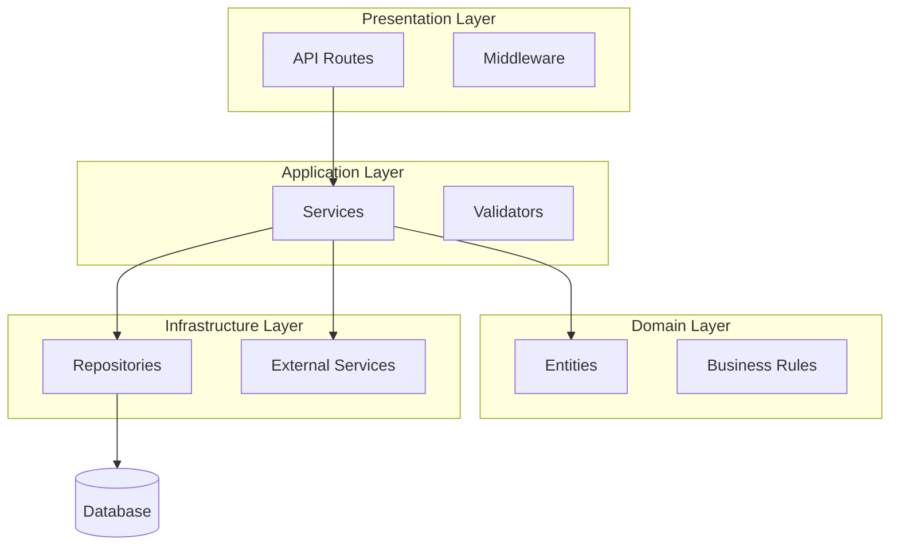
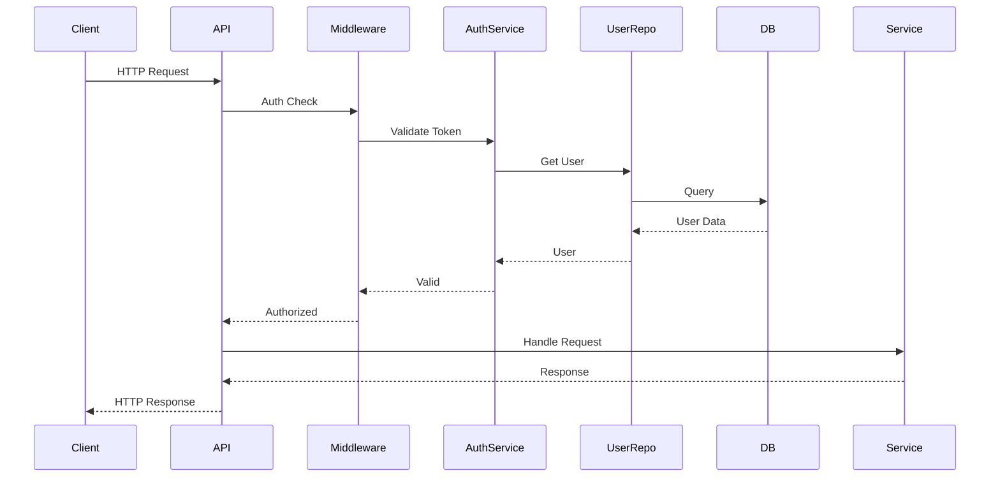

# PROMPT_08 — Phase 07: Architecture Reconstruction

## PHASE CLASS: Architectural Analysis
## DEPENDENCIES: PROMPT_07 (Deep Read) — complete
## OUTPUT DIRECTORY: `re-docs/07-architecture/`

---

## OBJECTIVE

Reconstruct the complete architecture of the system from the source code. Document layers, components, communication patterns, architectural styles, and design decisions. Produce architectural diagrams that accurately represent the system.

## PREREQUISITES

- [ ] PROMPT_07 completed
- [ ] All key files have been deeply read
- [ ] Module structure is understood
- [ ] Dependencies are mapped

## INPUTS

- `re-docs/05-modules/04-module-dependency-map.md`
- `re-docs/06-deep-read/03-function-catalog.md`
- `re-docs/06-deep-read/04-class-catalog.md`
- All source code (for architectural pattern detection)

## ANALYSIS STEPS

### Step 1: Architectural Style Identification

Identify the architectural style(s) used:

| Style | Indicators |
|-------|-----------|
| **Layered Architecture** | Controllers → Services → Repositories pattern |
| **Hexagonal/Ports & Adapters** | Domain core, ports interfaces, adapter implementations |
| **Clean Architecture** | Entities → Use Cases → Interface Adapters → Frameworks |
| **Microservices** | Independent services, API gateways, inter-service communication |
| **Event-Driven** | Event buses, event handlers, pub/sub patterns |
| **CQRS** | Separate command and query paths |
| **Event Sourcing** | Event store, event replay, projection |
| **MVC** | Models, Views, Controllers |
| **Serverless** | Function handlers, cloud service integrations |
| **Pipe and Filter** | Processing pipeline with discrete stages |
| **Plugin Architecture** | Plugin interfaces, plugin loaders |
| **Monolith** | Single deployable unit, shared codebase |

For each identified style, document:
- Style name
- Evidence in code (file:line references)
- How strictly the style is followed
- Deviations from the canonical style

### Step 2: Layer Identification

Identify the architectural layers:

```
┌─────────────────────────────────────┐
│  Presentation/API Layer              │
│  (Routes, Controllers, GraphQL)       │
├─────────────────────────────────────┤
│  Application/Service Layer           │
│  (Use Cases, Orchestration)           │
├─────────────────────────────────────┤
│  Domain/Business Logic Layer         │
│  (Entities, Rules, Domain Services)   │
├─────────────────────────────────────┤
│  Infrastructure/Data Layer           │
│  (Repositories, Database, External)   │
└─────────────────────────────────────┘
```

For each layer, document:
- Layer name
- Responsibility
- Files in this layer
- Layer boundary (what defines the layer)
- Communication pattern between layers

### Step 3: Component Identification

Identify all architectural components:

| Component | Type | Layer | Responsibility |
|-----------|------|-------|---------------|
| AuthController | Controller | API | Handle auth HTTP requests |
| AuthService | Service | Application | Auth business logic |
| UserRepository | Repository | Infrastructure | User data access |
| EmailService | Service | Infrastructure | Email sending |

For each component, document:
- Name
- Type (Controller, Service, Repository, etc.)
- Layer
- Responsibility
- Interfaces/Contracts
- Dependencies (other components it depends on)
- Dependents (components that depend on it)

### Step 4: Communication Pattern Analysis

Identify how components communicate:

- **Synchronous HTTP**: REST, GraphQL calls between services
- **Asynchronous Messaging**: Events, queues, pub/sub
- **Direct Method Calls**: In-process function calls
- **Dependency Injection**: Wired via DI container
- **Event Bus**: Components emit/listen to events
- **Shared Database**: Components communicate via shared DB

For each communication pattern:
- Pattern type
- Components involved
- Mechanism (library, protocol, interface)
- Data format (JSON, protobuf, etc.)
- Error handling for communication failures

### Step 5: Architecture Decision Recovery

For each significant architectural decision, document:

- **Decision**: What was decided?
- **Evidence**: What in the code shows this decision?
- **Context**: Why was this decision likely made?
- **Consequences**: What trade-offs resulted?
- **Alternatives**: What alternatives appear to have been rejected?

Common architectural decisions to document:
- Why this framework?
- Why this database?
- Why monolith vs. microservices?
- Why this communication pattern?
- Why this deployment model?

### Step 6: Package/Namespace Architecture

Document the package/module naming and organization:
- Package structure
- Package naming conventions
- Package dependency rules
- Visibility/module boundaries

### Step 7: Architecture Health Assessment

Assess the architecture:

- **Architecture fit**: Does the architecture fit the problem?
- **Architecture consistency**: Is the architecture applied consistently?
- **Architecture erosion**: Has the architecture degraded over time?
- **Technical debt**: What architectural debt exists?

## OUTPUT SPECIFICATION

### File 1: `01-architectural-style.md`

Identified architectural style with evidence.

### File 2: `02-layer-architecture.md`

Documentation of all architectural layers.

### File 3: `03-component-catalog.md`

Complete catalog of all architectural components.

### File 4: `04-communication-patterns.md`

Documentation of all inter-component communication.

### File 5: `05-architectural-decisions.md`

Recovered architectural decisions (reverse-engineered ADRs).

### File 6: `06-architecture-health.md`

Architecture health assessment.

### File 7: `07-architecture-summary.md`

One-page architecture summary suitable for onboarding.

## REQUIRED DIAGRAMS

### Diagram 1: System Architecture



### Diagram 2: Component Interaction



## VALIDATION CHECKS

- [ ] Architectural style is identified with code evidence
- [ ] All layers are documented
- [ ] All components are cataloged
- [ ] Communication patterns are documented
- [ ] Architecture decisions are recovered
- [ ] Architecture health is assessed
- [ ] Architecture summary is complete

## COMPLETION CHECKLIST

- [ ] All 7 output files generated
- [ ] Architectural style identified
- [ ] Layers documented with file boundaries
- [ ] Components cataloged
- [ ] Communication patterns documented
- [ ] ADRs recovered
- [ ] Architecture health assessed
- [ ] All outputs saved to `re-docs/07-architecture/`
- [ ] Phase validation checks passed

---

*Proceed to PROMPT_09_DATA_FLOW.md only after all checklist items are complete.*
