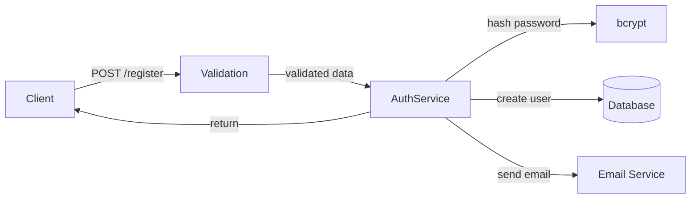
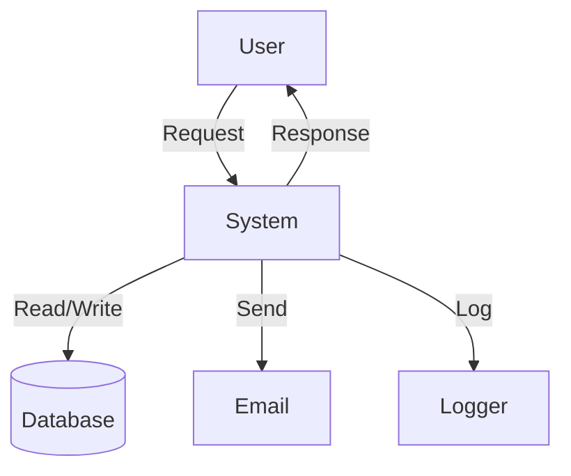

# PROMPT_09 — Phase 08: Data Flow Analysis

## PHASE CLASS: Runtime Behavior Analysis (Static)
## DEPENDENCIES: PROMPT_08 (Architecture) — complete
## OUTPUT DIRECTORY: `re-docs/08-data-flow/`

---

## OBJECTIVE

Trace and document every major data flow through the system. Understand how data enters, moves through, transforms, and exits the system. Document data shapes, transformations, validations, and persistences.

## PREREQUISITES

- [ ] PROMPT_08 completed
- [ ] Architecture is understood
- [ ] Components are identified
- [ ] Communication patterns known

## INPUTS

- `re-docs/07-architecture/03-component-catalog.md`
- `re-docs/07-architecture/04-communication-patterns.md`
- `re-docs/06-deep-read/` (for data transformation logic)
- Full source code

## ANALYSIS STEPS

### Step 1: Data Entry Point Identification

Identify all data entry points:

- HTTP request bodies
- URL query parameters
- URL path parameters
- HTTP headers
- WebSocket messages
- File uploads
- CLI arguments
- Environment variables
- Message queue messages
- Webhook payloads
- Database change streams

For each entry point, document:
- Source
- Data format (JSON, XML, FormData, etc.)
- Schema (structure of incoming data)
- Validation applied
- First processing location

### Step 2: Data Flow Tracing

For each major feature, trace the data flow end-to-end:

```markdown
## Data Flow: User Registration

1. Client sends POST /api/auth/register with {email, password, name}
2. Express parses body → req.body
3. Validation middleware validates with Zod schema
4. AuthController.register() called
5. AuthService.createUser() called
   a. Hash password with bcrypt
   b. Create user in database
   c. Generate verification token
   d. Send verification email
6. Return 201 with {user, token}
```

For each step, document:
- Step number
- Location (file:line)
- Data transformation (what changed?)
- Side effects (what else happened?)

### Step 3: Data Transformation Documentation

For each data transformation:

```markdown
### Transformation: Password Hashing

- **Input**: Plain text password (string)
- **Output**: Bcrypt hash (string)
- **Location**: src/auth/service.ts:45-52
- **Algorithm**: bcrypt.hashSync(password, 10)
- **Error handling**: Throws if password is empty or too long
```

### Step 4: State Shape Documentation

Document the shape of important state:

#### Database State
```sql
CREATE TABLE users (
    id UUID PRIMARY KEY,
    email VARCHAR(255) UNIQUE NOT NULL,
    password_hash VARCHAR(255) NOT NULL,
    role VARCHAR(50) DEFAULT 'user',
    created_at TIMESTAMP DEFAULT NOW()
);
```

#### In-Memory State
```typescript
interface AppState {
  users: User[];
  currentSession: Session | null;
  config: Config;
}
```

#### Cache State
```typescript
interface CacheState {
  users: Map<string, User>;
  sessions: Map<string, Session>;
}
```

### Step 5: Data Validation Documentation

Document all validation layers:

```markdown
### Validation Layer 1: HTTP Body Validation
- **Location**: src/api/middleware/validate.ts
- **Tool**: Zod schemas
- **Schemas**: 
  - registerSchema: {email, password, name}
  - loginSchema: {email, password}

### Validation Layer 2: Business Logic Validation
- **Location**: src/auth/service.ts
- **Rules**:
  - Email must not be already registered
  - Password must meet complexity requirements
```

### Step 6: Data Exit Point Identification

Identify all data exit points:

- HTTP responses
- WebSocket messages
- File writes
- Database writes
- External API calls
- Log output
- Email sends
- Push notifications
- Webhook calls

For each exit point, document:
- Destination
- Data format
- Data schema
- Trigger condition

## OUTPUT SPECIFICATION

### File 1: `01-data-entry-points.md`

All data entry points with schemas.

### File 2: `02-data-flows.md`

End-to-end data flows for each major feature.

### File 3: `03-transformations.md`

All data transformations with inputs and outputs.

### File 4: `04-state-shapes.md`

All state shapes (DB, memory, cache, files).

### File 5: `05-validation-layer.md`

All validation layers with schemas and rules.

### File 6: `06-data-exit-points.md`

All data exit points with schemas.

### File 7: `07-data-flow-summary.md`

Summary including:
- End-to-end data flow diagrams
- Data flow complexity assessment
- Data quality observations
- Recommended improvements

## REQUIRED DIAGRAMS

### Diagram 1: End-to-End Data Flow (per major feature)



### Diagram 2: Data Flow Diagram (DFD Level 0)



## VALIDATION CHECKS

- [ ] All data entry points are identified
- [ ] Major data flows are traced end-to-end
- [ ] All data transformations are documented
- [ ] All state shapes are documented
- [ ] All validation rules are documented
- [ ] All data exit points are identified
- [ ] No flow has gaps (unknown data movement)

## COMPLETION CHECKLIST

- [ ] All 7 output files generated
- [ ] Data entry points documented
- [ ] Major data flows traced
- [ ] Transformations documented
- [ ] State shapes captured
- [ ] Validation layer documented
- [ ] Exit points documented
- [ ] Data flow diagrams generated
- [ ] All outputs saved to `re-docs/08-data-flow/`
- [ ] Phase validation checks passed

---

*Proceed to PROMPT_10_CALL_GRAPH.md only after all checklist items are complete.*
