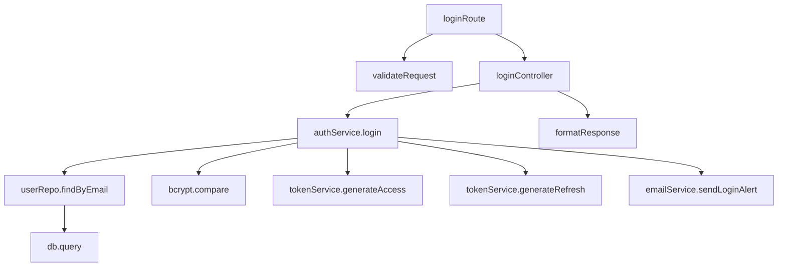
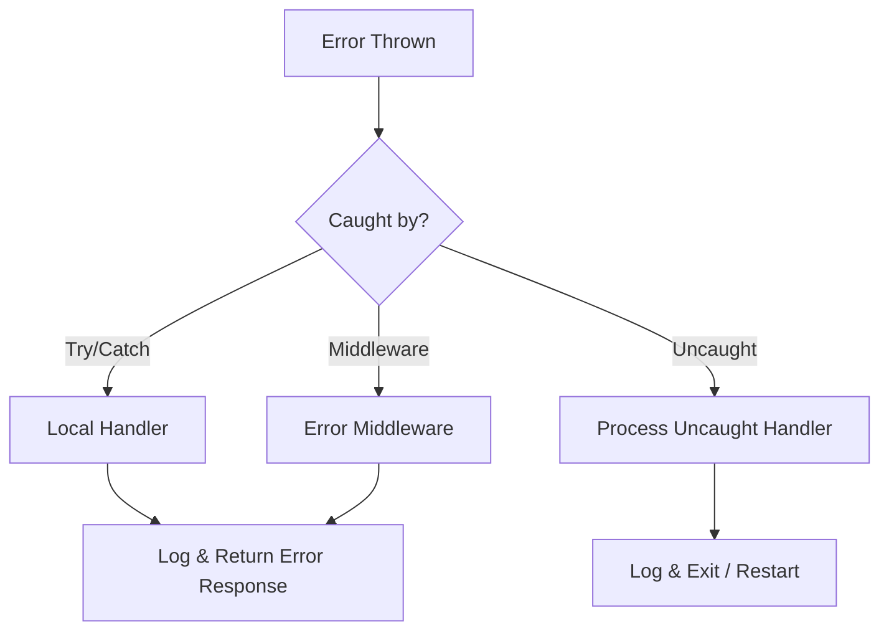

# PROMPT_10 — Phase 09: Call Graph & Control Flow Analysis

## PHASE CLASS: Execution Analysis
## DEPENDENCIES: PROMPT_09 (Data Flow) — complete
## OUTPUT DIRECTORY: `re-docs/09-call-graph/`

---

## OBJECTIVE

Build complete call graphs for the system. Trace every execution path from entry point to exit. Document control flow structures, async chains, error propagation paths, and conditional branching.

## PREREQUISITES

- [ ] PROMPT_09 completed
- [ ] Data flows are understood
- [ ] Functions are cataloged
- [ ] Components are identified

## INPUTS

- `re-docs/06-deep-read/03-function-catalog.md`
- `re-docs/07-architecture/03-component-catalog.md`
- `re-docs/08-data-flow/02-data-flows.md`
- Full source code

## ANALYSIS STEPS

### Step 1: Entry Point Call Graph

For each system entry point, build the full call graph:

```markdown
## Entry Point: POST /api/auth/login

loginRoute (src/api/routes/auth.ts:12)
├── validateRequest (src/api/middleware/validate.ts:25)
├── loginController (src/api/controllers/auth.ts:30)
│   ├── authService.login (src/auth/service.ts:50)
│   │   ├── userRepo.findByEmail (src/auth/repository.ts:20)
│   │   │   └── db.query (src/infrastructure/database.ts:100)
│   │   ├── bcrypt.compare (lib/bcrypt)
│   │   ├── tokenService.generateAccess (src/auth/token.ts:30)
│   │   ├── tokenService.generateRefresh (src/auth/token.ts:55)
│   │   └── emailService.sendLoginAlert (src/email/service.ts:80)
│   │       └── emailClient.send (lib/email-client)
│   └── formatResponse (src/api/controllers/auth.ts:60)
└── errorHandler (src/api/middleware/error.ts:15)
```

For each node in the call graph, document:
- Function name
- File location
- What it does (one-line)
- What it returns
- Error behavior

### Step 2: Control Flow Analysis

For complex functions, document the control flow:

```typescript
// src/auth/service.ts:50 - login()
async function login(email: string, password: string) {
  // 1. Validate input (if not already validated)
  if (!email || !password) throw new ValidationError('Missing fields');

  // 2. Find user
  const user = await userRepo.findByEmail(email);
  if (!user) throw new AuthenticationError('Invalid credentials');

  // 3. Check password
  const valid = await bcrypt.compare(password, user.passwordHash);
  if (!valid) throw new AuthenticationError('Invalid credentials');

  // 4. Check if user is active
  if (user.status !== 'active') throw new AuthenticationError('Account disabled');

  // 5. Generate tokens
  const accessToken = tokenService.generateAccess(user);
  const refreshToken = await tokenService.generateRefresh(user);

  // 6. Update last login
  await userRepo.updateLastLogin(user.id);

  // 7. Notify (fire and forget)
  emailService.sendLoginAlert(user.email).catch(() => {});

  // 8. Return
  return { accessToken, refreshToken, user: sanitizeUser(user) };
}
```

Document:
- Every branch condition
- Every error path
- Every async await point
- Every side effect
- Sequence of operations

### Step 3: Async Chain Tracing

For every async operation, trace the full chain:

```markdown
## Async Chain: User Registration

1. HTTP Request → Express receives
2. Body Parser → Parses JSON
3. Validation → Zod validates
4. Controller → Calls service
5. Service → await userRepo.create (DB write)
6. Service → await tokenService.generate
7. Service → await emailService.send (email send)
8. Service → return to controller
9. Controller → Format and send response
```

For each await point:
- What is being awaited?
- What happens if it fails?
- What happens if it times out?
- Is there a fallback?

### Step 4: Error Propagation Mapping

Trace how errors propagate through the system:

```markdown
## Error Propagation: Validation Error

1. Validation middleware throws ValidationError
2. Error propagates up through controller
3. Express error middleware catches it
4. Error middleware formats error response
5. Returns 400 with error details

## Error Propagation: Database Error

1. Repository throws DatabaseError
2. Service catches, logs, wraps in ServiceError
3. Controller catches, returns 500
4. Error middleware logs stack trace
5. Returns 500 with generic message
```

### Step 5: Middleware Chain Analysis

For systems with middleware (Express, Koa, Django, etc.):
- List all middleware in order
- Document what each middleware does
- Document which middleware applies to which routes
- Document middleware execution order

### Step 6: Call Depth Analysis

For the overall call graph:
- Maximum call depth
- Average call depth
- Functions with the most callers (hot functions)
- Functions with no callers (potentially dead code)
- Functions that call many others (orchestrators)

### Step 7: Concurrency and Parallelism

Document all concurrency patterns:
- Promise.all usage
- Worker threads
- Child processes
- Cluster mode
- Database connection pooling
- HTTP connection pooling
- Concurrent task execution

## OUTPUT SPECIFICATION

### File 1: `01-entry-point-call-graphs.md`

Complete call graphs for all entry points.

### File 2: `02-control-flow-analysis.md`

Control flow analysis for complex functions.

### File 3: `03-async-chains.md`

Async chain traces for all async operations.

### File 4: `04-error-propagation.md`

Error propagation maps for all error types.

### File 5: `05-middleware-chain.md`

Middleware chain analysis (if applicable).

### File 6: `06-call-graph-stats.md`

Call graph statistics and hot functions.

### File 7: `07-control-flow-summary.md`

Summary including:
- System entry points count
- Total call paths
- Async operation count
- Error propagation patterns
- Concurrency patterns

## REQUIRED DIAGRAMS

### Diagram 1: Full Call Graph (Entry Point)



### Diagram 2: Error Flow



## VALIDATION CHECKS

- [ ] Entry points all have call graphs
- [ ] Complex functions have control flow documentation
- [ ] Async chains are traced
- [ ] Error propagation is mapped
- [ ] Middleware chain is documented (if applicable)
- [ ] Hot functions are identified
- [ ] Potentially dead code is flagged

## COMPLETION CHECKLIST

- [ ] All 7 output files generated
- [ ] Call graphs built for all entry points
- [ ] Control flow documented for complex functions
- [ ] Async chains traced
- [ ] Error propagation mapped
- [ ] Middleware chain documented
- [ ] Call graph statistics compiled
- [ ] All outputs saved to `re-docs/09-call-graph/`
- [ ] Phase validation checks passed

---

*Proceed to PROMPT_11_FEATURES.md only after all checklist items are complete.*
