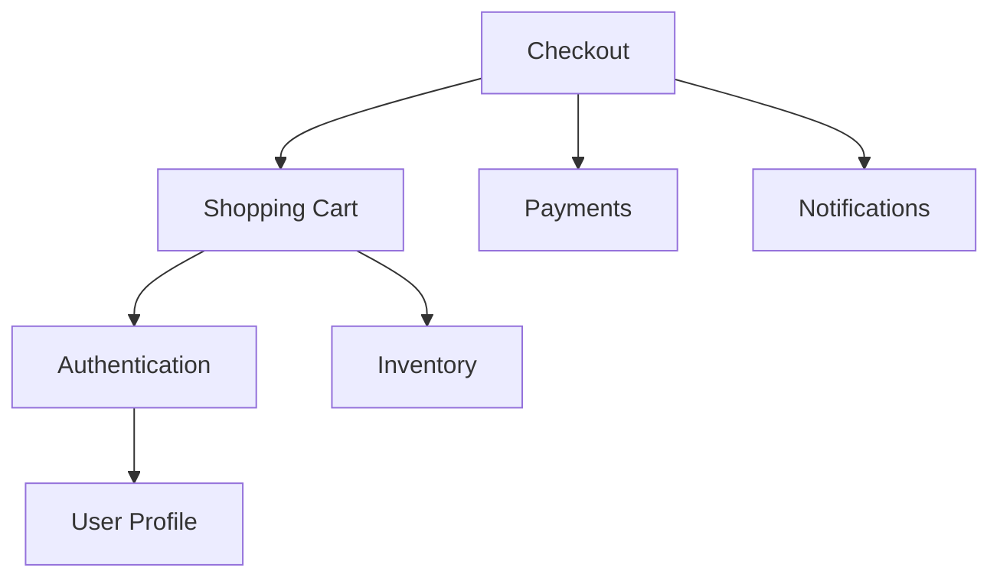
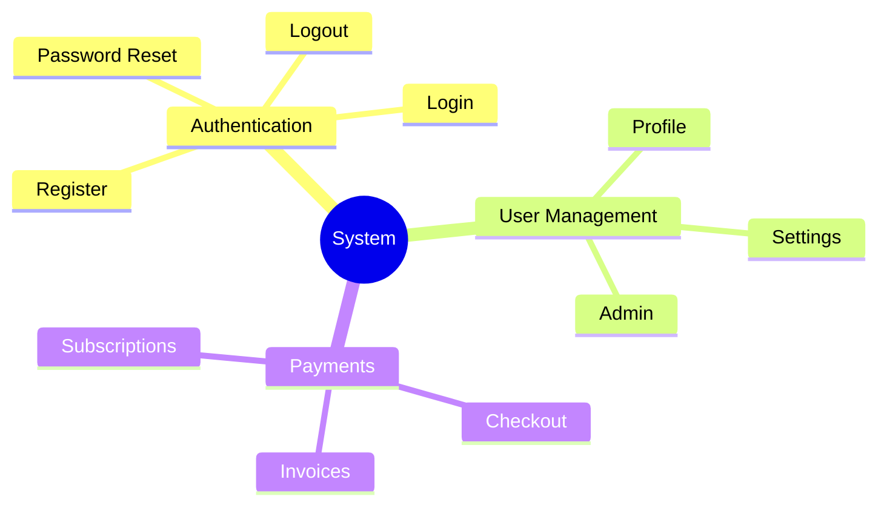
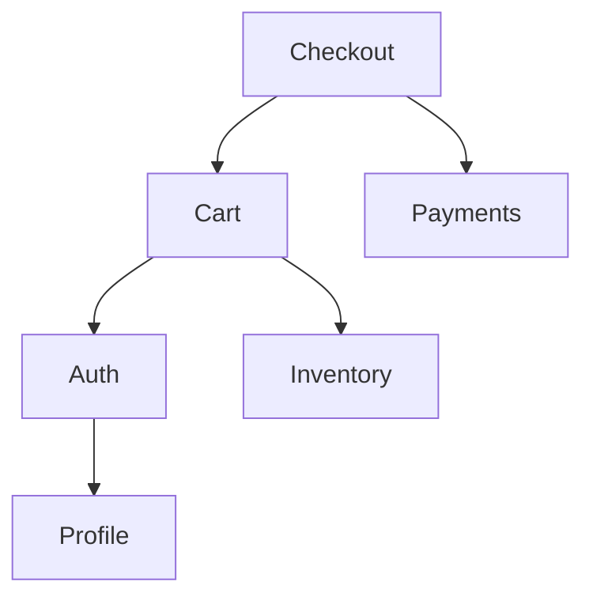

# PROMPT_11 — Phase 10: Feature Mapping

## PHASE CLASS: Functional Analysis
## DEPENDENCIES: PROMPT_10 (Call Graph) — complete
## OUTPUT DIRECTORY: `re-docs/10-features/`

---

## OBJECTIVE

Identify every feature in the system, document its boundaries, map its implementation across the codebase, and understand how features interact. Build a complete feature inventory.

## PREREQUISITES

- [ ] PROMPT_10 completed
- [ ] Call graphs are built
- [ ] Entry points are known
- [ ] Data flows are understood

## INPUTS

- `re-docs/09-call-graph/01-entry-point-call-graphs.md`
- `re-docs/08-data-flow/02-data-flows.md`
- `re-docs/00-scouting/03-readme-analysis.md` (for claimed features)
- Full source code

## ANALYSIS STEPS

### Step 1: Feature Extraction

Extract all features from the system. Features can be identified from:

- **Route/Endpoint patterns** (each endpoint typically serves a feature)
- **README claims** (features claimed in documentation)
- **Directory structure** (feature-organized directories)
- **UI components** (each screen/page is a feature)
- **Service classes** (each service typically implements a feature)
- **Configuration flags** (feature flags)

For each feature, document:

```markdown
## Feature: User Authentication

### ID: F-001
### Status: Implemented
### Priority: Core

### Description
Users can register, login, logout, and reset their passwords.

### Entry Points
- POST /api/auth/register
- POST /api/auth/login
- POST /api/auth/logout
- POST /api/auth/reset-password

### Files
- src/api/routes/auth.ts (route definitions)
- src/api/controllers/auth.ts (request handling)
- src/auth/service.ts (business logic)
- src/auth/repository.ts (data access)
- src/auth/token.ts (token management)

### Dependencies
- Authentication service
- User repository
- Token service
- Email service

### Test Coverage
- src/__tests__/auth.test.ts
```

### Step 2: Feature Boundary Mapping

For each feature, document its boundaries:

```markdown
### Feature Boundary

What's IN scope:
- User registration with email/password
- User login with email/password
- JWT-based session management
- Password reset flow
- Account lockout after failed attempts

What's OUT of scope:
- OAuth/Social login (separate feature)
- Two-factor authentication (separate feature)
- Session management UI (separate feature)
```

### Step 3: Feature Interaction Map

Document how features interact:

```markdown
### Feature Interactions

| Feature | Interacts With | Interaction Type |
|---------|---------------|-----------------|
| Authentication | User Profile | Reads user data |
| Authentication | Notifications | Sends login alerts |
| Shopping Cart | Authentication | Requires login |
| Shopping Cart | Inventory | Checks stock |
| Checkout | Shopping Cart | Converts cart to order |
| Checkout | Payments | Processes payment |
```

### Step 4: Feature Dependency Graph

Build a feature dependency graph:



### Step 5: Feature Completeness Assessment

For each feature, assess:
- **Complete**: All functionality appears implemented
- **Partial**: Some functionality is missing or stubbed
- **Planned**: Placeholder or TODO exists
- **Deprecated**: Old feature, likely unused

### Step 6: Feature Flag Analysis (if applicable)

If feature flags exist:
- List all feature flags
- Which are enabled/disabled
- What each flag controls
- How flags are evaluated

## OUTPUT SPECIFICATION

### File 1: `01-feature-inventory.md`

Complete inventory of all features.

### File 2: `02-feature-details.md`

Detailed documentation for each feature.

### File 3: `03-feature-interactions.md`

Feature interaction map.

### File 4: `04-feature-dependency-graph.md`

Feature dependency graph.

### File 5: `05-feature-completeness.md`

Feature completeness assessment.

### File 6: `06-feature-flags.md`

Feature flag analysis (if applicable).

### File 7: `07-feature-summary.md`

Summary including:
- Total feature count
- Feature distribution (core vs. add-on)
- Feature completeness score
- Feature health assessment
- Recommended feature improvements

## REQUIRED DIAGRAMS

### Diagram 1: Feature Map



### Diagram 2: Feature Dependency Graph



## VALIDATION CHECKS

- [ ] All features identifiable from code are documented
- [ ] Each feature has entry points documented
- [ ] Each feature has file boundaries documented
- [ ] Feature interactions are mapped
- [ ] Feature dependency graph is built
- [ ] Feature completeness is assessed
- [ ] README claims are verified against actual features

## COMPLETION CHECKLIST

- [ ] All 7 output files generated
- [ ] Feature inventory is complete
- [ ] Feature details documented
- [ ] Feature interactions mapped
- [ ] Feature dependency graph built
- [ ] Feature completeness assessed
- [ ] Feature flags analyzed (if applicable)
- [ ] All outputs saved to `re-docs/10-features/`
- [ ] Phase validation checks passed

---

*Proceed to PROMPT_12_ALGORITHMS.md only after all checklist items are complete.*
