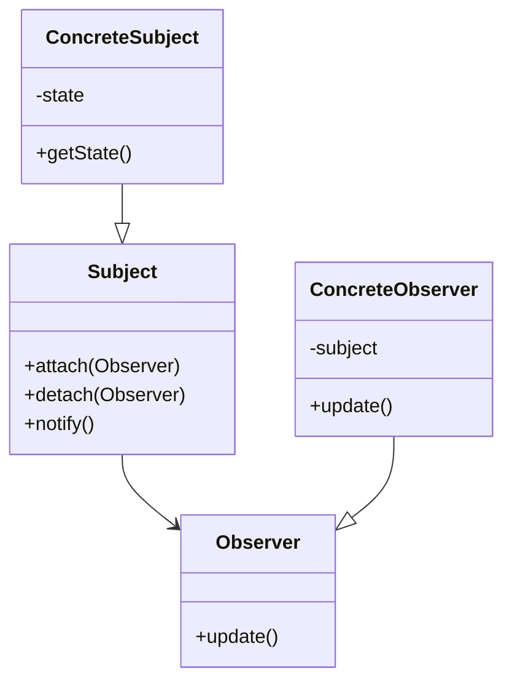

# PROMPT_13 — Phase 12: Design Pattern Identification

## PHASE CLASS: Pattern Analysis
## DEPENDENCIES: PROMPT_12 (Algorithms) — complete
## OUTPUT DIRECTORY: `re-docs/12-design-patterns/`

---

## OBJECTIVE

Identify every design pattern used in the system, document how each pattern is implemented, and assess whether patterns are applied correctly and consistently.

## PREREQUISITES

- [ ] PROMPT_12 completed
- [ ] Class catalog exists
- [ ] Function catalog exists
- [ ] Architecture is understood

## INPUTS

- `re-docs/06-deep-read/04-class-catalog.md`
- `re-docs/07-architecture/01-architectural-style.md`
- Full source code

## ANALYSIS STEPS

### Step 1: Creational Pattern Detection

Look for these creational patterns:

| Pattern | Signature Indicators |
|---------|---------------------|
| **Singleton** | Static instance property, private constructor, getInstance() |
| **Factory Method** | createX(), makeX(), buildX() methods, abstract product creation |
| **Abstract Factory** | Factory interfaces, factory implementations, families of products |
| **Builder** | Builder class, chainable methods, build() method |
| **Prototype** | clone() method, Cloneable interface |
| **Dependency Injection** | Constructor injection, DI container, service locator |
| **Lazy Initialization** | Null check on first access, initialization on first use |

For each identified pattern, document:
```markdown
## Pattern: Singleton
### Implementation: Database Connection Pool
### Location: src/infrastructure/database.ts:10-60
### Code Evidence:
```typescript
class DatabasePool {
  private static instance: DatabasePool;
  
  private constructor() {
    // Initialize connections
  }
  
  static getInstance(): DatabasePool {
    if (!DatabasePool.instance) {
      DatabasePool.instance = new DatabasePool();
    }
    return DatabasePool.instance;
  }
}
```
### Correctness: Correct implementation (thread-safe via static initialization)
### Alternatives: Could use DI container instead
```

### Step 2: Structural Pattern Detection

| Pattern | Signature Indicators |
|---------|---------------------|
| **Adapter** | Wrapper class, interface translation, delegation |
| **Decorator** | Wrapper with same interface, layered behavior |
| **Facade** | Simplified interface to complex subsystem |
| **Proxy** | Intermediary with same interface, access control |
| **Composite** | Tree structure, uniform interface for leaf/container |
| **Bridge** | Abstraction and implementation separated |
| **Module** | File with public exports, private internals |

### Step 3: Behavioral Pattern Detection

| Pattern | Signature Indicators |
|---------|---------------------|
| **Observer** | subscribe/notify pattern, event listeners |
| **Strategy** | Interface with multiple implementations, interchangeable |
| **Command** | Command class with execute(), undo() |
| **Chain of Responsibility** | Linked handlers, each can handle or pass |
| **State** | State transitions, state-dependent behavior |
| **Template Method** | Abstract class with skeleton method, subclasses fill steps |
| **Iterator** | next(), hasNext() methods |
| **Mediator** | Central coordinator, components communicate via mediator |
| **Memento** | Snapshot/restore pattern |
| **Visitor** | Accept/visit double dispatch |

### Step 4: Architectural Pattern Detection

| Pattern | Indicators |
|---------|-----------|
| **MVC** | Models/, Views/, Controllers/ directories |
| **Middleware Pipeline** | Chain of middleware functions |
| **Repository Pattern** | Repository classes abstracting data access |
| **Service Layer** | Service classes containing business logic |
| **Unit of Work** | Transaction tracking, commit/rollback |
| **Active Record** | Model class directly maps to database row |
| **Data Mapper** | Separate mapper class for DB mapping |
| **CQRS** | Separate read/write models or paths |
| **Event Sourcing** | Event store, event replay |

### Step 5: Pattern Implementation Assessment

For each identified pattern, assess:

- **Correctness**: Is the pattern implemented correctly?
- **Consistency**: Is the same pattern implemented the same way everywhere?
- **Appropriateness**: Is this the right pattern for the problem?
- **Anti-patterns**: Are there any anti-patterns present?

### Step 6: Anti-Pattern Detection

Also document any anti-patterns found:

| Anti-Pattern | Indicators |
|-------------|-----------|
| **God Class** | Class with too many responsibilities |
| **Spaghetti Code** | Entangled control flow |
| **Golden Hammer** | Overused pattern in wrong contexts |
| **Premature Optimization** | Overly complex code for simple needs |
| **Copy-Paste Programming** | Repeated code blocks |
| **Magic Numbers** | Unexplained numeric constants |
| **Shotgun Surgery** | One change requires many file modifications |
| **Feature Envy** | Method more interested in other class's data |
| **Inappropriate Intimacy** | Classes too dependent on each other's internals |

## OUTPUT SPECIFICATION

### File 1: `01-creational-patterns.md`

All creational design patterns with implementation details.

### File 2: `02-structural-patterns.md`

All structural design patterns with implementation details.

### File 3: `03-behavioral-patterns.md`

All behavioral design patterns with implementation details.

### File 4: `04-architectural-patterns.md`

All architectural patterns with implementation details.

### File 5: `05-anti-patterns.md`

All identified anti-patterns with locations and recommendations.

### File 6: `06-pattern-assessment.md`

Assessment of pattern implementation quality.

### File 7: `07-pattern-summary.md`

Summary including:
- Total patterns identified
- Most commonly used patterns
- Pattern consistency score
- Anti-pattern count
- Recommendations

## REQUIRED DIAGRAMS

### Pattern Structure Diagram



## VALIDATION CHECKS

- [ ] All creational patterns identified
- [ ] All structural patterns identified
- [ ] All behavioral patterns identified
- [ ] Architectural patterns documented
- [ ] Anti-patterns identified and flagged
- [ ] Each pattern has code evidence
- [ ] Pattern implementation assessed

## COMPLETION CHECKLIST

- [ ] All 7 output files generated
- [ ] Creational patterns documented
- [ ] Structural patterns documented
- [ ] Behavioral patterns documented
- [ ] Architectural patterns documented
- [ ] Anti-patterns flagged
- [ ] Pattern assessment completed
- [ ] All outputs saved to `re-docs/12-design-patterns/`
- [ ] Phase validation checks passed

---

*Proceed to PROMPT_14_API_BOUNDARIES.md only after all checklist items are complete.*
