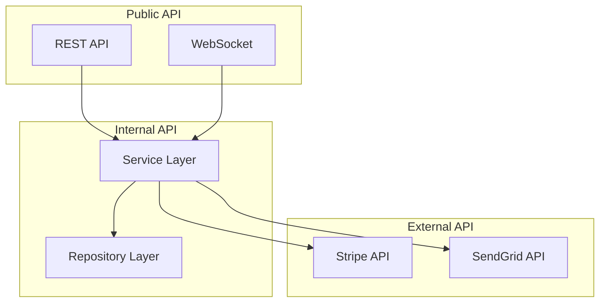

# PROMPT_14 — Phase 13: API & Service Boundary Analysis

## PHASE CLASS: Interface Analysis
## DEPENDENCIES: PROMPT_13 (Design Patterns) — complete
## OUTPUT DIRECTORY: `re-docs/13-api-boundaries/`

---

## OBJECTIVE

Document every API endpoint, service boundary, internal API, and communication contract in the system. Produce complete API documentation that includes request/response schemas, authentication, error codes, and usage examples.

## PREREQUISITES

- [ ] PROMPT_13 completed
- [ ] Architecture is understood
- [ ] Components are identified
- [ ] Data flows are traced

## INPUTS

- `re-docs/07-architecture/03-component-catalog.md`
- `re-docs/08-data-flow/01-data-entry-points.md`
- `re-docs/08-data-flow/06-data-exit-points.md`
- All route/controller/service files

## ANALYSIS STEPS

### Step 1: REST API Documentation (if applicable)

For each REST endpoint, produce complete documentation:

```markdown
## POST /api/auth/login

### Summary
Authenticate user and return JWT tokens.

### Full URL
POST /api/auth/login

### Authentication
None (public endpoint)

### Content-Type
application/json

### Request Body
```json
{
  "email": "user@example.com",
  "password": "securePassword123"
}
```

### Request Schema
| Field | Type | Required | Description |
|-------|------|----------|-------------|
| email | string | Yes | User email address |
| password | string | Yes | User password |

### Validation Rules
- email: valid email format, max 255 chars
- password: min 8 chars, max 128 chars

### Response (200)
```json
{
  "accessToken": "eyJhbGci...",
  "refreshToken": "dGhpcyBp...",
  "user": {
    "id": "uuid",
    "email": "user@example.com",
    "role": "user"
  }
}
```

### Response Schema (200)
| Field | Type | Description |
|-------|------|-------------|
| accessToken | string | JWT access token (15 min expiry) |
| refreshToken | string | JWT refresh token (7 day expiry) |
| user | object | Sanitized user object |

### Error Responses
| Status | Condition | Example |
|--------|-----------|---------|
| 400 | Validation failed | {"error": "Invalid email format"} |
| 401 | Invalid credentials | {"error": "Invalid email or password"} |
| 423 | Account locked | {"error": "Account locked for 24 hours"} |
| 429 | Rate limit | {"error": "Too many requests"} |

### Rate Limiting
- 5 attempts per minute per IP
- 20 attempts per hour per email

### Implementation
- **Route**: src/api/routes/auth.ts:15
- **Controller**: src/api/controllers/auth.ts:30
- **Service**: src/auth/service.ts:50
- **Validation**: src/api/validators/auth.ts:10-30
```

### Step 2: GraphQL API Documentation (if applicable)

For GraphQL:
- Document all queries
- Document all mutations
- Document all subscriptions
- Document all types
- Document all resolvers
- Document authorization rules

### Step 3: Internal API Documentation

Document internal service APIs (functions called across module boundaries):

```markdown
## Internal API: AuthService.login()

### Module: Auth
### Visibility: Public (used by API module)

### Signature
async login(email: string, password: string): Promise<LoginResult>

### Parameters
| Parameter | Type | Description |
|-----------|------|-------------|
| email | string | User email |
| password | string | User password |

### Return Type
```typescript
interface LoginResult {
  accessToken: string;
  refreshToken: string;
  user: SanitizedUser;
}
```

### Throws
- AuthenticationError: invalid credentials
- AccountLockedError: account locked
```

### Step 4: WebSocket/SSE API Documentation (if applicable)

For real-time APIs:
- Document all events
- Document event payloads
- Document connection lifecycle
- Document reconnection behavior
- Document channel/room structure

### Step 5: Third-Party API Integration Documentation

For each external API integration:
- API name
- Endpoint/host
- Authentication method
- API key location (env variable)
- Client library used
- Key functions called
- Error handling
- Rate limiting
- Retry strategy
- Data transformation

### Step 6: Service Contract Documentation

For microservices or service-oriented architectures:
- Service name
- Service responsibility
- API endpoints exposed
- Events published
- Events consumed
- Dependencies on other services
- Service level (core, supporting, infrastructure)
- Health check endpoint
- Deployment unit

### Step 7: Middleware Documentation

For each middleware:
- Name
- Purpose
- When it runs (before which routes?)
- What it does
- What it modifies (req/res)
- Error behavior
- Performance impact

## OUTPUT SPECIFICATION

### File 1: `01-rest-api.md`

Complete REST API documentation.

### File 2: `02-graphql-api.md` (if applicable)

Complete GraphQL API documentation.

### File 3: `03-internal-apis.md`

Internal service API documentation.

### File 4: `04-realtime-api.md` (if applicable)

WebSocket/SSE API documentation.

### File 5: `05-third-party-integrations.md`

Third-party API integration documentation.

### File 6: `06-service-contracts.md` (if applicable)

Microservice contract documentation.

### File 7: `07-middleware-catalog.md`

Complete middleware documentation.

### File 8: `08-api-summary.md`

Summary including:
- Total endpoints/APIs
- Authentication coverage
- Error handling consistency
- API documentation completeness
- API versioning strategy
- API design consistency assessment

## REQUIRED DIAGRAMS

### API Structure Diagram



## VALIDATION CHECKS

- [ ] All HTTP endpoints are documented with method, path, and handler
- [ ] Each endpoint has request/response schemas
- [ ] Each endpoint has error responses documented
- [ ] Authentication requirements are documented per-endpoint
- [ ] Internal APIs are documented
- [ ] Third-party integrations are documented
- [ ] Middleware is documented

## COMPLETION CHECKLIST

- [ ] All 8 output files generated
- [ ] All external APIs documented
- [ ] All internal APIs documented
- [ ] All middleware documented
- [ ] All integrations documented
- [ ] API summary written
- [ ] All outputs saved to `re-docs/13-api-boundaries/`
- [ ] Phase validation checks passed

---

*Proceed to PROMPT_15_STATE_EVENTS.md only after all checklist items are complete.*
